# SUSE AI Factory (AIF) - C4 Architecture Diagrams

## Table of Contents
1. [C4 Level 1 - System Context](#c4-level-1---system-context)
2. [C4 Level 2 - Container](#c4-level-2---container)
3. [C4 Level 3 - Component](#c4-level-3---component)
4. [C4 Level 4 - Code](#c4-level-4---code)
5. [Deployment Architecture](#deployment-architecture)
6. [Key Data Flows](#key-data-flows)

---

## C4 Level 1 - System Context

### High-Level System Context

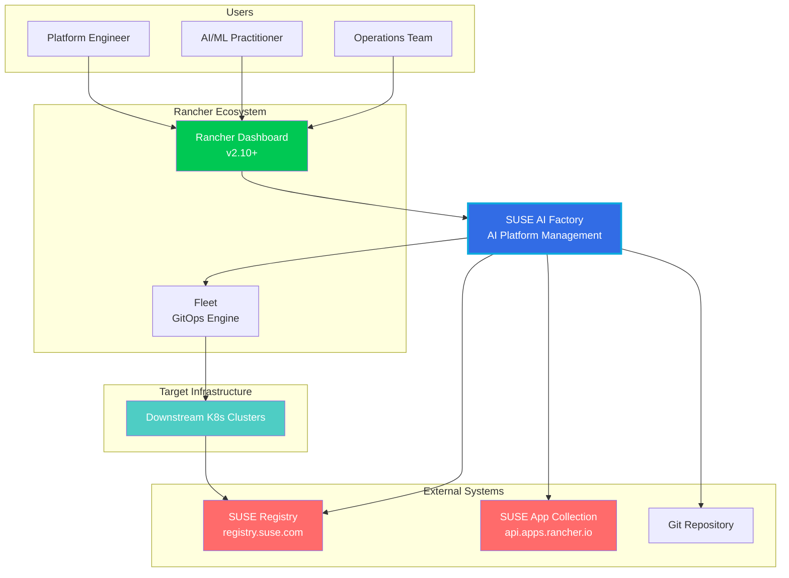

### Key Interactions

| Actor/System | Interacts With | Purpose | Protocol |
|-------------|----------------|---------|----------|
| Platform Engineer | Rancher Dashboard | Create Bundles, publish Blueprints | HTTPS |
| AI Practitioner | Rancher Dashboard | Deploy Workloads | HTTPS |
| AIF | SUSE Registry | Pull Helm charts, discover NIMs | OCI/HTTPS |
| AIF | SUSE App Collection | Discover curated AI apps | REST API |
| AIF | Fleet | Create deployment manifests | K8s API |
| Fleet | Downstream Clusters | Deploy AI workloads | Fleet tunnel |

---

## C4 Level 2 - Container

### Container Architecture Overview

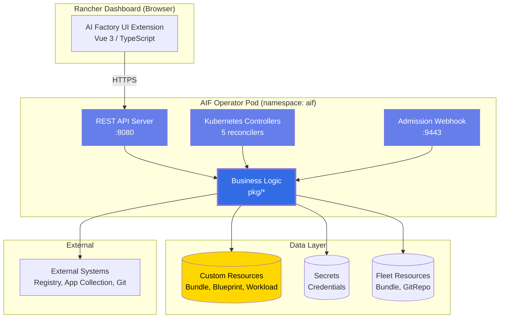

### Port Allocation

| Component | Port | Purpose |
|-----------|------|---------|
| REST API Server | 8080 | HTTP endpoints for UI and external clients |
| Health Probes | 8081 | /healthz, /readyz |
| Metrics Server | 8082 | Prometheus metrics |
| Admission Webhook | 9443 | Blueprint immutability validation |

---

## C4 Level 3 - Component

### 3.1 API Layer Architecture

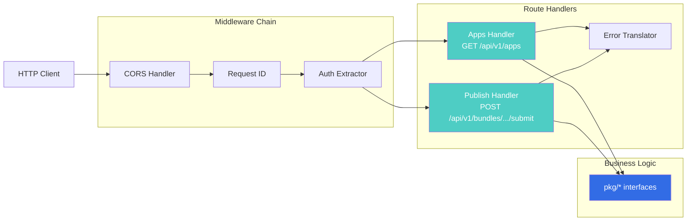

### 3.2 Controller Layer Architecture

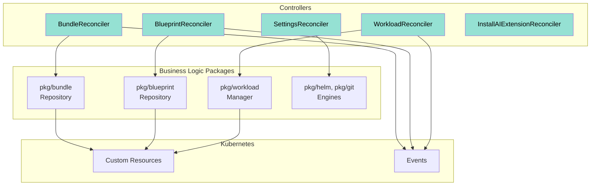

### 3.3 Business Logic Layer (Hexagonal Architecture)

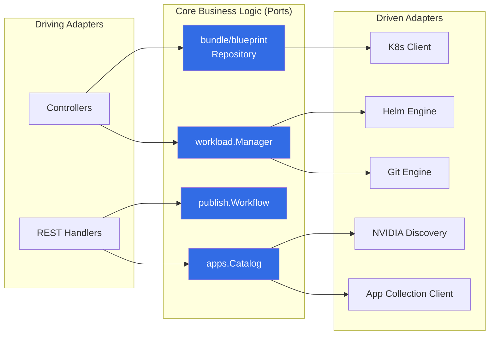

---

## C4 Level 4 - Code

### 4.1 Apps Package Structure

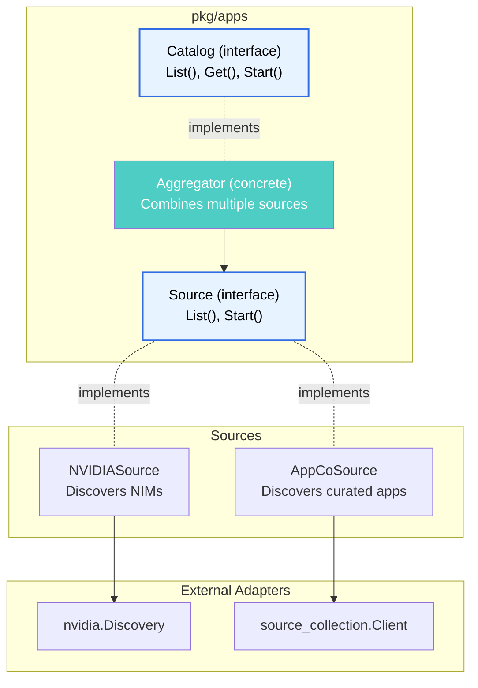

### 4.2 Bundle & Blueprint Package Structure

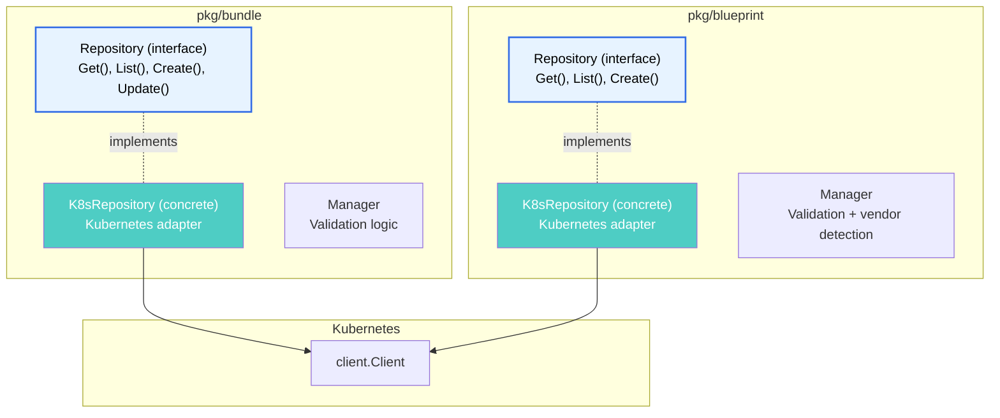

### 4.3 Publish Workflow Package

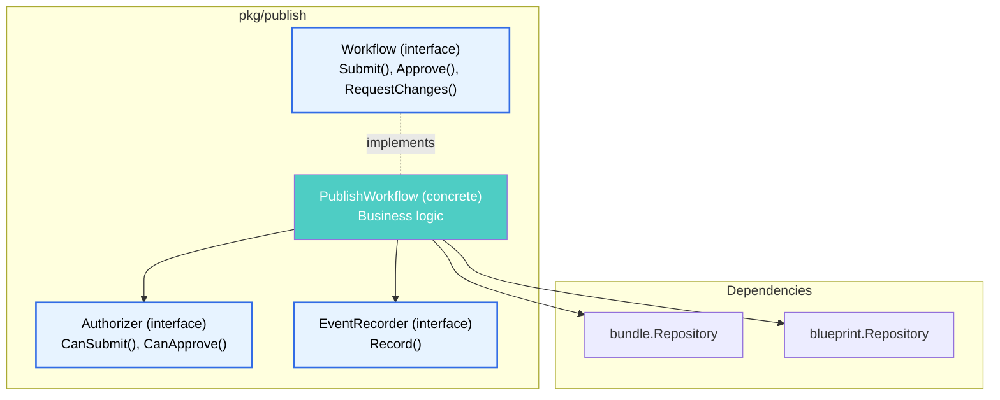

### 4.4 Workload & Deployment Engines

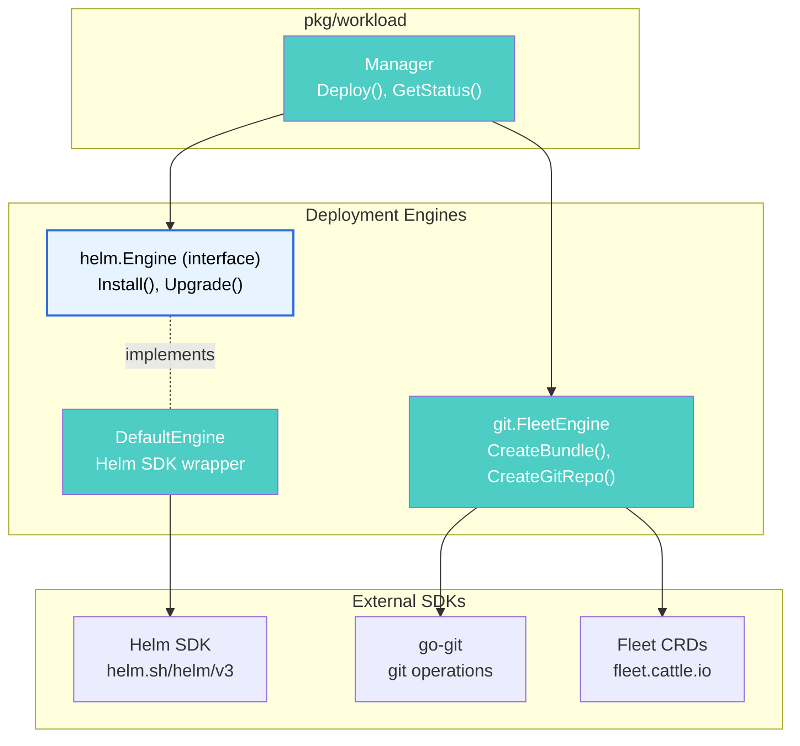

---

## Deployment Architecture

### Hub-on-Management-Cluster Pattern

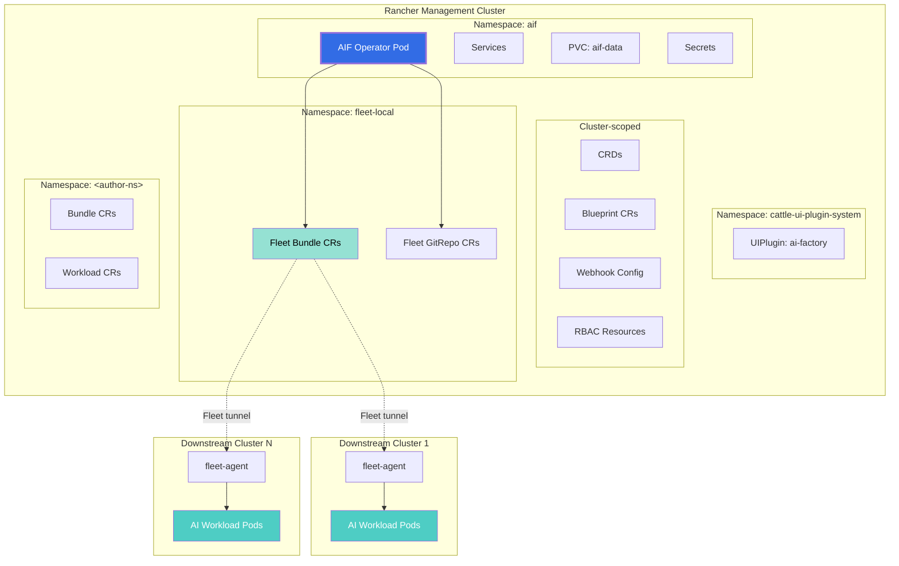

### Deployment Facts

**Management Cluster:**
- ✅ AIF Operator runs here (single pod, scalable to ≥2 with PDB)
- ✅ All CRDs stored here (Bundle, Blueprint, Workload)
- ✅ UI Plugin registered here
- ✅ Fleet CRs created here

**Downstream Clusters:**
- ❌ No AIF Operator
- ❌ No AIF CRDs
- ✅ Only fleet-agent (pre-existing Rancher component)
- ✅ AI workload pods deployed by fleet-agent

---

## Key Data Flows

### Flow 1: Bundle Publish Workflow

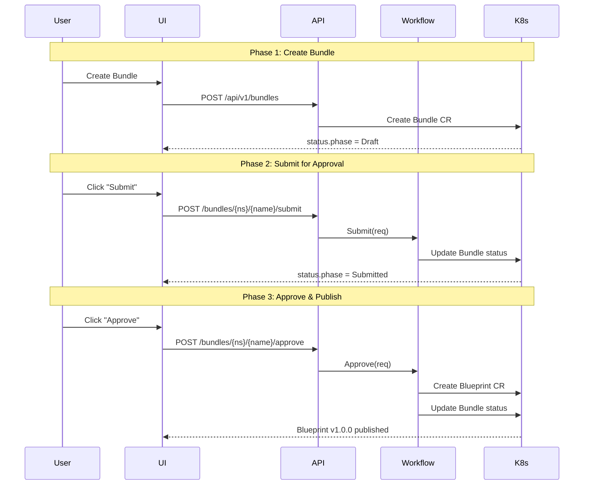

### Flow 2: Workload Deployment

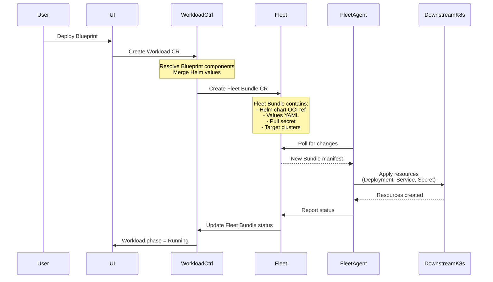

### Flow 3: Apps Catalog Discovery

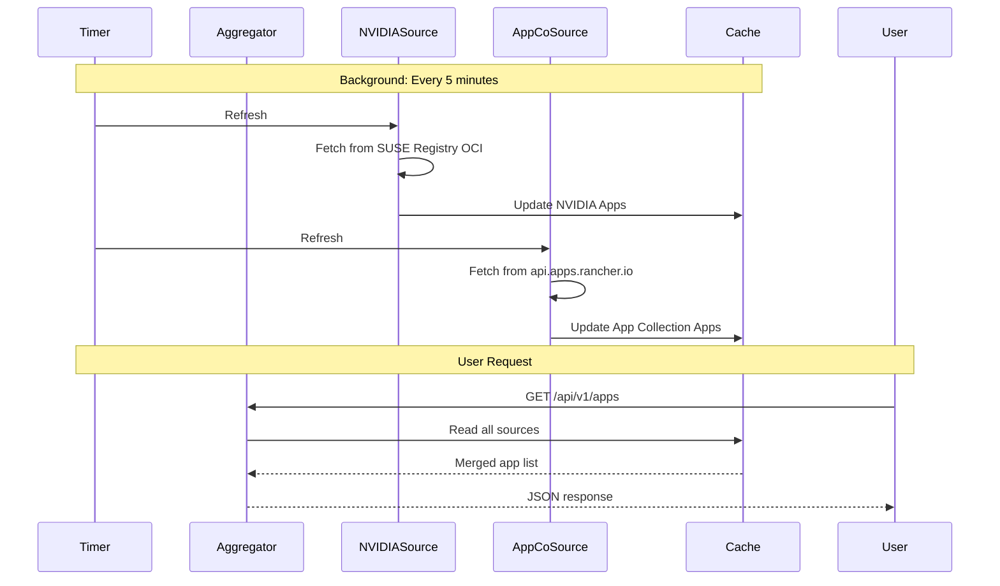

---

## Architecture Principles

### Hexagonal Architecture (Ports & Adapters)

```
┌─────────────────────────────────────────┐
│  Driving Adapters (Inputs)              │
│  • REST API handlers                    │
│  • Kubernetes controllers               │
│  • Admission webhooks                   │
└──────────────┬──────────────────────────┘
               │
               ▼
┌─────────────────────────────────────────┐
│  Business Logic Core (Ports)            │
│  • Interfaces in pkg/*/interface.go     │
│  • apps.Catalog                         │
│  • bundle/blueprint.Repository          │
│  • publish.Workflow                     │
│  • workload.Manager                     │
└──────────────┬──────────────────────────┘
               │
               ▼
┌─────────────────────────────────────────┐
│  Driven Adapters (Outputs)              │
│  • K8s repositories                     │
│  • Helm engine                          │
│  • Git engine                           │
│  • NVIDIA discovery                     │
│  • App Collection client                │
└─────────────────────────────────────────┘
```

### Dependency Flow

```
cmd/operator/main.go (≤250 lines, wiring only)
    ↓
internal/{api,controller,webhook}/
    ↓
pkg/<domain>/{interface.go, types.go, ...}
    ↓
api/v1alpha1 (CRDs) — ONLY in conversions.go + repository.go
    ↓
stdlib, third-party (controller-runtime, Helm SDK, etc.)
```

### Four-Noun Conceptual Model

```
App (Building Block)
  ↓ compose into
Bundle (Mutable Workshop)
  ↓ publish via approval workflow
Blueprint (Immutable Stack)
  ↓ deploy as
Workload (Running Instance)
```

---

## Technology Stack

| Layer | Technologies |
|-------|-------------|
| **Language** | Go 1.21+ |
| **Frameworks** | controller-runtime v0.17, Helm SDK v3.13, go-git v5 |
| **UI** | Vue 3, @rancher/shell ^3.0.10, TypeScript |
| **Storage** | Kubernetes CRDs (etcd-backed) |
| **Observability** | log/slog (JSON/text), Prometheus, K8s Events |
| **Security** | RBAC, Admission webhooks, Secrets |
| **Deployment** | Helm charts, Fleet (GitOps) |
| **Testing** | envtest, Ginkgo v2, go test |

---

## Critical Constraints

1. **No internal OCI registry** — AIF does not host/proxy/mirror images
2. **No direct NVIDIA NGC access** — All assets via SUSE Registry mirror
3. **Blueprint immutability** — Spec fields immutable per version (webhook-enforced)
4. **Workload provenance** — Every Workload records `spec.source`
5. **Air-gap first-class** — Registry endpoints configurable via Settings CR
6. **Publish-by-approval governance** — Bundle → Submitted → Approved → Blueprint
7. **Single pull-secret pattern** — One docker-config Secret per workload namespace

---

**Generated:** 2026-05-12  
**Version:** 2.0 (Simplified & Decluttered)  
**Based on:** AIF codebase analysis (api/v1alpha1, internal, pkg, ui, charts)
