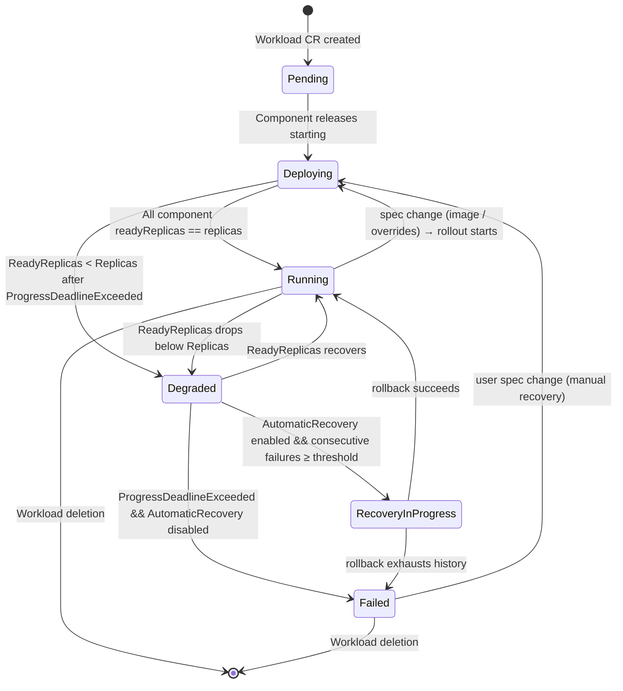

# SUSE AI Factory — Architecture & Component Design

> **Audience:** Engineering teams implementing from scratch.
> **Scope:** Complete technical reference for all components, interfaces, data contracts, and implementation standards. Treat this as the single source of truth for greenfield implementation.
> **Version:** v1.1 (aligned with `SOFTWARE_SPEC.md` v1.1 four-noun model)

---

## Table of Contents

1. [Architecture Principles](#1-architecture-principles)
2. [System Context](#2-system-context)
3. [Component Catalog](#3-component-catalog)
4. [Custom Resource Definitions](#4-custom-resource-definitions)
5. [REST API Contract](#5-rest-api-contract)
6. [Go Package Architecture](#6-go-package-architecture)
7. [UI Extension Architecture](#7-ui-extension-architecture)
8. [Controller Design](#8-controller-design)
9. [Helm Chart Specifications](#9-helm-chart-specifications)
10. [Security Architecture](#10-security-architecture)
11. [Observability](#11-observability)
12. [Testing Strategy](#12-testing-strategy)
13. [External Integration Contracts](#13-external-integration-contracts)
14. [Data Persistence Model](#14-data-persistence-model)
15. [Glossary & Acronyms](#15-glossary--acronyms)
16. [Document Cross-References](#16-document-cross-references)

> **Hard scope cuts (v1) — non-negotiable:**
> 1. **No internal/embedded OCI registry.** AIF does not host, proxy, or mirror images. There is no `pkg/registry/`, `pkg/mirror/`, no `:5000` port, no `aif_registry_*` metrics, no `/api/v1/clients`, no `/api/v1/registry/*`.
> 2. **No direct NVIDIA NGC access at runtime.** AIF does not reach `nvcr.io`, `helm.ngc.nvidia.com`, or `integrate.api.nvidia.com` from any code path. NIM containers and Helm charts are mirrored into SUSE Registry by an **external offline process** (run by SUSE / customer ops, NOT implemented by AIF). AIF's only sources are SUSE Registry (`registry.suse.com`) and SUSE Application Collection (`dp.apps.rancher.io`).
> 3. **Mirror path convention.** NVIDIA Helm charts: `oci://registry.suse.com/ai/charts/nvidia/{nim-llm|nim-vlm|...}:{version}`. NVIDIA container images: `registry.suse.com/ai/containers/nvidia/{model}:{version}`.
> 4. **v1.1 conceptual model.** The product surface is four nouns — **App**, **Bundle**, **Blueprint**, **Workload** — with publish-by-approval governance (Bundle → Submitted → Approved → mints Blueprint version). The OLD `New → Conformant → Ready → Certified` Bundle lifecycle is removed. Blueprints are immutable per version and cluster-scoped.

---

## 1. Architecture Principles

These are non-negotiable constraints for the implementation. Every design decision should reinforce them.

### 1.1 Kubernetes-Native First
All mutable platform state is stored as Kubernetes Custom Resources, not in-memory maps. In-memory caches are acceptable as a read-through performance layer but must be rebuilt from CRD state on startup. No operator restart should result in data loss.

### 1.2 Least Privilege
The operator's service account holds only the exact RBAC permissions it needs. No `cluster-admin`. Every API group and resource is explicitly listed.

### 1.3 Secrets are Secrets
No credential string lives in a Helm `values.yaml` or an environment variable that is not sourced from a Kubernetes Secret. All credentials are stored as `Secret` resources and consumed via `secretKeyRef` env var references or volume mounts.

### 1.4 Single Binary, Split Concerns
`cmd/operator/main.go` is wiring only (≤250 lines). All HTTP handler logic lives in `internal/api/`. All controller logic lives in `internal/controller/`. Business logic lives in `pkg/`. The binary's `main()` function does: parse flags → create managers → register routes → start servers → handle shutdown.

### 1.5 Interfaces Enable Testing
Every manager and engine exposes a Go interface. The concrete implementation satisfies the interface. Tests use hand-written fakes or generated mocks, never the real implementation that talks to Kubernetes or external APIs.

### 1.6 Standard Error Handling
Errors wrap with context using `fmt.Errorf("operation: %w", err)`. No `panic` except in `init()` for programmer errors. HTTP handlers never surface raw internal errors — they translate to an HTTP status code and a structured JSON error body via a shared `writeError(w, code, err)` helper.

### 1.7 Structured Logging
All logging uses the standard library `log/slog` package. JSON in production, text in development (selected by `--log-format`). Every log entry includes `request_id`, `component`, and relevant resource identifiers. No credentials or PII in logs.

### 1.8 Context Propagation
Every function performing I/O (Kubernetes API, external HTTP, disk) accepts `context.Context` as its first argument and respects cancellation.

### 1.9 Graceful Shutdown
The operator handles `SIGINT` and `SIGTERM`. On signal, it stops accepting new HTTP requests, drains in-flight requests with a 15-second timeout, then terminates.

### 1.10 Immutable Versioned Artifacts
Blueprint CRs are immutable per version. A validating admission webhook rejects any update to `spec` fields on an existing Blueprint. Status fields (phase: Active / Deprecated / Withdrawn) are mutable; spec is not. New versions are minted as new CR instances, not as updates.

### 1.11 Provenance Everywhere
Every Workload records its source — App, Blueprint version, or Bundle test deploy — in a structured `spec.source` field. The operate experience uses this to offer context-aware actions (e.g., upgrade-to-newer-Blueprint-version is only valid for `kind: Blueprint` Workloads).

---

## 2. System Context

### 2.0 Prerequisites

| Component | Minimum version | Why |
|---|---|---|
| Kubernetes | **1.24** | CEL validation in CRDs (used by Bundle/Blueprint/Workload validation rules) |
| Kubernetes | 1.25 (recommended) | Stable PodSecurity standards (operator pod uses `restricted` profile) |
| Kubernetes | 1.27 (recommended) | Stable `SubjectAccessReview` v1 + `SelfSubjectAccessReview` v1 (used by Publisher SAR enforcement, §10.1) |
| controller-runtime | **v0.17** | Reconciler pattern, webhook builder, envtest setup, cross-controller event source (`source.Kind` + `handler.EnqueueRequestsFromMapFunc`) |
| Go | **1.21** | Generics, structured logging via `log/slog`, HTTP `ServeMux` route patterns |
| Helm | **3.13** | OCI registry support (`pkg/registry`), `helm push` for OCI charts |
| Rancher | **2.10** | UIPlugin CRD (`catalog.cattle.io/v1`); UI extension framework v3 |
| `@rancher/shell` | **^3.0.10** | Vue 3 components, Steve store, plugin DSL |
| cert-manager *(when `webhook.tlsMode=cert-manager`)* | **v1.13** | `Issuer` and `Certificate` v1 APIs |
| go-git | **v5** | Pure-Go Git operations for Fleet engine |
| Helm SDK | **helm.sh/helm/v3 ≥ v3.13** | OCI auth, chart pull/install, registry client |

These are the floors. Newer versions are supported unless explicitly called out as breaking. The operator chart and CI workflows pin specific versions for reproducibility.


### 2.1 Context Diagram

```
┌──────────────────────────────────────────────────────────────────┐
│  End User (Browser)                                              │
│                                                                  │
│   Rancher Dashboard 2.10+                                        │
│     └─ SUSE AI Factory UIPlugin (Vue 3 / @rancher/shell)         │
│          │  Dynamic JS load: {operator}/ui/index.js              │
│          │  API calls: Rancher proxy → operator :8080            │
└──────────────────────┬───────────────────────────────────────────┘
                       │ HTTPS (Rancher authenticates)
                       ▼
┌──────────────────────────────────────────────────────────────────┐
│  AIF Operator Pod  (namespace: aif)                              │
│                                                                  │
│  Port 8080 ─ REST API (internal/api/)                            │
│  Port 8081 ─ Health probes (/healthz, /readyz)                   │
│  Port 8082 ─ Prometheus metrics                                  │
│                                                                  │
│  Kubernetes Controllers (internal/controller/):                  │
│    BundleReconciler · BlueprintReconciler · WorkloadReconciler   │
│    SettingsReconciler · InstallAIExtensionReconciler             │
│                                                                  │
│  Validating Admission Webhook:                                   │
│    BlueprintImmutabilityWebhook  (rejects spec mutations)        │
│                                                                  │
│  Business Logic (pkg/):                                          │
│    apps · bundle · blueprint · publish · workload                │
│    helm · git · nvidia (discovery only)                          │
└──────┬───────────────────────────────────────┬───────────────────┘
       │ Kubernetes API (controller-runtime)   │ External HTTPS
       ▼                                       ▼
  Rancher Management Cluster             ┌─ SUSE Registry
  ┌─ CRDs (ai.suse.com)                 │  registry.suse.com
  │  Bundle (namespaced, per-team ns)   │   (incl. mirrored NVIDIA assets at
  │  Blueprint (cluster-scoped)         │    ai/charts/nvidia/, ai/containers/nvidia/)
  │  Workload (namespaced, per-team ns) │
  │  Settings (namespaced, aif ns)      ├─ SUSE Application Collection
  │  InstallAIExtension (namespaced)    │  api.apps.rancher.io
  ├─ Fleet CRs (fleet.cattle.io)        │  dp.apps.rancher.io
  │  Fleet Bundle  ← deployStrategy: helm    (AIF creates; OCI chart + values)
  │  Fleet GitRepo ← deployStrategy: gitops  (AIF creates; points to user's repo)
  │                                     └─ Git repo (deployStrategy: gitops)
  └─ Secrets (suse-registry-creds source)
                                         (NGC is OUT OF SCOPE — assets reach
         ↓ Fleet CRs on mgmt cluster;    AIF only via the SUSE-managed
         fleet-agents on downstream      offline mirror process)
         clusters pull via Fleet
         controller tunnel

  Downstream Clusters (Rancher-managed; listed in Workload.spec.targetClusters)
  ┌─ fleet-agent       (already present on every Rancher-managed cluster)
  ├─ Deployments/Services  (applied by fleet-agent from Fleet Bundle)
  └─ Secrets (suse-registry-creds)  (delivered via Fleet Bundle)
  ✗ No AIF operator   ✗ No AIF CRDs
```

### 2.2 Deployment Topology

AIF follows Rancher's **hub-on-management-cluster** pattern. The Rancher management cluster is the single control plane. Downstream clusters are delivery targets only — they run no AIF components.

```
=== Rancher Management Cluster ===

Namespace: aif
  Deployment: aif-operator              (1 replica, expandable to ≥2 with PDB)
  Service: aif-operator                 (ClusterIP, port 8080)
  Service: aif-operator-webhook         (ClusterIP, port 9443 — admission webhook)
  ServiceAccount: aif-operator
  ClusterRole: aif-operator             (fine-grained, see §10)
  ClusterRoleBinding: aif-operator
  ClusterRole: aif-blueprint-publisher  (assignable to platform engineers)
  PVC: aif-data                         (10Gi, RWO, mounted at /data)
  Secret: suse-app-collection-creds     (referenced by Settings CRD)
  Secret: suse-registry-creds-source    (referenced by Settings CRD;
                                          covers both registry.suse.com and
                                          the mirrored NVIDIA ai/* namespaces)
  Secret: fleet-git-creds               (referenced by Settings CRD)
  ValidatingWebhookConfiguration: aif-blueprint-immutability

Namespace: cattle-ui-plugin-system
  UIPlugin: ai-factory                  (Rancher extension registration)

Namespace: <author-ns>                  (per-user or per-team)
  Bundle CRs                            (Drafts owned by author)
  Workload CRs                          (management-cluster-side record; spec.targetClusters
                                          lists the downstream clusters)

(cluster-scoped, management cluster)
  Blueprint CRs                         (one CR per name+version, immutable, org-wide)

Namespace: fleet-local (or per fleet workspace)
  fleet.cattle.io/Bundle CRs            (created by WorkloadReconciler for deployStrategy: helm)
  fleet.cattle.io/GitRepo CRs           (created by WorkloadReconciler for deployStrategy: gitops)

=== Downstream Clusters (one or more; listed in Workload.spec.targetClusters) ===

  fleet-agent                           (Rancher-managed; already present on every
                                          imported cluster; opens tunnel to Fleet
                                          controller on management cluster)
  Deployments, Services                 (applied by fleet-agent from Fleet Bundle)
  Secret: suse-registry-creds           (delivered as a resource inside the Fleet Bundle;
                                          fleet-agent reconciles it into the workload namespace)
  ✗ No AIF operator   ✗ No AIF CRDs
```

**Cross-cluster delivery:** the AIF operator never calls downstream cluster APIs directly. WorkloadReconciler creates Fleet Bundle or GitRepo CRs on the management cluster; Fleet's own controller (also on the management cluster) communicates with fleet-agents via their existing tunnel. The operator watches Fleet CR status and mirrors it back to `Workload.status`.

### 2.3 Conceptual Model (Engineering Reference)

Reproduced from `SOFTWARE_SPEC.md §1` for engineering convenience. Schema details are in §4.

| Noun | CRD | Scope | Mutability | Identity |
|------|-----|-------|------------|----------|
| **App** | (none — catalog data) | Catalog-wide | Immutable from AIF's perspective | `{repo, chart, version}` |
| **Bundle** | `Bundle` | Namespaced | Mutable | `{namespace, name}` |
| **Blueprint** *(AIF Blueprint)* | `Blueprint` | Cluster-scoped | Spec immutable; status mutable | `{spec.blueprintName, spec.version}` |
| **Workload** | `Workload` | Namespaced | Spec mutable for re-deploy | `{namespace, name}` |

Apps are not CRDs. The catalog is built dynamically by reading the SUSE Registry chart index (NIM apps) and the SUSE Application Collection API (SUSE apps), then served via `/api/v1/apps`.

> **Terminology — "Blueprint" in this document means "AIF Blueprint."** NVIDIA and other vendors publish their own "Reference Blueprint" Helm charts (e.g., NVIDIA RAG, NVIDIA AIQ). Those are charts mirrored into SUSE Registry; AIF treats each one as an App in the catalog and additionally **wraps** it as a single-component AIF Blueprint so it appears on the Blueprints page with full lifecycle (versioning, Active/Deprecated/Withdrawn). A NVIDIA Blueprint is **not** an AIF Blueprint — it's a chart that AIF wraps. AIF never claims authorship of vendor content; it wraps it. See §4.3 (Blueprint CRD), §13.1 (Reference Blueprint detection contract), and §15 (Glossary) for the engineering details. See `SOFTWARE_SPEC.md §1` for the customer-facing version of this distinction.

---

## 3. Component Catalog

| Component | Language / Framework | Port(s) | Responsibility |
|-----------|---------------------|---------|----------------|
| **aif-operator** | Go 1.26+ | 8080, 8081, 8082, 9443 | REST API server, controller manager, validating admission webhook |
| **ai-factory UI extension** | Vue 3 / `@rancher/shell` ^3.0.10 | served at 8080/ui | All user-facing pages; loaded dynamically by Rancher Dashboard |
| **aif-operator Helm chart** | Helm 3 | — | Deploys operator, CRDs, RBAC, webhook config, PVC, Service |
| **aif-ui Helm chart** | Helm 3 | — | Registers Rancher UIPlugin |
| **generic-container chart** | Helm 3 | — | Reusable chart for arbitrary container workloads |
| **nim-llm chart** | Helm 3 | — | NVIDIA NIM LLM (Llama family) deployment |
| **nim-vlm chart** | Helm 3 | — | NVIDIA NIM VLM (vision-language model) deployment |

### Component Interactions

```
Browser
  │── (1) load extension JS ──────────────→ aif-operator :8080/ui/
  │── (2) REST API calls (via Rancher proxy) → aif-operator :8080/api/v1/
                                                    │
              ┌─────────────────────────────────────┼────────────────────┐
              │ (3) Helm install/upgrade            │ (4) K8s CRD R/W    │ (5) Webhook calls
              ▼                                     ▼                    ▼
       External Helm repos                 Kubernetes API Server   Admission webhook
       (oci://registry.suse.com,                   │              (Blueprint immutability)
        oci://dp.apps.rancher.io)             ┌───┴──────────────────┐
                                              │ Controllers watch    │
                                              │ Bundle / Blueprint / │
                                              │ Workload / Settings  │
                                              └──────────────────────┘
```

### 3.1 UI Imports Reference Table

The UI extension imports exclusively from `@rancher/shell` and `@components/`. This table is the authoritative source — **do not import from anywhere else**. The "Reference path" column points at the upstream source in the local `dashboard/` and `harvester-ui-extension/` working copies, used as the model for AIF.

| Purpose | AIF import path | Reference path (this repo) |
|---------|------------------|------------------------------|
| List wrapper | `@shell/components/ResourceList` | `dashboard/shell/components/ResourceList/index.vue` |
| Sortable table | `@shell/components/ResourceTable` | `dashboard/shell/components/ResourceTable.vue` |
| Generic sortable list | `@shell/components/SortableTable` | `dashboard/shell/components/SortableTable/index.vue` |
| Detail wrapper | `@shell/components/ResourceDetail` | `dashboard/shell/components/ResourceDetail/index.vue` |
| Tabbed container | `@shell/components/Tabbed` | `dashboard/shell/components/Tabbed/index.vue` |
| Single tab | `@shell/components/Tabbed/Tab` | `dashboard/shell/components/Tabbed/Tab.vue` |
| CRU resource shell | `@shell/components/CruResource` | `dashboard/shell/components/CruResource.vue` |
| YAML editor | `@shell/components/YamlEditor` | `dashboard/shell/components/YamlEditor/index.vue` |
| Loading spinner | `@shell/components/Loading` | `dashboard/shell/components/Loading.vue` |
| Banner | `@components/Banner` | `dashboard/pkg/rancher-components/src/components/Banner/Banner.vue` |
| Badge state | `@components/BadgeState` | `dashboard/pkg/rancher-components/src/components/BadgeState/BadgeState.vue` |
| Card | `@shell/components/Card` | `dashboard/shell/components/Card.vue` |
| Labeled input | `@components/Form/LabeledInput` | `dashboard/pkg/rancher-components/src/components/Form/LabeledInput/LabeledInput.vue` |
| Labeled select | `@shell/components/form/LabeledSelect` | `dashboard/shell/components/Form/LabeledSelect.vue` |
| Name/NS/desc trio | `@shell/components/form/NameNsDescription` | `dashboard/shell/components/Form/NameNsDescription.vue` |
| Key-value editor | `@shell/components/form/KeyValue` | `dashboard/shell/components/Form/KeyValue.vue` |
| Array list editor | `@shell/components/form/ArrayList` | `dashboard/shell/components/Form/ArrayList.vue` |
| Checkbox | `@components/Form/Checkbox` | `dashboard/pkg/rancher-components/src/components/Form/Checkbox/Checkbox.vue` |
| Radio group | `@components/Form/Radio` | `dashboard/pkg/rancher-components/src/components/Form/Radio/RadioGroup.vue` |
| Unit input | `@shell/components/form/UnitInput` | `dashboard/shell/components/Form/UnitInput.vue` |
| Password input | `@shell/components/form/Password` | `dashboard/shell/components/Form/Password.vue` |
| Table headers | `@shell/config/table-headers` | `dashboard/shell/config/table-headers.js` |
| Type-map DSL | (provided via `$plugin.DSL(store, name)`) | `dashboard/shell/store/type-map.js` |
| CreateEditView mixin | `@shell/mixins/create-edit-view` | `dashboard/shell/mixins/create-edit-view/index.js` |
| ResourceFetch mixin | `@shell/mixins/resource-fetch` | `dashboard/shell/mixins/resource-fetch.js` |
| `allHash` helper | `@shell/utils/promise` | `dashboard/shell/utils/promise.js` |
| SteveModel | `@shell/plugins/steve/steve-class` | `dashboard/shell/plugins/steve/steve-class.js` |
| SteveFactory + steveStoreInit | `@shell/plugins/steve` | `dashboard/shell/plugins/steve/index.js` |
| Plugin/IPlugin types | `@shell/core/types` | `dashboard/shell/core/types.ts` |
| Auto-import models | `@rancher/auto-import` | `dashboard/dev/auto-import/index.ts` |

### 3.2 Reused-from-Harvester Reference Files

The Harvester extension (`harvester-ui-extension/`) is the most complete real-world reference for a Rancher product extension. AIF copies its structure file-for-file:

| Concern | AIF path | Harvester reference |
|---------|----------|----------------------|
| Entry point | `ui/ai-factory/pkg/ai-factory/index.ts` | `harvester-ui-extension/pkg/harvester/index.ts` |
| Product registration | `pkg/ai-factory/config/aif-product.js` | `pkg/harvester/config/harvester-cluster.js` |
| Type constants | `pkg/ai-factory/config/types.ts` | `pkg/harvester/config/types.ts` |
| Resource model (CRD) | `pkg/ai-factory/models/ai.suse.com.bundle.js` | `pkg/harvester/models/kubevirt.io.virtualmachine.js` |
| List page | `pkg/ai-factory/list/ai.suse.com.bundle.vue` | `pkg/harvester/pages/c/_cluster/_resource/index.vue` |
| Detail page (Tabbed) | `pkg/ai-factory/detail/ai.suse.com.bundle/index.vue` | `pkg/harvester/detail/harvesterhci.io.host/index.vue` |
| Edit page (CruResource) | `pkg/ai-factory/edit/ai.suse.com.bundle.vue` | `pkg/harvester/edit/harvesterhci.io.addon/index.vue` |
| Steve store | `pkg/ai-factory/store/index.ts` | `pkg/harvester/store/harvester-store/index.ts` |
| Routing | `pkg/ai-factory/routing/aif-routing.js` | `pkg/harvester/routing/harvester-routing.js` |
| Validators | `pkg/ai-factory/validators/index.js` | `pkg/harvester/validators/index.js` |
| l10n | `pkg/ai-factory/l10n/en-us.yaml` | `pkg/harvester/l10n/en-us.yaml` |

---

## 4. Custom Resource Definitions

All CRDs belong to group `ai.suse.com`, version `v1alpha1`.

### 4.1 Common Patterns

**Status Conditions:** All CRDs use `[]metav1.Condition` for status, not free-form strings.

**Condition Type and Reason constants** — to prevent typo-induced silent failures, every Type and Reason string emitted by AIF controllers MUST be a Go constant from `pkg/conditions/types.go`:

```go
// pkg/conditions/types.go
package conditions

// Standard condition Types (used across all CRDs)
const (
    TypeReady       = "Ready"        // resource fully reconciled and functioning
    TypeProgressing = "Progressing"  // reconciliation actively making progress
    TypeDegraded    = "Degraded"     // resource running but in a degraded state
)

// Condition Reasons used across controllers
const (
    // Generic
    ReasonReconciled       = "Reconciled"        // happy-path success
    ReasonInvalidSpec      = "InvalidSpec"       // spec validation failed

    // Bundle-specific
    ReasonAwaitingDeployer = "AwaitingDeployer"  // Workload waiting for deploy logic
    ReasonSecretNotFound   = "SecretNotFound"    // Settings credential Secret missing

    // Workload-specific
    ReasonProgressDeadlineExceeded = "ProgressDeadlineExceeded"
    ReasonRollbackExhausted        = "RollbackExhausted"

    // Webhook / immutability
    ReasonImmutableSpec = "ImmutableSpec"        // Blueprint spec mutation attempted

    // Pull-secret reconciler (P7-2)
    ReasonPullSecretReconcileBlocked = "PullSecretReconcileBlocked"
    ReasonSourceSecretMissing        = "SourceSecretMissing"
)
```

Controllers reference these constants directly:

```go
meta.SetStatusCondition(&bundle.Status.Conditions, metav1.Condition{
    Type:    conditions.TypeReady,
    Status:  metav1.ConditionTrue,
    Reason:  conditions.ReasonReconciled,
    Message: "Bundle validated successfully",
})
```

A CI grep guard rejects raw string literals for Type and Reason in `internal/controller/`:

```bash
grep -rE '"Ready"|"InvalidSpec"|"Reconciled"' internal/controller/ \
    | grep -v '_test\.go\|conditions\.' \
    && exit 1 \
    || exit 0
```


Standard condition types used across CRDs:

| Type | Meaning |
|------|---------|
| `Ready` | The resource is fully reconciled and functioning |
| `Progressing` | Reconciliation is actively making progress |
| `Degraded` | The resource is running but in a degraded state |

**Finalizer:** Every controller adds the finalizer `ai.suse.com/cleanup` on first reconcile and removes it only after cleanup logic completes.

**Phase enum:** All phase fields use typed Go string constants, not bare strings.

**ComponentRef** (shared by Bundle and Blueprint):

```go
type ComponentRef struct {
    Name string        `json:"name"`              // Local handle (used as map key for valueOverrides)
    Kind ComponentKind `json:"kind"`              // "App" or "Blueprint"
    App  *AppRef       `json:"app,omitempty"`
    Blueprint *BlueprintRef `json:"blueprint,omitempty"`
}

type AppRef struct {
    Repo    string `json:"repo"`     // e.g., oci://registry.suse.com/ai/charts
    Chart   string `json:"chart"`    // e.g., milvus
    Version string `json:"version"`  // e.g., 4.1.2
}

type BlueprintRef struct {
    Name    string `json:"name"`     // e.g., rag-with-llama
    Version string `json:"version"`  // e.g., 1.2.0
}
```

---

### 4.2 Bundle CRD

**Kind:** `Bundle` | **Plural:** `bundles` | **Scope:** Namespaced

#### Spec Fields

| Field | Type | Required | Description | Validation |
|-------|------|----------|-------------|------------|
| `title` | string | Yes | Human-readable name | min 1, max 128 chars |
| `description` | string | No | Free-text description | max 1024 chars |
| `targetBlueprint` | string | Yes | Blueprint lineage name this Bundle publishes into | DNS-1123 subdomain |
| `useCase` | string | Yes | `rag` \| `vision` \| `fine-tuning` \| `inference` \| `other` | enum |
| `authors[]` | []string | No | Author display names | each max 128 chars |
| `components[]` | []ComponentRef | Yes | Apps and/or Blueprints to include | min length 1 |
| `valueOverrides` | map[string]string | No | Per-component Helm values YAML, keyed by `ComponentRef.name` | — |
| `paused` | bool | No | Suspend reconciliation | default false |

#### Status Fields

| Field | Type | Description |
|-------|------|-------------|
| `phase` | BundlePhase | `Draft` \| `Submitted` \| `ChangesRequested` |
| `submission` | *SubmissionStatus | Set when `phase != Draft` |
| `review` | *ReviewStatus | Set when `phase == ChangesRequested` |
| `testDeploys` | []TestDeployRecord | Recent test deploys (capped at 10) |
| `publishedVersions` | []PublishedVersionRef | History of `{blueprintName, version, publishedAt, publishedBy}` |
| `conditions[]` | []metav1.Condition | Standard |
| `observedGeneration` | int64 | |

```go
type SubmissionStatus struct {
    ProposedVersion   string      `json:"proposedVersion"`              // SemVer
    ChangeDescription string      `json:"changeDescription,omitempty"`
    SubmittedBy       string      `json:"submittedBy"`                  // Rancher username
    SubmittedAt       metav1.Time `json:"submittedAt"`
    GenerationAtSubmit int64      `json:"generationAtSubmit"`           // For detecting concurrent edits
}

type ReviewStatus struct {
    ReviewerComment string      `json:"reviewerComment"`
    ReviewedBy      string      `json:"reviewedBy"`
    ReviewedAt      metav1.Time `json:"reviewedAt"`
}

type TestDeployRecord struct {
    WorkloadRef     string      `json:"workloadRef"`     // namespace/name
    TargetClusters  []string    `json:"targetClusters"`
    StartedAt       metav1.Time `json:"startedAt"`
    Result          string      `json:"result"`          // "Success" | "Failed" | "Running"
}

type PublishedVersionRef struct {
    BlueprintName string      `json:"blueprintName"`
    Version       string      `json:"version"`
    PublishedAt   metav1.Time `json:"publishedAt"`
    PublishedBy   string      `json:"publishedBy"`
}
```

#### Phase Transition Rules

```
Draft              → Submitted          (POST /bundles/{ns}/{name}/submit)
Submitted          → Draft              (POST /bundles/{ns}/{name}/withdraw)
Submitted          → Draft + Blueprint  (POST /bundles/{ns}/{name}/approve   — also mints a Blueprint CR)
Submitted          → ChangesRequested   (POST /bundles/{ns}/{name}/request-changes)
ChangesRequested   → Submitted          (POST /bundles/{ns}/{name}/submit)
ChangesRequested   → Draft              (POST /bundles/{ns}/{name}/withdraw)
Any                → deleted            (DELETE /bundles/{ns}/{name})
```

The `approve` action is the only transition that creates a Blueprint CR. After approval, the Bundle returns to `Draft` and the new Blueprint version reference is appended to `status.publishedVersions`.

---

### 4.3 Blueprint CRD

**Kind:** `Blueprint` | **Plural:** `blueprints` | **Scope:** Cluster-scoped

#### Identity Model

One CRD instance per published version. Object name is auto-generated as `{blueprintName}.{version}` (e.g., `rag-with-llama.1.2.0`). The lineage name and version are also stored as both spec fields and labels for efficient querying:

```yaml
metadata:
  name: rag-with-llama.1.2.0
  labels:
    ai.suse.com/blueprint-name: rag-with-llama
    ai.suse.com/blueprint-version: "1.2.0"
    ai.suse.com/blueprint-source: published   # or "wraps-vendor-chart"
```

The UI groups Blueprint CRs by the `blueprint-name` label to present a single card per lineage with a version selector. The user-facing column on the Blueprint card is labelled **Origin** (not "Source") with values `Published from Bundle` or `Wraps vendor chart` — see `SOFTWARE_SPEC.md §6` Blueprint Gallery. The internal Go field name remains `source` for code-level concision; "Origin" is the UI presentation label.

#### Spec Fields (immutable after creation)

| Field | Type | Required | Description | Validation |
|-------|------|----------|-------------|------------|
| `blueprintName` | string | Yes | Lineage name | DNS-1123 subdomain |
| `version` | string | Yes | Semantic version | must match `^\d+\.\d+\.\d+$` |
| `useCase` | string | Yes | `rag` \| `vision` \| `fine-tuning` \| `inference` \| `other` | enum |
| `description` | string | No | Free-text description | max 1024 chars |
| `changeDescription` | string | No | What changed in this version (free text) | max 2048 chars |
| `source` | BlueprintSource | Yes | `{type, vendorChartRef?, publishedFrom?}` — see `BlueprintSource` struct below | — |
| `components[]` | []ComponentRef | Yes | Pinned components (always exactly one component when `source.type=WrapsVendorChart`) | min length 1 |
| `valueOverrides` | map[string]string | No | Per-component Helm values YAML | — |
| `publishedBy` | string | Yes | Username of the approver (for `Published`); literal `"aif-system"` for `WrapsVendorChart` (AIF never claims authorship of vendor content) | — |
| `publishedAt` | metav1.Time | Yes | Publish timestamp | — |

```go
type BlueprintSource struct {
    Type           BlueprintSourceType       `json:"type"`                       // "WrapsVendorChart" | "Published"
    VendorChartRef *VendorChartRef           `json:"vendorChartRef,omitempty"`   // when type=WrapsVendorChart
    PublishedFrom  *PublishedFromRef         `json:"publishedFrom,omitempty"`    // when type=Published
}

type BlueprintSourceType string
const (
    BlueprintSourceWrapsVendorChart BlueprintSourceType = "WrapsVendorChart"
    BlueprintSourcePublished        BlueprintSourceType = "Published"
)

// VendorChartRef points at the vendor-published Reference Blueprint Helm chart
// (e.g., NVIDIA RAG, NVIDIA AIQ) that this AIF Blueprint wraps. AIF wraps; it
// does not modify the chart or claim its authorship.
type VendorChartRef struct {
    Provider string `json:"provider"`  // "nvidia" | "suse" | "<customer-vendor-id>"
    Repo     string `json:"repo"`      // e.g., oci://registry.suse.com/ai/charts/nvidia
    Chart    string `json:"chart"`
    Version  string `json:"version"`   // chart version (matches AIF Blueprint spec.version 1:1)
}

type PublishedFromRef struct {
    BundleNamespace  string `json:"bundleNamespace"`
    BundleName       string `json:"bundleName"`
    BundleGeneration int64  `json:"bundleGeneration"`  // Bundle generation at submit time
}
```

> **Migration note from earlier drafts:** Earlier drafts of this document used `Type = "External"` and `ExternalBlueprintRef`. Both are renamed to `WrapsVendorChart` and `VendorChartRef` respectively to align with the v1.1 disambiguation in `SOFTWARE_SPEC.md §6` (NVIDIA Blueprints are not AIF Blueprints; AIF wraps vendor charts). The CRD shape is unchanged in spirit; only the enum value, struct name, and label value (`blueprint-source: external` → `wraps-vendor-chart`) are renamed.

#### Version Mapping for Wrapped Blueprints

When `source.type == WrapsVendorChart`, AIF mints exactly one Blueprint CR per distinct vendor chart version. The mapping is **1:1**:

| Vendor chart in SUSE Registry | Wrapping AIF Blueprint CR |
|---|---|
| `oci://registry.suse.com/ai/charts/nvidia/rag:1.0.0` | `Blueprint nvidia-rag.1.0.0` (`spec.version = "1.0.0"`) |
| `oci://registry.suse.com/ai/charts/nvidia/rag:1.1.0` | `Blueprint nvidia-rag.1.1.0` (`spec.version = "1.1.0"`) |
| `oci://registry.suse.com/ai/charts/nvidia/rag:2.0.0` | `Blueprint nvidia-rag.2.0.0` (`spec.version = "2.0.0"`) |

The wrapping Blueprint's `spec.version` is the chart's `Chart.yaml` `version:` field (the chart version, **not** `appVersion`). This produces a predictable, drift-free mapping.

**Edge cases:**

| Edge case | Behavior |
|---|---|
| Chart version isn't valid SemVer (`latest`, `1.0-rc1`) | AIF rejects the wrap; logs a warning; the chart still appears as an App if the user enables `Include Reference Blueprints` on the Apps page (see §5 Apps). The mirror process is expected to publish SemVer-compliant chart versions. |
| Same chart version re-pushed with a different OCI digest | No-op. The existing Blueprint CR is unchanged. Existing Workloads continue to use the existing Blueprint version; the chart digest update flows through at the next deploy. Logs a warning for visibility. |
| Chart removed from SUSE Registry | The wrapping Blueprint is **not deleted** (Workloads may reference it). The next discovery pass marks the Blueprint `Withdrawn` (status only — spec is still immutable). UI shows a "vendor chart no longer in registry" indicator in the Blueprint detail panel. |
| Customer publishes an internal `nvidia-rag` chart that collides with a wrapped lineage | The validating admission webhook rejects the second Blueprint creation with `LINEAGE_RESERVED`. Wrapped lineage names are reserved per the chart's name in the registry. Customer must use a different lineage name. |
| Pre-release chart version (`1.2.0-rc.1`) | Allowed. Wrapping Blueprint mint succeeds; the version is grouped under "Pre-release versions" in the UI version selector and hidden from the default view. |

#### Status Fields

| Field | Type | Description |
|-------|------|-------------|
| `phase` | BlueprintPhase | `Active` (default) \| `Deprecated` \| `Withdrawn` |
| `deprecation` | *DeprecationStatus | Set when phase != Active |
| `deploymentCount` | int | Number of currently-deployed Workloads sourced from this Blueprint version |
| `conditions[]` | []metav1.Condition | Standard |
| `observedGeneration` | int64 | |

```go
type DeprecationStatus struct {
    Reason     string      `json:"reason,omitempty"`
    ActionedBy string      `json:"actionedBy"`
    ActionedAt metav1.Time `json:"actionedAt"`
}
```

#### Immutability Enforcement

A `ValidatingAdmissionWebhook` (`aif-blueprint-immutability`) rejects any UPDATE that modifies fields under `spec`. Status updates and label/annotation updates are permitted. The webhook is registered by the `aif-operator` Helm chart with cert-manager-issued TLS.

To create a new version, callers create a new Blueprint CR with a different `(blueprintName, version)` pair. To deprecate or withdraw, callers PATCH `status.phase` only — done via the dedicated REST endpoints, never raw `kubectl edit`.

#### Phase Transition Rules

```
(no instance)      → Active             (POST /bundles/{ns}/{name}/approve   — operator creates Blueprint CR from a Bundle, source.type=Published)
(no instance)      → Active             (auto-wrap by catalog sync           — operator creates Blueprint CR from a vendor chart bearing the reference-blueprint annotation, source.type=WrapsVendorChart; see §13.1)
Active             → Deprecated         (POST /api/v1/blueprints/{name}/versions/{version}/deprecate)
Active             → Withdrawn          (POST /api/v1/blueprints/{name}/versions/{version}/withdraw — also fires automatically when a wrapped vendor chart is removed from SUSE Registry)
Deprecated         → Active             (POST /api/v1/blueprints/{name}/versions/{version}/reactivate)
Withdrawn          → Active             (POST /api/v1/blueprints/{name}/versions/{version}/reactivate)
```

Deprecation and withdrawal never modify the immutable spec; they flip a status field. Deletion of a Blueprint CR is allowed only when `status.deploymentCount == 0` (enforced by the webhook).

---

### 4.4 Workload CRD

**Kind:** `Workload` | **Plural:** `workloads` | **Scope:** Namespaced

#### Spec Fields

| Field | Type | Required | Description | Default |
|-------|------|----------|-------------|---------|
| `name` | string | Yes | Workload display name | — |
| `source` | WorkloadSource | Yes | Provenance — see below | — |
| `targetClusters` | []string | Yes | At least one entry required. Lists the downstream Rancher-managed clusters where the workload will run. WorkloadReconciler reads this field and sets `spec.targets` in the created Fleet Bundle or GitRepo CR so fleet-agents on the named clusters apply the workload. | — |
| `valueOverrides` | map[string]string | No | Per-component Helm values overrides | — |
| `deployStrategy` | string | No | `helm` \| `gitops` | `helm` |
| `replicas` | int32 | No | Desired replica count (for components without their own scaling) | 1 |
| `strategy.type` | StrategyType | No | `RollingUpdate` \| `BlueGreen` \| `Canary` \| `AutomaticRecovery` | `RollingUpdate` |
| `strategy.rollingUpdate.maxSurge` | IntOrString | No | Max surge | `"1"` |
| `strategy.rollingUpdate.maxUnavailable` | IntOrString | No | Max unavailable | `"0"` |
| `strategy.blueGreen.autoPromotionSeconds` | int32 | No | Seconds before auto-promote preview | 0 (manual) |
| `strategy.canary.steps[].weight` | int32 | No | Traffic weight 0–100 | — |
| `strategy.canary.steps[].pauseSeconds` | int32 | No | Pause duration between steps | — |
| `strategy.automaticRecovery.enabled` | bool | No | Auto-rollback on `ProgressDeadlineExceeded` | false |
| `strategy.automaticRecovery.failureThreshold` | int32 | No | Consecutive failures before rollback | 3 |
| `scaling.minReplicas` | int32 | No | HPA minimum | 1 |
| `scaling.maxReplicas` | int32 | No | HPA maximum | — |
| `scaling.targetCPUUtilizationPercent` | int32 | No | HPA CPU target | — |
| `scaling.vpa.enabled` | bool | No | Enable VPA | false |
| `scaling.vpa.updateMode` | string | No | `Auto` \| `Initial` \| `Off` | `Auto` |
| `paused` | bool | No | Suspend reconciliation | false |

**`deployStrategy` semantics:**

| Value | What the WorkloadReconciler does |
|-------|----------------------------------|
| `helm` | Creates a `fleet.cattle.io/v1alpha1 Bundle` CR on the management cluster. The Bundle references the OCI Helm chart(s) and contains the merged values (§6.6 merge result). No git repository required. fleet-agents on `spec.targetClusters` pull and apply the Bundle. |
| `gitops` | Creates a `fleet.cattle.io/v1alpha1 GitRepo` CR on the management cluster. Points to `Settings.spec.fleet.repoURL` / `branch`. AIF generates manifests and pushes them to that repo (via `pkg/git`); Fleet reads the repo and auto-generates a Bundle. Every reconcile that changes values results in a new git commit and re-deployment. |

Both strategies use Fleet for cross-cluster delivery. The operator never calls the downstream cluster's Kubernetes API directly.

```go
type WorkloadSource struct {
    Kind       WorkloadSourceKind `json:"kind"`                  // "App" | "Blueprint" | "BundleTest"
    App        *AppRef            `json:"app,omitempty"`
    Blueprint  *BlueprintRef      `json:"blueprint,omitempty"`
    BundleTest *BundleTestRef     `json:"bundleTest,omitempty"`
}

type BundleTestRef struct {
    Namespace  string `json:"namespace"`
    Name       string `json:"name"`
    Generation int64  `json:"generation"`  // Bundle generation snapshot at test-deploy time
}
```

**Note:** `kind` here is a source-provenance discriminator, not a Kubernetes `TypeMeta.Kind`. `App` and `Blueprint` correspond to CRDs of the same name. `BundleTest` has no corresponding CRD — it denotes a test deployment created from a Bundle via `/bundles/{ns}/{name}/test-deploy`.

The `source.kind` discriminator drives the operate experience: only `Blueprint`-sourced Workloads expose an "Upgrade" action (re-deploy against a newer Blueprint version of the same lineage).

#### Status Fields

| Field | Type | Description |
|-------|------|-------------|
| `phase` | WorkloadPhase | `Pending` \| `Deploying` \| `Running` \| `Degraded` \| `Failed` \| `RecoveryInProgress` |
| `replicas` | int32 | Current total replicas |
| `readyReplicas` | int32 | Replicas passing readiness check |
| `componentReleases[]` | []ComponentReleaseStatus | One per component (chart name + Helm release name + status) |
| `conditions[]` | []metav1.Condition | Standard |
| `deploymentHistory[]` | []DeploymentRecord | Ordered deployment revision history |
| `observedGeneration` | int64 | |

#### Workload Phase State Machine



**Transition guards / timeouts:**

| Constant | Value | Where used |
|----------|-------|------------|
| `ProgressDeadlineSeconds` | 600 | Set on every component Deployment |
| `ReadinessInitialDelaySeconds` | 30 | Default if not specified by component chart |
| `RecoveryFailureThreshold` | 3 | Consecutive `ProgressDeadlineExceeded` events before AutomaticRecovery |
| `RollbackHistoryMin` | 2 | `RollbackWorkload` requires ≥2 entries in `deploymentHistory` |
| `RequeueAfterDeploying` | 30s | `ctrl.Result{RequeueAfter}` while phase is `Deploying` |
| `RequeueAfterRunning` | 60s | `ctrl.Result{RequeueAfter}` while phase is `Running` (poll-based health check) |
| `RequeueAfterDegraded` | 15s | Faster requeue while phase is `Degraded` to detect recovery |

#### Phase computation rules (P5-1 contract)

`pkg/workload/manager.go::RecomputePhase(ctx, w *Workload)` is the single source of truth for phase. It reads `w.status.componentReleases[]` (each populated by `pkg/helm` after install/upgrade) and applies the rules in order — first match wins:

```
1. componentReleases is empty                    → Pending
2. ANY component.status == "failed"              → if AutomaticRecovery enabled and failureCount < threshold → Degraded
                                                   else if AutomaticRecovery enabled and failureCount >= threshold → RecoveryInProgress
                                                   else → Failed
3. ANY component.status in {pending-install,
   pending-upgrade, pending-rollback, uninstalling,
   superseded}                                   → Deploying
4. ALL components.status == "deployed" AND
   sum(readyReplicas) == sum(desiredReplicas)    → Running
5. ALL components.status == "deployed" AND
   sum(readyReplicas) <  sum(desiredReplicas)    → Degraded
6. (unreachable; defensive)                       → keep prior phase, log warning
```

`failureCount` is tracked in `status.recoveryFailureCount` (int32, persisted on the CR). It increments on each transition INTO `Degraded` from a non-Degraded state where ≥1 component reports a `ProgressDeadlineExceeded` Kubernetes event in the last 60s. It resets to 0 on transition INTO `Running`.

`ComponentReleaseStatus` carries Helm's release status verbatim (`pending-install`, `deployed`, `failed`, etc., per `helm.sh/helm/v3/pkg/release`). The reconciler does NOT translate Helm status into custom strings.

**Concurrent reconciler safety:** `RecomputePhase` is pure (no side effects, no client calls). Callers must hold the per-Workload reconcile lock (controller-runtime serializes per-resource reconciles by default — no extra locking needed). If a spec change races with a phase recomputation, the next reconcile picks up the new spec and recomputes from scratch.

#### Recovery procedure (P5-2 contract)

When phase enters `RecoveryInProgress` (rule 2 second-tier above), `WorkloadReconciler.recover(ctx, w)` executes:

```
1. Find the most-recent successful deployment record:
     entries := w.status.deploymentHistory  // ordered oldest → newest
     successful := filter(entries, e -> e.phase == "Running")
     if len(successful) < RollbackHistoryMin (=2) →
         transition Failed; record event RecoveryUnavailable; return
     target := successful[len(successful)-2]  // second-most-recent successful (the one BEFORE the current failing rev)

2. For each component in the failing release set:
     helm rollback {workloadID}-{componentName} --version target.helmRevisions[componentName]
     (parallel; bounded errgroup; collect per-component results)

3. If ALL components rolled back successfully:
     w.status.recoveryFailureCount = 0
     w.status.deploymentHistory.append({revision: ..., phase: "RolledBack", source: target.source, timestamp: now})
     emit event WorkloadRecovered (Reason=Recovered)
     transition Deploying  (next reconcile will compute Running once probes pass)

4. If ANY component rollback failed:
     transition Failed
     emit event RecoveryFailed (Reason=RollbackError) with the per-component error list in the message
     do NOT increment recoveryFailureCount further (it's already at threshold; no point)
```

**deploymentHistory storage:** `[]DeploymentRecord` of length ≤ 10 (oldest entries truncated). Each record carries `{revision, source, valueOverridesHash, helmRevisions: map[componentName]int, phase, timestamp}`. Helm release revisions are the rollback target — the operator does NOT keep its own snapshot of values; it relies on Helm's release-history storage.

**Spec changes during recovery:** if `spec.generation` changes while phase is `RecoveryInProgress`, the reconciler ABORTS recovery (does not roll back further), records event `RecoveryAbortedBySpecChange` (Reason=`AbortedBySpecChange`), resets `recoveryFailureCount=0`, and transitions to `Deploying` with the new spec. This gives operators a manual escape hatch.

**`paused: true` during recovery:** if `spec.paused == true`, the reconciler returns immediately without touching state. Pausing during `RecoveryInProgress` freezes the Workload mid-rollback (which may leave components in mixed revisions); the operator must resolve manually. The pause flag is documented as "expert use only" in §11.

**Failed → Deploying (manual recovery):** when phase is `Failed` and the user changes spec, the reconciler resets `recoveryFailureCount=0` and proceeds normally. No special "force" flag is needed; any spec change is treated as the user accepting responsibility for moving forward.

#### NIM Resource Sizing Formulas

NIM Helm values are generated programmatically by `pkg/nvidia/nim.go` when a Workload's source resolves to a NIM App. Generated `resources` block ensures Guaranteed QoS (requests == limits).

| Variable | Source | Default |
|----------|--------|---------|
| `gpuCount` | request body / model default | model-defined |
| `cpuPerGPU` | constant | `8` cores |
| `memoryPerGPU_LLM` | constant | `32Gi` |
| `memoryPerGPU_VLM` | constant | `64Gi` |

**Generated resources for an LLM with `gpuCount=N`:**

```yaml
resources:
  requests:
    cpu:    "{N * 8}"
    memory: "{N * 32}Gi"
    nvidia.com/gpu: "{N}"
  limits:
    cpu:    "{N * 8}"
    memory: "{N * 32}Gi"
    nvidia.com/gpu: "{N}"
tolerations:
  - key: nvidia.com/gpu
    operator: Exists
    effect: NoSchedule
nodeSelector:
  nvidia.com/gpu.present: "true"
imagePullSecrets:
  - name: suse-registry-creds
```

`image.repository` is templated as `{Settings.registryEndpoints.suseRegistry}/ai/containers/nvidia/{model}` (default `registry.suse.com/ai/containers/nvidia/{model}`); `image.tag` is the version. The Helm chart itself is pulled from `oci://{Settings.registryEndpoints.suseRegistry}/ai/charts/nvidia/{nim-llm|nim-vlm}:{version}`. **Air-gap deployments override `Settings.registryEndpoints.suseRegistry`** to point at a customer-internal registry (e.g., `harbor.example.com`); the resulting NIM-generated values use that hostname directly. The image-rewrite pass in `pkg/helm.ApplyImageRewrites` (§6.6 layer 5) is also applied to NIM-generated values so customers using a path prefix (e.g., `harbor.example.com/suse/`) don't need to override the endpoint — the rewrite layer handles it.

**Sizing edge cases (P4-4 contract):**

| `gpuCount` input | Behaviour | Why |
|---|---|---|
| `gpuCount > 0` | Generate resources block as documented; values scale linearly | Normal path |
| `gpuCount == 0` | Reject with `ErrInvalidGPUCount`; HTTP 400 from deploy endpoint | NIMs are GPU-bound; a zero-GPU deploy is a misconfiguration, not a CPU fallback |
| `gpuCount < 0` | Reject with `ErrInvalidGPUCount`; HTTP 400 from deploy endpoint | Defensive |
| `gpuCount == nil` AND model has `defaultGPUs` | Use model's `defaultGPUs` | Default-path |
| `gpuCount == nil` AND model has no `defaultGPUs` | Reject with `ErrMissingGPUCount`; HTTP 400 | Engineer must specify; we won't guess |
| `gpuCount > maxGPUs-on-largest-node` | Generate values anyway; scheduler will fail with `Unschedulable` | Operator policy: don't pre-validate against cluster capacity (that's Kubernetes' job); surface the failure via Workload `Degraded` |

**Model name → image repository sanitization (P4-4):** the model identifier is passed through as-is into the image repository path. Model names MUST already be DNS-1123 compliant (lowercase, alphanumeric, dashes); the deployer does NOT sanitize. If a model name contains a slash (e.g., `nvidia/llama-3-70b`) the deployer treats it as a sub-path under `containers/nvidia/`. Validation that the chosen model exists in the NIM catalog happens BEFORE deploy in `pkg/nvidia/discovery.LookupModel`; `ErrModelNotFound` if absent.

**`gpuCount` source priority** (when both are present): explicit value in the Workload's `valueOverrides.gpuCount` wins over the model's `defaultGPUs`. The NIM Deployer reads `valueOverrides.gpuCount` from Workload spec; falls back to model default; rejects per the table above if both are absent.

**`imagePullSecrets` insertion**: the NIM deployer (layer 4 of §6.6) emits the `resources` block, the `tolerations`, the `nodeSelector`, and the `image.repository`/`image.tag` fields. It does NOT emit `imagePullSecrets` — that's layer 6 (operator-managed) so a single source-of-truth (the pull-secret reconciler from P5-5) controls every Workload's pull-secret name uniformly.

---

### 4.5 Settings CRD

**Kind:** `Settings` | **Plural:** `settings` | **Scope:** Namespaced (singleton in `aif` namespace)

#### Spec Fields

| Field | Type | Required | Description |
|-------|------|----------|-------------|
| `applicationCollection.userSecretRef` | SecretKeyRef | No | SUSE Application Collection username |
| `applicationCollection.tokenSecretRef` | SecretKeyRef | No | SUSE Application Collection token |
| `applicationCollection.categories[]` | []string | No | Category filter list |
| `suseRegistry.userSecretRef` | SecretKeyRef | No | SUSE Registry username (auths `registry.suse.com`, including the mirrored NVIDIA `ai/charts/nvidia/` and `ai/containers/nvidia/` namespaces) |
| `suseRegistry.tokenSecretRef` | SecretKeyRef | No | SUSE Registry token |
| `suseRegistry.refreshIntervalMinutes` | int | No | NIM index refresh cadence (default `10`) |
| `fleet.repoURL` | string | No | Git repository URL |
| `fleet.branch` | string | No | Git branch (default: `main`) |
| `fleet.authType` | string | No | `ssh` \| `token` \| `basic` |
| `fleet.credSecretRef` | SecretKeyRef | No | Git credential secret |
| `registryEndpoints.suseRegistry` | string | No | Hostname of the SUSE Registry to use for NIM discovery, vendor-chart wrapping, and image references. Default `registry.suse.com`. **Air-gap deployments** override to a customer-internal registry (e.g., `harbor.example.com`). |
| `registryEndpoints.applicationCollection` | string | No | Hostname for SUSE App Collection chart pulls. Default `dp.apps.rancher.io`. |
| `registryEndpoints.applicationCollectionAPI` | string | No | URL of the SUSE Application Collection HTTP API. Default `https://api.apps.rancher.io`. Set to empty string (`""`) to disable HTTP catalog discovery (AIF then lists the OCI catalog at `applicationCollection` instead). |
| `imageRewrite.enabled` | bool | No | When true, the image-rewrite pass (§6.6 layer 5) substitutes image-repository prefixes per `imageRewrite.rules` during Helm values merge. Default false. |
| `imageRewrite.rules[].match` | string | No | Match prefix on `image.repository` / `image.registry` fields. Required when an entry exists. Example: `registry.suse.com/`. |
| `imageRewrite.rules[].replace` | string | No | Replacement prefix. Required when an entry exists. Example: `harbor.example.com/suse/`. Rules apply in order; first match wins per field. |
| `catalogDiscovery.applicationCollectionMode` | string | No | `api` (default — uses the HTTP API), `registry-fallback` (tries API; on connection-error or HTTP 5xx, falls back to listing the OCI catalog at `applicationCollection`), or `disabled` (skips API entirely; lists OCI catalog only). Air-gap default is `registry-fallback` or `disabled`. |
| `blueprintClassification.forceReferenceBlueprint[]` | []ChartRef | No | List of `{repo, chart}` to force-classify as Reference Blueprints (auto-wrap into AIF Blueprints) regardless of chart annotation. Used when a chart should be wrapped but the mirror process didn't inject the annotation. |
| `blueprintClassification.forceBuildingBlock[]` | []ChartRef | No | List of `{repo, chart}` to force-skip wrapping regardless of annotation. Used when a chart bears the `reference-blueprint` annotation but the customer doesn't want it auto-wrapped on this cluster. |

> **Out of scope (v1):** No internal-registry fields (AIF does not host an OCI registry). No `nvidia.ngcApiKeySecretRef` / `nvidia.aieApiKeySecretRef` / `nvidia.catalogRefresh` (AIF does not access NVIDIA NGC at runtime). The customer's mirror tool (skopeo / Harbor replication / oras) is also out of scope — AIF only consumes from the configured registries.

> **Air-gap defaults preservation:** All `registryEndpoints`, `imageRewrite`, `catalogDiscovery`, and `blueprintClassification` fields are optional. When omitted, AIF uses the upstream-default behaviour, preserving the connected-customer experience. Air-gap is configured by overriding these fields, not by enabling a separate mode.

#### Go struct definitions (air-gap field groups — added in P5-7)

```go
// api/v1alpha1/settings_types.go (excerpt — air-gap field groups added in P5-7)

type SettingsSpec struct {
    // ... existing fields (applicationCollection, suseRegistry, fleet) ...

    // RegistryEndpoints overrides upstream defaults; air-gap deployments set these
    // to a customer-internal registry. All optional; defaults applied in code, not schema.
    // +optional
    RegistryEndpoints *RegistryEndpointsSpec `json:"registryEndpoints,omitempty"`

    // ImageRewrite controls Helm-values prefix substitution at deploy time (§6.6 layer 5).
    // +optional
    ImageRewrite *ImageRewriteSpec `json:"imageRewrite,omitempty"`

    // CatalogDiscovery controls how the SUSE Application Collection is discovered.
    // +optional
    CatalogDiscovery *CatalogDiscoverySpec `json:"catalogDiscovery,omitempty"`

    // BlueprintClassification overrides annotation-based vendor-chart wrapping decisions.
    // +optional
    BlueprintClassification *BlueprintClassificationSpec `json:"blueprintClassification,omitempty"`
}

type RegistryEndpointsSpec struct {
    // SUSERegistry is the hostname for SUSE Registry (NIM index, vendor charts, NIM container images).
    // Default: "registry.suse.com".
    // +optional
    SUSERegistry string `json:"suseRegistry,omitempty"`

    // ApplicationCollection is the OCI hostname for SUSE Application Collection chart pulls.
    // Default: "dp.apps.rancher.io".
    // +optional
    ApplicationCollection string `json:"applicationCollection,omitempty"`

    // ApplicationCollectionAPI is the HTTP API URL for SUSE App Collection metadata.
    // Default: "https://api.apps.rancher.io". Set to "" to disable HTTP discovery.
    // +optional
    ApplicationCollectionAPI string `json:"applicationCollectionAPI,omitempty"`
}

type ImageRewriteSpec struct {
    // Enabled is true to apply rewrite rules during Helm values merge (§6.6 layer 5).
    // Default: false.
    // +optional
    Enabled bool `json:"enabled,omitempty"`

    // Rules apply in order; first match per field wins. Empty list = no-op.
    // +optional
    Rules []ImageRewriteRule `json:"rules,omitempty"`
}

type ImageRewriteRule struct {
    // Match is the prefix to match on image.repository / image.registry fields.
    // +kubebuilder:validation:MinLength=1
    Match string `json:"match"`

    // Replace is the substitution prefix.
    // +kubebuilder:validation:MinLength=1
    Replace string `json:"replace"`
}

type CatalogDiscoverySpec struct {
    // ApplicationCollectionMode selects discovery strategy for SUSE App Collection.
    // +kubebuilder:validation:Enum=api;registry-fallback;disabled
    // +kubebuilder:default=api
    // +optional
    ApplicationCollectionMode string `json:"applicationCollectionMode,omitempty"`
}

type BlueprintClassificationSpec struct {
    // ForceReferenceBlueprint lists charts to wrap as AIF Blueprints regardless of annotation.
    // +optional
    ForceReferenceBlueprint []ChartRef `json:"forceReferenceBlueprint,omitempty"`

    // ForceBuildingBlock lists charts to skip wrapping regardless of annotation.
    // +optional
    ForceBuildingBlock []ChartRef `json:"forceBuildingBlock,omitempty"`
}

type ChartRef struct {
    // Repo is the OCI repository, e.g. "oci://registry.suse.com/ai/charts/nvidia".
    // +kubebuilder:validation:MinLength=1
    Repo string `json:"repo"`

    // Chart is the chart name, e.g. "rag".
    // +kubebuilder:validation:MinLength=1
    Chart string `json:"chart"`
}
```

**Defaults handled in code, not schema.** When `RegistryEndpoints` is nil OR a sub-field is empty, the consuming engine (e.g., `pkg/nvidia/discovery.go`) substitutes the documented default (`registry.suse.com`, `dp.apps.rancher.io`, `https://api.apps.rancher.io`). This pattern keeps the CRD schema clean (no `+kubebuilder:default` for hostname strings) while preserving the "defaults preserve existing behaviour" promise. Engines document the default in their godoc.

#### Status Fields

| Field | Type | Description |
|-------|------|-------------|
| `lastApplied` | metav1.Time | When settings were last applied to engines |
| `conditions[]` | []metav1.Condition | Ready condition |

---

### 4.6 InstallAIExtension CRD

**Kind:** `InstallAIExtension` | **Plural:** `installaiextensions` | **Scope:** Namespaced

Bootstrap CRD. Used by Rancher cluster admins to install the AIF UIPlugin into the management cluster declaratively (instead of running `helm install aif-ui` manually).

#### Spec Fields

| Field | Type | Required | Description |
|-------|------|----------|-------------|
| `helm.name` | string | Yes | Helm release name |
| `helm.url` | string | Yes | Helm chart repository URL |
| `helm.version` | string | Yes | Chart version |
| `extension.name` | string | Yes | Extension display name |
| `extension.version` | string | Yes | Extension version |

#### Status Fields

| Field | Type | Description |
|-------|------|-------------|
| `phase` | string | `Installing` \| `Installed` \| `Failed` |
| `conditions[]` | []metav1.Condition | Ready condition |

---

## 5. REST API Contract

**Base path:** `/api/v1`
**Content-Type:** `application/json`
**Authentication:** Delegated to Rancher proxy. The operator does not perform authentication itself — it trusts that any request reaching `:8080` has been authenticated by Rancher. The operator extracts the calling user from `Impersonate-User` headers set by the proxy for audit fields (`SubmittedBy`, `PublishedBy`, etc.).

**Authorization:** RBAC is enforced by Kubernetes. The `aif-operator` service account holds the union of all permissions; per-user authorization is delegated to Rancher's project/namespace RBAC plus the `aif-blueprint-publisher` ClusterRole binding for publish actions.

**Error envelope:**

```json
{
  "error": "MACHINE_READABLE_CODE",
  "message": "human-readable message",
  "details": { "field": "title", "reason": "required" }
}
```

Standard error codes: `NOT_FOUND`, `INVALID_INPUT`, `INVALID_TRANSITION` (lifecycle conflict, returned as 409), `IMMUTABLE` (Blueprint spec mutation attempted, 409), `FORBIDDEN` (RBAC), `CONFLICT`, `INTERNAL_ERROR`, `NOT_IMPLEMENTED`.

**Status code map:**

| Status | When returned |
|--------|---------------|
| 200 | Read OK; mutation that returns the updated resource |
| 201 | Resource created |
| 202 | Async job accepted; response includes `{jobId}` |
| 204 | Delete OK; no body |
| 400 | Validation error |
| 403 | RBAC denied |
| 404 | Resource not found |
| 409 | Lifecycle conflict or immutability violation |
| 500 | Internal error (slog includes the request_id) |

---

### System

| Method | Path | Response | Description |
|--------|------|----------|-------------|
| `GET` | `/healthz` | `200 "ok"` | Liveness probe |
| `GET` | `/readyz` | `200 "ok"` or `503` | Readiness: 503 until controllers' initial reconcile completes |
| `GET` | `/api/v1/status` | `{status, version}` | Operator status |

---

### Apps (Catalog)

| Method | Path | Query | Response | Description |
|--------|------|-------|----------|-------------|
| `GET` | `/api/v1/apps` | `?source=nvidia\|suse\|all`, `?category=`, `?includeReferenceBlueprints=true\|false` (default `false`) | `[]App` | List catalog apps. When `includeReferenceBlueprints=false` (default), apps with `referenceBlueprint: true` are filtered out (they're surfaced on the Blueprints page instead — see `SOFTWARE_SPEC.md §5`). Set to `true` to include them in the response. |
| `GET` | `/api/v1/apps/{id}` | — | `App` | Single app (returned regardless of `referenceBlueprint` flag) |
| `GET` | `/api/v1/apps/categories` | — | `[]string` | Distinct category values |

`App`: `{id, name, displayName, description, publisher, version, logoURL, source, assetType, categories[], tags[], chartRef:{repo,chart,version}, projectURL, referenceBlueprint: bool}`

The `referenceBlueprint` field is `true` when the chart's `Chart.yaml` carries the annotation `ai.suse.com/role: reference-blueprint` (see §13.1 for the annotation contract). This drives both the **Reference Blueprint** badge in the UI and the toggle-based filtering above.

**Degraded App schema (P5-8 OCI-fallback mode):** when `Settings.spec.catalogDiscovery.applicationCollectionMode == "registry-fallback"` AND the App Collection HTTP API is unreachable (network error or 5xx), the source_collection client falls back to listing the OCI catalog directly. The OCI catalog carries chart names + versions but NOT the rich metadata the API provides. Apps in fallback mode are emitted with these fixed sentinels:

| Field | Connected (API) | Fallback (OCI catalog) |
|---|---|---|
| `id` | upstream `slug_name` | chart name (e.g., `redis`) |
| `displayName` | upstream `title` | chart name |
| `description` | upstream `description` | `(OCI catalog only — install rich metadata by enabling api mode)` |
| `publisher` | upstream `publisher_name` | `Unknown` |
| `categories` | upstream `categories[]` | `[]` (empty list) |
| `tags` | upstream `tags[]` | `[]` |
| `logoURL` | upstream `logo_url` | `""` (empty; UI shows generic placeholder) |
| `version` | upstream `latest_version` | tag from OCI listing (highest semver) |
| `source` | `"suse"` | `"suse-oci-fallback"` (UI uses this for the "OCI catalog" badge) |
| `referenceBlueprint` | from `Chart.yaml` annotation (fetched lazily) | from `Chart.yaml` annotation (still works — chart fetch path is independent) |

The `source` discriminator (`"suse-oci-fallback"`) lets the UI render a small badge so users understand why metadata is sparse.

**Fallback HTTP-status semantics (P5-8):** the source_collection client triggers fallback ONLY on:

| Outcome | Behaviour |
|---|---|
| Network error (DNS, connection refused, TLS handshake failure) | Fallback to OCI |
| HTTP 5xx (any 500–599) | Fallback to OCI |
| HTTP 408 / 429 (timeout / rate-limit) | Retry once with 1s backoff; fallback to OCI on second failure |
| HTTP 401 / 403 | NO fallback. Auth misconfiguration; surface error to user. Returning a degraded catalog would mask the real problem. |
| HTTP 4xx other | NO fallback. Schema mismatch / bad request — likely a code bug. Surface error. |
| HTTP 2xx with empty body / malformed JSON | NO fallback. Treat as a 5xx-equivalent: log error, retry once, then fallback. |

When fallback fires, the client emits `slog.Warn("app collection api unreachable; falling back to OCI catalog", err)` exactly once per cache window (default 10min) — not on every request — to avoid log spam.

---

### Bundles

| Method | Path | Body | Response | Description |
|--------|------|------|----------|-------------|
| `GET` | `/api/v1/bundles` | — | `[]Bundle` | List Bundles visible to caller |
| `GET` | `/api/v1/bundles/pending-review` | — | `[]Bundle` | Submitted Bundles across all namespaces (publisher only) |
| `POST` | `/api/v1/bundles` | `BundleSpec` | `Bundle` + 201 | Create a Draft Bundle |
| `GET` | `/api/v1/bundles/{ns}/{name}` | — | `Bundle` | Get Bundle |
| `PATCH` | `/api/v1/bundles/{ns}/{name}` | `BundleSpec (subset)` | `Bundle` | Edit Draft (rejected if `phase != Draft`) |
| `DELETE` | `/api/v1/bundles/{ns}/{name}` | — | 204 | Delete Bundle |
| `POST` | `/api/v1/bundles/{ns}/{name}/test-deploy` | `{targetClusters, deployStrategy}` | `Workload` + 201 | Create a `BundleTest`-sourced Workload |
| `POST` | `/api/v1/bundles/{ns}/{name}/preflight` | — | `{ok, missingCharts: [{component, ref}], missingImages: [{component, image}], unresolvableComponents: [{component, reason}]}` | Verifies every component's chart and image is currently resolvable in the configured registry (after image-rewrite pass — see §6.6 layer 5). Pre-publish health check used by the Bundle UI banner and the Publisher's review screen. **Informational only — does NOT block Submit or Approve.** Always returns `200 OK`. Result is cached for 60s per `(ns, name, generation)`; cache invalidates on Bundle edit. Requires `get bundles` (any bundle viewer can run it). |
| `POST` | `/api/v1/bundles/{ns}/{name}/submit` | `{proposedVersion, changeDescription?}` | `Bundle` | Draft → Submitted (or ChangesRequested → Submitted) |
| `POST` | `/api/v1/bundles/{ns}/{name}/withdraw` | — | `Bundle` | Submitted/ChangesRequested → Draft |
| `POST` | `/api/v1/bundles/{ns}/{name}/approve` | — | `{blueprintName, version}` | Mints Blueprint CR; Bundle returns to Draft (publisher only) |
| `POST` | `/api/v1/bundles/{ns}/{name}/request-changes` | `{comment}` | `Bundle` | Submitted → ChangesRequested (publisher only) |

---

### Blueprints

| Method | Path | Query / Body | Response | Description |
|--------|------|--------------|----------|-------------|
| `GET` | `/api/v1/blueprints` | `?useCase=` | `[]BlueprintLineage` | List lineages (one entry per `blueprintName`, with version count) |
| `GET` | `/api/v1/blueprints/{name}` | — | `BlueprintLineage` (with `versions[]`) | Lineage detail |
| `GET` | `/api/v1/blueprints/{name}/versions/{version}` | — | `Blueprint` | Single version |
| `POST` | `/api/v1/blueprints/wrap-vendor-chart` | `{provider, repo, chart, version}` | `Blueprint` + 201 | Manually wrap a specific vendor Reference Blueprint chart as an AIF Blueprint (publisher-only escape hatch when annotation-based auto-wrap hasn't fired yet, or when wrapping a chart that lacks the annotation). The auto-wrap path described in §13.1 is the primary mechanism; this endpoint is for ops-driven exception cases. |
| `POST` | `/api/v1/blueprints/{name}/versions/{version}/deploy` | `{targetClusters, valueOverrides?, deployStrategy?}` | `Workload` + 201 | Create a `Blueprint`-sourced Workload |
| `POST` | `/api/v1/blueprints/{name}/versions/{version}/deprecate` | `{reason?}` | `Blueprint` | Active → Deprecated (publisher only) |
| `POST` | `/api/v1/blueprints/{name}/versions/{version}/withdraw` | `{reason?}` | `Blueprint` | Active → Withdrawn (publisher only) |
| `POST` | `/api/v1/blueprints/{name}/versions/{version}/reactivate` | — | `Blueprint` | Deprecated/Withdrawn → Active (publisher only) |
| `DELETE` | `/api/v1/blueprints/{name}/versions/{version}` | — | 204 | Delete (rejected if `status.deploymentCount > 0`) |

`BlueprintLineage`: `{blueprintName, useCase, latestVersion, totalVersions, sources:[wraps-vendor-chart|published|both], versions:[]Blueprint}`

---

### Workloads

| Method | Path | Body | Response | Description |
|--------|------|------|----------|-------------|
| `GET` | `/api/v1/workloads` | — | `[]Workload` | List all Workloads |
| `GET` | `/api/v1/workloads/{ns}/{name}` | — | `Workload` | Single Workload |
| `POST` | `/api/v1/workloads/{ns}/{name}/upgrade` | `{toBlueprintVersion}` | `Workload` | Re-deploy with newer Blueprint version (only `kind: Blueprint` Workloads) |
| `DELETE` | `/api/v1/workloads/{ns}/{name}` | — | 204 | Uninstall workload (delete CR; controller cleans up Helm releases / Fleet bundles) |
| `GET` | `/api/v1/workloads/metrics` | — | `{total, byPhase, bySourceKind, byCluster}` | Aggregated metrics |

> Note: There is no `/api/v1/workloads/{id}/scale` endpoint in v1. Replica scaling is delegated to Kubernetes tooling (`kubectl scale deployment …` or HPA). See `SOFTWARE_SPEC.md §12 Out of Scope`.

---

### Helm Charts (catalog inspection)

| Method | Path | Query | Response | Description |
|--------|------|-------|----------|-------------|
| `GET` | `/api/v1/charts/values` | `repo`, `chart`, `version` | `{valuesYAML}` | Default chart values |
| `GET` | `/api/v1/charts/versions` | `repo`, `chart` | `[]string` | Available versions, semver-sorted |

---

### NVIDIA NIM (SUSE-Registry-Backed)

> All NIM endpoints read from / deploy from SUSE Registry only. AIF does not call NGC. NIM containers and charts are placed at `oci://registry.suse.com/ai/charts/nvidia/{nim-llm|nim-vlm|...}:{version}` and `registry.suse.com/ai/containers/nvidia/{model}:{version}` by an external offline mirror process.

| Method | Path | Query / Body | Response | Description |
|--------|------|--------------|----------|-------------|
| `GET` | `/api/v1/nvidia/nims` | `?type=llm\|vlm\|all` | `[]NIMModel` | List NIMs from the SUSE Registry chart index |
| `GET` | `/api/v1/nvidia/nims/{id}` | — | `NIMModel` | Single NIM |
| `GET` | `/api/v1/nvidia/nims/{id}/profiles` | — | `[]NIMProfile` | Deployment profiles read from chart annotations |
| `POST` | `/api/v1/nvidia/refresh` | — | `{count, lastRefresh}` | Refresh the NIM index from SUSE Registry |

There is no `/api/v1/nvidia/models/sync`, no `/api/v1/nvidia/mirror`, and no NGC handler — those are out of scope.

---

### Settings

| Method | Path | Body | Response | Description |
|--------|------|------|----------|-------------|
| `GET` | `/api/v1/settings` | — | `Settings` | Get current settings |
| `PUT` | `/api/v1/settings` | `Settings` | `Settings` | Save settings + trigger background catalog syncs |
| `POST` | `/api/v1/settings/test-connection` | optional `{endpoints?: [{endpoint: string, type?: "registry"\|"api"\|"git"\|"oci"}]}` to scope; default tests all configured endpoints | `[{endpoint, type, ok, error?, latencyMs}]` | Tests reachability of every configured endpoint (`registryEndpoints.suseRegistry`, `registryEndpoints.applicationCollectionAPI`, `registryEndpoints.applicationCollection` OCI catalog, `fleet.repoURL`). Doesn't mutate state. Always returns `200 OK` with per-endpoint results — `ok=false` is reported in the body, not as an HTTP error. Per-endpoint timeout 5s; aggregate timeout 30s via `context.WithTimeout`. Probes run in parallel goroutines (one per endpoint) and the response is ordered to match the request `endpoints[]` (or alphabetical when scope=default). Treats HTTP 401 as `ok=true` (the endpoint is reachable; auth is a separate concern; persistent 401 surfaces as a separate diagnostic on Settings save). NO retry logic in this endpoint — single probe attempt per endpoint. Used by the Settings UI's per-field test button (see `SOFTWARE_SPEC.md §9 Section 5`). |

**Test-connection probe behaviour by `type`:**

| `type` | Probe |
|---|---|
| `registry` | `GET https://{endpoint}/v2/` — Docker Registry HTTP API v2 ping; expect 200 or 401 |
| `oci` | `GET https://{endpoint}/v2/_catalog?n=1` — OCI catalog list (paginated); expect 200, 401, or 404 (catalog disabled is `ok=true`) |
| `api` | `GET https://{endpoint}/healthz` then fall back to `GET {endpoint}/` (root); expect any 2xx, 401, or 403 |
| `git` | `git ls-remote {endpoint} HEAD` via `pkg/git`; expect successful protocol negotiation (auth failure → `ok=true` if response indicates the repo exists) |

**`type` inference when omitted:** if the request body's endpoints[] doesn't carry `type`, the handler inspects the URL: `oci://...` → `oci`; `git@...` or `.git` suffix → `git`; ends in `/v2/` → `registry`; otherwise → `api`. Inferred type is echoed back in the response.

---

### Auth

| Method | Path | Response | Description |
|--------|------|----------|-------------|
| `GET` | `/api/v1/auth/publishers` | `{configured: bool, count: int, callerIsPublisher: bool}` | Combined gate for the UI: `configured` drives the no-publishers banner; `callerIsPublisher` drives non-publisher button gating. Implementation: lists `ClusterRoleBindings` filtered by `roleRef.kind=ClusterRole, roleRef.name=aif-blueprint-publisher` to compute `configured`/`count` (sum of distinct subjects); runs `SelfSubjectAccessReview` (verb `update`, resource `bundles/approve`) for the calling user to compute `callerIsPublisher`. Always returns `200 OK`; never `403`. |

---

### Clusters

| Method | Path | Response | Description |
|--------|------|----------|-------------|
| `GET` | `/api/v1/clusters` | `[]Cluster` | List clusters (proxied from Rancher API) |
| `GET` | `/api/v1/clusters/metrics` | `ClusterMetrics` | CPU/memory/GPU/storage per cluster |

---

### Namespaces

| Method | Path | Body | Response | Description |
|--------|------|------|----------|-------------|
| `GET` | `/api/v1/namespaces` | — | `[]string` | List K8s namespaces |
| `POST` | `/api/v1/namespaces` | `{name}` | `{name}` + 201 | Create namespace |

---

### Sync

| Method | Path | Response | Description |
|--------|------|----------|-------------|
| `POST` | `/api/v1/sync/application-collection` | `{synced, count, durationMs}` | Sync SUSE Application Collection into the catalog |
| `POST` | `/api/v1/sync/suse-registry-nims` | `{synced, count, durationMs}` | Refresh NIM index from SUSE Registry |

---

## 6. Go Package Architecture

### 6.1 Directory Structure

```
github.com/SUSE/aif/
├── api/
│   └── v1alpha1/                CRD Go types, deepcopy, groupversion
├── charts/                      Helm charts (see §9)
├── cmd/
│   └── operator/
│       └── main.go              ≤250 lines: flags, wiring, start
├── internal/
│   ├── api/                     HTTP handler files (one per resource group)
│   │   ├── apps.go
│   │   ├── blueprints.go
│   │   ├── bundles.go
│   │   ├── charts.go
│   │   ├── clusters.go
│   │   ├── middleware.go        CORS, request ID, auth-extraction, error helper
│   │   ├── namespaces.go
│   │   ├── nvidia.go
│   │   ├── publish.go           submit / withdraw / approve / request-changes
│   │   ├── settings.go
│   │   ├── status.go
│   │   ├── sync.go
│   │   └── workloads.go
│   ├── controller/
│   │   ├── blueprint_controller.go
│   │   ├── bundle_controller.go
│   │   ├── installaiextension_controller.go
│   │   ├── settings_controller.go
│   │   └── workload_controller.go
│   ├── manager/
│   │   ├── routes.go            mux setup + handler registration
│   │   └── setup.go             controller-runtime manager + webhook setup
│   └── webhook/
│       └── blueprint_immutability.go    Validating admission webhook
├── pkg/
│   ├── apps/
│   │   ├── catalog.go           Catalog assembly (NIM index + SUSE App Collection)
│   │   └── interface.go         Catalog interface
│   ├── blueprint/
│   │   ├── manager.go           Blueprint CRUD, version listing, immutability checks
│   │   ├── wrapper.go           Vendor-chart wrapping logic (annotation-driven auto-wrap; see §13.1)
│   │   └── interface.go
│   ├── bundle/
│   │   ├── manager.go           Bundle CRUD
│   │   └── interface.go
│   ├── publish/
│   │   ├── workflow.go          Submit / approve / request-changes / withdraw
│   │   └── interface.go
│   ├── workload/
│   │   ├── manager.go           Workload CRUD, source resolution
│   │   ├── deployer.go          Helm/Fleet dispatch per component
│   │   └── interface.go
│   ├── nvidia/
│   │   ├── discovery.go         NIM index reader (SUSE Registry only)
│   │   └── nim.go               NIM Helm values generation (sizing formulas)
│   │   # NO model_catalog.go, NO ngc.go — NGC is unreachable from AIF.
│   ├── helm/
│   │   ├── engine.go            Helm 3 install/upgrade/uninstall
│   │   └── values.go            MergeValues
│   ├── git/
│   │   └── fleet.go             FleetEngine (manifest gen + go-git push)
│   └── source_collection/
│       └── client.go            SUSE Application Collection HTTP client
├── ui/
│   └── ai-factory/              Vue 3 extension (see §7)
├── Dockerfile
├── Makefile
└── go.mod
```

### 6.2 Interface Design

Every manager and engine exposes an interface. Example for the bundle package:

```go
// pkg/bundle/interface.go
package bundle

type Manager interface {
    Create(ctx context.Context, b Bundle) (Bundle, error)
    Get(ctx context.Context, ns, name string) (Bundle, error)
    List(ctx context.Context, opts ListOptions) ([]Bundle, error)
    Update(ctx context.Context, b Bundle) (Bundle, error)
    Delete(ctx context.Context, ns, name string) error
    ListPendingReview(ctx context.Context) ([]Bundle, error)
}
```

And for the publish workflow:

```go
// pkg/publish/interface.go
package publish

type Workflow interface {
    Submit(ctx context.Context, ns, name string, req SubmitRequest) (Bundle, error)
    Withdraw(ctx context.Context, ns, name string, user string) (Bundle, error)
    Approve(ctx context.Context, ns, name string, req ApproveRequest) (PublishedBlueprintRef, error)
    RequestChanges(ctx context.Context, ns, name string, req ReviewRequest) (Bundle, error)
}
```

#### Helm engine interface

```go
// pkg/helm/interface.go
package helm

type Engine interface {
    // InstallChartFromRepo installs a chart pulled from an OCI repo. Idempotent: if a
    // release with the same name exists, performs an upgrade instead.
    InstallChartFromRepo(ctx context.Context, req InstallRequest) (ReleaseStatus, error)

    // Uninstall removes a release. Returns nil if the release doesn't exist.
    Uninstall(ctx context.Context, namespace, releaseName string) error

    // Status returns the current Helm release status.
    Status(ctx context.Context, namespace, releaseName string) (ReleaseStatus, error)

    // Rollback rolls back to a specific revision (per §4.4 Recovery procedure).
    Rollback(ctx context.Context, namespace, releaseName string, revision int) error

    // History returns release revision history (newest first).
    History(ctx context.Context, namespace, releaseName string) ([]RevisionInfo, error)

    // UpdateSettings is called by SettingsReconciler.applySettingsToEngines to push
    // the latest registry endpoints + image-rewrite rules. Engine holds no Settings
    // reference; the reconciler pushes scalars on every reconcile (per §4.5 defaults
    // policy + §8.2.1 settings propagation pattern).
    UpdateSettings(s EngineSettings)
}

type InstallRequest struct {
    Namespace   string
    ReleaseName string
    ChartRef    string                 // OCI ref, e.g. "oci://registry.suse.com/ai/charts/nim-llm:1.2.0"
    Values      map[string]any         // post-merge, post-image-rewrite values per §6.6
    Wait        bool                   // block until release reaches deployed
    Timeout     time.Duration          // default 5min
}

type ReleaseStatus struct {
    Name     string
    Revision int
    Status   string                    // helm.sh/helm/v3/pkg/release status verbatim per §4.4
    Updated  time.Time
}

type EngineSettings struct {
    RegistryEndpoints RegistryEndpoints   // mirrored shape of api/v1alpha1.RegistryEndpointsSpec
    ImageRewrite      ImageRewriteConfig  // mirrored shape of api/v1alpha1.ImageRewriteSpec
}
```

#### Fleet engine interface

```go
// pkg/git/interface.go
package git

type FleetEngine interface {
    // Push writes a Fleet manifest tree per §6.7 to the configured Git repo and
    // pushes via the configured auth (token | basic | ssh-key). Returns the commit SHA.
    Push(ctx context.Context, w *aifv1.Workload, components []ResolvedComponent) (sha string, err error)

    // Remove deletes the Workload's directory from the Fleet repo and pushes.
    Remove(ctx context.Context, clusterID, workloadID string) (sha string, err error)

    // UpdateSettings updates the engine's Git auth config from Settings.spec.fleet.
    // Same pattern as helm.Engine.UpdateSettings — reconciler pushes on every
    // Settings reconcile.
    UpdateSettings(s FleetSettings)
}

type ResolvedComponent struct {
    Name        string                  // matches Workload.spec.components[].name
    ChartRef    string                  // OCI repo ref
    Version     string                  // chart version
    MergedValues map[string]any         // post-merge values per §6.6
}

type FleetSettings struct {
    GitRepo   string                    // e.g. https://git.example.com/aif-fleet.git
    Branch    string                    // default "main"
    AuthMode  string                    // "token" | "basic" | "ssh-key"
    AuthRef   *corev1.SecretKeySelector // Secret carrying the credential
}
```

#### NIM discovery + deployer interfaces

```go
// pkg/nvidia/interface.go
package nvidia

type Discovery interface {
    // Index returns the cached NIM catalog (sorted by ID). Refresh runs on
    // the operator's refreshInterval (Settings.spec.refreshInterval; default 10m).
    Index(ctx context.Context) ([]NIMEntry, error)

    // Get returns a single cached NIMEntry by canonical ID ("<chart>:<version>").
    // Returns ErrNIMNotFound when the ID is absent (callers branch via errors.Is).
    // Used by GET /api/v1/nvidia/nims/{id} (P2-6).
    Get(ctx context.Context, id string) (NIMEntry, error)

    // Refresh forces an immediate sync. Used by Settings save (P5-4) and
    // manual refresh (P2-3).
    Refresh(ctx context.Context) error

    UpdateSettings(s EngineSettings)
}

type Deployer interface {
    // GenerateValues produces the NIM resources block per §4.4 NIM Sizing Formulas.
    GenerateValues(ctx context.Context, req GenerateRequest) (map[string]any, error)
}

type NIMEntry struct {
    ID            string                 // canonical "<chart>:<version>"
    Chart         string                 // chart name within ai/charts/nvidia/
    Version       string                 // semver tag (no "v" prefix)
    DisplayName   string                 // defaults to Chart
    Type          Type                   // typed enum: TypeLLM | TypeVLM
    DefaultGPUs   int32                  // populated by Deployer (P4-4); 0 from Discovery
    DefaultModel  string                 // populated by Deployer (P4-4); "" from Discovery
    ChartRef      string                 // full OCI ref: oci://<host>/ai/charts/nvidia/<chart>:<version>
}

type Type string

const (
    TypeLLM Type = "llm"
    TypeVLM Type = "vlm"
)
```

#### Source collection (SUSE App Collection) interface

```go
// pkg/source_collection/interface.go
package source_collection

type Client interface {
    // List returns the customer-visible app catalog. Honours
    // Settings.spec.catalogDiscovery.applicationCollectionMode per §13.2 +
    // P5-8 fallback rules.
    List(ctx context.Context) ([]CatalogApp, error)

    // GetChart returns Chart.yaml metadata for a given chart ref. Used by
    // P3-8 preflight + P2-5 wrapper Blueprint generation.
    GetChart(ctx context.Context, repo, chart, version string) (*ChartMetadata, error)

    UpdateSettings(s EngineSettings)
}

type CatalogApp struct {
    ID            string                 // slug_name from upstream API; or chart name in OCI fallback
    DisplayName   string                 // title from upstream; "(OCI catalog only)" sentinel in fallback
    Description   string
    Publisher     string                 // upstream publisher; "Unknown" in fallback
    Categories    []string
    ChartRef      string
    LatestVersion string
    Source        string                 // "api" | "oci-fallback" — for UI badging
}

type ChartMetadata struct {
    Name        string
    Version     string
    AppVersion  string
    Description string
    Annotations map[string]string         // includes ai.suse.com/role for §13.1 wrapper detection
}
```

### 6.3 HTTP Handler Pattern

```go
// internal/api/publish.go
type PublishHandler struct {
    workflow publish.Workflow
    log      *slog.Logger
}

func (h *PublishHandler) Register(mux *http.ServeMux) {
    mux.HandleFunc("POST /api/v1/bundles/{namespace}/{name}/submit",          h.submit)
    mux.HandleFunc("POST /api/v1/bundles/{namespace}/{name}/withdraw",        h.withdraw)
    mux.HandleFunc("POST /api/v1/bundles/{namespace}/{name}/approve",         h.approve)
    mux.HandleFunc("POST /api/v1/bundles/{namespace}/{name}/request-changes", h.requestChanges)
}

func (h *PublishHandler) submit(w http.ResponseWriter, r *http.Request) {
    ns, name := r.PathValue("namespace"), r.PathValue("name")
    var req publish.SubmitRequest
    if err := json.NewDecoder(r.Body).Decode(&req); err != nil {
        writeError(w, http.StatusBadRequest, fmt.Errorf("invalid request: %w", err))
        return
    }
    bundle, err := h.workflow.Submit(r.Context(), ns, name, req)
    if err != nil {
        writeError(w, errorStatus(err), err)
        return
    }
    writeJSON(w, http.StatusOK, bundle)
}
```

### 6.4 Error Helper

```go
// internal/api/errors.go (lifted out of middleware.go for clarity; landed by P1-10)
type APIError struct {
    Error   string         `json:"error"`           // machine-readable code (see error code constants below)
    Message string         `json:"message"`         // human-readable description
    Details map[string]any `json:"details,omitempty"` // optional structured context (e.g., field name on validation errors)
}

// Error code constants — every handler MUST use these for the Error field.
const (
    ErrCodeNotFound           = "NOT_FOUND"
    ErrCodeInvalidInput       = "INVALID_INPUT"
    ErrCodeInvalidTransition  = "INVALID_TRANSITION"  // lifecycle conflict (e.g., promote a Draft Bundle)
    ErrCodeImmutable          = "IMMUTABLE"           // mutation rejected by webhook
    ErrCodeForbidden          = "FORBIDDEN"           // RBAC / SAR denial
    ErrCodeConflict           = "CONFLICT"            // duplicate-create, version conflict
    ErrCodePublishConflict    = "PUBLISH_CONFLICT"    // approve found existing Blueprint version
    ErrCodeLineageReserved    = "LINEAGE_RESERVED"    // wrap-vendor-chart name collision with internally-published Blueprint
    ErrCodeInternalError      = "INTERNAL_ERROR"
    ErrCodeNotImplemented     = "NOT_IMPLEMENTED"
)

func writeError(w http.ResponseWriter, status int, err error) {
    code := errorCode(err)  // maps wrapped sentinel errors to MACHINE_READABLE_CODE
    w.Header().Set("Content-Type", "application/json")
    w.WriteHeader(status)
    _ = json.NewEncoder(w).Encode(APIError{Error: code, Message: err.Error()})
}

func writeJSON(w http.ResponseWriter, status int, v any) {
    w.Header().Set("Content-Type", "application/json")
    w.WriteHeader(status)
    _ = json.NewEncoder(w).Encode(v)
}
```

**MANDATE:** every HTTP handler in `internal/api/` MUST use `writeError` and `writeJSON`; raw `http.Error` calls or hand-rolled `w.Write([]byte(...))` are forbidden. CI grep guard:

```bash
grep -rE 'http\.Error\(|w\.Write\(\[\]byte' internal/api/ \
    | grep -v '_test\.go' \
    && exit 1 \
    || exit 0
```

The error helper, code constants, and CI guard land in story **P1-10** (HTTP API Skeleton). All Phase 3+ handler stories assume this contract.

### 6.5 Concurrency Rules

- All manager state maps use `sync.RWMutex` with `RLock`/`RUnlock` for reads and `Lock`/`Unlock` for writes.
- Lock granularity is per-collection (one mutex per map), not global.
- Background goroutines (catalog sync) are started with `go func()` and log errors; they never crash the operator.
- All goroutines respect the operator's root context and terminate on cancellation.
- Bundle approval is serialized per-Bundle: the `publish.Workflow.Approve` method acquires a per-Bundle mutex so two concurrent approve calls don't both mint Blueprints.

#### 6.5.1 Approve atomicity contract

The Approve action mints a Blueprint AND mutates the Bundle status (resets phase to `Draft`, appends to `publishedVersions`, clears `submission`/`review`). These two writes are NOT inside a single Kubernetes transaction (K8s has no multi-resource transactions). The contract is:

**Sequence (must execute in this exact order):**

```
1. acquire per-Bundle mutex (publish.Workflow.bundleMutex.Lock(ns/name))
2. re-read Bundle (fresh; resourceVersion stamped)
3. validate phase == Submitted; else return 409 PUBLISH_NOT_PENDING
4. validate proposed version > highest existing version for lineage; else return 409 PUBLISH_VERSION_NOT_INCREASING
5. compose Blueprint CR
6. CREATE Blueprint via client.Create(ctx, &bp)
   - on AlreadyExists → return 409 PUBLISH_CONFLICT (do NOT mutate Bundle)
   - on any other error → return 500 (do NOT mutate Bundle)
7. UPDATE Bundle status:
     status.phase = Draft
     status.publishedVersions = append(..., {blueprintName, version, publishedAt, publishedBy})
     status.submission = nil
     status.review = nil
   via client.Status().Update(ctx, &b) using the resourceVersion from step 2
   - on Conflict (resourceVersion mismatch) → goto recovery branch below
   - on success → record events; return 200
8. release per-Bundle mutex (deferred at step 1)

Recovery branch (step 7 conflict):
   The Blueprint already exists from step 6. We MUST eventually reset the Bundle so it reflects the published state.
   - re-read Bundle (fresh resourceVersion)
   - re-validate: status.phase MUST still be Submitted (else another publisher's success already reset it — that's fine, we return 200)
   - re-attempt the status update with the new resourceVersion
   - retry up to 3 times with 50ms exponential backoff
   - if still conflicting: log error, record event BundleStatusUpdateLagged on Bundle, return 200 (the Blueprint exists; the Bundle status will eventually catch up via the BundleReconciler's reconcile loop, which detects "Submitted Bundle with a matching published Blueprint" and resets phase)
```

**Why CREATE before UPDATE:** the Blueprint is the source of truth for whether publishing happened. If we updated the Bundle first and then the Blueprint CREATE failed, we'd have a Bundle stuck in `Draft` with a stale `publishedVersions` entry referencing a Blueprint that doesn't exist. The reverse failure mode (Blueprint exists, Bundle still says `Submitted`) is recoverable by the reconciler — the forward mode is not.

**Why a per-Bundle mutex AND CREATE-on-conflict semantics:** the mutex serializes approve calls FROM THIS OPERATOR REPLICA. In a multi-replica deployment (leader election notwithstanding — the API server doesn't elect), two replicas could race. The CREATE-on-conflict (apiserver-side via Blueprint name uniqueness) is the actual correctness guarantee; the mutex is a latency optimization (avoids generating two CREATE attempts).

**Mutex lifetime:** the per-Bundle mutex map (`map[types.NamespacedName]*sync.Mutex`) is held by `publish.Workflow`. Mutex entries are NEVER deleted — they're kept indefinitely (one mutex per Bundle ever observed). Memory cost: ~24 bytes per Bundle namespace/name pair, negligible at any realistic scale (10k Bundles ≈ 240KB).

**`request-changes` and `withdraw` follow the same contract** with simpler payloads (no Blueprint CREATE, just a status.phase transition). Same per-Bundle mutex, same resourceVersion check on UPDATE, same retry-on-conflict strategy.

#### 6.5.2 Reconciler recovery for partial-failure approves

The BundleReconciler observes Bundles in steady state. As part of its reconcile pass, when it sees a Bundle with `status.phase == Submitted`, it ALSO checks: "does a Blueprint named `{targetBlueprint}.{proposedVersion}` already exist with `spec.source.publishedFrom.{namespace,name,generation} == this Bundle's coordinates`?" If yes — the previous Approve completed step 6 but failed step 7 — the reconciler does the deferred status reset (phase → Draft, append publishedVersions, clear submission/review). This makes the partial-failure window self-healing without any operator intervention.

The reconciler MUST NOT do the inverse healing (Bundle says published but Blueprint missing) because that's the unrecoverable forward-failure mode and indicates either accidental Blueprint deletion (operator should investigate) or storage corruption (operator should escalate). Surface it as condition `Ready=False Reason=PublishedBlueprintMissing` and an event, but do not attempt to re-mint.

### 6.6 Helm Values Merge Precedence

When the operator deploys a Workload, it merges values in this exact order. Later layers override earlier layers. Maps deep-merge; **lists replace** wholesale.

```
1. Chart defaults                      (chart's own values.yaml)
2. Blueprint component value overrides (Blueprint.spec.valueOverrides[componentName] — when source.kind=Blueprint)
3. Workload-level overrides            (Workload.spec.valueOverrides[componentName])
4. NIM-generated overrides             (resources block from pkg/nvidia/nim.go — for NIM components only)
5. Image-rewrite pass                  ← walks merged values and rewrites image.repository / image.registry
                                          per Settings.imageRewrite.rules (when imageRewrite.enabled == true)
6. Operator-managed fields             (imagePullSecrets, image.repository pinning — always last)
```

The merge function is in `pkg/helm/values.go`:

```go
// Merge applies layers in order; later layers win.
// Maps deep-merge. Lists replace.
func MergeValues(layers ...map[string]any) map[string]any

// ApplyImageRewrites walks merged Helm values and rewrites image.repository
// and image.registry fields per the configured prefix substitution rules.
// Idempotent. Safe to call when no rules are configured (no-op).
// Safe to call with rules=nil (no-op).
//
// The walk recursively visits ALL maps and lists, looking for:
//   - the literal key "image" with a string value (e.g., image: "registry.suse.com/foo:1.0")
//   - the literal key "image" with a map value carrying "repository" and/or "registry" sub-keys
//   - any nested key path matching "*.image" (subchart values, sidecar containers, init containers)
//   - the keys "repository" and "registry" inside any map already identified as an image map
//
// Behavior:
//   - For string-valued image fields: applies the FIRST rule whose Match is a prefix of the value
//   - For map-valued image fields: rewrites repository and registry independently; each picks its own first-matching rule
//   - Rules apply in order; first match wins per field. No rule chaining.
//   - Pure function: returns a new map; does NOT mutate input
//   - Idempotent: calling twice with the same rules produces the same output
//   - Recursion depth limit: 16 (defensive against pathological inputs)
//
// Edge cases handled:
//   - image: "" (empty string)               → unchanged
//   - image: nil                              → unchanged
//   - image as int / bool                     → unchanged (defensive; Helm chart bug)
//   - rules: nil or empty                     → no-op
//   - rule with empty Match                   → skipped (would match everything; treated as misconfiguration)
//   - image refs with digest (foo@sha256:...) → prefix-matched on the foo part; digest preserved
//   - image refs with non-default port (host:5000/foo) → prefix matched as a whole; rule must include the port
//   - shorthand refs without registry (just "redis:7") → no rewrite (no host prefix to match)
func ApplyImageRewrites(values map[string]any, rules []ImageRewriteRule) map[string]any

type ImageRewriteRule struct {
    Match   string `json:"match"`   // prefix to match, e.g. "registry.suse.com/"
    Replace string `json:"replace"` // replacement prefix, e.g. "harbor.example.com/suse/"
}
```

**Worked example** — input values, rules, output:

```yaml
# input values
image: "registry.suse.com/ai/llm:1.0"
sidecars:
  - name: proxy
    image:
      repository: "registry.suse.com/sidecars/proxy"
      tag: "2.1"
  - name: redis
    image: "redis:7"          # no host prefix; not rewritten

# rules (in order)
- match: "registry.suse.com/"
  replace: "harbor.example.com/suse/"

# output
image: "harbor.example.com/suse/ai/llm:1.0"
sidecars:
  - name: proxy
    image:
      repository: "harbor.example.com/suse/sidecars/proxy"
      tag: "2.1"
  - name: redis
    image: "redis:7"
```

**Required test scenarios (P4-6):**

1. Empty rules → input unchanged
2. String image at top level → rewritten
3. Map image with `repository` key (subchart pattern) → rewritten
4. Nested in `sidecars[]` list → walked + rewritten
5. Image with digest (`foo@sha256:...`) → prefix matched, digest preserved
6. Multiple rules, first match wins, no chaining (rule 2 should NOT see rule 1's output)
7. Idempotency: `ApplyImageRewrites(ApplyImageRewrites(v, r), r) == ApplyImageRewrites(v, r)`

Validation rules:

**Forbidden top-level keys** (silently dropped from each input layer BEFORE merge — recorded as a `slog.Warn` event with the layer name and dropped key for observability):

| Key | Reason |
|---|---|
| `imagePullSecrets` | Managed by the operator (layer 6); user overrides are ignored to prevent stale auth refs |
| `nameOverride`, `fullnameOverride` | The operator generates release names per §6.6 Component-to-Helm-release mapping; user overrides break the per-component release naming convention and cascade-delete OwnerReferences |
| `serviceAccount.create` | Operator decides ServiceAccount creation per chart's RBAC patterns; user override risks orphaned ServiceAccounts |

The forbidden-key drop happens in `pkg/helm.MergeValues` BEFORE merge — i.e., layer 2 (Blueprint overrides) and layer 3 (Workload overrides) are scrubbed; layer 1 (chart defaults) and layer 4–6 (operator-controlled) are trusted.

**Required after merge**: `image.repository` must be present and non-empty (validated in `pkg/helm.MergeValues` post-merge; returns `ErrMissingImageRepository` if absent).

**Map vs list merge semantics** (the line "Maps deep-merge; lists replace wholesale" expanded):

```yaml
# Layer 1 (chart defaults)
env:
  - name: FOO
    value: chart-foo
  - name: BAR
    value: chart-bar
resources:
  requests:
    cpu: "100m"
    memory: "256Mi"

# Layer 3 (Workload override)
env:
  - name: FOO
    value: override-foo
resources:
  requests:
    cpu: "500m"
```

Result after merge:

```yaml
env:                                      # LIST: layer 3 replaces wholesale → BAR is gone
  - name: FOO
    value: override-foo
resources:                                # MAP: deep-merge
  requests:
    cpu: "500m"                            # layer 3 wins
    memory: "256Mi"                        # layer 1 preserved (no override at layer 3)
```

**Why list-replace (not list-merge-by-name):** list-merge-by-name requires a key heuristic that varies by chart (`name` for env vars, `containerPort` for ports, etc.); inferring the key wrongly is silent corruption. List-replace is unambiguous; users override the FULL list. This matches Helm's own values-merge convention.

**MergeValues purity:** `MergeValues(layers ...map[string]any) map[string]any` is a pure function — it does NOT mutate any input layer. Internally it deep-copies maps before recursing. Safe to reuse layer maps across calls. Layer slices (`[]any`) are NOT deep-copied because they're replaced wholesale, not merged into; the returned map borrows references to layer slices, so callers MUST NOT mutate input slices after passing them.

**Air-gap note:** Layer 5 (image-rewrite) is the mechanism by which air-gap deployments retarget every container image — including NIM-generated ones — to the customer's internal registry. The rewrite is purely textual prefix substitution at the merged-values level; the operator does not parse Docker image references semantically. Customers who use a hostname-only override (no path prefix) can leave `imageRewrite.rules` empty and rely on `Settings.registryEndpoints.suseRegistry` alone for NIM images. Customers whose Harbor uses a project prefix (e.g., `harbor.example.com/suse/...`) need both: the endpoint override drives NIM-generated values, and the rewrite rules catch chart-defaulted images that don't go through NIM generation.

**Component-to-Helm-release mapping** — A multi-component Workload (e.g., a Blueprint with three components) deploys as **N independent Helm releases**, one per component. The release naming convention is `{workloadID}-{componentName}` (truncated to 53 characters per Helm release-name limits). For example, a Workload `w-c1d4f8` from Blueprint `rag-with-llama@1.2.0` with components `[llm, vector-db, retriever]` produces three Helm releases:

```
w-c1d4f8-llm
w-c1d4f8-vector-db
w-c1d4f8-retriever
```

Each release lives in the same target namespace (per `Workload.spec.targetNamespace`) and is owned by the same Workload CR (via OwnerReference for cascade delete).

Workload status aggregates per-component release health:
- `status.componentReleases[]` carries per-release status
- `status.phase` is computed by the WorkloadReconciler:
  - `Running` when **all** components have `status: deployed` AND ready replicas == desired replicas
  - `Deploying` when **any** component is in `pending-install`, `pending-upgrade`, or progressing
  - `Degraded` when **any** component reports `status: failed` or replicas drop below desired
  - `Failed` when ProgressDeadlineExceeded for the aggregate

**Why per-component releases (not a synthetic umbrella chart):** independent releases let the operator:
- Roll back a single component without disturbing others
- Report fine-grained component-level health on the Workloads page
- Apply per-component value overrides cleanly (no need to flatten subchart values)
- Avoid the operational complexity of synthesizing and storing umbrella charts

The trade-off: uninstall has to remove all per-component releases atomically (the WorkloadReconciler iterates and removes each). This is handled in `pkg/workload/deployer.go::Uninstall(ctx, workload)`.

This pattern applies to Workloads sourced from `Blueprint` and `BundleTest`. For `App` source (single chart), there's exactly one release named `{workloadID}` (no component suffix needed).

### 6.7 Fleet Manifest Layout

When `Workload.spec.deployStrategy == "gitops"`, the operator (via `pkg/fleet/gitrepo_engine.go` and `pkg/git/`) writes a directory tree to `--git-dir`, pushes it, and creates `fleet.cattle.io/v1alpha1 GitRepo` CR(s) on the management cluster pointing at that repo. The layout below is the contract; Fleet expects it exactly.

**Multi-cluster workloads** (`targetClusters` with >1 entry): The operator generates one directory per cluster ID (`gitops/{clusterID}/{workloadID}/`) and creates **one GitRepo CR per cluster**, each with `spec.paths = ["gitops/{clusterID}/{workloadID}"]` and `spec.targets = [{clusterName: clusterID}]` (single-cluster targeting). This isolates manifests per cluster and avoids Fleet's multi-cluster targeting complexity (which requires identical manifests across all targets — not suitable for workloads that may have cluster-specific value overrides in future phases). For a Workload targeting 3 clusters, the operator creates 3 GitRepo CRs (one per cluster) on the management cluster.

```
{git-dir}/
└── gitops/
    └── {clusterID}/
        └── {workloadID}/
            ├── fleet.yaml              # Fleet bundle definition
            └── manifests/
                ├── 00-namespace.yaml   # Always written; idempotent if namespace exists (no-op apply)
                ├── 10-{component-1}.yaml   # HelmChart resource per component
                ├── 11-{component-2}.yaml
                └── ...
```

**Filename numbering** (P4-3 contract):

- `00-namespace.yaml` — always written (even if the namespace exists); apply is idempotent. The `00` prefix ensures it lands first in lexicographic order.
- Component files: `1{component-index}-{sanitized-component-name}.yaml` where `component-index` is the 1-based index in `Workload.spec.components[]`. So component 0 → `10-...`, component 1 → `11-...`, component 2 → `12-...`, ..., component 9 → `19-...`, component 10 → `1-10-{name}.yaml` (the dash separator avoids `1-` prefix collision).
- **Security boundary:** Secrets (e.g., `suse-registry-creds`) are NEVER written to this manifest directory. They are delivered via the GitRepo CR's `spec.resources[]` field, which Fleet applies directly to downstream clusters without version control exposure. No `XX-secret.yaml` files exist in the git repository.

**Component name sanitization** (for filename only — the manifest's `metadata.name` uses the original): lowercase, replace any non-`[a-z0-9-]` with `-`, collapse runs of `-`, trim leading/trailing `-`. Example: `"vector-DB Store"` → `vector-db-store`.

**Limit:** more than 100 components per Workload is rejected at validation time (`ErrTooManyComponents`); no real Blueprint approaches that, and the numbering scheme above stays unambiguous up to `199-...`.

**Why fixed prefix `1` (not pure ordinal):** Fleet applies manifests in lexicographic order. Reserving the `0X-` slot for system-level resources (namespace, RBAC) and the `1X-` / `1XX-` slot for components leaves room for `2X-` post-component hooks (e.g., a smoke-test Job) without renumbering existing files. Don't fill the gaps; it's a cheap insurance policy against future schema additions.

**Re-write semantics** (P4-3): on every reconcile that requires a Fleet push, the engine rewrites the FULL `manifests/` directory (deletes the old contents, writes fresh files based on the current spec). Files are NOT diffed — Git handles the change set. The push only happens if `git diff --quiet` returns non-zero (i.e., the rewrite produced a real change); otherwise the engine logs `fleet: no manifest changes; skipping push` and returns the previous SHA. This makes reconciles cheap when nothing changed.

`fleet.yaml`:

```yaml
namespace: aif-workloads
labels:
  ai.suse.com/workload: "{workloadID}"
  ai.suse.com/cluster:  "{clusterID}"
  ai.suse.com/source-kind: "{App|Blueprint|BundleTest}"
helm:
  releaseName: "{workloadID}"
defaultNamespace: aif-workloads
```

**Commit message convention:** `aif: {action} workload {workloadID} on {clusterID}` where `action` ∈ `{deploy, update, remove}`. Author: `AIF Operator <aif-operator@suse.com>`.

**Branch policy:** the operator commits only to `Settings.fleet.branch` (default `main`). It does not create branches or open PRs.

---

## 7. UI Extension Architecture

The UI is a Rancher Dashboard extension built **exactly** like the Harvester UI Extension — the team gold standard. It uses `@rancher/shell` components throughout and registers via the Rancher plugin DSL. No bespoke component library; no custom CSS framework.

Reference: `C:\2026\aif\harvester-ui-extension\pkg\harvester\`

### 7.1 Directory Structure

```
ui/ai-factory/
├── package.json                        # workspace root; @rancher/shell: "^3.0.10"
├── vue.config.js                       # extends @rancher/shell base config
└── pkg/ai-factory/
    ├── package.json                    # extension metadata (name, version, rancher annotations)
    ├── index.ts                        # entry point (see §7.2)
    ├── config/
    │   ├── types.ts                    # AIF.BUNDLE, AIF.BLUEPRINT, AIF.WORKLOAD constants
    │   └── aif-product.js              # DSL product/nav registration (see §7.3)
    ├── models/
    │   ├── aif.js                      # base SteveModel subclass
    │   ├── ai.suse.com.bundle.js
    │   ├── ai.suse.com.blueprint.js
    │   └── ai.suse.com.workload.js
    ├── list/
    │   ├── ai.suse.com.bundle.vue
    │   ├── ai.suse.com.blueprint.vue
    │   └── ai.suse.com.workload.vue
    ├── detail/
    │   ├── ai.suse.com.bundle/index.vue
    │   ├── ai.suse.com.blueprint/index.vue
    │   └── ai.suse.com.workload/index.vue
    ├── edit/
    │   └── ai.suse.com.bundle.vue
    ├── pages/
    │   ├── c/_cluster/
    │   │   ├── index.vue
    │   │   └── _resource/
    │   │       ├── index.vue
    │   │       ├── create.vue
    │   │       └── _namespace/_id.vue
    │   ├── overview.vue                # custom dashboard
    │   ├── apps.vue                    # catalog page
    │   └── pending-reviews.vue         # NEW: publisher review queue
    ├── components/
    │   ├── BundleWizard/
    │   │   ├── index.vue               # 4-step wizard shell (Tabbed)
    │   │   ├── StepBasicInfo.vue
    │   │   ├── StepComponents.vue      # Apps + existing Blueprints (filter tabs)
    │   │   ├── StepConfiguration.vue   # YamlEditor per component
    │   │   └── StepSave.vue
    │   ├── DeployWizard.vue            # 4-step Install & Deploy modal (App / Blueprint / Bundle test)
    │   ├── BundleSubmitDialog.vue      # NEW: collects proposedVersion + changeDescription
    │   ├── PublishReviewQueue.vue      # NEW: publisher's "Pending Reviews" section
    │   ├── BlueprintVersionPicker.vue  # NEW: dropdown grouped by lineage
    │   ├── PipelineViz.vue             # deployment pipeline visualization
    │   └── AppCatalogCard.vue
    ├── formatters/
    │   ├── BundlePhaseState.vue        # Draft / Submitted / ChangesRequested
    │   ├── BlueprintPhaseState.vue     # Active / Deprecated / Withdrawn
    │   ├── WorkloadPhaseState.vue
    │   └── WorkloadSource.vue          # NEW: renders App / Blueprint / Bundle (test) provenance
    ├── store/
    │   ├── index.ts                    # SteveFactory store for AIF CRDs
    │   └── aif-common.js               # Apps catalog, NIM index, settings, sync status
    ├── routing/
    │   └── aif-routing.js
    ├── utils/
    │   └── api.js                      # REST client for non-K8s /api/v1/* endpoints
    └── l10n/
        └── en-us.yaml
```

### 7.2 Entry Point (`index.ts`)

```typescript
import { IPlugin } from '@shell/core/types';
import { importTypes } from '@rancher/auto-import';
import { SteveFactory, steveStoreInit } from '@shell/plugins/steve';

export function init($plugin: IPlugin, store: any): void {
  importTypes($plugin);

  $plugin.addProduct(require('./config/aif-product'));

  // Connect the Steve store to the Rancher management cluster ('local').
  // AIF is a hub-model product — all CRDs live on the management cluster;
  // there is no per-downstream-cluster store switching.
  $plugin.addDashboardStore(
    'aif',
    SteveFactory('local', null),
    { namespace: 'aif', isClusterStore: true },
    steveStoreInit
  );

  $plugin.addDashboardStore(
    'aif-common',
    require('./store/aif-common').default.specifics,
    require('./store/aif-common').default.config
  );

  $plugin.addRoutes(require('./routing/aif-routing').default);
  $plugin.addL10n('en-us', require('./l10n/en-us.yaml'));
}
```

### 7.3 Product Registration (`config/aif-product.js`)

```javascript
import { AIF, AIF_TYPES } from './types';
import { STATE, NAME, AGE } from '@shell/config/table-headers';

export function init(store, $plugin) {
  const { product, basicType, virtualType, configureType, headers } =
    $plugin.DSL(store, AIF);

  product({
    inStore:             'aif',
    icon:                'ai-factory',
    isMultiClusterApp:   true,
    showClusterSwitcher: false,  // hub model — no cluster switching inside AIF
    weight:              100,
    to: { name: `${AIF}-c-cluster-${AIF_TYPES.OVERVIEW}` }
  });

  // Flat navigation — no sidebar grouping. All seven pages appear in a single
  // ordered list. Ordering is by weight (higher = higher in sidebar).
  virtualType({ name: AIF_TYPES.OVERVIEW,        labelKey: 'aif.nav.overview',       weight: 600, route: { name: `${AIF}-c-cluster-${AIF_TYPES.OVERVIEW}` }        });
  virtualType({ name: AIF_TYPES.APPS,             labelKey: 'aif.nav.apps',           weight: 500, route: { name: `${AIF}-c-cluster-${AIF_TYPES.APPS}` }            });
  virtualType({ name: AIF_TYPES.BLUEPRINTS,       labelKey: 'aif.nav.blueprints',     weight: 400, route: { name: `${AIF}-c-cluster-${AIF_TYPES.BLUEPRINTS}` }      });
  virtualType({ name: AIF_TYPES.BUNDLES,          labelKey: 'aif.nav.bundles',        weight: 300, route: { name: `${AIF}-c-cluster-${AIF_TYPES.BUNDLES}` }         });
  virtualType({ name: AIF_TYPES.WORKLOADS,        labelKey: 'aif.nav.workloads',      weight: 200, route: { name: `${AIF}-c-cluster-${AIF_TYPES.WORKLOADS}` }       });
  virtualType({ name: AIF_TYPES.PENDING_REVIEWS,  labelKey: 'aif.nav.pendingReviews', weight: 150, route: { name: `${AIF}-c-cluster-${AIF_TYPES.PENDING_REVIEWS}` } });
  virtualType({ name: AIF_TYPES.SETTINGS,         labelKey: 'aif.nav.settings',       weight: 100, route: { name: `${AIF}-c-cluster-${AIF_TYPES.SETTINGS}` }        });

  basicType([
    AIF_TYPES.OVERVIEW, AIF_TYPES.APPS, AIF_TYPES.BLUEPRINTS, AIF_TYPES.BUNDLES,
    AIF_TYPES.WORKLOADS, AIF_TYPES.PENDING_REVIEWS, AIF_TYPES.SETTINGS
  ]);

  // CRD-backed types — registered separately so the Steve store discovers and watches them.
  basicType([AIF_TYPES.BUNDLE, AIF_TYPES.BLUEPRINT, AIF_TYPES.WORKLOAD, AIF_TYPES.SETTINGS]);

  // Bundles: author-created, directly deletable (spec §8.2 — "Delete: available in any state").
  // Blueprints: minted by approval workflow; only Deprecate/Withdraw/Reactivate are valid lifecycle actions.
  // Workloads: removed via a custom Uninstall action that cleans up K8s resources, not raw delete.
  // Settings: singleton CR managed by the operator; no delete action in spec.
  configureType(AIF_TYPES.BUNDLE,    { isCreatable: true,  isEditable: true,  isRemovable: true,  canYaml: true });
  configureType(AIF_TYPES.BLUEPRINT, { isCreatable: false, isEditable: false, isRemovable: false, canYaml: true });
  configureType(AIF_TYPES.WORKLOAD,  { isCreatable: false, isEditable: false, isRemovable: false });
  configureType(AIF_TYPES.SETTINGS,  { isCreatable: false, isEditable: true,  isRemovable: false });

  const BUNDLE_PHASE     = { name: 'phase',  labelKey: 'aif.tableHeaders.phase',  value: 'status.phase', formatter: 'BundlePhaseState',     width: 140 };
  const BLUEPRINT_PHASE  = { name: 'phase',  labelKey: 'aif.tableHeaders.phase',  value: 'status.phase', formatter: 'BlueprintPhaseState',  width: 120 };
  const WORKLOAD_PHASE   = { name: 'phase',  labelKey: 'aif.tableHeaders.phase',  value: 'status.phase', formatter: 'WorkloadPhaseState',   width: 120 };
  const WORKLOAD_SOURCE  = { name: 'source', labelKey: 'aif.tableHeaders.source', value: 'spec.source',  formatter: 'WorkloadSource',       width: 220 };
  const TARGET_CLUSTER   = { name: 'target', labelKey: 'aif.tableHeaders.targetClusters', value: 'spec.targetClusters', formatter: 'ClusterList', width: 200 };
  const TARGET_BLUEPRINT = { name: 'target', labelKey: 'aif.tableHeaders.targetBlueprint', value: 'spec.targetBlueprint', width: 180 };
  const VERSION_COL      = { name: 'version', labelKey: 'aif.tableHeaders.version', value: 'spec.version', width: 100 };

  headers(AIF_TYPES.BUNDLE,    [STATE, NAME, TARGET_BLUEPRINT, BUNDLE_PHASE, AGE]);
  headers(AIF_TYPES.BLUEPRINT, [STATE, NAME, VERSION_COL, BLUEPRINT_PHASE, AGE]);
  headers(AIF_TYPES.WORKLOAD,  [STATE, NAME, WORKLOAD_SOURCE, TARGET_CLUSTER, WORKLOAD_PHASE, AGE]);
}
```

### 7.4 Bundle Model (action methods)

```javascript
// models/ai.suse.com.bundle.js
import SteveModel from '@shell/plugins/steve/steve-class';
import { AIF } from '../config/types';

export default class Bundle extends SteveModel {
  get phase()             { return this.status?.phase || 'Draft'; }
  get isDraft()           { return this.phase === 'Draft'; }
  get isSubmitted()       { return this.phase === 'Submitted'; }
  get isChangesRequested(){ return this.phase === 'ChangesRequested'; }
  get canEdit()           { return this.isDraft || this.isChangesRequested; }
  get canSubmit()         { return this.canEdit; }
  get canWithdraw()       { return this.isSubmitted || this.isChangesRequested; }
  get canTestDeploy()     { return true; }

  async doSubmit(proposedVersion, changeDescription) {
    return this.$dispatch('aif/request', {
      url: `/api/v1/bundles/${this.metadata.namespace}/${this.metadata.name}/submit`,
      method: 'POST',
      body: { proposedVersion, changeDescription }
    });
  }
  async doWithdraw()       { return this._lifecycleAction('withdraw'); }
  async doApprove()        { return this._lifecycleAction('approve'); }
  async doRequestChanges(comment) {
    return this.$dispatch('aif/request', {
      url: `/api/v1/bundles/${this.metadata.namespace}/${this.metadata.name}/request-changes`,
      method: 'POST',
      body: { comment }
    });
  }
  async doTestDeploy(targetClusters, deployStrategy) {
    return this.$dispatch('aif/request', {
      url: `/api/v1/bundles/${this.metadata.namespace}/${this.metadata.name}/test-deploy`,
      method: 'POST',
      body: { targetClusters, deployStrategy }
    });
  }

  _lifecycleAction(action) {
    return this.$dispatch('aif/request', {
      url: `/api/v1/bundles/${this.metadata.namespace}/${this.metadata.name}/${action}`,
      method: 'POST'
    });
  }
}
```

### 7.5 List, Detail, Edit, Formatter Patterns

These follow the standard `@rancher/shell` patterns documented by Harvester. See `harvester-ui-extension/pkg/harvester/` for the canonical examples; AIF mirrors them file-for-file. Patterns covered:

- **List page** (`ResourceTable` + custom headers/formatters)
- **Detail page** (`Tabbed` with overview / components / conditions tabs)
- **Edit page** (`CruResource` + `CreateEditView` mixin)
- **Formatter** (small Vue components rendering a value into a chip/badge)

### 7.6 Store Architecture

**`store/index.ts`** — `SteveFactory` store for AIF CRDs (Bundle, Blueprint, Workload, Settings). Talks to the Kubernetes API server via the Rancher Steve proxy.

**`store/aif-common.js`** — Vuex store for non-CRD state:
- Catalog Apps list (from `/api/v1/apps`)
- NIM models (from `/api/v1/nvidia/nims`)
- Platform settings
- Sync job status
- Pending review queue (from `/api/v1/bundles/pending-review`)

### 7.7 i18n Rules

- Every user-visible string uses `labelKey` in config and `t('key.path')` in templates.
- No hardcoded English strings outside `l10n/en-us.yaml`.
- Key namespace: `aif.*`.

---

## 8. Controller Design

### 8.1 Standard Reconcile Loop Pattern

Every controller follows this exact structure:

```go
func (r *BundleReconciler) Reconcile(ctx context.Context, req ctrl.Request) (ctrl.Result, error) {
    log := r.log.With("bundle", req.NamespacedName)

    var bundle aifv1.Bundle
    if err := r.Get(ctx, req.NamespacedName, &bundle); err != nil {
        return ctrl.Result{}, client.IgnoreNotFound(err)
    }

    if !bundle.DeletionTimestamp.IsZero() {
        return r.handleDeletion(ctx, &bundle)
    }

    if !controllerutil.ContainsFinalizer(&bundle, finalizerName) {
        controllerutil.AddFinalizer(&bundle, finalizerName)
        return ctrl.Result{}, r.Update(ctx, &bundle)
    }

    result, err := r.reconcile(ctx, log, &bundle)

    if statusErr := r.Status().Update(ctx, &bundle); statusErr != nil {
        log.Error("failed to update status", "error", statusErr)
    }
    return result, err
}
```

### 8.2 Controller-Specific Behaviors

**BundleReconciler**
- Watch: `Bundle` CR
- Validates spec fields (title, useCase enum, components[] non-empty, targetBlueprint format)
- Sets `Ready` condition based on validation result
- Does NOT mutate `status.phase` directly — phase transitions happen exclusively via `pkg/publish` workflow methods invoked by HTTP handlers
- Records events: `BundleValidated`, `BundleInvalid`, `BundleSubmitted`, `BundleWithdrawn`, `BundlePublished`, `BundleChangesRequested`

**BlueprintReconciler**
- Watch: `Blueprint` CR
- On creation: validates spec, sets `Ready=True`, computes `status.deploymentCount` by listing Workloads with matching `source.blueprint`
- On update: validates that only `status` and `metadata.labels` / `metadata.annotations` changed (defense-in-depth — the admission webhook is the primary enforcement)
- Watches Workload CRs to maintain `status.deploymentCount` accurately
- Records events: `BlueprintWrappedFromVendorChart`, `BlueprintPublished`, `BlueprintDeprecated`, `BlueprintWithdrawn`, `BlueprintReactivated`

**BlueprintReconciler Workload watch predicate (P1-2 contract):**

```go
// Watches Workload events but only enqueues Blueprints that own the deploymentCount of those Workloads.
.Watches(
    &aifv1.Workload{},
    handler.EnqueueRequestsFromMapFunc(func(ctx context.Context, obj client.Object) []reconcile.Request {
        w, ok := obj.(*aifv1.Workload)
        if !ok || w.Spec.Source.Kind != aifv1.WorkloadSourceKindBlueprint || w.Spec.Source.Blueprint == nil {
            return nil
        }
        // Enqueue the Blueprint CR named "{blueprintName}.{version}" (Blueprint is cluster-scoped per §4.3)
        return []reconcile.Request{{
            NamespacedName: types.NamespacedName{
                Name: fmt.Sprintf("%s.%s", w.Spec.Source.Blueprint.Name, w.Spec.Source.Blueprint.Version),
            },
        }}
    }),
    builder.WithPredicates(predicate.Funcs{
        CreateFunc:  func(e event.CreateEvent) bool { return true },   // new Workload → recompute count
        DeleteFunc:  func(e event.DeleteEvent) bool { return true },   // gone Workload → recompute count
        UpdateFunc:  func(e event.UpdateEvent) bool { return false },  // status updates don't change deploymentCount membership
        GenericFunc: func(e event.GenericEvent) bool { return false },
    }),
)
```

The `UpdateFunc: false` predicate is intentional: deploymentCount is a structural property (does this Workload reference this Blueprint?), not a phase property. Workload status updates (which fire constantly) would otherwise trigger needless Blueprint reconciles.

`status.deploymentCount` recomputation:

```go
// Inside BlueprintReconciler.reconcile:
var workloads aifv1.WorkloadList
if err := r.List(ctx, &workloads); err != nil { return err }
count := 0
for _, w := range workloads.Items {
    if w.Spec.Source.Kind == aifv1.WorkloadSourceKindBlueprint &&
       w.Spec.Source.Blueprint != nil &&
       w.Spec.Source.Blueprint.Name == bp.Spec.BlueprintName &&
       w.Spec.Source.Blueprint.Version == bp.Spec.Version {
        count++
    }
}
bp.Status.DeploymentCount = int32(count)
```

**WorkloadReconciler**
- Watch: `Workload` CR; owns `Deployment`, `Service`, optional VPA
- Resolves `spec.source` to a list of components:
  - `kind: App`           → 1 component (the App's chart)
  - `kind: Blueprint`     → look up Blueprint CR by `source.blueprint.{name,version}`, copy its `components[]`
  - `kind: BundleTest`    → look up Bundle CR by `source.bundleTest.{namespace,name}` at the specified `generation`
- For each component: ensure Helm release (or Fleet manifest) is in desired state
- Status phase logic: aggregate component release states; `Running` only if all components are healthy
- Returns `ctrl.Result{RequeueAfter: 30s}` for in-progress deployments
- Records events: `Deploying`, `Running`, `Degraded`, `RecoveryStarted`, `Failed`

**SettingsReconciler**
- Watch: `Settings` CR
- Reads all `SecretKeyRef` fields, resolves Secret values
- Calls `applySettingsToEngines()` to propagate to helm, fleet, nvidia engines
- Reconciles `suse-registry-creds` docker-config Secret on the management cluster in namespace `aif` (the source Secret). WorkloadReconciler includes this Secret in Fleet Bundle and GitRepo CRs via `spec.resources[]` (per P4-3b and P4-3 acceptance criteria), so fleet-agents apply it to the workload namespace on the downstream cluster. Secrets are never written to git repositories.
- Sets `status.lastApplied = metav1.Now()`

#### 8.2.1 Settings propagation pattern (P5-4 contract)

`applySettingsToEngines` is called once per Settings reconcile. It is the SOLE writer for engine-side settings cache; engines never read Settings directly. The pattern:

```go
func (r *SettingsReconciler) applySettingsToEngines(ctx context.Context, s *aifv1.Settings) error {
    // 1. Resolve all Secret refs into scalar values (sync; small + bounded)
    creds, err := r.resolveCredentials(ctx, s)
    if err != nil {
        // fail-closed: do NOT push partial config to engines; set Settings condition + return
        meta.SetStatusCondition(&s.Status.Conditions, metav1.Condition{
            Type:   aifv1.ConditionTypeReady,
            Status: metav1.ConditionFalse,
            Reason: aifv1.ReasonSecretNotFound,
            Message: err.Error(),
        })
        return err
    }

    // 2. Build the per-engine settings struct (deref pointers, apply defaults)
    helmSettings := buildHelmSettings(s, creds)
    fleetSettings := buildFleetSettings(s, creds)
    nimSettings := buildNimSettings(s, creds)
    appCollSettings := buildAppCollectionSettings(s, creds)

    // 3. Push to each engine. Each engine takes a brief Lock() to swap its settings struct;
    //    in-flight requests use the OLD settings. No request-time blocking.
    r.helmEngine.UpdateSettings(helmSettings)
    r.fleetEngine.UpdateSettings(fleetSettings)
    r.nimDiscovery.UpdateSettings(nimSettings)
    r.appCollClient.UpdateSettings(appCollSettings)

    // 4. Trigger background catalog syncs (async; do NOT block Settings save)
    //    The HTTP handler returns 200 immediately; sync results land in metrics + logs.
    go func() {
        ctx, cancel := context.WithTimeout(context.Background(), 5*time.Minute)
        defer cancel()
        if err := r.nimDiscovery.Refresh(ctx); err != nil {
            r.log.Warn("nim refresh after settings update failed", "error", err)
        }
        if err := r.appCollClient.Refresh(ctx); err != nil {
            r.log.Warn("app collection refresh after settings update failed", "error", err)
        }
    }()
    return nil
}
```

**Per-engine UpdateSettings contract:**

```go
// pkg/helm/engine.go (and equivalent for each engine)
func (e *Engine) UpdateSettings(s EngineSettings) {
    e.mu.Lock()
    defer e.mu.Unlock()
    e.settings = s   // pointer/struct swap; in-flight Install/Upgrade calls use old settings
}

func (e *Engine) snapshot() EngineSettings {
    e.mu.RLock()
    defer e.mu.RUnlock()
    return e.settings   // copy; method receivers operate on the snapshot, never holding the lock across syscalls
}
```

The `mu sync.RWMutex` is the engine's own; SettingsReconciler does NOT hold a global lock across the four UpdateSettings calls. Settings updates are NOT atomic across engines — there's a brief window where helm has new settings but fleet still has old. This is acceptable because (a) updates happen only on Settings save (rare), (b) each engine is independently consistent, and (c) cross-engine consistency isn't a property any consumer relies on.

**HTTP API behaviour for Settings save:**

```
PUT /api/v1/settings → handler validates → kubectl apply → controller-runtime watch fires → SettingsReconciler runs (typically <100ms)
                                         → handler returns 200 OK with the SAVED Settings (NOT waiting for engines or background sync)
                                         
The reconciler runs synchronously WRT the apply, but the handler doesn't wait for it. Consumers polling /api/v1/settings see the new values immediately (etcd is the source of truth); engine effects (e.g., NIM refresh) land asynchronously and surface via /api/v1/status + metrics.
```

**InstallAIExtensionReconciler**
- Watch: `InstallAIExtension` CR
- Checks if `UIPlugin` CRD exists in cluster; if not, sets `Failed` with reason `UIPluginCRDMissing`
- Installs referenced Helm chart to `cattle-ui-plugin-system` namespace (release name `aif-ui`) via `pkg/helm`
- Verifies `UIPlugin` resource was created in `cattle-ui-plugin-system` by the Helm chart, using non-blocking requeue pattern (`RequeueAfter: 5s` when not found)
- Sets `phase=Installing` while waiting for UIPlugin creation, `phase=Installed` when verified
- Sets `Ready=True` condition when UIPlugin verified

### 8.3 Validating Admission Webhook (`internal/webhook/blueprint_immutability.go`)

#### Handler

```go
func (w *BlueprintImmutabilityWebhook) Handle(ctx context.Context, req admission.Request) admission.Response {
    if req.Operation != admissionv1.Update {
        return admission.Allowed("non-update operations are not gated by this webhook")
    }
    var oldBp, newBp aifv1.Blueprint
    if err := json.Unmarshal(req.OldObject.Raw, &oldBp); err != nil {
        return admission.Errored(http.StatusBadRequest, fmt.Errorf("decode old object: %w", err))
    }
    if err := json.Unmarshal(req.Object.Raw, &newBp); err != nil {
        return admission.Errored(http.StatusBadRequest, fmt.Errorf("decode new object: %w", err))
    }

    if !equality.Semantic.DeepEqual(oldBp.Spec, newBp.Spec) {
        return admission.Denied("Blueprint spec is immutable; mint a new version instead")
    }
    return admission.Allowed("status / metadata change permitted")
}
```

#### Manager wiring (P1-5 + P1-7 contract)

The webhook is registered with the controller-runtime manager's webhook server in `internal/manager/setup.go`. The webhook server is **not** the same as the metrics or health server — it binds to its own port (`:9443` per §9.1) and serves TLS with the cert mounted by whichever mode `webhook.tlsMode` selected.

```go
// internal/manager/setup.go (excerpt)
func NewManager(cfg *rest.Config, opts Options) (manager.Manager, error) {
    mgr, err := ctrl.NewManager(cfg, ctrl.Options{
        Scheme:                  scheme,
        MetricsBindAddress:      ":8082",
        HealthProbeBindAddress:  ":8081",
        WebhookServer: webhook.NewServer(webhook.Options{
            Port:    9443,
            CertDir: "/tmp/k8s-webhook-server/serving-certs", // mount path; see §9.1.1
            // CertName / KeyName default to "tls.crt" / "tls.key"
        }),
        LeaderElection:          true,
        LeaderElectionID:        "aif-operator.ai.suse.com",
    })
    if err != nil {
        return nil, err
    }
    // ... register reconcilers ...
    mgr.GetWebhookServer().Register(
        "/validate-ai-suse-com-v1alpha1-blueprint",
        &webhook.Admission{Handler: &blueprintwh.BlueprintImmutabilityWebhook{}},
    )
    return mgr, nil
}
```

The path `/validate-ai-suse-com-v1alpha1-blueprint` MUST match the `clientConfig.service.path` in the `ValidatingWebhookConfiguration` template (§9.1.1).

#### Certificate reload behaviour

controller-runtime's webhook server watches `CertDir` for file modifications and hot-reloads the cert + key without restarting the pod. This is critical for the `cert-manager` mode, where cert-manager rotates the secret on its own cadence (default 30 days, renewBefore 15d). For `helm-hook` mode the cert is generated once per `helm install/upgrade` — rotation requires re-running `helm upgrade`. For `manual` mode rotation is the customer's responsibility; they update the Secret named in `webhook.manual.tlsSecretName` and the webhook reloads automatically.

#### `ValidatingWebhookConfiguration` schema

The webhook configuration name is `aif-blueprint-immutability`. It registers ONE rule:

```yaml
rules:
  - apiGroups:   [ai.suse.com]
    apiVersions: [v1alpha1]
    operations:  [UPDATE]            # CREATE/DELETE flow through admission.Allowed in the handler too — see contract
    resources:   [blueprints]        # NOT blueprints/status — status updates are allowed
    scope:       Cluster
admissionReviewVersions: [v1]
sideEffects: None
failurePolicy: Fail                   # NON-NEGOTIABLE: a webhook outage MUST NOT allow silent spec mutation
timeoutSeconds: 10
```

**Failure policy: `Fail`** — a webhook outage blocks Blueprint mutations rather than allowing silent corruption. This is the only acceptable choice for an immutability gate.

**Why `operations: [UPDATE]` only:** CREATE always succeeds (a fresh Blueprint has no prior spec to compare against — immutability only kicks in after the first persistence). DELETE is unrelated to spec mutation. The handler's branch on `req.Operation != admissionv1.Update` is defensive — if the webhook configuration is ever broadened, the handler still does the right thing.

**Why `resources: [blueprints]` and not `blueprints/status`:** the K8s admission system routes spec writes to `blueprints` and status writes to `blueprints/status`. Registering only `blueprints` means status updates skip the webhook entirely — they cannot be denied even in principle.

### 8.4 RBAC Annotations

Each controller file declares its RBAC requirements via kubebuilder markers:

```go
//+kubebuilder:rbac:groups=ai.suse.com,resources=bundles,verbs=get;list;watch;create;update;patch;delete
//+kubebuilder:rbac:groups=ai.suse.com,resources=bundles/status,verbs=get;update;patch
//+kubebuilder:rbac:groups=ai.suse.com,resources=blueprints,verbs=get;list;watch;create;update;patch;delete
//+kubebuilder:rbac:groups=ai.suse.com,resources=blueprints/status,verbs=get;update;patch
//+kubebuilder:rbac:groups=ai.suse.com,resources=workloads,verbs=get;list;watch;create;update;patch;delete
//+kubebuilder:rbac:groups=apps,resources=deployments,verbs=get;list;watch;create;update;patch;delete
//+kubebuilder:rbac:groups=core,resources=services;secrets;namespaces,verbs=get;list;watch;create;update;patch;delete
//+kubebuilder:rbac:groups=core,resources=events,verbs=create;patch
//+kubebuilder:rbac:groups=catalog.cattle.io,resources=uiplugins,verbs=get;list;watch;create;update;patch;delete
//+kubebuilder:rbac:groups=admissionregistration.k8s.io,resources=validatingwebhookconfigurations,verbs=get;list;watch;create;update;patch
```

The `ClusterRole` in the Helm chart is generated from these annotations via `make generate`.

### 8.5 Publisher Role

The chart provides an `aif-blueprint-publisher` `ClusterRole` that grants:
- `get`, `list`, `watch` on `bundles` (cluster-wide — to see pending reviews)
- Permission to invoke `/api/v1/bundles/*/approve` and `/api/v1/bundles/*/request-changes` (enforced via `SubjectAccessReview` at the HTTP handler — see §10.1)
- `update` on `blueprints/status` (for Deprecate / Withdraw / Reactivate)

The role is **not bound by default**. **Designation is external to AIF**: a cluster admin creates a `ClusterRoleBinding` referencing this role with one or more `User`, `Group`, or `ServiceAccount` subjects, using `kubectl`, Rancher's Cluster RBAC UI, or an OIDC-group mapping. AIF does not write or manage these bindings — there is no in-AIF "manage publishers" UI surface. See `PUBLISHERs.md` for binding examples.

AIF detects whether any subjects are bound to the role by listing `ClusterRoleBindings` with `roleRef.kind=ClusterRole, roleRef.name=aif-blueprint-publisher`. The detection is exposed via the auth endpoint described in §5 (`GET /api/v1/auth/publishers`) and used by the UI to render the no-publishers banner and to gate publisher-only actions for non-publisher callers (visible-but-disabled buttons with a tooltip).

The auth endpoint is implemented as a stateless HTTP handler in `internal/api/auth.go`; no controller is needed for publisher detection.

#### SAR enforcement design choice (P3-5, P5-6, P7-5)

The `aif-blueprint-publisher` ClusterRole grants verbs on the synthetic subresource `bundles/approve` and `bundles/request-changes`. This subresource doesn't exist as a real K8s subresource (there's no `apiserver` endpoint at `/apis/ai.suse.com/v1alpha1/namespaces/X/bundles/Y/approve`). The HTTP handler enforcement happens via `SubjectAccessReview`:

```yaml
# Example ClusterRole binding pattern
apiVersion: rbac.authorization.k8s.io/v1
kind: ClusterRole
metadata:
  name: aif-blueprint-publisher
rules:
  - apiGroups: [ai.suse.com]
    resources: [bundles, bundles/approve, bundles/request-changes]
    verbs: [get, list, watch, update]
  - apiGroups: [ai.suse.com]
    resources: [blueprints/status]
    verbs: [update]
```

When a request hits `/api/v1/bundles/{ns}/{name}/approve`, the operator's HTTP middleware (§10.1 `RequirePublisher`) issues a `SubjectAccessReview` for the impersonated caller with `Verb=update Resource=bundles Subresource=approve`. K8s evaluates this against the ClusterRoleBindings — if the caller is bound to a role granting `update` on `bundles/approve`, SAR returns `Allowed=true`.

**Why synthetic subresource (not just `update bundles`):** binding `update bundles` would let any subject also patch a Bundle's spec via `kubectl patch bundle`, which is too broad. The synthetic subresource lets a binding grant ONLY the workflow action without granting CRD-level write access. K8s RBAC handles synthetic subresources cleanly even though the kube-apiserver doesn't serve them — SAR evaluation is a pure policy check, not a resource lookup.

**Why SAR (not pure HTTP middleware tied to a hardcoded role name):** SAR delegates the policy decision to K8s, which is the canonical RBAC authority. Customers who want to use a different role name (e.g., binding `cluster-admin` to allow approval) don't need to recompile or reconfigure the operator — their existing RBAC just works. Hardcoded role names would create a parallel authorization system; SAR keeps K8s as the single source of truth.

The auth endpoint is implemented as a stateless HTTP handler in `internal/api/auth.go`; no controller is needed for publisher detection.

---

## 9. Helm Chart Specifications

### 9.1 `charts/aif-operator`

**Purpose:** Deploys the operator Deployment, Service, ServiceAccount, ClusterRole, ClusterRoleBinding, PVC, ValidatingWebhookConfiguration, and CRD manifests.

**Key `values.yaml` parameters:**

```yaml
image:
  registry: ghcr.io           # NEW: defaults preserve existing behaviour; air-gap overrides to e.g. harbor.example.com/suse
  repository: suse/aif-operator
  tag: ""                     # defaults to Chart.appVersion
  pullPolicy: IfNotPresent

imagePullSecrets: []          # e.g. [{name: ghcr-login}] connected; [{name: harbor-pull-secret}] air-gap

replicaCount: 1

service:
  type: ClusterIP
  ports:
    api: 8080
    health: 8081
    metrics: 8082
    webhook: 9443

resources:
  requests:
    cpu: "100m"
    memory: "256Mi"
  limits:
    cpu: "1000m"
    memory: "512Mi"

persistence:
  enabled: true
  size: 10Gi
  storageClass: ""
  accessMode: ReadWriteOnce
  mountPath: /data

securityContext:
  runAsNonRoot: true
  runAsUser: 1000
  readOnlyRootFilesystem: true

extraEmptyDirs:
  - /data/charts
  - /data/git
  - /tmp

operator:
  logLevel: info        # debug | info | warn | error
  logFormat: json       # json | text
  catalogRefresh: 10m

webhook:
  enabled: true
  tlsMode: cert-manager       # NEW enum: cert-manager | manual | helm-hook
                              #   cert-manager (default): uses cert-manager Issuer/Certificate (recommended for connected clusters)
                              #   manual:                 expects a pre-created TLS Secret named in webhook.manual.tlsSecretName
                              #   helm-hook:              pre-install hook generates a self-signed cert (recommended for air-gap without cert-manager)
  certManager:
    enabled: true             # used when tlsMode == cert-manager (preserved for backwards compatibility)
  manual:
    tlsSecretName: ""         # used when tlsMode == manual; the Secret must contain tls.crt + tls.key + ca.crt
  helmHook:
    enabled: false            # used when tlsMode == helm-hook (set automatically when tlsMode == helm-hook)
                              # the hook generates a self-signed CA + server cert and patches the
                              # ValidatingWebhookConfiguration's caBundle field. No external dependency.

podDisruptionBudget:
  enabled: false
  minAvailable: 1

networkPolicy:
  enabled: false
```

**Webhook TLS mode trade-offs:**

| Mode | When to use | Pros | Cons |
|---|---|---|---|
| `cert-manager` | Connected clusters; air-gap clusters with cert-manager pre-mirrored | Automatic rotation; standard pattern | Hard dependency on cert-manager being installed |
| `helm-hook` | Air-gap clusters without cert-manager | Zero external dependency; install just works | Self-signed cert; no rotation (re-helm-install rotates) |
| `manual` | Environments with their own cert lifecycle (HashiCorp Vault, internal PKI) | Customer-controlled; enterprise-friendly | Customer responsible for rotation, monitoring, renewal |

**SecurityContext rules (non-negotiable):**
- `readOnlyRootFilesystem: true`
- `runAsNonRoot: true`, `runAsUser: 1000`
- All directories needing writes (`/data/charts`, `/data/git`, `/tmp`) use `emptyDir` or the PVC mount

**RBAC:** Generated from kubebuilder annotations. Specific API groups/resources only. No `cluster-admin`. Includes the additional `aif-blueprint-publisher` ClusterRole (unbound by default).

**Probes:**
```yaml
livenessProbe:
  httpGet: { path: /healthz, port: 8081 }
  initialDelaySeconds: 15
readinessProbe:
  httpGet: { path: /readyz, port: 8081 }
  initialDelaySeconds: 5
startupProbe:
  httpGet: { path: /healthz, port: 8081 }
  failureThreshold: 30
  periodSeconds: 10
```

#### 9.1.1 Webhook templates (one per `tlsMode`)

The chart conditionally renders templates based on `webhook.tlsMode`. Three template families:

**Common template (always rendered):** `templates/webhook-configuration.yaml`

```yaml
{{- if .Values.webhook.enabled }}
apiVersion: admissionregistration.k8s.io/v1
kind: ValidatingWebhookConfiguration
metadata:
  name: aif-blueprint-immutability
  annotations:
    {{- if eq .Values.webhook.tlsMode "cert-manager" }}
    cert-manager.io/inject-ca-from: "{{ .Release.Namespace }}/aif-webhook-cert"
    {{- end }}
webhooks:
  - name: blueprint-immutability.ai.suse.com
    clientConfig:
      service:
        name: {{ include "aif-operator.fullname" . }}
        namespace: {{ .Release.Namespace }}
        path: /validate-ai-suse-com-v1alpha1-blueprint
        port: {{ .Values.service.ports.webhook }}
      {{- if eq .Values.webhook.tlsMode "manual" }}
      caBundle: {{ required "webhook.manual.caBundle required when tlsMode=manual" .Values.webhook.manual.caBundle }}
      {{- else if eq .Values.webhook.tlsMode "helm-hook" }}
      caBundle: ""  # patched in by the helm-hook Job (see webhook-tls-helm-hook.yaml)
      {{- end }}
      # cert-manager mode: caBundle omitted; cert-manager's CA injector populates it via the annotation above
    rules:
      - apiGroups:   [ai.suse.com]
        apiVersions: [v1alpha1]
        operations:  [UPDATE]
        resources:   [blueprints]
        scope:       Cluster
    admissionReviewVersions: [v1]
    sideEffects: None
    failurePolicy: Fail
    timeoutSeconds: 10
{{- end }}
```

**Mode 1 — `cert-manager`:** `templates/webhook-tls-cert-manager.yaml` (rendered only when `tlsMode == cert-manager`)

```yaml
apiVersion: cert-manager.io/v1
kind: Issuer
metadata:
  name: aif-webhook-issuer
  namespace: {{ .Release.Namespace }}
spec:
  selfSigned: {}
---
apiVersion: cert-manager.io/v1
kind: Certificate
metadata:
  name: aif-webhook-cert
  namespace: {{ .Release.Namespace }}
spec:
  secretName: aif-webhook-tls           # mounted into the operator pod at /tmp/k8s-webhook-server/serving-certs
  duration: 8760h    # 1 year
  renewBefore: 720h  # 30 days
  dnsNames:
    - {{ include "aif-operator.fullname" . }}
    - {{ include "aif-operator.fullname" . }}.{{ .Release.Namespace }}
    - {{ include "aif-operator.fullname" . }}.{{ .Release.Namespace }}.svc
    - {{ include "aif-operator.fullname" . }}.{{ .Release.Namespace }}.svc.cluster.local
  issuerRef:
    name: aif-webhook-issuer
    kind: Issuer
```

The Deployment template (`templates/deployment.yaml`) mounts `aif-webhook-tls` at `/tmp/k8s-webhook-server/serving-certs` regardless of mode — modes 2 and 3 write to the same Secret name so the mount path is invariant.

**Mode 2 — `manual`:** No additional template. The customer is responsible for creating a Secret named in `webhook.manual.tlsSecretName` containing `tls.crt` + `tls.key`, and providing the corresponding CA bundle in `webhook.manual.caBundle` (base64-encoded). The Deployment template renames the customer Secret on mount (via `volume.secret.secretName: {{ .Values.webhook.manual.tlsSecretName }}`).

**Mode 3 — `helm-hook`:** `templates/webhook-tls-helm-hook.yaml` (rendered only when `tlsMode == helm-hook`)

```yaml
{{- if eq .Values.webhook.tlsMode "helm-hook" }}
apiVersion: v1
kind: ServiceAccount
metadata:
  name: aif-webhook-tls-bootstrap
  namespace: {{ .Release.Namespace }}
  annotations:
    "helm.sh/hook": pre-install,pre-upgrade
    "helm.sh/hook-weight": "-10"
    "helm.sh/hook-delete-policy": before-hook-creation,hook-succeeded
---
apiVersion: rbac.authorization.k8s.io/v1
kind: ClusterRole
metadata:
  name: aif-webhook-tls-bootstrap
  annotations:
    "helm.sh/hook": pre-install,pre-upgrade
    "helm.sh/hook-weight": "-10"
    "helm.sh/hook-delete-policy": before-hook-creation,hook-succeeded
rules:
  - apiGroups: [""]
    resources: [secrets]
    verbs: [get, create, patch, update]
  - apiGroups: [admissionregistration.k8s.io]
    resources: [validatingwebhookconfigurations]
    verbs: [get, patch, update]
---
apiVersion: rbac.authorization.k8s.io/v1
kind: ClusterRoleBinding
metadata:
  name: aif-webhook-tls-bootstrap
  annotations:
    "helm.sh/hook": pre-install,pre-upgrade
    "helm.sh/hook-weight": "-10"
    "helm.sh/hook-delete-policy": before-hook-creation,hook-succeeded
subjects:
  - kind: ServiceAccount
    name: aif-webhook-tls-bootstrap
    namespace: {{ .Release.Namespace }}
roleRef:
  apiGroup: rbac.authorization.k8s.io
  kind: ClusterRole
  name: aif-webhook-tls-bootstrap
---
apiVersion: batch/v1
kind: Job
metadata:
  name: aif-webhook-tls-bootstrap
  namespace: {{ .Release.Namespace }}
  annotations:
    "helm.sh/hook": pre-install,pre-upgrade
    "helm.sh/hook-weight": "0"
    "helm.sh/hook-delete-policy": before-hook-creation,hook-succeeded
spec:
  backoffLimit: 3
  template:
    spec:
      serviceAccountName: aif-webhook-tls-bootstrap
      restartPolicy: Never
      containers:
        - name: tls-gen
          image: "{{ .Values.image.registry }}/{{ .Values.image.repository }}:{{ .Chart.AppVersion }}"  # reuses operator image (which ships an /opt/aif/bin/tls-bootstrap binary)
          imagePullPolicy: {{ .Values.image.pullPolicy }}
          command: ["/opt/aif/bin/tls-bootstrap"]
          args:
            - --secret-name=aif-webhook-tls
            - --secret-namespace={{ .Release.Namespace }}
            - --webhook-config-name=aif-blueprint-immutability
            - --service-name={{ include "aif-operator.fullname" . }}
            - --service-namespace={{ .Release.Namespace }}
{{- end }}
```

The `tls-bootstrap` binary is shipped inside the operator container image (P0-7 + P9-1 deliver it). It generates a self-signed CA + server cert (CN matches the service DNS names from the cert-manager template above), writes the Secret `aif-webhook-tls` with `tls.crt` + `tls.key` + `ca.crt`, and patches `validatingwebhookconfigurations/aif-blueprint-immutability` to set `webhooks[0].clientConfig.caBundle` to the CA. Idempotent — re-running the Job on `helm upgrade` regenerates and rotates the cert.

**Why ship `tls-bootstrap` inside the operator image (not a separate image):** air-gap installs already mirror the operator image. Adding a second image (e.g., `bitnami/kubectl`) means another image to mirror. Reusing the operator image means zero extra mirroring work for the helm-hook path.

---

### 9.2 `charts/aif-ui`

**Purpose:** Registers the Rancher UIPlugin resource.

**Key `values.yaml` parameters:**

```yaml
endpoint: http://aif-operator.aif.svc.cluster.local:8080/ui
plugin:
  name: ai-factory
  version: "1.0.0"
  noCache: false
```

**UIPlugin template** must include the required annotation:

```yaml
metadata:
  annotations:
    catalog.cattle.io/ui-extensions-version: ">= 3.0.0 < 4.0.0"
```

---

### 9.3 `charts/generic-container`

**Purpose:** Reusable chart for deploying arbitrary containerized workloads.

**Key `values.yaml` parameters:**

```yaml
image: nginx:latest
replicaCount: 1
service:
  port: 80
  type: ClusterIP
gpu:
  enabled: false
  count: "1"
  type: nvidia.com/gpu
resources:
  requests: { cpu: "100m", memory: "128Mi" }
  limits:   { cpu: "500m", memory: "256Mi" }
env: []
ports: []
```

---

### 9.4 `charts/nim-llm`

**Purpose:** NVIDIA NIM LLM inference service.

> Mirrored into SUSE Registry (`oci://registry.suse.com/ai/charts/nvidia/nim-llm`) by the offline mirror process. AIF pulls it from there using `suse-registry-creds`. Image references resolve to `registry.suse.com/ai/containers/nvidia/{model}`.

**Requirements:**
- GPU: `nvidia.com/gpu: "1"` (configurable)
- CPU: 8, Memory: 32Gi (per GPU)
- Toleration: `nvidia.com/gpu: NoSchedule`
- NodeSelector: `nvidia.com/gpu.present: "true"`
- Secret `suse-registry-creds` (docker-config) in target namespace, used as `imagePullSecrets`
- Health check: `GET /v1/health/ready:8000`, `initialDelaySeconds: 60`

---

### 9.5 `charts/nim-vlm`

**Purpose:** NVIDIA NIM VLM inference service.

> Same SUSE-Registry-mirrored sourcing as `nim-llm`.

**Requirements (stricter):**
- GPU: `nvidia.com/gpu: "2"` (configurable)
- CPU: 16, Memory: 64Gi (per GPU)
- `initialDelaySeconds: 120`

---

## 10. Security Architecture

### 10.1 Authentication and Authorization

- **Authentication:** The operator does not authenticate requests. Rancher's proxy layer handles authentication. Requests not passing through the Rancher proxy are blocked at the network layer (`NetworkPolicy`).
- **Authorization:** Three layers:
  1. Rancher project/cluster RBAC (gates access to the operator at all)
  2. Kubernetes namespace RBAC (gates Bundle CRUD per namespace)
  3. The `aif-blueprint-publisher` ClusterRole binding (gates publish actions). The HTTP handler performs a `SubjectAccessReview` against the calling user before allowing `/approve`, `/request-changes`, `/blueprints/.../deprecate`, `/blueprints/.../withdraw`.
- **CORS:** `Access-Control-Allow-Origin` is restricted to the Rancher dashboard origin. Configurable via `--allowed-origin`.

#### Caller identity extraction

The operator extracts the calling user from the request headers (Rancher injects `Impersonate-User` and `Impersonate-Group` per its impersonation pattern):

```go
// internal/api/auth.go (lifted by P1-10)
func ExtractUser(r *http.Request) (user string, groups []string) {
    user = r.Header.Get("Impersonate-User")
    if user == "" {
        user = r.Header.Get("X-Rancher-User")  // fallback for direct-from-Rancher requests
    }
    groups = r.Header.Values("Impersonate-Group")
    sort.Strings(groups)  // deterministic ordering for cache key
    return
}
```

When neither header is present, the caller is treated as anonymous; `RequirePublisher` denies anonymous access with 403.

#### `RequirePublisher` middleware (P7-5 contract)

```go
// internal/api/middleware.go (lifted by P1-10; populated by P7-5)
func (m *AuthMiddleware) RequirePublisher(next http.HandlerFunc) http.HandlerFunc {
    return func(w http.ResponseWriter, r *http.Request) {
        user, groups := ExtractUser(r)
        if user == "" {
            writeError(w, http.StatusForbidden, errors.New("authentication required"))
            return
        }

        // Cache key MUST include groups; group-bound roles are common in OIDC setups.
        cacheKey := user + "|" + strings.Join(groups, ",")
        if allowed, ok := m.sarCache.Load(cacheKey); ok && time.Since(allowed.(cacheEntry).at) < 30*time.Second {
            if !allowed.(cacheEntry).allowed {
                writeError(w, http.StatusForbidden, errIns insufficientPermissions)
                return
            }
            next(w, r)
            return
        }

        sar := &authzv1.SubjectAccessReview{
            Spec: authzv1.SubjectAccessReviewSpec{
                User:   user,
                Groups: groups,
                ResourceAttributes: &authzv1.ResourceAttributes{
                    Verb:     "update",
                    Group:    "ai.suse.com",
                    Resource: "bundles",
                    Subresource: "approve",  // synthetic subresource convention; see §8.5
                },
            },
        }
        if err := m.kubeClient.Create(r.Context(), sar); err != nil {
            writeError(w, http.StatusInternalServerError, fmt.Errorf("authorization check failed: %w", err))
            return
        }
        m.sarCache.Store(cacheKey, cacheEntry{allowed: sar.Status.Allowed, at: time.Now()})
        if !sar.Status.Allowed {
            writeError(w, http.StatusForbidden, errInsufficientPermissions)
            return
        }
        next(w, r)
    }
}

var errInsufficientPermissions = &APIError{
    Error:   ErrCodeForbidden,
    Message: "requires aif-blueprint-publisher role; ask your cluster admin to bind you to the role",
}
```

**Cache details:**
- Per-(user+groups) entry; TTL 30s; map is `sync.Map` (no global lock)
- Cache is cleared on operator restart (intentional — fresh enforcement after RBAC changes; trade-off: 30s lag tolerated)
- Cache size is unbounded — at scale this could be an issue (10k unique users × 200 bytes = ~2MB; acceptable)

**SAR vs SelfSAR distinction:** the HTTP enforcement path (RequirePublisher above) uses `SubjectAccessReview` (with explicit `User:` field) because the operator is checking on behalf of the impersonated caller. The UI-detection path (`GET /api/v1/auth/publishers`) uses `SelfSubjectAccessReview` because the user is the calling user (no impersonation needed for self-checks). See §8.5 for the SAR-vs-middleware design choice.

### 10.2 Credential Management

| Credential | Storage | Consumption |
|------------|---------|-------------|
| SUSE Application Collection user/token | K8s Secret `suse-app-collection-creds` in `aif` namespace | `secretKeyRef` env var in operator pod |
| SUSE Registry user/token | K8s Secret `suse-registry-creds-source` in `aif` namespace | `secretKeyRef` env var in operator pod |
| Git credentials (Fleet) | K8s Secret (name from Settings CRD) | Operator reads at sync time |
| Workload pull secret (all images) | K8s Secret `suse-registry-creds` (docker-config) reconciled into each workload namespace | `imagePullSecrets` on every workload pod |
| GHCR image pull secret (operator only) | K8s Secret `ghcr-login` in `aif` namespace | `imagePullSecrets` on operator pod |

There is no `nvidia-api-key`, `ngc-api-key`, `NGC_API_KEY`, or `NVIDIA_API_KEY` Secret or env var anywhere — NGC is unreachable from AIF.

No credential appears in Helm `values.yaml` files.

### 10.3 Network Security

Recommended `NetworkPolicy` for the `aif` namespace:

```yaml
# Ingress: only from Rancher proxy (cattle-system namespace) and from
#          kube-apiserver (for the validating webhook)
# Egress:  kube-apiserver, registry.suse.com, dp.apps.rancher.io,
#          api.apps.rancher.io, the configured Fleet Git host.
#          NGC hosts are intentionally NOT allow-listed.
```

### 10.4 Container Security

- `readOnlyRootFilesystem: true` on the operator container
- `runAsNonRoot: true`, `runAsUser: 1000`
- No `privileged: true`, no `hostNetwork`, no `hostPID`
- Minimal base image: `alpine:3.18` with only the compiled operator binary

### 10.5 Image Supply Chain

- Multi-architecture images (`linux/amd64`, `linux/arm64`) built via `docker buildx`
- Images signed with `cosign` and attested with SBOM
- No shell, no package manager in the runtime image

---

## 11. Observability

### 11.1 Prometheus Metrics

Exposed at `:8082/metrics`. All metrics prefixed `aif_`.

| Metric | Type | Labels | Description |
|--------|------|--------|-------------|
| `aif_bundles_total` | Gauge | `phase`, `namespace` | Bundle count by phase |
| `aif_blueprints_total` | Gauge | `phase` | Blueprint version count |
| `aif_blueprint_lineages_total` | Gauge | — | Distinct Blueprint names |
| `aif_workloads_total` | Gauge | `phase`, `source_kind`, `cluster` | Workload count |
| `aif_publish_requests_total` | Counter | `outcome` (`approved`, `rejected`, `withdrawn`) | Publish workflow throughput |
| `aif_helm_install_duration_seconds` | Histogram | `status` | Helm install duration |
| `aif_suse_sync_duration_seconds` | Histogram | `status` | SUSE Application Collection sync duration |
| `aif_nim_index_refresh_duration_seconds` | Histogram | `status` | NIM index refresh against SUSE Registry |
| `aif_reconcile_duration_seconds` | Histogram | `controller`, `status` | Controller reconcile duration |
| `aif_api_request_duration_seconds` | Histogram | `path`, `method`, `status` | HTTP API request duration |
| `aif_webhook_admission_total` | Counter | `outcome` (`allowed`, `denied`) | Blueprint immutability webhook |

### 11.2 Structured Logging

JSON in production, text in development.

Required fields on every log entry:

| Field | Description |
|-------|-------------|
| `time` | RFC3339Nano timestamp |
| `level` | debug / info / warn / error |
| `msg` | Human-readable message |
| `component` | `api` / `controller` / `helm` / `nvidia` / `webhook` / etc. |
| `request_id` | UUID injected by HTTP middleware (API logs only) |
| `user` | Calling user (audit logs only) |

Sensitive values (API keys, passwords, tokens) must never appear in log output.

### 11.3 Kubernetes Events

Controllers record events using `record.EventRecorder`:

| Resource | Reason | Type | When |
|----------|--------|------|------|
| Bundle | `BundleValidated` | Normal | Spec passes validation |
| Bundle | `BundleSubmitted` | Normal | Phase Draft → Submitted |
| Bundle | `BundleWithdrawn` | Normal | Phase Submitted → Draft |
| Bundle | `BundleApproved` | Normal | Approve action; new Blueprint version minted |
| Bundle | `BundleChangesRequested` | Normal | Phase Submitted → ChangesRequested |
| Blueprint | `BlueprintWrappedFromVendorChart` | Normal | Vendor Reference Blueprint chart auto-wrapped as an AIF Blueprint |
| Blueprint | `BlueprintPublished` | Normal | New Blueprint version created (from a published Bundle) |
| Blueprint | `BlueprintDeprecated` | Warning | Status flipped to Deprecated |
| Blueprint | `BlueprintWithdrawn` | Warning | Status flipped to Withdrawn |
| Workload | `Deploying` | Normal | Deployment begins |
| Workload | `Running` | Normal | All replicas ready |
| Workload | `RecoveryStarted` | Warning | ProgressDeadlineExceeded; AutomaticRecovery kicked in |

### 11.4 Health Probes

| Path | Port | Type | Returns |
|------|------|------|---------|
| `/healthz` | 8081 | Liveness | `200 "ok"` always |
| `/readyz` | 8081 | Readiness | `200 "ok"` once initial reconcile complete; `503` otherwise |

---

## 12. Testing Strategy

### 12.1 Test Pyramid

```
             ┌─────────────┐
             │   E2E (CI)  │  kind cluster + Helm + smoke tests
             ├─────────────┤
             │ Integration  │  envtest K8s API + full HTTP server
             ├─────────────┤
             │    Unit      │  pkg/ packages, mocked dependencies
             └─────────────┘
```

### 12.2 Unit Tests

- **Coverage target:** 80% per package
- **Location:** `_test.go` files alongside source
- **Mocking:** Hand-written fakes in `*_test.go` for small interfaces; `go.uber.org/mock` for larger interfaces
- **Critical surfaces:**
  - `pkg/publish` — every transition (Submit, Withdraw, Approve, RequestChanges) including invalid-state cases
  - `pkg/blueprint` — version listing, importer logic, immutability path
  - `pkg/workload` — source resolution (App/Blueprint/BundleTest)
  - `pkg/helm` — value merge precedence
  - `pkg/nvidia` — NIM sizing formulas

### 12.3 Controller Integration Tests

- **Framework:** `sigs.k8s.io/controller-runtime/pkg/envtest` (real kube-apiserver + etcd)
- **CRDs:** Installed from `charts/aif-operator/crds/` via the `envtest.CRDInstallOptions` mechanism (see canonical setup below)
- **Pattern:** Create CR → wait for status condition → assert expected state
- **Critical scenarios:**
  - Bundle: validation transitions, finalizer cleanup
  - Blueprint: webhook rejection of spec mutation, Workload deploymentCount tracking
  - Workload: source resolution; full lifecycle from Pending → Running

#### Canonical envtest setup (P1-8 contract)

Every controller test package shares the suite-bootstrap pattern. `internal/controller/suite_test.go`:

```go
package controller_test

import (
    "context"
    "log/slog"
    "os"
    "path/filepath"
    "testing"
    "time"

    . "github.com/onsi/ginkgo/v2"
    . "github.com/onsi/gomega"
    "k8s.io/client-go/kubernetes/scheme"
    ctrl "sigs.k8s.io/controller-runtime"
    "sigs.k8s.io/controller-runtime/pkg/client"
    "sigs.k8s.io/controller-runtime/pkg/envtest"
    logf "sigs.k8s.io/controller-runtime/pkg/log"
    "sigs.k8s.io/controller-runtime/pkg/log/zap"
    metricsserver "sigs.k8s.io/controller-runtime/pkg/metrics/server"
    "sigs.k8s.io/controller-runtime/pkg/webhook"

    aifv1 "github.com/SUSE/aif/api/v1alpha1"
    "github.com/SUSE/aif/internal/controller"
    "github.com/SUSE/aif/internal/manager"
    "github.com/SUSE/aif/pkg/blueprint"
    "github.com/SUSE/aif/pkg/bundle"
)

var (
    testEnv   *envtest.Environment
    k8sClient client.Client
    cancelFn  context.CancelFunc
)

func TestControllers(t *testing.T) {
    if os.Getenv("KUBEBUILDER_ASSETS") == "" {
        t.Skip("KUBEBUILDER_ASSETS not set; skipping envtest suite (run 'make test-controllers')")
    }
    RegisterFailHandler(Fail)
    RunSpecs(t, "Controller Suite")
}

var _ = BeforeSuite(func() {
    logf.SetLogger(zap.New(zap.WriteTo(GinkgoWriter), zap.UseDevMode(true)))

    testEnv = &envtest.Environment{
        CRDInstallOptions: envtest.CRDInstallOptions{
            Paths:              []string{filepath.Join("..", "..", "charts", "aif-operator", "crds")},
            ErrorIfPathMissing: true,
            CleanUpAfterUse:    true,
        },
        ErrorIfCRDPathMissing: true,
        // Rendered webhook config — envtest cannot parse Helm {{ }} templates,
        // so we keep a rendered ValidatingWebhookConfiguration in testdata/.
        WebhookInstallOptions: envtest.WebhookInstallOptions{
            Paths: []string{filepath.Join("testdata")},
        },
    }

    cfg, err := testEnv.Start()
    Expect(err).NotTo(HaveOccurred())
    Expect(cfg).NotTo(BeNil())

    Expect(aifv1.AddToScheme(scheme.Scheme)).To(Succeed())

    mgr, err := ctrl.NewManager(cfg, ctrl.Options{
        Scheme: scheme.Scheme,
        Metrics: metricsserver.Options{BindAddress: "0"},
        WebhookServer: webhook.NewServer(webhook.Options{
            Port:    testEnv.WebhookInstallOptions.LocalServingPort,
            Host:    testEnv.WebhookInstallOptions.LocalServingHost,
            CertDir: testEnv.WebhookInstallOptions.LocalServingCertDir,
        }),
    })
    Expect(err).NotTo(HaveOccurred())

    logger := slog.New(slog.NewTextHandler(GinkgoWriter, nil))

    // Register reconcilers under test (package controller_test must qualify types)
    Expect((&controller.BundleReconciler{
        Client:   mgr.GetClient(),
        Scheme:   mgr.GetScheme(),
        Recorder: mgr.GetEventRecorder("bundle-controller"),
        Manager:  bundle.New(logger),
    }).SetupWithManager(mgr)).To(Succeed())
    // ... other reconcilers ...

    Expect(manager.SetupWebhooks(mgr)).To(Succeed())

    var ctx context.Context
    ctx, cancelFn = context.WithCancel(context.Background())
    go func() {
        defer GinkgoRecover()
        Expect(mgr.Start(ctx)).To(Succeed())
    }()

    k8sClient = mgr.GetClient()
    Eventually(func() error { return k8sClient.List(ctx, &aifv1.BundleList{}) }, 30*time.Second).Should(Succeed())
})

var _ = AfterSuite(func() {
    cancelFn()
    Expect(testEnv.Stop()).To(Succeed())
})
```

**Package `controller_test`:** The suite uses `package controller_test` (external test package) because `internal/manager/setup.go` imports `internal/controller`, and using `package controller` would create an import cycle. Reconciler types must be qualified as `controller.BundleReconciler`, etc. Test files that use fake clients and access unexported methods (e.g. `installaiextension_controller_test.go`) remain `package controller`.

**Webhook testdata:** The Helm chart template at `charts/aif-operator/templates/webhook.yaml` contains `{{ }}` syntax that envtest cannot parse. A rendered `ValidatingWebhookConfiguration` lives in `internal/controller/testdata/webhook-configuration.yaml`. envtest overrides `clientConfig` fields anyway, so the rendered copy only needs correct paths and resource rules.

**CRD path resolution:** the `Paths: []string{"../../charts/aif-operator/crds"}` is relative to the test package directory. Tests in `internal/controller/` resolve to `<repo>/charts/aif-operator/crds`. P0-2 (CRD generation) MUST land before P1-8 (envtest scaffolding) because `make manifests` populates this directory.

**`KUBEBUILDER_ASSETS` env var:** envtest needs the `etcd` and `kube-apiserver` binaries. The standard mechanism is:
- Local: `make envtest` invokes `setup-envtest use $(ENVTEST_K8S_VERSION) --bin-dir bin/k8s` and exports `KUBEBUILDER_ASSETS=$(go run sigs.k8s.io/controller-runtime/tools/setup-envtest use --print path $(ENVTEST_K8S_VERSION))`
- CI: same, gated on a build cache to avoid re-downloading per run
- `ENVTEST_K8S_VERSION` defaults to `1.32.x` (matching the project's k8s.io v0.35.1 dependencies)

**Why Ginkgo + Gomega (not just `*testing.T`):** controller tests are inherently event-driven (CR create → reconcile fires async → status update). `Eventually(...)` polling assertions fit this model; `*testing.T` requires hand-rolled polling loops. The envtest community uses Ginkgo by convention; use it for consistency. Pure unit tests (in `pkg/`) can use `*testing.T` directly.

### 12.4 HTTP Integration Tests

- **Framework:** Standard `net/http/httptest` + `envtest`
- **Pattern:** Start full HTTP server with real managers wired to envtest. Call endpoints with `httptest.NewRecorder`. Assert JSON response bodies and status codes.
- **Critical scenarios:**
  - Full publish workflow end-to-end (Submit → Approve → assert Blueprint exists)
  - Authorization: SubjectAccessReview rejects non-publisher calls to `/approve`

### 12.5 Webhook Tests

- **Framework:** `controller-runtime/pkg/webhook/admission` test harness
- **Critical scenarios:** Spec change → denied; status change → allowed; metadata change → allowed; create → allowed.

### 12.6 UI Tests

- **Framework:** Vitest + Vue Test Utils
- **Pattern:** Mock `api.js` with `vi.mock`. Mount components. Assert rendered output and emitted events.
- **Critical scenarios:** Bundle wizard validation; PublishReviewQueue interaction; BlueprintVersionPicker switching.

#### 12.6.1 Test setup pattern

Every UI test file follows this structure (referenced by all P6-* stories):

```javascript
// e.g., ui/ai-factory/pkg/ai-factory/components/__tests__/BundleSubmitDialog.test.js
import { mount } from '@vue/test-utils';
import { describe, it, expect, vi, beforeEach } from 'vitest';
import BundleSubmitDialog from '../BundleSubmitDialog.vue';

// Mock the REST client
vi.mock('../utils/api', () => ({
  submitBundle: vi.fn().mockResolvedValue({ phase: 'Submitted' }),
}));

// Stub @rancher/shell components that aren't under test
const globalStubs = {
  LabeledInput: true,
  LabeledSelect: true,
  Loading: true,
  Banner: true,
};

describe('BundleSubmitDialog', () => {
  let wrapper;

  beforeEach(() => {
    wrapper = mount(BundleSubmitDialog, {
      global: { stubs: globalStubs, mocks: { $store: { dispatch: vi.fn() } } },
      props: { bundle: { metadata: { name: 'b1', namespace: 'ns1' } } },
    });
  });

  it('disables Submit until proposedVersion is valid SemVer', async () => {
    expect(wrapper.find('[data-test="submit-button"]').attributes('disabled')).toBeDefined();
    await wrapper.find('[data-test="proposed-version"]').setValue('1.0.0');
    expect(wrapper.find('[data-test="submit-button"]').attributes('disabled')).toBeUndefined();
  });
});
```

#### 12.6.2 Mocking conventions

| Surface | Mock pattern |
|---|---|
| REST client (`utils/api.js`) | `vi.mock('../utils/api', () => ({ ... }))` returning resolved/rejected Promises |
| `@shell/*` components | `globalStubs: { ResourceTable: true, Loading: true, ... }` — render as `<resource-table-stub />` |
| Steve store | `mocks: { $store: { dispatch: vi.fn(), getters: {...} } }` |
| Plugin DSL (`$plugin.DSL`) | Provide a fake plugin object with stub methods (`product`, `basicType`, `virtualType`, `headers`) |
| Steve model methods (`model.$dispatch('aif/request', ...)`) | Mock the model's `$dispatch` directly, not the store |
| Router (`this.$router.push`) | `mocks: { $router: { push: vi.fn() } }` |
| i18n (`this.t('aif.something')`) | `mocks: { t: (key) => key }` (returns key as label) |

#### 12.6.3 Required test coverage per UI story

Every P6-* story acceptance includes Vitest tests covering:
- **Render correctness** — given props, the component renders the expected DOM structure
- **User interaction** — click handlers fire the correct `$emit` or `$dispatch`
- **Conditional logic** — toggles, role-based gating, empty states
- **Error states** — what renders when `api.foo()` rejects

Use `data-test="..."` attributes to select elements (don't rely on CSS classes which may change).

### 12.7 E2E Tests

- **Trigger:** CI only (not local dev)
- **Environment:** `kind` cluster + Helm install of both charts
- **Smoke tests:**
  1. `kubectl get pods -n aif` → operator Running
  2. `curl :8080/healthz` → `"ok"`
  3. `curl :8080/api/v1/status` → `{"status":"running"}`
  4. POST `/api/v1/bundles` → verify Bundle CR created
  5. POST `/api/v1/bundles/{ns}/{name}/submit` then `/approve` → verify Blueprint CR exists
  6. PATCH a Blueprint `spec` directly via kubectl → verify webhook denial

### 12.8 CI Pipeline (GitHub Actions)

```yaml
jobs:
  lint:     golangci-lint run ./...
  test:     go test ./... -race -coverprofile=coverage.out
  coverage: fail if coverage < 80%
  build:    go build ./...
  helm-lint: helm lint charts/*
  ui-test:  cd ui/ai-factory && yarn install && yarn test
  docker:   docker buildx build (no push on PR)
  e2e:      kind cluster + helm install + smoke tests (main branch only)
```

---

## 13. External Integration Contracts

### 13.1 NVIDIA NIM via SUSE Registry Mirror

> **AIF does not access NVIDIA NGC.** No code path in AIF reaches `nvcr.io`, `helm.ngc.nvidia.com`, or `integrate.api.nvidia.com`. This section documents the contract between AIF and the **external offline mirror process** that places NVIDIA assets into SUSE Registry.

#### Mirror process responsibilities (out of scope for AIF)

1. **Selecting** which NIM models to make available (driver version, license, customer subscription)
2. **Pulling** the chosen NIM Helm charts from `helm.ngc.nvidia.com` and container images from `nvcr.io`
3. **Re-pushing** them into SUSE Registry under the conventional paths below
4. **Re-running** on a cadence tied to NVIDIA's NIM release cycle

#### Mirror path convention

| Asset | Source (mirror reads) | Destination (AIF reads) |
|-------|-----------------------|---------------------------|
| NIM Helm chart | `helm.ngc.nvidia.com/nim/<chart>:<version>` | `oci://registry.suse.com/ai/charts/nvidia/<chart>:<version>` |
| NIM container image | `nvcr.io/nim/<model>:<version>` | `registry.suse.com/ai/containers/nvidia/<model>:<version>` |
| Other NVIDIA charts (Nemo Microservices, Blueprints, AIQ, RAG) | `helm.ngc.nvidia.com/nvidia/<repo>` | `oci://registry.suse.com/ai/charts/nvidia/<repo>` |

#### How AIF discovers NIMs

AIF queries the SUSE Registry OCI catalog endpoint:

- `GET https://registry.suse.com/v2/_catalog` (filtered by repo prefix `ai/charts/nvidia/`)
- For each chart found: `GET /v2/ai/charts/nvidia/<chart>/tags/list` → enumerate versions
- Auth: **OCI Bearer-token exchange** (per [distribution/spec/auth/token](https://distribution.github.io/distribution/spec/auth/token/)). The registry responds to unauthenticated requests with `401 + Www-Authenticate: Bearer realm="https://scc.suse.com/api/registry/authorize",service="SUSE Linux Docker Registry",scope="..."`. The client exchanges `Settings.suseRegistry.{user,token}` for a short-lived Bearer JWT at the SCC realm, then retries the original request with `Authorization: Bearer <token>`. Tokens are not cached across requests (the scope varies per repo).

There is no hardcoded model seed list. Catalog content is purely a function of what is present in SUSE Registry.

#### Chart → NIM type heuristic

| Chart name contains (case-insensitive regex) | Inferred type |
|----------------------------------------------|----------------|
| `vlm`, `vision`, `kosmos`, `neva` | `vlm` |
| (anything else) | `llm` |

#### Refresh cadence

`NIMDiscovery.RefreshIndex(ctx)` runs on first request and every `Settings.suseRegistry.refreshIntervalMinutes` (default 10 minutes). Each refresh is observed by `aif_nim_index_refresh_duration_seconds`.

#### What if a model isn't in SUSE Registry?

AIF does not show it, does not deploy it, and has no "request mirror" UX. Adding a new model is an operational task on the mirror process, outside AIF.

#### Reference Blueprint detection contract (annotation-based)

When the mirror process places a vendor **Reference Blueprint** Helm chart (e.g., NVIDIA RAG, NVIDIA AIQ) into SUSE Registry, it MUST also set the following annotation in the chart's `Chart.yaml` `annotations:` block:

```yaml
# Chart.yaml (the mirror process injects these annotations into vendor charts
# before pushing into SUSE Registry; vendors don't ship SUSE-specific annotations)
annotations:
  ai.suse.com/role: reference-blueprint            # required: marks as Reference Blueprint
  ai.suse.com/use-case: rag                        # optional: rag | vision | fine-tuning | inference | other
  ai.suse.com/display-name: "NVIDIA RAG Blueprint" # optional: overrides the chart's `name` for UI display
  ai.suse.com/description: "End-to-end retrieval-augmented generation pipeline" # optional
```

This annotation is the **only** signal AIF uses to distinguish vendor Reference Blueprint charts from regular building-block Helm charts (NIMs, Milvus, vLLM, etc.). Default classification when the annotation is absent is `building-block` (a regular App, no auto-wrap).

**Catalog discovery flow:**

```
For each chart in registry index:
  1. Fetch Chart.yaml metadata only (cache by digest; one HEAD per refresh, body fetch only on new digest).
  2. Read annotations.
  3. If `ai.suse.com/role == "reference-blueprint"`:
       a. Surface in /api/v1/apps with App.referenceBlueprint = true (filtered by default — see §5).
       b. Auto-create a wrapping Blueprint CR with source.type = WrapsVendorChart,
          spec.version = chart's version (1:1 mapping per §4.3 Version Mapping for Wrapped Blueprints),
          spec.publishedBy = "aif-system",
          spec.useCase = annotation value (or "other" if absent).
  4. Else:
       Surface in /api/v1/apps with App.referenceBlueprint = false.
```

**Customer overrides via Settings** (planned for v1.x — out of scope for v1.0):
- `Settings.spec.blueprintClassification.forceReferenceBlueprint[]` — list of `{repo, chart}` to force-wrap regardless of annotation
- `Settings.spec.blueprintClassification.forceBuildingBlock[]` — list of `{repo, chart}` to force-skip wrapping regardless of annotation

The annotation contract is the **integration boundary** between AIF and the SUSE mirror process. The mirror process is the source of truth for which vendor charts are Reference Blueprints; AIF reads the annotation as gospel.

#### Customer-side re-mirroring (air-gap deployments)

The mirror process described above is the SUSE-managed leg: NGC → SUSE Registry. **Air-gap customers operate a second mirror leg**: SUSE Registry → customer's local OCI registry (e.g., Harbor, Quay, Nexus). The customer's mirroring tool MUST:

1. **Preserve all OCI manifest digests.** AIF and downstream Helm tooling rely on digest stability; a re-pushed chart with a different digest is treated as a new version (not a no-op).
2. **Preserve all chart annotations.** Critically `ai.suse.com/role: reference-blueprint` must survive the re-mirror — if it's stripped, AIF won't auto-wrap the chart as an AIF Blueprint. The companion annotations (`ai.suse.com/use-case`, `ai.suse.com/display-name`, `ai.suse.com/description`) should also be preserved for the best UX.
3. **Maintain a consistent path-prefix substitution.** Example: every `registry.suse.com/X` is mirrored to `harbor.example.com/suse/X`. AIF closes this path-prefix loop via `Settings.imageRewrite.rules` (see §4.5) — the rules apply the same prefix substitution at Helm values merge time so that pods reference the customer-internal registry.
4. **Re-mirror on a cadence aligned with NIM and Reference Blueprint release notifications** — operational judgment, not enforced by AIF. A weekly cadence plus event-driven re-mirroring on NIM release is a reasonable baseline.

The customer's mirror tool is **not specified by AIF**; existing OCI tooling all works:
- **Harbor's built-in replication** — recommended when Harbor is the local registry; preserves digests and annotations natively.
- **`skopeo copy --all --preserve-digests`** — works for any OCI-compliant target.
- **`oras copy`** — works for OCI-native artifacts (charts published as OCI artifacts).

The AIF release bundle (see §16) ships an opinionated `mirror.sh` (skopeo-based) that handles the common cases; customers with non-default mirroring needs use their own tooling.

#### Authorship boundary (governance)

AIF **never claims authorship of vendor content**. When AIF auto-wraps a vendor Reference Blueprint chart into an AIF Blueprint CR:

- `spec.publishedBy` is set to the literal string `"aif-system"` (not any human user, not any platform engineer)
- `spec.publishedAt` is set to the catalog-sync timestamp at which AIF first detected the chart
- `spec.changeDescription` is set to a deterministic auto-generated string (e.g., `"Auto-wrapped from oci://registry.suse.com/ai/charts/nvidia/rag:1.2.0 at <ts>"`)
- The wrapped chart itself is **not modified** by AIF — AIF reads it as a single component reference
- Lifecycle actions (Deprecate, Withdraw, Reactivate) on a wrapped Blueprint are AIF publishing decisions about the Blueprint version's status in this AIF instance — they do NOT modify the vendor chart and do NOT make any claim about the chart's authenticity

The UI surfaces the Blueprint Origin column as `Wraps vendor chart` (with the wrapped chart name in a tooltip) so users always know the upstream provenance.

---

### 13.2 SUSE Application Collection

**API endpoints used:**

| Endpoint | Purpose | Response shape |
|---|---|---|
| `GET https://api.apps.rancher.io/v1/applications?packaging_format=HELM_CHART` | List all available Helm-chart apps | `{items: [Application], next: string?}` |
| `GET https://api.apps.rancher.io/v1/applications/{slug_name}` | Get a single app's full metadata | `Application` (single object) |
| `GET https://api.apps.rancher.io/v1/applications/{slug_name}/versions` | List versions for an app | `{items: [VersionEntry], next: string?}` |

**Authentication:**
- HTTP Basic with `Settings.spec.applicationCollection.{user, token}` (separate from suseRegistry creds, though customers often use the same value)
- 401 returned on bad creds; 403 on subscription tier mismatch (e.g., free-tier user requesting an enterprise-only chart)

**Pagination:** RFC 5988 `Link: <...>; rel="next"` header, AND a `next` field in the response body (both populated; either is canonical). `pageSize` query param defaults to 50, max 200.

**Rate limits:** observed empirically as ~60 req/min per token; client-side throttle to 30 req/min via `golang.org/x/time/rate` to leave headroom.

**Response field mapping (`Application` → AIF `CatalogApp`):**

| Upstream JSON field | AIF `CatalogApp` field | Notes |
|---|---|---|
| `slug_name` | `id` | DNS-1123 compliant per upstream; safe for K8s resource names |
| `title` | `displayName` | |
| `description` | `description` | |
| `publisher_name` | `publisher` | |
| `categories[]` | `categories` | upstream is `[{id, name}]`; AIF flattens to `[]string` of names |
| `tags[]` | `tags` | string array; copied verbatim |
| `logo_url` | `logoURL` | absolute URL |
| `helm.repository_url` + `helm.chart_name` | `chartRef` | combined into `{repo, chart, version}` shape |
| `latest_version.version` | `latestVersion` | semver |

**Error semantics for List:**
- `200 OK` → parse + dedupe by `slug_name`
- `401`/`403` → propagate to caller as `ErrAuthFailed`; do NOT fall back (per P5-8 fallback table)
- `5xx` / network error → fall back to OCI catalog if `applicationCollectionMode == "registry-fallback"` per §5 "Apps" Degraded App schema
- `200 OK` with empty body or malformed JSON → `ErrCatalogMalformed`; retry once with 1s backoff; fall back per P5-8

**OCI fallback mechanism:** when fallback fires, the source_collection client invokes a Docker Registry HTTP API v2 walk against `Settings.spec.registryEndpoints.applicationCollection` (default `dp.apps.rancher.io`):

```
GET /v2/_catalog?n=200       → list of repositories
For each repository:
  GET /v2/{repo}/tags/list   → list of tags
  Sort tags by semver; pick highest stable (no -alpha/-beta/-rc) as latestVersion
```

`Chart.yaml` is fetched lazily on first detail request (NOT during the list walk — keeps bulk-list cheap):

```
oras pull oci://{endpoint}/{repo}:{version} --include "Chart.yaml" → parse → annotations
```

The fallback path produces a Degraded App per §5 with `source: "suse-oci-fallback"`.

**Cache invalidation triggers** (P2-3):
- `Settings.spec.refreshInterval` (default 10m) — periodic
- `Settings.spec.applicationCollection.{user, token, url}` change — invalidate immediately on Settings save
- `Settings.spec.registryEndpoints.applicationCollection*` change — invalidate immediately
- Manual: `POST /api/v1/apps/refresh` (publisher-only; useful after a known upstream update)

---

### 13.3 Rancher Fleet (GitOps)

**Generated manifest structure per Workload** (canonical layout — see §6.7 for full details):

```
{git-dir}/
└── gitops/
    └── {clusterID}/
        └── {workloadID}/
            ├── fleet.yaml              # Fleet bundle definition
            └── manifests/
                ├── 00-namespace.yaml
                ├── 10-{component-1}.yaml
                └── ...
```

`fleet.yaml`:
```yaml
namespace: aif-workloads
labels:
  ai.suse.com/workload: "{workloadID}"
  ai.suse.com/cluster:  "{clusterID}"
helm:
  releaseName: "{workloadID}"
```

**Auth modes:**

| `authType` | Credential | go-git method |
|------------|-----------|---------------|
| `ssh` | Path to SSH private key file | `ssh.NewPublicKeysFromFile("git", path, "")` |
| `token` | Token string | `BasicAuth{Username: "git", Password: token}` |
| `basic` | `user:password` | `BasicAuth{Username: user, Password: password}` |

Commit author: `AIF Operator <aif-operator@suse.com>`

---

### 13.4 Image Pull Secrets (Direct from Upstream)

The operator does not host or proxy an image registry. Workload pods pull images directly from canonical upstream sources via Kubernetes image-pull secrets:

| Source | Image registry | Pull secret name (convention) |
|--------|----------------|--------------------------------|
| SUSE Registry (SUSE-native) | `registry.suse.com/ai/...` | `suse-registry-creds` |
| SUSE Registry (mirrored NVIDIA NIM) | `registry.suse.com/ai/containers/nvidia/...` | `suse-registry-creds` (same Secret) |
| SUSE Application Collection | `dp.apps.rancher.io` | `suse-registry-creds` (same Secret — single docker-config covers both hosts) |

The pull-secret manifests flow via: `SettingsReconciler` creates the source Secret (`suse-registry-creds`) on the management cluster in namespace `aif` from the credentials in the `Settings` CRD → WorkloadReconciler embeds this Secret in Fleet Bundle and GitRepo CRs via `spec.resources[]` (for both `deployStrategy: helm` and `deployStrategy: gitops`) → fleet-agents on downstream clusters apply the Secret into the workload namespace. **Security note:** Secrets are NEVER written to git repositories — they flow exclusively through Fleet's `spec.resources[]` mechanism to prevent credential exposure in version control history.

#### Pull-secret Secret shape (P5-5 contract)

The reconciler creates a `Secret` of type `kubernetes.io/dockerconfigjson` named `suse-registry-creds` in each Workload's target namespace. The `data.<.dockerconfigjson>` field is base64-encoded JSON with this shape:

```json
{
  "auths": {
    "registry.suse.com": {
      "username": "<from Settings.spec.suseRegistry.userSecretRef>",
      "password": "<from Settings.spec.suseRegistry.tokenSecretRef>",
      "auth": "<base64(username:password)>"
    },
    "dp.apps.rancher.io": {
      "username": "<from Settings.spec.applicationCollection.userSecretRef>",
      "password": "<from Settings.spec.applicationCollection.tokenSecretRef>",
      "auth": "<base64(username:password)>"
    },
    "<custom registry from Settings.spec.registryEndpoints.suseRegistry, if non-default>": {
      "username": "<from Settings.spec.suseRegistry.userSecretRef>",
      "password": "<from Settings.spec.suseRegistry.tokenSecretRef>",
      "auth": "<base64(username:password)>"
    }
  }
}
```

**Authoritative behaviour:**

- The `auths` map ALWAYS contains entries for `registry.suse.com` and `dp.apps.rancher.io` even when `Settings.spec.registryEndpoints.*` overrides them — this preserves the canonical hostnames in case the chart's image refs weren't rewritten.
- When `Settings.spec.registryEndpoints.suseRegistry` is non-empty AND non-default, an ADDITIONAL `auths` entry is appended for that hostname using the same suseRegistry credentials. Same pattern for `applicationCollection`.
- The `auth` field is the standard `base64(username:password)` value; both the `username`/`password` AND the `auth` field are populated for compatibility with all Docker / containerd / CRI-O versions.
- When a Settings credential field is empty (e.g., the customer hasn't configured `applicationCollection.tokenSecretRef`), that hostname's entry is OMITTED from `auths` (not included with empty values, which would short-circuit pull retries).

**Reconciler scope (P5-5):**

- **Trigger:** Settings change (controller watch on Settings CRD), Workload create (controller watch on Workload CRD; new namespace = new Secret), Source Secret change (controller watch on Secrets in the operator namespace, filtered by `roleRef` to the Settings-referenced Secret names), Workload deletion (no action; the Secret stays for any other Workload in the same namespace, deleted with the namespace if it becomes orphaned)
- **Iteration:** for each Workload, ensure `suse-registry-creds` exists in `Workload.spec.targetNamespace`; create or update via apply-patch
- **Skip:** namespaces with `metadata.deletionTimestamp != nil` (don't write into terminating namespaces)
- **Fail-closed condition:** when a Settings-referenced Secret (e.g., `Settings.spec.suseRegistry.tokenSecretRef`) is missing, the reconciler does NOT write a partial Secret — it sets `Settings` condition `Type=PullSecretReconcileBlocked, Reason=SourceSecretMissing, Status=True, Message="Settings.spec.suseRegistry.tokenSecretRef secret 'X' not found in namespace 'Y'"` and stops processing for that credential set. Other credential sets continue (e.g., applicationCollection still works if its Secret is present).

**Cross-controller event source pattern (P5-5):**

```go
// In SettingsReconciler.SetupWithManager:
return ctrl.NewControllerManagedBy(mgr).
    For(&aifv1.Settings{}).
    Watches(
        &aifv1.Workload{},
        handler.EnqueueRequestsFromMapFunc(func(ctx context.Context, obj client.Object) []reconcile.Request {
            // Any Workload event triggers a Settings reconcile (which iterates Workloads → re-stamps secrets)
            return []reconcile.Request{{NamespacedName: types.NamespacedName{Namespace: "aif", Name: "settings"}}}
        }),
        builder.WithPredicates(predicate.Funcs{
            CreateFunc: func(e event.CreateEvent) bool { return true },          // new Workload → new namespace possibly
            DeleteFunc: func(e event.DeleteEvent) bool { return false },         // skip — see "Reconciler scope" above
            UpdateFunc: func(e event.UpdateEvent) bool { return false },         // Workload status updates don't change pull-secret needs
        }),
    ).
    Complete(r)
```

The `UpdateFunc: false` predicate is the cache-invalidation key: it prevents Workload status updates (which fire on every reconcile) from triggering Settings reconciles. Only Workload CREATE matters for pull-secret stamping.

> **Out of scope (v1):** No embedded OCI registry, no mirror engine. Air-gapped deployments use the customer's existing OCI tooling (e.g., Harbor) to mirror upstream registries privately.

---

## 14. Data Persistence Model

### 14.1 Source of Truth

All mutable platform state lives in Kubernetes CRDs. In-memory caches in `pkg/apps`, `pkg/bundle`, `pkg/blueprint`, and `pkg/workload` are **derived state** — rebuilt from CRDs on operator startup via the controller reconcile loop.

```
K8s etcd (CRDs)
      │ controller reconcile on startup
      ▼
In-memory managers (pkg/bundle, pkg/blueprint, pkg/workload, pkg/apps)
      │ write-through on API mutations
      ▼
K8s etcd (CRDs)  ◄─ always the ground truth
```

### 14.2 Startup Reconciliation

On startup, each controller reconciles all existing CRs of its kind. This rebuilds the in-memory cache. The operator serves the API only after this initial reconcile pass completes (enforced by the readiness probe returning 503 until warm).

### 14.3 Sync Intervals

| Data | Source | Sync interval |
|------|--------|---------------|
| NIM catalog | SUSE Registry chart index | Configurable, default 10m |
| SUSE Application Collection | SUSE API | On settings save + every 10m |
| Settings propagation | Settings CRD | On CRD change (controller watch) |
| In-memory CRD caches | CRD watch | On CRD change |
| `suse-registry-creds` reconcile into workload namespaces | Workload CRD watch + Settings change | Event-driven |

### 14.4 PersistentVolumeClaim

The operator PVC (10Gi, RWO) mounts at `/data` and stores:

| Path | Contents |
|------|----------|
| `/data/charts` | Aggregated Helm chart tarballs (cache) |
| `/data/git` | Fleet manifest work directory |

This data is operational cache, not primary data store. Loss of the PVC requires re-running sync operations but does not cause data loss of platform state.

### 14.5 Blueprint Version Growth

Each publish action creates one new Blueprint CR. Over a multi-year deployment, a single Blueprint lineage may accumulate dozens of versions. The Blueprints page UI groups by lineage and paginates the version list. There is no automatic garbage collection of old Blueprint CRs in v1; deletion is a manual operation (gated by `status.deploymentCount == 0`).

---

## 15. Glossary & Acronyms

| Term | Definition |
|------|------------|
| **AIF** | SUSE AI Factory — the product covered by these specs. |
| **App** | A Helm-chart-packaged AI application in the catalog, sourced from SUSE Application Collection or from SUSE Registry (including the mirrored-NVIDIA namespace and vendor Reference Blueprint charts). Apps are not CRDs — they are catalog data served at `/api/v1/apps`. The `App.referenceBlueprint` field distinguishes vendor Reference Blueprint charts (filtered out of the Apps catalog by default — see SOFTWARE_SPEC §5). |
| **Bundle** | A mutable workshop CRD where an author composes Apps and existing Blueprints into a candidate AI stack. Namespaced. Phases: `Draft` → `Submitted` → `ChangesRequested`. CRD: `Bundle.ai.suse.com/v1alpha1`. |
| **Blueprint** *(AIF Blueprint)* | A published, immutable, versioned AI stack tied to a use case — an **AIF concept**, distinct from vendor Reference Blueprint charts (see "NVIDIA Blueprint" / "Reference Blueprint chart" below). Cluster-scoped. One CRD instance per `(blueprintName, version)` tuple. Created by (a) approving a Bundle (`source.type=Published`) or (b) auto-wrapping a vendor Reference Blueprint chart (`source.type=WrapsVendorChart`). Phases: `Active` → `Deprecated` / `Withdrawn`. CRD: `Blueprint.ai.suse.com/v1alpha1`. |
| **NVIDIA Blueprint** *(synonym: Reference Blueprint, Vendor Reference Blueprint, Reference Blueprint chart)* | A vendor-published reference workflow (e.g., NVIDIA RAG, NVIDIA AIQ) packaged as a Helm chart and mirrored into SUSE Registry. Detected by AIF via the chart annotation `ai.suse.com/role: reference-blueprint` (see §13.1). NVIDIA Blueprints are **not** AIF Blueprints; they are charts that AIF wraps as single-component AIF Blueprints (`source.type=WrapsVendorChart`) so they appear on the Blueprints page with full lifecycle. AIF never claims authorship of vendor content. |
| **Workload** | A running instance of an App, Blueprint, or test-deploy of a Bundle. CRD: `Workload.ai.suse.com/v1alpha1`. Carries `spec.source` provenance. |
| **Settings** | Singleton CRD per cluster holding catalog credentials, sync intervals, Fleet config. |
| **InstallAIExtension** | One-shot CRD that bootstraps the UI Helm chart and registers the UIPlugin. |
| **Source (of a Workload)** | Provenance metadata: `kind` ∈ {`App`, `Blueprint`, `BundleTest`} + a typed reference. |
| **Origin (of a Blueprint)** | The user-facing UI label for the Blueprint card column reflecting `Blueprint.spec.source.type`. Values: `Wraps vendor chart` (`source.type=WrapsVendorChart`) or `Published from Bundle` (`source.type=Published`). The internal Go field name is `source`; "Origin" is the UI presentation. |
| **Publish action** | The act of approving a Submitted Bundle, which mints a new Blueprint version and resets the Bundle to Draft. |
| **Vendor-chart wrapping** | The act of AIF auto-creating a single-component AIF Blueprint that references a vendor Reference Blueprint chart. Triggered by detection of the `ai.suse.com/role: reference-blueprint` annotation during catalog sync. See §13.1 and §4.3 (Version Mapping for Wrapped Blueprints). |
| **Blueprint Publisher** | A role bound via the `aif-blueprint-publisher` ClusterRole, enforced by SubjectAccessReview at the HTTP handler. Designation is external to AIF (kubectl, Rancher Cluster RBAC UI, OIDC group mapping); see `PUBLISHERs.md`. |
| **NIM** | NVIDIA Inference Microservices — containerized inference servers. AIF consumes them from SUSE Registry only. |
| **NGC** | NVIDIA GPU Cloud. **AIF does not access NGC.** Mentioned only as the source the mirror process pulls from. |
| **Mirror process** | Offline, SUSE-managed process (out of scope for AIF) that pulls NIM containers and Helm charts from NGC and re-publishes them into SUSE Registry. |
| **SUSE Application Collection** | Catalog at `dp.apps.rancher.io` / `api.apps.rancher.io`. |
| **SUSE Registry** | OCI image registry at `registry.suse.com`. |
| **Fleet** | Rancher's GitOps engine. |
| **Steve** | Rancher's typed API gateway over Kubernetes. |
| **GVK** | Group/Version/Kind — Kubernetes resource identifier triple. |
| **OwnerRef** | Kubernetes ownership reference; used for cascade deletion. |
| **CRD** | Custom Resource Definition. |
| **CR** | Custom Resource (an instance of a CRD). |
| **CruResource** | `@shell` Vue component for create/read/update form shell. |
| **SteveModel** | Base class for resource models extending the Steve typed-API client. |
| **UIPlugin** | `catalog.cattle.io/v1` CRD that registers a Rancher Dashboard extension. |
| **PDB** | PodDisruptionBudget. |
| **VPA / HPA** | Vertical / Horizontal Pod Autoscaler. |
| **SBOM** | Software Bill of Materials. |
| **OCI** | Open Container Initiative — registry/image specification. |
| **Air-gap** | A deployment scenario where the AIF cluster has no internet access and reaches only customer-internal services (local OCI registry, internal Git, internal IdP). AIF supports air-gap as a first-class configuration variant — same operator binary, same UI, same workflows; only `Settings.spec.{registryEndpoints, imageRewrite, catalogDiscovery}` values, Helm chart values (`image.registry`, `imagePullSecrets`, `webhook.tlsMode`), and the customer's mirror process differ. There is no `airGap: true` flag and no separate "Air-Gap Edition" of AIF. |
| **Registry Endpoint Override** | Per-cluster Settings configuration (`Settings.spec.registryEndpoints`) that points AIF discovery and image references at a customer-internal registry instead of the upstream SUSE-hosted defaults. See §4.5. |
| **Image Rewrite** | A merged-Helm-values transformation pass (`pkg/helm.ApplyImageRewrites`) that substitutes hardcoded image-repository prefixes per `Settings.spec.imageRewrite.rules`. Layer 5 in the Helm values merge precedence (§6.6). Air-gap deployments rely on this layer to retarget every container image — including NIM-generated ones — to the customer's internal registry. |
| **Air-Gap Release Bundle** | A `tar.gz` artifact published with each AIF release containing every image, chart, mirror script, and example values needed to install AIF in an air-gapped cluster. Produced by `make airgap-bundle`. See §16. |
| **Pre-flight Check** | A non-blocking informational action on a Bundle (`POST /api/v1/bundles/{ns}/{name}/preflight`) that verifies all referenced charts and images are currently resolvable in the configured registry. Surfaces missing items as a warning to authors and publishers; does NOT block Submit or Approve. See §5 (REST API). |
| **Webhook TLS Mode** | One of `cert-manager` (default), `manual`, `helm-hook`. Determines how the validating admission webhook's TLS cert is provisioned. `helm-hook` is the recommended air-gap mode (zero external dependency). See §9.1. |
| **Customer-Side Re-Mirroring** | The second mirror leg in an air-gap deployment: SUSE Registry → customer's local registry. Performed by customer-operated tooling (Harbor replication, `skopeo`, `oras`). Must preserve OCI digests and chart annotations. See §13.1. |

---

## 16. Document Cross-References

This table maps each architectural concern to its customer-facing description in `SOFTWARE_SPEC.md` and its execution stories in `PROJECT_PLAN.md`.

| Architecture section | SOFTWARE_SPEC section | PROJECT_PLAN stories |
|----------------------|------------------------|------------------------|
| §1 Architecture Principles | — (internal) | — |
| §2 System Context | §1 Product Vision, §3 Platform Navigation | P0-1 |
| §3 Component Catalog | §3 Platform Navigation | P0-1, P0-3, P0-5 |
| §3.1 UI Imports Reference Table | — (internal) | P6-0, P6-1..P6-9 |
| §3.2 Reused-from-Harvester Reference | — (internal) | P6-0, P6-1 |
| §4.1 CRD Common Patterns | — (internal) | P0-2 |
| §4.2 Bundle CRD | §7 Bundles | P0-2, P3-1..P3-4 |
| §4.3 Blueprint CRD + immutability | §6 Blueprints | P0-2, P3-5, P3-6 |
| §4.4 Workload CRD + Phase State Machine | §8 Workloads | P0-2, P5-1..P5-3 |
| §4.4 NIM Resource Sizing Formulas | §10 Install & Deploy Flow (NIM step) | P4-4 |
| §4.5 Settings CRD | §9 Settings | P0-2, P1-6, P5-4 |
| §4.6 InstallAIExtension CRD | (internal — automatic on operator install) | P0-2, P1-7 |
| §5 REST API Contract | §11 Notifications and Feedback | All `/api/v1/*` stories |
| §6 Go Package Architecture | — (internal) | P0-1, P3-1, P4-1, P5-1 |
| §6.6 Helm Values Merge Precedence | §10 Install & Deploy Flow | P4-1, P4-5 |
| §6.7 Fleet Manifest Layout | §7 Bundles (Fleet deploy strategy) | P3-3 |
| §7 UI Extension Architecture | §3 Platform Navigation, §4–§10 | P6-0..P6-9 |
| §8 Controller Design + Webhook | (internal) | P1-1..P1-9 |
| §9 Helm Chart Specifications | (internal) | P0-3, P0-5, P9-3, P9-4 |
| §10 Security Architecture | §1 Product Vision (security promise) | P7-1..P7-5 |
| §11 Observability | §11 Notifications and Feedback | P8-1, P8-2, P8-3 |
| §12 Testing Strategy | — (internal) | P1-8, P3-7, P8-4, P8-5, P8-6 |
| §13 External Integration Contracts | §5 Apps, §6 Blueprints, §9 Settings | P2-1, P2-2, P3-3 |
| §13.4 Image Pull Secrets | §10 Install & Deploy Flow | P0-2, P1-6, P7-2 |
| §14 Data Persistence Model | (internal) | P3-1, P5-1 |
| §15 Glossary & Acronyms | §13 Glossary | — |
| §16 Air-Gap Release Bundle | §1 Vision (air-gap), §9 Settings | P9-6 |

---

## 16. Air-Gap Release Bundle

Every AIF release is accompanied by a self-contained release bundle: `aif-airgap-bundle-<version>.tar.gz`. The bundle is a build artifact produced by `make airgap-bundle` (story P9-6) and published as a GitHub release asset alongside the multi-arch container images.

The bundle is the **single download** an air-gap customer needs to install AIF. It contains every image, every chart, an opinionated mirror script, and a worked example of the Helm install values for an air-gapped cluster.

### 16.1 Contents

```
aif-airgap-bundle-<version>.tar.gz
├── manifest.yaml                     # see §16.2
├── images/
│   ├── aif-operator.tar              # OCI tarballs (one per image), multi-arch
│   ├── aif-ui.tar
│   ├── nim-llm.tar
│   ├── nim-vlm.tar
│   └── generic-container.tar
├── charts/
│   ├── aif-operator-<version>.tgz
│   ├── aif-ui-<version>.tgz
│   ├── generic-container-<version>.tgz
│   ├── nim-llm-<version>.tgz
│   └── nim-vlm-<version>.tgz
├── values-airgap-example.yaml        # commented helm install --set example
├── mirror.sh                         # skopeo-based wrapper, executable
└── README.md                         # one-page quick-start: extract → mirror → install
```

The bundle does **not** include vendor Reference Blueprint charts (NVIDIA RAG, NVIDIA AIQ) or NIM model containers — those have separate release cadences and licensing terms. The customer's mirror tooling pulls those from SUSE Registry independently. See §13.1 for the customer-side re-mirroring contract.

### 16.2 manifest.yaml schema

```yaml
apiVersion: aif.suse.com/v1
kind: AirgapBundle
metadata:
  name: aif-airgap-bundle
  version: "1.0.0"                    # matches the AIF release version
  buildTimestamp: "2026-04-29T10:30:00Z"
  buildSha: "<git commit sha>"
images:
  - name: aif-operator
    sourceRef: ghcr.io/suse/aif-operator:1.0.0
    file: images/aif-operator.tar
    digest: sha256:abc123...           # OCI manifest digest
    platforms: [linux/amd64, linux/arm64]
  - name: aif-ui
    sourceRef: ghcr.io/suse/aif-ui:1.0.0
    file: images/aif-ui.tar
    digest: sha256:def456...
    platforms: [linux/amd64, linux/arm64]
  # ... one entry per image
charts:
  - name: aif-operator
    version: "1.0.0"
    file: charts/aif-operator-1.0.0.tgz
    digest: sha256:789abc...           # chart .tgz digest
  # ... one entry per chart
verification:
  cosignSignatureBundle: cosign.sig    # optional; present when --sign was passed
```

### 16.3 mirror.sh contract

```
Usage: ./mirror.sh <target-registry-prefix> [flags]

Required:
  <target-registry-prefix>    Where to push everything. Examples:
                                harbor.example.com/suse
                                quay.example.com/aif
                                nexus.example.com/repository/oci-private/suse

Flags:
  --dry-run                   Print what would be pushed; don't push
  --parallel N                Push up to N images/charts concurrently (default 4)
  --skip-verify               Don't verify pushed digests against manifest.yaml (NOT recommended)
  --auth-file <path>          Use a Docker auth config at this path
  --insecure                  Allow http/self-signed TLS (NOT recommended)

Behavior:
  1. Parses manifest.yaml
  2. For each image: skopeo copy oci-archive:<file> docker://<target>/<name>:<version>
     preserving manifest digests and all annotations (--all, --preserve-digests)
  3. For each chart: helm push <file> oci://<target>
  4. After each push: HEAD the destination to verify digest matches manifest.yaml
  5. Exits 0 on success; non-zero on any failure (with the failed item logged)

Auth: Skopeo and Helm pick up credentials from the standard locations
  (~/.docker/config.json, $HELM_REGISTRY_CONFIG, --auth-file flag).

Idempotency: Re-running against the same target is a no-op for already-pushed
  images at the same digest (skopeo copy is digest-aware).
```

### 16.4 Versioning and verification

The bundle's `metadata.version` matches the AIF release version exactly. The bundle is published as a GitHub release artifact at `https://github.com/SUSE/aif/releases/download/v<version>/aif-airgap-bundle-<version>.tar.gz` alongside the multi-arch container images.

Customers verify integrity by:

1. **Cosign-verifying the bundle itself** (the `.tar.gz` is signed at release time): `cosign verify-blob --signature aif-airgap-bundle-<version>.sig --certificate aif-airgap-bundle-<version>.crt aif-airgap-bundle-<version>.tar.gz`
2. **Comparing post-mirror digests against manifest.yaml**: `mirror.sh` does this automatically; customers can re-verify with `./mirror.sh ... --dry-run` (compares without pushing).

### 16.5 What the bundle does NOT include

To keep the bundle bounded and licensable:

- **Vendor Reference Blueprint charts** (NVIDIA RAG, NVIDIA AIQ, etc.) — separate release cadence; customer mirrors from SUSE Registry directly using their own tooling (or `skopeo` recipes from `AIRGAP.md` §4)
- **NIM model containers** — separate licensing; customer subscribes via their NVIDIA agreement and the SUSE-managed mirror process places them into SUSE Registry; customer then re-mirrors to their local registry
- **cert-manager** — when using `webhook.tlsMode: cert-manager`, the customer must pre-mirror cert-manager separately (or use `webhook.tlsMode: helm-hook` to avoid the dependency)
- **SUSE Application Collection charts** — customer mirrors these from SUSE Application Collection independently (recipes in `AIRGAP.md` §4)

The bundle is for **AIF itself**: the operator + UI + the deploy-time chart templates. Workload assets are a separate, ongoing mirroring activity.

### 16.6 Build process (P9-6 contract)

The `make airgap-bundle` target is implemented in `Makefile` and orchestrated by `hack/build-airgap-bundle.sh` (Bash; Linux/macOS only — air-gap bundle building is not supported on Windows).

**Build-time tool prerequisites** (CI image + developer machine):

| Tool | Version | Purpose |
|---|---|---|
| `docker` (with `buildx`) | 24.0+ | Multi-arch image build |
| `skopeo` | 1.13+ | OCI tarball export with multi-arch manifest list preservation |
| `helm` | 3.13+ | Chart packaging |
| `cosign` | 2.2+ | Bundle signing (optional; gated on `--sign` Make argument) |
| `sha256sum` | coreutils | Digest computation for `manifest.yaml` |
| `tar` | GNU tar 1.34+ or BSD tar | Final bundle assembly |
| `yq` | 4.x | `manifest.yaml` synthesis |

**Build sequence** (the script walks these phases sequentially; failure at any phase aborts the build):

```
Phase 1 — Prepare workspace
  rm -rf dist/airgap-staging/
  mkdir -p dist/airgap-staging/{images,charts}
  cp hack/mirror.sh dist/airgap-staging/mirror.sh && chmod +x ...
  cp hack/values-airgap-example.yaml dist/airgap-staging/
  cp hack/airgap-README.md dist/airgap-staging/README.md

Phase 2 — Build & export images (multi-arch)
  For each image in (aif-operator, aif-ui, nim-llm, nim-vlm, generic-container):
    docker buildx build --platform linux/amd64,linux/arm64 \
      --tag ghcr.io/suse/<image>:<version> --push \
      --provenance=false --sbom=false \
      -f Dockerfile.<image> .
    skopeo copy --all --preserve-digests \
      docker://ghcr.io/suse/<image>:<version> \
      oci-archive:dist/airgap-staging/images/<image>.tar
  # --all preserves the multi-arch manifest list so customers can pull either arch
  # --preserve-digests is critical: any digest drift here breaks signature verification

Phase 3 — Package charts
  For each chart in (aif-operator, aif-ui, generic-container, nim-llm, nim-vlm):
    helm package charts/<chart>/ --destination dist/airgap-staging/charts/ \
      --version <version> --app-version <version>

Phase 4 — Synthesize manifest.yaml
  Iterate images/* and charts/* in the staging dir
  For each: compute sha256sum, capture skopeo inspect output for the manifest digest
  Render manifest.yaml per §16.2 schema using yq

Phase 5 — Optional signing
  If --sign was passed:
    cosign sign-blob --yes \
      --output-signature dist/airgap-staging/cosign.sig \
      --output-certificate dist/airgap-staging/cosign.crt \
      <each image tarball + chart tgz + manifest.yaml>
    Update manifest.yaml verification.cosignSignatureBundle field

Phase 6 — Assemble final tarball
  tar czf dist/aif-airgap-bundle-<version>.tar.gz \
    -C dist/airgap-staging/ \
    --owner=0 --group=0 --mtime='UTC 2026-01-01' \
    .
  # owner/group/mtime normalization makes the tarball reproducible (same input → same sha256)
  sha256sum dist/aif-airgap-bundle-<version>.tar.gz > dist/aif-airgap-bundle-<version>.tar.gz.sha256

Phase 7 — Validate
  ./hack/validate-airgap-bundle.sh dist/aif-airgap-bundle-<version>.tar.gz
  # Extracts to a temp dir, parses manifest.yaml, verifies every digest, runs `helm template`
  # against each chart with values-airgap-example.yaml, and asserts no failures.
```

**Reproducibility guarantee:** Phase 6's `--owner=0 --group=0 --mtime='UTC 2026-01-01'` flags + Phase 2's `--preserve-digests` together make the bundle byte-identical for the same git SHA. This is verified by a CI job that runs `make airgap-bundle` twice and asserts `sha256sum dist/aif-airgap-bundle-<version>.tar.gz` matches.

**E2E test environment** (`hack/airgap-e2e.sh`, runs in CI on `main` branch only):

```
1. kind create cluster --config hack/kind-airgap.yaml
   # config disables the default registry mirror, adds extraMounts for a local Harbor

2. docker run --name harbor-airgap -d -p 5000:5000 registry:2
   # plain insecure registry; suffices for E2E (production uses real Harbor)

3. kubectl apply -f hack/egress-deny-netpol.yaml
   # NetworkPolicy in default namespace: deny ALL egress except DNS + the local registry CIDR
   # This proves the install path doesn't smuggle internet calls

4. tar xzf dist/aif-airgap-bundle-*.tar.gz -C /tmp/airgap/
5. /tmp/airgap/mirror.sh localhost:5000/aif --insecure --parallel 4

6. helm install aif-operator /tmp/airgap/charts/aif-operator-*.tgz \
     --values /tmp/airgap/values-airgap-example.yaml \
     --set image.registry=localhost:5000/aif \
     --set webhook.tlsMode=helm-hook \
     --namespace aif --create-namespace

7. kubectl wait --for=condition=Available deploy/aif-operator -n aif --timeout=180s
8. kubectl apply -f hack/airgap-e2e-bundle.yaml  # creates a sample Bundle CR
9. kubectl wait --for=condition=Ready bundle/sample-airgap -n aif --timeout=60s
10. kubectl logs deploy/aif-operator -n aif | grep -v 'connection refused' | grep -v 'no such host' \
      || (echo "FAIL: operator made external network call" && exit 1)
    # asserts no log line indicates an attempted external connection
```
