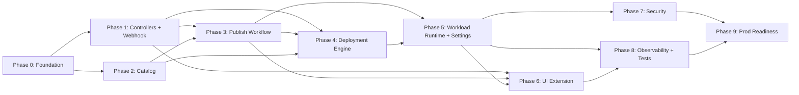

# SUSE AI Factory — Project Plan

> **Audience:** Engineering leads and coding agents.
> **Scope:** Phased delivery plan with user stories. Each story contains owner hint, effort, dependencies, parallelism, a one-sentence done criterion, acceptance criteria, a concrete validation command, and a structured prompt a coding agent can execute directly.
> **Version:** v1.1 (aligned with `SOFTWARE_SPEC.md` and `ARCHITECTURE.md` v1.1 four-noun model).
> **References:** `docs/spec/SOFTWARE_SPEC.md` (what to build), `docs/spec/ARCHITECTURE.md` (how to build it), `CLAUDE.md` at repo root (working conventions).

## Scope-Critical Decisions (read before any story)

These constraints flow through every story; violating them creates rework. Each is enforced by acceptance criteria and validation greps.

1. **Four-noun model.** The product surface is **App** (catalog), **Bundle** (mutable workshop, namespaced), **Blueprint** (immutable, versioned, cluster-scoped), **Workload** (running instance with `spec.source` provenance). The OLD `New → Conformant → Ready → Certified` Bundle lifecycle is removed. Bundle phases are `Draft → Submitted → ChangesRequested`.
2. **Publish-by-approval governance.** A Bundle becomes a Blueprint via `POST /api/v1/bundles/{ns}/{name}/approve` invoked by a user holding the `aif-blueprint-publisher` ClusterRole. Approval mints a NEW Blueprint CR (immutable per `(name, version)`). The Bundle returns to `Draft`.
3. **Blueprint immutability.** A `ValidatingAdmissionWebhook` (`aif-blueprint-immutability`) rejects any UPDATE to `Blueprint.spec`. Status mutations (Active / Deprecated / Withdrawn) are allowed.
4. **Workload provenance.** Every Workload has `spec.source` = `{kind: App|Blueprint|BundleTest, ...}`. The deployer resolves source → component list. Operate-page actions (Upgrade) check `source.kind`.

   > **Follow-up (post-merge P4-3):** The P4-3 branch removed `BundleTest` from the source-kind enum (CRD enum is now `App|Blueprint`); the `BundleTestRef` Go struct, the `/bundles/{ns}/{name}/test-deploy` REST endpoint, and the deployer's BundleTest arm were all deleted. The enum above describes the pre-P4-3 shape; consult `api/v1alpha1/workload_types.go` for the current definition.
5. **No internal OCI registry.** AIF never hosts, proxies, or mirrors images. There is no `pkg/registry/`, no `pkg/mirror/`, no `:5000` port, no `aif_registry_*` metrics, no `/api/v1/clients`, no `/api/v1/registry/*`, no `/api/v1/sync` (image-mirror direction).
6. **No direct NVIDIA NGC access at runtime.** AIF never reaches `nvcr.io`, `helm.ngc.nvidia.com`, or `integrate.api.nvidia.com`. NIM containers and Helm charts are mirrored into SUSE Registry by an **external offline process** (run by SUSE / customer ops, NOT implemented by any story in this plan). AIF's only NVIDIA-asset source is SUSE Registry. Therefore: no NGC API client, no NGC API key in Settings, no NGC sync endpoint.
7. **Mirror path convention (contract with the offline process):**
   - NVIDIA Helm charts: `oci://registry.suse.com/ai/charts/nvidia/{nim-llm|nim-vlm|...}:{version}`
   - NVIDIA container images: `registry.suse.com/ai/containers/nvidia/{model}:{version}`
   - SUSE-native charts come from `oci://registry.suse.com/ai/charts/...` and SUSE Application Collection (`oci://dp.apps.rancher.io/charts`)
8. **Catalog content == what is published.** AIF lists NIMs by reading the SUSE Registry chart index at `oci://registry.suse.com/ai/charts/nvidia/`. There is no hardcoded model seed and no "pending mirror" UX.
9. **One pull-secret pattern.** Workload pods authenticate to both SUSE Registry and SUSE Application Collection via a single docker-config Secret named `suse-registry-creds`, reconciled by the operator from the `Settings` CRD into each workload namespace. There is no `ngc-api-key` Secret in v1.
10. **Air-gap is a first-class scenario, not a mode.** Every story must keep its acceptance criteria valid in an air-gapped cluster.
11. **Hub-on-management-cluster topology.** The AIF operator and all AIF CRDs (`Bundle`, `Blueprint`, `Workload`, `Settings`, `InstallAIExtension`) live exclusively on the Rancher management cluster. Downstream clusters run only the Rancher-managed `fleet-agent` — no AIF operator, no AIF CRDs (all five AIF CRDs exist only on the management cluster). Workload delivery to downstream clusters flows through Fleet: `deployStrategy: helm` → WorkloadReconciler creates a `fleet.cattle.io/v1alpha1 Bundle` CR; `deployStrategy: gitops` → WorkloadReconciler creates a `fleet.cattle.io/v1alpha1 GitRepo` CR. The operator never calls downstream cluster APIs directly. `Workload.spec.targetClusters` ([]string) lists the destination clusters and is used to populate `spec.targets` in the Fleet CR (one entry per cluster). The UI has no cluster switcher; the Steve store connects to the management cluster only; the cluster picker in the deploy wizard is sourced from `management.cattle.io.cluster`.

---

## Story Template

```
**ID:** P{phase}-{n}
**Epic:** {epic name}
**Story:** As a {persona}, I want {action} so that {outcome}.
**Owner Hint:** Backend Go | UI Vue | DevOps | Tests | Docs
**Effort:** S (≤1 day) | M (2–3 days) | L (4+ days)
**Depends On:** P{a}-{b}, P{c}-{d}
**Parallelizable With:** P{e}-{f}, ...
**Done When:** {one unambiguous merge criterion}

**Acceptance Criteria:**
- [ ] ...

**Validation:**
<commands or API calls that prove this story is done>

**Agent Prompt:**
> ...
```

---

## Personas

- **Platform Engineer** — installs, configures, and operates the AI Factory; deals with Helm, Rancher, RBAC, networking, secrets. Often holds the Blueprint Publisher role.
- **AI/ML Practitioner (Bundle Author)** — discovers Apps, composes Bundles, deploys Apps and Blueprints, test-deploys Bundles, submits for review.
- **Blueprint Publisher** — reviews submitted Bundles and either approves (mints Blueprint version) or requests changes.
- **Operations Engineer** — monitors Workloads, upgrades to newer Blueprint versions, uninstalls failed deployments.
- **AIF Maintainer** — extends the operator and the UI extension; reads CLAUDE.md daily.
- **Security Engineer** — reviews RBAC, secrets handling, NetworkPolicy, container hardening, admission webhooks.
- **Tester / Tooling** — owns test suites and CI gates.
- **Docs** — owns CLAUDE.md, ADRs, chart READMEs.

---

## Phase Dependency Graph



Phases 2 and 3 can start as soon as Phase 1 begins. Phase 6 can start once Phase 1 is in flight (UI scaffold is independent, but full integration awaits Phase 5).

---

## Parallelization Matrix

| Phase | Parallel groups | Serial chains |
|-------|-----------------|---------------|
| 0     | P0-0 ‖ P0-1; then P0-2 ‖ P0-3 ‖ P0-5 ‖ P0-6; P0-7 after P1-5 lands | P0-4 needs P0-1 + P0-2; P0-7 needs P1-5 (the webhook itself) |
| 1     | P1-1 ‖ P1-2 ‖ P1-3 ‖ P1-4 ‖ P1-6 ‖ P1-7 ‖ P1-10 | P1-5 needs P1-2 (webhook); P1-8 last; P1-9 after P1-8; P1-10 (HTTP API skeleton) needs P0-2 + P0-4 + P1-7 — no other Phase 1 dep |
| 2     | P2-1 ‖ P2-2; then P2-3; then P2-4; then P2-5 ‖ P2-6; then P2-7 | P2-3 needs P2-1+P2-2; P2-4 needs P2-3; P2-5 needs P2-3+P2-4 (annotation-fetching populates the field the P2-4 filter consumes); P2-7 needs P2-5 (the wrapper consumes the RB-flagged catalog) |
| 3     | P3-2 ‖ P3-3 ‖ P3-4 ‖ P3-5 ‖ P3-8 (after P3-1) | P3-1 first; P3-6 last; P3-7 after P3-6; P3-8 also needs P5-7 + P4-6 |
| 4     | P4-2 ‖ P4-3 ‖ P4-4 ‖ P4-6 | P4-1 first; P4-5 last; P4-6 needs P5-7 |
| 5     | P5-1 ‖ P5-3 ‖ P5-4a ‖ P5-6 ‖ P5-7 ‖ P5-8 ‖ P5-9 | P5-2 needs P5-1; P5-4a needs P1-10 (handler skeleton); P5-4b needs P4-3 + P4-3b (after P5-4a); P5-5 last; P5-6 only depends on P3-6; P5-8 needs P5-7; P5-9 needs P5-7 |
| 6     | P6-0 ‖ P6-1; then P6-2 ‖ P6-3; then P6-4 ‖ P6-5 ‖ P6-6; then P6-7 ‖ P6-8 ‖ P6-9 ‖ P6-10 | UI-internal chain only |
| 7     | All five (P7-1..P7-5) parallel | Each only needs its Phase 0 prereq |
| 8     | P8-1 ‖ P8-2 ‖ P8-3 ‖ P8-6; P8-4 ‖ P8-5 | P8-6 needs Phase 6 done |
| 9     | P9-1 ‖ P9-2 ‖ P9-3 ‖ P9-3a ‖ P9-4 ‖ P9-6 ‖ P9-7 | P9-3a needs P9-3; P9-5 last (final polish); P9-6 needs P9-1, P9-2, P0-6, P0-7; P9-7 needs P9-6, P5-7 |

A two-developer team can run the matrix at roughly: dev-A on Backend, dev-B on UI/DevOps, with Tests + Docs interleaved. A 4-agent fleet should saturate Phase 1 (multiple parallel controllers) and Phase 7 (all 5 parallel) easily.

---

## Coordination Notes (file-level conflict hotspots)

| File | Touched by | Mitigation |
|------|-----------|------------|
| `cmd/operator/main.go` | P0-4 only after that | Keep main ≤250 lines. Route registration moves into `internal/manager/routes.go` after P0-4. Each handler story adds one `mux.HandleFunc` line via that file, not main. |
| `internal/manager/routes.go` | P3-2..P3-6, P4-2, P4-3, P4-5, P5-2, P5-3, P5-4a, P5-5, P7-5, P8-1, P8-2 | Each handler story adds one `mux.HandleFunc` line — no rewrites of existing lines. |
| `charts/aif-operator/templates/deployment.yaml` | P0-3, P7-2, P7-3, P9-3, P9-3a | P0-3 lands a complete-but-minimal template. P7-* and P9-3 are surgical patches. P9-3a wires leader-election args. |
| `charts/aif-operator/templates/rbac.yaml` | P0-3, P7-1, P8-3 | Generate from `//+kubebuilder:rbac` markers via `make manifests`. Don't hand-edit after P0-3. |
| `charts/aif-operator/templates/webhook.yaml` | P1-5, P7-4 | Created in P1-5; P7-4 may add CA bundle injection details. |
| `pkg/bundle/manager.go` | P3-1 first, then P3-2..P3-5 add methods | Define `Manager` interface in P3-1. Subsequent stories add methods only — never change existing signatures. |
| `pkg/blueprint/manager.go` | P3-5, P3-6, P5-5 | Same pattern: interface frozen in P3-5. |
| `pkg/publish/workflow.go` | P3-1 frozen interface; P3-2..P3-5 implementations | Same. |
| `pkg/nvidia/discovery.go` | P2-1, P5-5 | The NIM index is read from SUSE Registry only. Any new code that touches `nvcr.io`, `helm.ngc.nvidia.com`, or `integrate.api.nvidia.com` is a bug — the mirror process is external to AIF. |
| `pkg/workload/manager.go` | P5-1, P5-2, P8-1 | Interface frozen in P5-1. |
| `internal/api/middleware.go` | P0-4, P7-5, P8-1, P8-2 | Keep middleware composable — each story adds a separate function. |
| `ui/ai-factory/pkg/ai-factory/index.ts` | P6-1, P6-2, P6-3, P6-4 | P6-1 lands skeleton. Subsequent stories add lines for `addProduct`, `addRoutes`, `addL10n` — no rewrites. > **Follow-up (post-merge, P6-9):** `addDashboardStore('aif', ...)` removed — the custom Steve store was dropped in favour of the built-in `management` store. Future stories must not re-add it unless a concrete need arises. |
| `ui/ai-factory/pkg/ai-factory/utils/operator-api.ts` | P6-9 (created), P6-3..P6-10 (consumed) | Replaces the originally planned `utils/api.js`. Typed `fetch` wrapper routing all operator REST calls through the Rancher k8s-proxy. All UI stories that need operator REST calls import from this module. Never modify existing function signatures after P6-9. |
| `ui/ai-factory/pkg/ai-factory/utils/api.js` | (superseded by `utils/operator-api.ts`) | Original plan; replaced by `operator-api.ts` in P6-9. If future needs differ from the operator REST pattern, this file may be created separately; for now, treat `operator-api.ts` as the canonical REST client module. |
| `CLAUDE.md` | P0-0, P1-9, P3-7, P6-0, P9-5 | Append-only edits between P0-0 and P9-5. P9-5 is the only story allowed to delete content. |
| `pkg/helm/values.go` | P4-1 (engine + MergeValues), P4-6 (ApplyImageRewrites) | P4-1 lands `MergeValues`; P4-6 adds `ApplyImageRewrites` as a separate function called after `MergeValues` and after NIM generation. No edits to existing function signatures. |
| `api/v1alpha1/settings_types.go` | P0-2 (initial), P5-7 (air-gap fields) | P5-7 adds `registryEndpoints`, `imageRewrite`, `catalogDiscovery`, `blueprintClassification` as additive optional field groups — no removal of existing fields. |
| `charts/aif-operator/values.yaml`, `templates/deployment.yaml`, `templates/webhook*.yaml` | P0-3 (initial), P0-6 (image.registry), P0-7 (webhook.tlsMode), P7-2, P7-3, P7-4 | P0-6 adds `image.registry` field; P0-7 adds `webhook.tlsMode` enum + `webhook-tls-helm-hook.yaml` template logic. Both are additive, default values preserve existing behaviour. |
| `internal/api/settings.go`, `internal/api/bundles.go` | P5-4a (settings CRUD handler), P5-9 (test-connection), P3-8 (preflight) | P5-4a creates `internal/api/settings.go` with `GET`/`PUT /api/v1/settings`; P5-9 adds `/api/v1/settings/test-connection`; P3-8 adds `/api/v1/bundles/{ns}/{name}/preflight`. All register independent HandleFunc lines via `routes.Register`. |
| `internal/manager/engine_bus.go` | P5-7 (created), P5-4b (Fleet engine wiring) | P5-7 created the bus with helm/nvidia/appco engines. P5-4b adds the Fleet engine field + `projectFleet` projection — purely additive. |
| `api/v1alpha1/settings_types.go` (air-gap fields specifically) | P5-7 (defines), then consumed by P3-8, P4-6, P5-4a, P5-8, P5-9, P6-9, P7-2, P9-6 | **P5-7 is a cross-phase prerequisite.** Promote its scheduling: implement P5-7 immediately after P0-2 (CRD scaffolding) so air-gap-aware stories in Phase 3, 4, 6, 7, 9 can take a hard dependency. Each consumer story's `Depends On` must explicitly list P5-7. |

---

## Ready-for-Development Checklist

### Cluster & runtime
- [ ] `kind` cluster running (or another K8s 1.24+ cluster — see `ARCHITECTURE.md §2.0 Prerequisites`)
- [ ] CRDs from `charts/aif-operator/crds/` installed
- [ ] cert-manager v1.13+ installed (required when `webhook.tlsMode=cert-manager`; skip if using `webhook.tlsMode=helm-hook`)
- [ ] Rancher 2.10+ if doing UI work

### Languages & runtimes
- [ ] Go 1.26+ installed; `go env GOPATH` writable
- [ ] Helm 3.13+ installed
- [ ] Docker / podman available for image builds
- [ ] Node 18+ and Yarn for UI work

### Code-generation & build tools (install via `make install-tools` — landed by P0-1)
- [x] `controller-gen@v0.20.1` (CRD + RBAC generation, version pinned in Makefile)
- [ ] `kubebuilder` (envtest binaries for controller integration tests) — **DEFERRED to P1-8**
- [x] `golangci-lint@v2.11.4` (lint pipeline, version pinned in Makefile)
- [x] `mockgen@v0.6.0` from `go.uber.org/mock` (for larger interface mocks)
- [x] `ginkgo@v2.28.1` and `gomega` (BDD test framework)

### Air-gap / release tooling (needed for Phase 9; can install later)
- [ ] `skopeo` (mirror.sh script + customer-side re-mirroring)
- [ ] `cosign` (image signing; v2+)
- [ ] `syft` (SBOM generation)
- [ ] `docker buildx` with QEMU emulation (multi-arch image builds)

### External access (for online dev — air-gap dev should override per `AIRGAP.md §6`)
- [ ] `git remote -v` configured if doing Fleet work (P4-3)
- [ ] SUSE Registry credentials (for NIM index discovery testing)
- [ ] SUSE Application Collection credentials (for catalog sync testing)

### Living docs
- [ ] Read `CLAUDE.md` at repo root (after P0-0)
- [ ] Rancher dev shell available on `:8005` if doing UI work (`cd dashboard && yarn dev`)
- [ ] `git remote -v` configured if doing Fleet work (P4-3)
- [ ] Read CLAUDE.md at repo root before opening files (after P0-0)

---

## Phase 0 — Foundation & Scaffolding

*Goal: Empty repository → compilable Go module + Helm chart skeletons + CI scaffold + a living CLAUDE.md. No business logic.*

> **Framing for Phase 0 — fresh start, not refactor.** AIF v1.1 is a greenfield implementation. The legacy `aif-v0/` codebase exists as `.reference/aif-v0/` for pattern lookup only — engineers should never edit it, modify its files, or treat its existing fields/structs as authoritative. Phase 0 acceptance criteria use **positive specifications** ("create X per `ARCHITECTURE.md §Y`") rather than negative ones ("remove the existing X that violates Y"). When an acceptance criterion mentions "no `cluster-admin`" or "no `:5000` port", read it as a grep guard against accidental re-introduction in NEW code — not as a directive to rip out v0. The reference codebase under `.reference/` is excluded from all linters, builds, and CI checks via path filters.


---

**ID:** P0-0
**Epic:** Living Documentation — Bootstrap CLAUDE.md
**Story:** As an AIF maintainer, I want a CLAUDE.md at the repo root so that humans and agents share one durable source of conventions, build commands, and "how to add X" recipes.
**Owner Hint:** Docs
**Effort:** S
**Depends On:** none
**Parallelizable With:** P0-1
**Done When:** `CLAUDE.md` at repo root documents build/test/lint commands, primary directories, naming conventions, and "how to add X" checklists.

**Acceptance Criteria:**
- [ ] `CLAUDE.md` exists at repo root
- [ ] Sections: Project Overview, Repository Layout, Build & Test Commands, Code Conventions, How to Add (CRD / REST endpoint / list page / detail page / edit page / publish-workflow action), Where to Look (cross-links to spec docs)
- [ ] Lists the 5 living-doc stories explicitly (P0-0, P1-9, P3-7, P6-0, P9-5)
- [ ] Cross-references `ARCHITECTURE.md §3.1` Imports Reference Table
- [ ] No project-specific code or content not derivable from `ARCHITECTURE.md`
- [ ] Under 400 lines

**Validation:**
```bash
test -f CLAUDE.md && wc -l CLAUDE.md
grep -E '^## ' CLAUDE.md
```

**Agent Prompt:**
> Create `CLAUDE.md` at the repo root. Read `docs/spec/SOFTWARE_SPEC.md`, `docs/spec/ARCHITECTURE.md`, and `docs/spec/PROJECT_PLAN.md` first. Write CLAUDE.md with sections: (1) Project Overview — 1 paragraph, links to SOFTWARE_SPEC. (2) Repository Layout — directory tree from ARCHITECTURE §6.1, one line per top-level dir. (3) Build & Test Commands — `make build`, `make test`, `make lint`, `helm lint`, `yarn build`, `yarn test`. (4) Code Conventions — Go: `slog`, `errors.Is`, no `fmt.Println`, interfaces in `interface.go`. UI: `@shell/*` imports, `labelKey` for all strings. (5) How to Add a CRD / REST endpoint / UI page / publish-workflow action — placeholders until P1-9 / P3-7 / P6-0 expand them. (6) Where to Look — cross-links. (7) Living-Doc Stories list. Keep under 400 lines.

---

**ID:** P0-1
**Epic:** Repository Foundation
**Story:** As a developer, I want a correctly structured Go module and repository layout so that all subsequent code has a consistent home.
**Owner Hint:** Backend Go
**Effort:** S
**Depends On:** none
**Parallelizable With:** P0-0, P0-3, P0-5
**Done When:** `go build ./...` succeeds and `docker build -t aif:test .` produces an image whose container runs as UID 1000.

**Acceptance Criteria:**
- [ ] `go.mod` declares `module github.com/SUSE/aif`, `go 1.21`
- [ ] Directory tree matches `ARCHITECTURE.md §6.1` exactly
- [ ] `go build ./...` succeeds with only an empty `main.go`
- [ ] `.gitignore` excludes `bin/`, `dist/`, `*.tgz`, `data/`
- [ ] `Makefile` has targets: `build`, `test`, `run`, `docker-build`, `docker-push`, `helm-install`, `helm-uninstall`, `charts-package`, `lint`, `manifests`, `generate`, **`install-tools`** *(installs all build/test tools per `tools.go`)*
- [x] `tools.go` (build tag `tools`) imports tool dependencies (versions in go.mod and Makefile). Tools included:
  - `sigs.k8s.io/controller-tools/cmd/controller-gen` (v0.20.1)
  - `github.com/golangci/golangci-lint/v2/cmd/golangci-lint` (v2.11.4)
  - `go.uber.org/mock/mockgen` (v0.6.0)
  - `github.com/onsi/ginkgo/v2/ginkgo` (v2.28.1)
  - Note: kubebuilder deferred to P1-8 due to Go 1.26 compatibility issues
- [x] `make install-tools` installs each tool with pinned versions from Makefile into `$GOPATH/bin`
- [ ] `Dockerfile` is two-stage: `golang:1.21-alpine` builder → `alpine:3.18` runtime; copies only the binary; runs as UID 1000

**Validation:**
```bash
go build ./...
go vet ./...
make help
make install-tools
which controller-gen golangci-lint mockgen ginkgo  # Note: kubebuilder removed, deferred to P1-8
docker build -t aif:test . && docker inspect aif:test | grep -i user
```

**Agent Prompt:**
> Initialise the SUSE AI Factory repository. Module path `github.com/SUSE/aif`, Go 1.21. Create: (1) `go.mod` (no deps yet). (2) All directories from `ARCHITECTURE.md §6.1` — `.gitkeep` in empty leaves. (3) `cmd/operator/main.go` with `package main\nfunc main() {}`. (4) `Makefile` with all targets per spec — stubs except `build` (`go build -o bin/aif-operator ./cmd/operator`). (5) Two-stage `Dockerfile`. (6) `.gitignore`. No business logic. Done when `go build ./...` and `docker build` succeed.

---

**ID:** P0-2
**Epic:** CRD Type Definitions
**Story:** As a platform engineer, I want all Kubernetes CRDs defined as Go types so that the operator can manage them declaratively.
**Owner Hint:** Backend Go
**Effort:** M
**Depends On:** P0-1
**Parallelizable With:** P0-3, P0-5
**Done When:** `make manifests generate` produces deepcopy + CRD YAMLs for all 5 kinds and `go build ./api/...` succeeds.

**Acceptance Criteria:**
- [ ] All five kinds defined in `api/v1alpha1/`: `Bundle` (namespaced), `Blueprint` (cluster-scoped), `Workload` (namespaced), `Settings` (namespaced), `InstallAIExtension` (namespaced)
- [ ] `BundleSpec` exactly matches `ARCHITECTURE.md §4.2` schema: `title`, `description`, `targetBlueprint`, `useCase`, `authors[]`, `components[]`, `valueOverrides`, `paused`. **Forbidden fields** (would re-introduce v0 patterns): `version`, `type`, `phase` (in spec — phase lives in status), `standards[]`, `componentConfigs`, `targetCluster`, `deployStrategy`. The grep guards in Validation enforce this.
- [ ] `BundleStatus` per §4.2: `phase` enum {`Draft`, `Submitted`, `ChangesRequested`}, `submission` (*SubmissionStatus), `review` (*ReviewStatus), `testDeploys[]` (TestDeployRecord), `publishedVersions[]` (PublishedVersionRef), `conditions[]`, `observedGeneration`. The full `SubmissionStatus`, `ReviewStatus`, `TestDeployRecord`, `PublishedVersionRef` Go struct definitions are in §4.2 — copy verbatim.
- [ ] `BlueprintSpec` per §4.3: `blueprintName`, `version`, `useCase`, `description`, `changeDescription`, `source`, `components[]`, `valueOverrides`, `publishedBy`, `publishedAt`. Includes `BlueprintSource` discriminated union (type ∈ {`WrapsVendorChart`, `Published`}) with `vendorChartRef` and `publishedFrom` sub-pointers per §4.3 — copy verbatim, including the `BlueprintSourceType` const block.
- [ ] `BlueprintStatus` per §4.3: `phase` enum {`Active`, `Deprecated`, `Withdrawn`}, `deprecation` (*DeprecationStatus), `deploymentCount int`, `conditions[]`, `observedGeneration`
- [ ] `WorkloadSpec` per §4.4: `source` (WorkloadSource discriminated union with `kind`, `app`, `blueprint`, `bundleTest` sub-fields), `targetClusters` ([]string, lists downstream clusters for Fleet routing), `valueOverrides`, `deployStrategy` (enum: `helm` | `gitops`; default `helm`), plus the full strategy/scaling/resources blocks (RollingUpdate/BlueGreen/Canary/AutomaticRecovery, scaling.{minReplicas,maxReplicas,vpa,targetCPU}). All optional except `name` and `source`.
- [ ] `WorkloadStatus` per §4.4: `phase` enum, `replicas`, `readyReplicas`, `componentReleases[]` (ComponentReleaseStatus per §6.6 component-to-Helm-release mapping), `conditions[]`, `deploymentHistory[]`, `observedGeneration`
- [ ] `SettingsSpec` per §4.5 — base fields ONLY in this story (P0-2 lands the foundation): `applicationCollection.{userSecretRef, tokenSecretRef, categories}`, `suseRegistry.{userSecretRef, tokenSecretRef, refreshIntervalMinutes}`, `fleet.{repoURL, branch, authType, credSecretRef}`. The air-gap field groups (`registryEndpoints`, `imageRewrite`, `catalogDiscovery`, `blueprintClassification`) are added in **P5-7** (additive, optional). All credential fields use `corev1.SecretKeySelector` from `k8s.io/api/core/v1`.
- [ ] **Phase enums use typed Go string constants** per `ARCHITECTURE.md §4.1` Common Patterns (e.g., `type BundlePhase string; const ( BundlePhaseDraft BundlePhase = "Draft"; ... )`). Plus the shared condition Type/Reason constants from `pkg/conditions/types.go` (lands here as part of P0-2; full enumeration in §4.1).
- [ ] All Status structs use `[]metav1.Condition` (from `k8s.io/apimachinery/pkg/apis/meta/v1`) plus `ObservedGeneration int64`
- [ ] Blueprint CRD has `+kubebuilder:resource:scope=Cluster`; all others `Namespaced`. Blueprint identity via labels `ai.suse.com/blueprint-name`, `ai.suse.com/blueprint-version`, `ai.suse.com/blueprint-source` per §4.3.
- [ ] `groupversion_info.go` registers group `ai.suse.com`, version `v1alpha1`
- [ ] `make manifests generate` produces CRD YAMLs in `charts/aif-operator/crds/` (directory pre-created in Makefile) plus deepcopy in `zz_generated_deepcopy.go`. The Makefile target ensures `mkdir -p charts/aif-operator/crds` before invoking controller-gen.

**Validation:**
```bash
make manifests generate
go build ./api/...
ls charts/aif-operator/crds/
grep -E 'scope:' charts/aif-operator/crds/blueprints.yaml | grep -i cluster
grep -iE 'registry\.internal|registry\.external\.sync|nvidia\.ngc|nvidia\.aie|ngc[Aa]pi[Kk]ey' api/v1alpha1/*.go && echo FAIL || echo PASS
grep -iE 'Conformant|Certified|Promote' api/v1alpha1/*.go && echo FAIL || echo PASS
```

**Agent Prompt:**
> Create all five CRD Go type files in `api/v1alpha1/` per `ARCHITECTURE.md §4`. One file per Kind. Use `controller-gen` markers. Critical rules: (1) Phase enums are typed Go string constants. (2) Bundle phases are `Draft`/`Submitted`/`ChangesRequested` ONLY — DO NOT add `New`/`Conformant`/`Ready`/`Certified` (the OLD lifecycle is removed). (3) Blueprint is `+kubebuilder:resource:scope=Cluster` (others Namespaced). (4) `WorkloadSource` is a discriminated union — provide all three sub-pointer fields with `omitempty`. (5) `SettingsSpec` credential fields use `corev1.SecretKeySelector`. ONLY allow refs for `applicationCollection`, `suseRegistry`, `fleet`. NO NGC fields, NO internal-registry fields, NO `nvidia.apiKeySecretRef`. (6) Add `+kubebuilder:object:root=true`, `+kubebuilder:subresource:status`, `+kubebuilder:printcolumn` annotations. (7) Add `go.mod` deps for `sigs.k8s.io/controller-runtime@v0.17` and `k8s.io/api`; run `go mod tidy`. Done when `go build ./api/...` succeeds and `make manifests` produces CRD YAMLs.

---

**ID:** P0-3
**Epic:** Helm Chart Scaffolding
**Story:** As a platform engineer, I want production-quality Helm charts so that the operator deploys securely and declaratively.
**Owner Hint:** DevOps
**Effort:** M
**Depends On:** P0-1
**Parallelizable With:** P0-2, P0-5
**Done When:** `helm lint` passes on all 5 charts (aif-operator, aif-ui, generic-container, nim-llm, nim-vlm) with no warnings.

**Acceptance Criteria:**

> **Scope boundary with P0-6 / P0-7:** P0-3 lands the *complete chart skeleton with all 5 templates*. P0-6 *adds* the `image.registry` value split (preserving the existing `image.repository` default of `ghcr.io/suse/aif-operator`). P0-7 *adds* the `webhook.tlsMode` enum + `webhook-tls-helm-hook.yaml` template (P0-3 ships the `cert-manager`-only path). Both P0-6 and P0-7 are additive — they don't rewrite anything P0-3 ships.

**charts/aif-operator/ — `values.yaml` per §9.1:**
- [ ] Image: `image.repository: ghcr.io/suse/aif-operator`, `image.tag: ""` (defaults to chart `appVersion`), `image.pullPolicy: IfNotPresent`. *(P0-6 splits `image.registry` out later.)*
- [ ] `imagePullSecrets: []`
- [ ] `replicaCount: 1`
- [ ] `service.type: ClusterIP`, `service.ports: {api: 8080, health: 8081, metrics: 8082, webhook: 9443}`. **Forbidden:** `service.ports.registry`, `service.ports: 5000`. The grep guard in Validation enforces this.
- [ ] `resources.{requests,limits}` per §9.1 default values
- [ ] `persistence.{enabled, size: 10Gi, storageClass, accessMode: ReadWriteOnce, mountPath: /data}`
- [ ] `securityContext: {runAsNonRoot: true, runAsUser: 1000, readOnlyRootFilesystem: true}`
- [ ] `extraEmptyDirs: [/data/charts, /data/git, /tmp]` — emptyDir volume mounts for the writable paths
- [ ] `operator.{logLevel: info, logFormat: json, catalogRefresh: 10m}`
- [ ] `webhook.{enabled: true, tlsMode: cert-manager, certManager.enabled: true}` *(P0-7 adds `tlsMode: manual` and `tlsMode: helm-hook` modes.)*
- [ ] `podDisruptionBudget.{enabled: false, minAvailable: 1}`
- [ ] `networkPolicy.{enabled: false}` *(P7-3 implements the template.)*
- [ ] **NOT present:** `nvidia.apiKeySecretRef`, `nvidia.aieApiKeySecretRef`, `registry.internal.*` — grep guard enforces.
- [ ] **TODO (post-P1-6):** Add `installAIExtension.enabled` flag to control whether InstallAIExtension controller runs. Default `true` for management cluster deployments, `false` for downstream clusters (where UIPlugin installation is unnecessary since Rancher Dashboard only loads UIPlugins from the management cluster).

**charts/aif-operator/templates/ — required templates:**
- [ ] `deployment.yaml`: container with security context above, the four named ports, three emptyDir volume mounts. Probes: liveness `httpGet :8081/healthz`, readiness `:8081/readyz`, startup `:8081/healthz` with `failureThreshold: 30, periodSeconds: 10`. Image reference uses `{{ .Values.image.repository }}:{{ .Values.image.tag | default .Chart.AppVersion }}`.
- [ ] `service.yaml`: 4 ports (api/health/metrics/webhook)
- [ ] `serviceaccount.yaml`: `aif-operator` SA in chart namespace
- [ ] `rbac.yaml`: TWO ClusterRoles — `aif-operator` (operational permissions, generated from kubebuilder markers via `make manifests`) and `aif-blueprint-publisher` (publisher role, unbound by default per §8.5). One ClusterRoleBinding for `aif-operator`. **Forbidden:** `cluster-admin` reference, wildcard verbs (`"*"`). Grep guards enforce.
- [ ] `pvc.yaml`: gated by `.Values.persistence.enabled`
- [ ] `poddisruptionbudget.yaml`: gated by `.Values.podDisruptionBudget.enabled`
- [ ] `webhook.yaml`: gated by `.Values.webhook.enabled`. Includes `ValidatingWebhookConfiguration` for `aif-blueprint-immutability` (per §8.3) plus, when `tlsMode: cert-manager`, the cert-manager `Issuer` + `Certificate` resources for `aif-operator-webhook` Service. The `caBundle` field uses cert-manager's `inject-ca-from` annotation. *(P0-7 adds the manual + helm-hook modes.)*
- [ ] `crds/` directory pre-created (P0-2 populates it via `make manifests`)

**charts/aif-ui/ per §9.2:**
- [ ] Single `UIPlugin` template in `cattle-ui-plugin-system` (literal namespace, NOT templated) with annotation `catalog.cattle.io/ui-extensions-version: ">= 3.0.0 < 4.0.0"` in `metadata.annotations` (NOT in `spec.plugin.metadata`).
- [ ] `helm lint` passes on all five charts

**Validation:**
```bash
# 1. All five charts lint clean
helm lint charts/aif-operator charts/aif-ui charts/generic-container charts/nim-llm charts/nim-vlm

# 2. Security context correctly applied
helm template aif-operator charts/aif-operator | grep -A3 'readOnlyRootFilesystem' | grep 'true'

# 3. Forbidden patterns are absent
helm template aif-operator charts/aif-operator | grep 'cluster-admin' && echo FAIL || echo PASS-no-cluster-admin
helm template aif-operator charts/aif-operator | grep -E 'port: 5000|nvidia.apiKey|registry-addr' && echo FAIL || echo PASS-no-forbidden
helm template aif-operator charts/aif-operator | grep -E 'verbs:.*"\*"|resources:.*"\*"' && echo FAIL || echo PASS-no-wildcards

# 4. All four service ports present
helm template aif-operator charts/aif-operator | grep -E 'port: (8080|8081|8082|9443)' | wc -l | grep -q '^4$' && echo PASS || echo FAIL

# 5. Both ClusterRoles present (operator + publisher)
helm template aif-operator charts/aif-operator | grep -E 'name: aif-operator$|name: aif-blueprint-publisher$' | wc -l | grep -q '^2$' && echo PASS || echo FAIL

# 6. UI chart correctness
helm template aif-ui charts/aif-ui | grep 'cattle-ui-plugin-system'
helm template aif-ui charts/aif-ui | grep 'ui-extensions-version: ">= 3.0.0 < 4.0.0"'
```

**Agent Prompt:**
> Create five Helm charts in `charts/`: `aif-operator`, `aif-ui`, `generic-container`, `nim-llm`, `nim-vlm`. Follow `ARCHITECTURE.md §9` exactly. For `aif-operator`: (1) `values.yaml` per §9.1 — service ports api/health/metrics/webhook only (NO 5000), NO nvidia.apiKeySecretRef, include webhook.{enabled,certManager.enabled} block. (2) `templates/deployment.yaml` — securityContext per spec; emptyDir for `/data/charts`, `/data/git`, `/tmp`; probes at port 8081. NO env var `NVIDIA_API_KEY`. (3) `templates/rbac.yaml` — `ClusterRole` `aif-operator` with specific verbs per §8.4 markers, plus a separate `ClusterRole` `aif-blueprint-publisher` (unbound by default). (4) `templates/webhook.yaml` — `ValidatingWebhookConfiguration` for `aif-blueprint-immutability` plus cert-manager `Issuer` and `Certificate` resources, all gated by `.Values.webhook.enabled`. For `aif-ui`: single `UIPlugin` template with required annotation. For `nim-llm`/`nim-vlm`: GPU resource requests, tolerations, `imagePullSecrets: [{name: suse-registry-creds}]`. Done when `helm lint` passes on all five charts with no errors.

---

**ID:** P0-4
**Epic:** Operator Binary Wiring
**Story:** As a developer, I want a well-structured operator entry point so that all components are wired together cleanly and the binary starts and stops gracefully.
**Owner Hint:** Backend Go
**Effort:** M
**Depends On:** P0-1, P0-2
**Parallelizable With:** none in phase
**Done When:** binary builds, starts, responds to `/healthz`, and shuts down cleanly within 15s on SIGINT.

**Acceptance Criteria:**
- [ ] `cmd/operator/main.go` is ≤250 lines (target: ~30 lines flag parsing, ~40 manager init, ~50 server startup, ~30 shutdown, ~100 imports/wiring) — aspirational but enforceable via CI line-count guard
- [ ] Parses CLI flags: `--addr` (8080), `--health-probe-bind-address` (8081), `--metrics-bind-address` (8082), `--webhook-bind-address` (9443), `--charts-dir`, `--git-dir`, `--leader-elect`, `--log-level`, `--log-format`, `--allowed-origin`, `--catalog-refresh`

  > **Follow-up (post-merge P4-3):** `--git-dir` is no longer parsed. The P4-3 Fleet GitRepo engine uses an in-memory go-git working tree (`memfs` + `memory.NewStorage`) and pushes directly to `Settings.spec.fleet.repoURL`; there is no on-disk staging directory. The flag was dropped from `cmd/operator/main.go`.
- [ ] NO `--registry-addr`, NO `--nvidia-api-key`, NO `NVIDIA_API_KEY` env read (per Definition of Done air-gap parameterization guard)
- [ ] **slog setup**: `slog.NewJSONHandler(os.Stdout, &slog.HandlerOptions{Level: ...})` for `--log-format=json` (production); `slog.NewTextHandler` for `--log-format=text` (development). Level from `--log-level`. Set as default via `slog.SetDefault(...)`.
- [ ] **Manager structs created** (in this wiring order — empty/stub OK; real impls in later phases):
  1. `helmEngine := helm.New(...)` — needed by everything
  2. `gitEngine := git.NewFleetEngine(...)`
  3. `nvidiaDiscovery := nvidia.NewDiscovery(...)`
  4. `nvidiaDeployer := nvidia.NewDeployer(...)`
  5. `appsCatalog := apps.New(nvidiaDiscovery, ...)`
  6. `bundleManager := bundle.New(k8sClient, ...)`
  7. `blueprintManager := blueprint.New(k8sClient, ...)`
  8. `publishWorkflow := publish.New(bundleManager, blueprintManager, ...)`
  9. `workloadManager := workload.New(k8sClient, helmEngine, gitEngine, ...)`
- [ ] HTTP routes registered via `routes.Register(mux, handlers...)` from `internal/manager/routes.go` (the package + signature land in P1-10; P0-4 stubs an empty `routes.Register` so the binary compiles)
- [ ] **Four server processes — port ownership** (controller-runtime owns three; we own the API server):
  - **`:8080` API server** — own `http.Server` instance with custom mux, all `/api/v1/*` routes, served by P0-4
  - **`:8081` health/probes** — managed by `mgr.AddHealthzCheck("/healthz", healthz.Ping)` + `mgr.AddReadyzCheck("/readyz", ...)`
  - **`:8082` Prometheus metrics** — controller-runtime's built-in metrics server (configured via `manager.Options.MetricsBindAddress`)
  - **`:9443` webhook** — controller-runtime's webhook server (configured via `manager.Options.WebhookServer`)
  - The `:8080` API server runs in its own goroutine; the controller-runtime manager runs in another (it owns 8081/8082/9443 internally)
- [ ] Handles `SIGINT`/`SIGTERM`: 15s `context.WithTimeout`; calls `apiServer.Shutdown(ctx)` AND `mgr.Stop()`; waits for both
- [ ] Starts controller-runtime manager (no controllers registered yet — added in Phase 1)

**Validation:**
```bash
# Build
go build -o bin/aif-operator ./cmd/operator

# Help works; forbidden flags absent
./bin/aif-operator --help
./bin/aif-operator --help | grep -iE 'registry-addr|nvidia-api-key' && echo FAIL || echo PASS-no-forbidden

# Line-count budget
test $(wc -l < cmd/operator/main.go) -le 250 && echo PASS-budget || echo FAIL-budget

# Full lifecycle: starts, healthz responds, shutdown clean within 15s
./bin/aif-operator --health-probe-bind-address=:8081 &
PID=$!
sleep 2
curl -fs http://localhost:8081/healthz | grep -q "ok" && echo PASS-healthz || echo FAIL-healthz
kill -SIGINT $PID
timeout 16 wait $PID && echo PASS-shutdown || echo FAIL-shutdown
```

**Agent Prompt:**
> Implement `cmd/operator/main.go` strictly as wiring, ≤250 lines, no business logic. (1) Parse flags listed in acceptance criteria. NO `--registry-addr`, NO `--nvidia-api-key`. (2) Set up `log/slog`. (3) Create empty manager instances. (4) Create HTTP `net/http.ServeMux`. Move route registration into `internal/manager/routes.go`; main calls `routes.Register(mux, handlers...)`. (5) Start four `http.Server` instances in goroutines (api, health, metrics, webhook). (6) Start controller-runtime manager. (7) Block on signal channel; on signal, 15s `Shutdown` context. Add deps: `sigs.k8s.io/controller-runtime`, `github.com/prometheus/client_golang`. Done when binary builds, `/healthz` responds, shutdown clean.

---

**ID:** P0-5
**Epic:** UI Chart & UIPlugin
**Story:** As a platform engineer, I want the aif-ui Helm chart to correctly register the Rancher UIPlugin so that the AI Factory extension loads in Rancher Dashboard.
**Owner Hint:** DevOps
**Effort:** S
**Depends On:** P0-1
**Parallelizable With:** P0-2, P0-3
**Done When:** `helm template charts/aif-ui` renders a `UIPlugin` in namespace `cattle-ui-plugin-system` with the required annotation.

**Acceptance Criteria:**
- [ ] `charts/aif-ui/templates/ui-plugin.yaml` creates `catalog.cattle.io/v1 UIPlugin`
- [ ] Namespace is the **literal string** `cattle-ui-plugin-system` — NOT `{{ .Release.Namespace }}` and NOT `{{ .Values.namespace }}`. The Rancher UI extension system requires this exact namespace to discover plugins. Verified by template grep: `helm template ... | grep 'namespace: cattle-ui-plugin-system'` MUST find a match.
- [ ] `metadata.annotations` (NOT `spec.plugin.metadata.annotations`) includes `catalog.cattle.io/ui-extensions-version: ">= 3.0.0 < 4.0.0"`. Verified against the local Rancher UIPlugin CRD schema in `dashboard/shell/types/catalog.cattle.io.types.ts` and the working examples in `harvester-ui-extension/charts/`.
- [ ] `spec.plugin.{name,version,endpoint,noCache}` configurable via `values.yaml`
- [ ] `endpoint` value default: `http://aif-operator.aif.svc.cluster.local:8080/ui` per `ARCHITECTURE.md §9.2`
- [ ] `helm lint` passes

**Validation:**
```bash
helm lint charts/aif-ui
helm template aif-ui charts/aif-ui --set endpoint=http://test:8080/ui | grep 'namespace: cattle-ui-plugin-system' || (echo "FAIL: hardcoded namespace missing" && exit 1)
helm template aif-ui charts/aif-ui --set endpoint=http://test:8080/ui | grep 'endpoint: http://test:8080/ui' || (echo "FAIL: endpoint not piped through" && exit 1)
helm template aif-ui charts/aif-ui | grep -E '^\s*catalog\.cattle\.io/ui-extensions-version:' || (echo "FAIL: annotation missing or in wrong block" && exit 1)
```

**Agent Prompt:**
> Complete `charts/aif-ui/`: `Chart.yaml` (apiVersion v2, version 1.0.0), `values.yaml` (`endpoint`, `plugin.{name,version,noCache}`), `templates/ui-plugin.yaml` (`UIPlugin` in `cattle-ui-plugin-system` with the required annotation in `metadata.annotations` — NOT `spec.plugin.metadata.annotations`), `_helpers.tpl`. UIPlugin namespace MUST be the literal `cattle-ui-plugin-system` regardless of `helm install --namespace`. Validate the annotation location against the working pattern in `harvester-ui-extension/charts/harvester-ui-extension/templates/ui-plugin.yaml`. Done when `helm lint` passes AND all three Validation greps pass.

---

**ID:** P0-6
**Epic:** Operator Chart Air-Gap Values
**Story:** As a Platform Engineer installing AIF in an air-gapped cluster, I want the operator chart to accept an arbitrary image registry and pull-secret so that I can install from my customer-internal Harbor.
**Owner Hint:** DevOps
**Effort:** S
**Depends On:** P0-3
**Parallelizable With:** P0-2, P0-4, P0-5
**Done When:** `helm install aif-operator charts/aif-operator --set image.registry=harbor.example.com/suse --set 'imagePullSecrets[0].name=harbor-pull-secret'` produces a Deployment whose container image is `harbor.example.com/suse/aif-operator:<tag>` and whose `imagePullSecrets` reference the named Secret.

**Acceptance Criteria:**
- [ ] `values.yaml` defaults block (verbatim — these defaults preserve existing behaviour for non-air-gap installs):
  ```yaml
  image:
    registry: ghcr.io
    repository: suse/aif-operator
    tag: ""              # empty string → templated to .Chart.AppVersion
    pullPolicy: IfNotPresent
  imagePullSecrets: []
  ```
- [ ] `templates/deployment.yaml` composes the image with the **conditional-prefix template** so empty `image.registry` falls back to Docker convention (no leading slash):
  ```yaml
  image: "{{- if .Values.image.registry -}}{{ .Values.image.registry }}/{{- end -}}{{ .Values.image.repository }}:{{ .Values.image.tag | default .Chart.AppVersion }}"
  ```
  The `{{- if .Values.image.registry -}}{{ .Values.image.registry }}/{{- end -}}` block is the empty-registry fallback. With `image.registry=""`, the rendered output is `image: "suse/aif-operator:1.0.0"` (Docker pulls from `docker.io` by default). With `image.registry="ghcr.io"`, output is `image: "ghcr.io/suse/aif-operator:1.0.0"`. With `image.registry="harbor.example.com/suse"`, output is `image: "harbor.example.com/suse/suse/aif-operator:1.0.0"` (note: the customer's prefix is appended; if they want to drop the `suse/` they can `--set image.repository=aif-operator`).
- [ ] `templates/deployment.yaml` `imagePullSecrets` block: `{{- with .Values.imagePullSecrets }}imagePullSecrets:\n{{- toYaml . | nindent 8 }}{{- end }}` (omitted entirely when the list is empty so the rendered manifest is clean)
- [ ] `values.yaml` comments document the three install modes: connected (defaults), air-gap with hostname-only override (`--set image.registry=harbor.example.com`), air-gap with project-prefix override (`--set image.registry=harbor.example.com/suse --set image.repository=aif-operator` — explains the path-collapse pattern)
- [ ] Chart `README.md` includes a 4-row table: Mode → `--set` flags → resulting image ref → notes
- [ ] `helm template` validation runs the four cases below; all pass

**Validation:**
```bash
# Default (connected install)
helm template aif-operator charts/aif-operator | grep -E '^\s*image: "?ghcr.io/suse/aif-operator:' || (echo FAIL-default && exit 1)

# Hostname-only override
helm template aif-operator charts/aif-operator --set image.registry=harbor.example.com | grep -E '^\s*image: "?harbor.example.com/suse/aif-operator:' || (echo FAIL-hostname-only && exit 1)

# Empty-registry fallback (Docker convention)
helm template aif-operator charts/aif-operator --set image.registry='' | grep -E '^\s*image: "?suse/aif-operator:' && \
  ! helm template aif-operator charts/aif-operator --set image.registry='' | grep -E '^\s*image: "?/suse/aif-operator' \
  || (echo FAIL-empty-registry-fallback && exit 1)

# Pull-secret pass-through
helm template aif-operator charts/aif-operator --set 'imagePullSecrets[0].name=harbor-pull-secret' | grep -A2 imagePullSecrets | grep 'name: harbor-pull-secret' || (echo FAIL-pullsecrets && exit 1)
```

**Agent Prompt:**
> Update `charts/aif-operator/values.yaml` and `templates/deployment.yaml` per `ARCHITECTURE.md §9.1`. The image is composed via a **conditional-prefix template** (the `{{- if .Values.image.registry -}}{{ .Values.image.registry }}/{{- end -}}` pattern from the Acceptance section above) so that an empty `image.registry` falls back to the Docker convention (no leading slash). Test all four modes: default, hostname-only, empty-registry, pullSecrets. Add the 4-row table to the chart `README.md`. Don't change any other chart structure or templates. Done when all four Validation cases pass.

---

**ID:** P0-7
**Epic:** Webhook TLS Mode (helm-hook + manual fallbacks for cert-manager-less clusters)
**Story:** As a Platform Engineer in an air-gapped cluster without cert-manager, I want the AIF chart to provision its own webhook TLS so that the Blueprint immutability webhook works without external dependencies.
**Owner Hint:** DevOps + Backend Go
**Effort:** M
**Depends On:** P0-3 (chart skeleton + values.yaml structure)
**Parallelizable With:** P7-3, P7-4
**Done When:** `helm template charts/aif-operator --set webhook.tlsMode=helm-hook` renders the helm-hook ServiceAccount + ClusterRole + ClusterRoleBinding + Job per `ARCHITECTURE.md §9.1.1 "Mode 3 — helm-hook"`; `helm template ... --set webhook.tlsMode=manual` renders without the helm-hook templates and requires `webhook.manual.tlsSecretName` + `webhook.manual.caBundle` to be set; both modes pass `helm lint`. **Runtime E2E** (admission denial) is owned by P7-4 (cert-manager) and the standalone E2E test that lands in P9-6's air-gap E2E flow — this story is template-only because the runtime depends on P1-5's webhook handler.

**Phase ordering note:** This story is in Phase 0 because it lands chart templates only (no Go code, no runtime test). The `tls-bootstrap` binary it references is built into the operator image as part of P9-1 + P0-7's build artifacts; the binary itself is implemented in Go and lives at `cmd/tls-bootstrap/main.go`. The runtime admission-denial E2E is verified in P7-4 (cert-manager mode) and P9-6 (air-gap mode); P0-7 completes when the helm-template renders are correct.

**Acceptance Criteria:**
- [ ] `values.yaml` includes the `webhook.tlsMode` enum + `webhook.manual.tlsSecretName` + `webhook.manual.caBundle` + `webhook.helmHook.enabled` blocks per `ARCHITECTURE.md §9.1` values block (verbatim)
- [ ] `templates/webhook-tls-helm-hook.yaml` matches `ARCHITECTURE.md §9.1.1 "Mode 3 — helm-hook"` **verbatim**: ServiceAccount + ClusterRole + ClusterRoleBinding + Job all gated on `eq .Values.webhook.tlsMode "helm-hook"`, all carrying the four hook annotations (`helm.sh/hook: pre-install,pre-upgrade`, `helm.sh/hook-weight` per the spec block, `helm.sh/hook-delete-policy: before-hook-creation,hook-succeeded`)
- [ ] **`tls-bootstrap` Go binary** at `cmd/tls-bootstrap/main.go` (~150 lines): generates a self-signed CA + server cert with `crypto/x509`; service DNS names per `webhook-tls-cert-manager.yaml` (4 entries); CA validity 10 years; server cert validity 1 year; writes Secret `aif-webhook-tls` with `tls.crt` + `tls.key` + `ca.crt` keys; patches `validatingwebhookconfigurations/aif-blueprint-immutability` to set `webhooks[0].clientConfig.caBundle` to the CA. Idempotent — re-running on `helm upgrade` regenerates and rotates. Built into the operator container image (Dockerfile multi-stage build emits `/opt/aif/bin/tls-bootstrap` alongside `/opt/aif/bin/aif-operator`).
- [ ] `templates/webhook-configuration.yaml` `caBundle` field is templated per `tlsMode`: cert-manager → field omitted (cert-manager CA injector populates via annotation); helm-hook → `caBundle: ""` (patched in by Job); manual → `caBundle: {{ required "webhook.manual.caBundle required when tlsMode=manual" .Values.webhook.manual.caBundle }}`
- [ ] When `tlsMode == manual`, BOTH `webhook.manual.tlsSecretName` AND `webhook.manual.caBundle` are required (Helm `required` template function); chart fails to render if either is missing
- [ ] `templates/deployment.yaml` always mounts the Secret `aif-webhook-tls` at `/tmp/k8s-webhook-server/serving-certs` regardless of mode (per §9.1.1 "modes 2 and 3 write to the same Secret name so the mount path is invariant"); for mode 2 the Secret is renamed via `volume.secret.secretName: {{ .Values.webhook.manual.tlsSecretName }}` so the customer's Secret is mounted under the canonical name
- [ ] `values.yaml` comments document the trade-off table from `ARCHITECTURE.md §9.1` (cert-manager / manual / helm-hook with pros/cons per mode)
- [ ] `helm lint` passes for all three modes
- [ ] Runtime E2E for helm-hook mode is owned by **P9-6 air-gap E2E** (which uses `tlsMode=helm-hook` per `ARCHITECTURE.md §16.6 "E2E test environment"` step 6); this story does NOT contain runtime tests

**Validation:**
```bash
# Default (cert-manager mode) — should NOT render the helm-hook Job
helm template aif-operator charts/aif-operator | grep -q 'name: aif-webhook-tls-bootstrap' && (echo FAIL-default-mode-leaked-helm-hook && exit 1) || true
helm template aif-operator charts/aif-operator | grep -q 'cert-manager.io/inject-ca-from' || (echo FAIL-cert-manager-annotation-missing && exit 1)

# helm-hook mode
helm template aif-operator charts/aif-operator --set webhook.tlsMode=helm-hook | grep -q 'name: aif-webhook-tls-bootstrap' || (echo FAIL-helm-hook-job-missing && exit 1)
helm template aif-operator charts/aif-operator --set webhook.tlsMode=helm-hook | grep -q 'helm.sh/hook: pre-install,pre-upgrade' || (echo FAIL-helm-hook-annotation-missing && exit 1)
helm template aif-operator charts/aif-operator --set webhook.tlsMode=helm-hook | grep -q 'cert-manager.io/inject-ca-from' && (echo FAIL-cert-manager-annotation-leaked-into-helm-hook-mode && exit 1) || true

# manual mode requires caBundle
helm template aif-operator charts/aif-operator --set webhook.tlsMode=manual 2>&1 | grep -q 'webhook.manual.caBundle required' || (echo FAIL-manual-without-cabundle-should-error && exit 1)
helm template aif-operator charts/aif-operator --set webhook.tlsMode=manual --set webhook.manual.tlsSecretName=my-tls --set webhook.manual.caBundle=AAAA | grep -q 'caBundle: AAAA' || (echo FAIL-manual-with-cabundle && exit 1)

# tls-bootstrap binary builds
go build -o /tmp/tls-bootstrap ./cmd/tls-bootstrap || (echo FAIL-tls-bootstrap-binary && exit 1)

helm lint charts/aif-operator
helm lint charts/aif-operator --set webhook.tlsMode=helm-hook
helm lint charts/aif-operator --set webhook.tlsMode=manual --set webhook.manual.tlsSecretName=x --set webhook.manual.caBundle=y
```

**Agent Prompt:**
> Implement webhook TLS mode parameterization per `ARCHITECTURE.md §9.1` + `§9.1.1`. Add the `webhook.tlsMode` enum to `values.yaml`. Implement `templates/webhook-tls-helm-hook.yaml` matching `§9.1.1 "Mode 3 — helm-hook"` verbatim — the ServiceAccount + ClusterRole + ClusterRoleBinding + Job with the four hook annotations. Implement `cmd/tls-bootstrap/main.go` (~150 lines, pure Go using `crypto/x509`, NO external image dependency — air-gap-friendly): generates self-signed CA + server cert (DNS names from §9.1.1 cert-manager template), writes Secret + patches ValidatingWebhookConfiguration. Update `templates/webhook-configuration.yaml` to template `caBundle` per mode. Update `templates/deployment.yaml` to mount the Secret regardless of mode (with mode-2 rename via volumeMount). Document trade-offs in `values.yaml` comments. Runtime E2E is OWNED BY P9-6 — do not implement runtime tests in this story; only chart-template + binary-build tests. Done when all 6 helm-template validation greps pass and `go build ./cmd/tls-bootstrap` succeeds.

---

## Phase 1 — Controllers + Admission Webhook

*Goal: All five controllers fully implemented with finalizers, status conditions, and Kubernetes Events. Blueprint immutability webhook deployed and serving.*

---

**ID:** P1-1
**Epic:** Bundle Controller
**Story:** As a platform engineer, I want the BundleReconciler to validate Bundle CRs and maintain status so that the in-memory cache stays in sync with the CRD state.
**Owner Hint:** Backend Go
**Effort:** M
**Depends On:** P0-2, P0-4
**Parallelizable With:** P1-2, P1-3, P1-4, P1-6, P1-7
**Done When:** envtest creates a Bundle CR and observes `Ready=True Reason=Reconciled` within 30s. The controller does NOT mutate `status.phase` (phase transitions are owned by `pkg/publish`).

**Acceptance Criteria:**
- [ ] Controller in `internal/controller/bundle_controller.go`
- [ ] Adds finalizer `ai.suse.com/cleanup`; removes after cleanup
- [ ] Validates `spec.useCase` enum (per `+kubebuilder:validation:Enum=rag;vision;fine-tuning;inference;other` from §4.2), `spec.targetBlueprint` DNS-1123 format, `spec.components[]` non-empty
- [ ] On valid spec: sets `Ready=True Reason=Reconciled`, calls `bundleManager.Upsert(ctx, bundleFromCR(b))` (interface per `ARCHITECTURE.md §6.2 Interface Design`)
- [ ] On invalid spec: sets `Ready=False Reason=InvalidSpec`, records `Warning` event
- [ ] Does NOT mutate `status.phase` (owned by publish workflow)
- [ ] **Bundle reconciler self-healing for partial-failure approves** per `ARCHITECTURE.md §6.5.2`: on each reconcile of a `Submitted` Bundle, check whether a matching Blueprint already exists with `spec.source.publishedFrom == this Bundle's coordinates`; if yes, perform the deferred status reset (phase→Draft, append publishedVersions, clear submission/review). NEVER auto-mint a missing Blueprint — set `Ready=False Reason=PublishedBlueprintMissing` instead.
- [ ] Records events: `BundleValidated`, `BundleInvalid`, `BundleStatusReconciled` (after self-heal)
- [ ] Sets `status.observedGeneration`
- [ ] Test: `bundle_controller_test.go` creates Bundle CR, asserts `Ready=True`; separate test for self-heal scenario (Submitted Bundle + matching Blueprint already exists → phase resets to Draft)
- [ ] Condition Type / Reason strings come from the shared `pkg/conditions` package per CC-2 (NO inline string literals)

**Validation:**
```bash
go test ./internal/controller/ -run TestBundleReconciler -v
```

**Agent Prompt:**
> Implement `internal/controller/bundle_controller.go` per `ARCHITECTURE.md §8.1`/§8.2. Use `controller-runtime` v0.17. Standard reconcile loop: fetch / handle deletion / add finalizer / reconcile / update status. Validate `spec.useCase` ∈ {`rag`,`vision`,`fine-tuning`,`inference`,`other`}, validate `spec.targetBlueprint` is DNS-1123, validate `spec.components[]` non-empty. On invalid: condition `Ready=False Reason=InvalidSpec`, event `Warning BundleInvalid`. On valid: condition `Ready=True Reason=Reconciled`, call `bundleManager.Upsert(ctx, bundleFromCR(cr))`, event `Normal BundleValidated`. Critical: DO NOT touch `status.phase` here — phase is owned by `pkg/publish`. Add `+kubebuilder:rbac` markers. Test with envtest. Done when test passes.

---

**ID:** P1-2
**Epic:** Blueprint Controller
**Story:** As a platform engineer, I want the BlueprintReconciler to track Blueprint version state and deployment counts.
**Owner Hint:** Backend Go
**Effort:** M
**Depends On:** P0-2, P0-4
**Parallelizable With:** P1-1, P1-3, P1-4, P1-6, P1-7
**Done When:** envtest creates a Blueprint CR and observes `Ready=True` and `status.deploymentCount=0` within 30s.

**Acceptance Criteria:**
- [ ] On creation: validates `spec.version` matches `^\d+\.\d+\.\d+(-[a-zA-Z0-9.-]+)?$` (semver per `golang.org/x/mod/semver`), validates `spec.source.type` ∈ {`Published`, `WrapsVendorChart`} (NOT `External` — that name was retired in §4.3), sets `Ready=True`, `phase=Active`
- [ ] **Watches Workload CRs via the `EnqueueRequestsFromMapFunc` predicate from `ARCHITECTURE.md §8.2 "BlueprintReconciler Workload watch predicate"`** — verbatim. The predicate ONLY enqueues on Workload CREATE and DELETE (the `UpdateFunc: false` in the Funcs predicate is intentional — Workload status updates don't change deploymentCount membership)
- [ ] `status.deploymentCount` recomputation matches the §8.2 snippet exactly: list ALL Workloads, count those where `Spec.Source.Kind == WorkloadSourceKindBlueprint && Spec.Source.Blueprint != nil && Spec.Source.Blueprint.Name == bp.Spec.BlueprintName && Spec.Source.Blueprint.Version == bp.Spec.Version`
- [ ] Records events: `BlueprintValidated`, `BlueprintWrappedFromVendorChart`, `BlueprintPublished`, `BlueprintDeprecated`, `BlueprintWithdrawn`, `BlueprintReactivated` (Type/Reason from `pkg/conditions` per CC-2)
- [ ] Cleanup: removes finalizer only when `status.deploymentCount == 0`
- [ ] Does NOT mutate `spec` (immutability enforced by webhook in P1-5; defense-in-depth — log + ignore any spec change attempt with `slog.Warn("ignored spec change on Blueprint"; ...)`)
- [ ] Test: creates Blueprint, asserts `Ready=True`; spawns a `Blueprint`-sourced Workload, asserts `deploymentCount=1` after Workload create; deletes Workload, asserts `deploymentCount=0`; spawns a Workload, then UPDATES its status — assert deploymentCount NOT recomputed (the predicate filtered out the update)

**Validation:**
```bash
go test -race ./internal/controller/ -run TestBlueprintReconciler -v
```

**Agent Prompt:**
> Implement `internal/controller/blueprint_controller.go`. Standard reconcile pattern. Validate spec on creation (semver via `golang.org/x/mod/semver`, source.type ∈ {`Published`, `WrapsVendorChart`} — note `External` has been renamed). Set `Ready=True`, default `phase=Active`. Set up the Workload watch using the `EnqueueRequestsFromMapFunc` + `predicate.Funcs{UpdateFunc: false}` pattern from `ARCHITECTURE.md §8.2 "BlueprintReconciler Workload watch predicate"` — copy verbatim. The `UpdateFunc: false` is critical for cache invalidation correctness; Workload status updates fire constantly and would otherwise trigger needless Blueprint reconciles. Recompute `status.deploymentCount` per the §8.2 snippet. Record events using condition Type/Reason constants from `pkg/conditions`. Cleanup: do NOT remove finalizer until `deploymentCount == 0`. DO NOT modify spec. Test with envtest, including the predicate-filter test (Workload status update should NOT trigger Blueprint reconcile). Done when `go test -race` passes.

---

**ID:** P1-3
**Epic:** Workload Controller (foundation)
**Story:** As an operator, I want the WorkloadReconciler scaffolded so that future stories can layer in deploy logic.
**Owner Hint:** Backend Go
**Effort:** M
**Depends On:** P0-2, P0-4
**Parallelizable With:** P1-1, P1-2, P1-4, P1-6, P1-7
**Done When:** envtest creates a Workload CR and observes `phase=Pending` with a `Ready=False Reason=AwaitingDeployer` condition within 30s.

**Acceptance Criteria:**
- [ ] Controller in `internal/controller/workload_controller.go`
- [ ] Standard finalizer pattern
- [ ] Validates `spec.source.kind` enum and that the corresponding sub-field (`app`/`blueprint`/`bundleTest`) is populated
- [ ] Sets `phase=Pending`, condition `Ready=False Reason=AwaitingDeployer` (deploy logic comes in Phase 4/5)
- [ ] Records event `WorkloadCreated`
- [ ] Test: creates Workload with each source kind, asserts validation

**Validation:**
```bash
go test ./internal/controller/ -run TestWorkloadReconciler -v
```

**Agent Prompt:**
> Implement `internal/controller/workload_controller.go` scaffolding only. Standard reconcile pattern with finalizer. Validate `spec.source` discriminator + matching sub-field (`source.kind=="App"` requires `source.app != nil`, etc.). Set initial `phase=Pending`, condition `Ready=False Reason=AwaitingDeployer`. Record event `Normal WorkloadCreated`. Deploy/sync logic is out of scope for this story (Phase 4/5). Test with envtest. Done when test passes.

---

**ID:** P1-4
**Epic:** Settings Controller
**Story:** As a platform engineer, I want the SettingsReconciler to resolve credential SecretKeyRefs and propagate them to the engines.
**Owner Hint:** Backend Go
**Effort:** M
**Depends On:** P0-2, P0-4
**Parallelizable With:** P1-1, P1-2, P1-3, P1-6, P1-7
**Done When:** envtest creates a Settings CR with a credential ref and observes `Ready=True` plus `status.lastApplied` set within 30s.

**Acceptance Criteria:**
- [ ] Resolves all `SecretKeyRef` fields from `applicationCollection`, `suseRegistry`, `fleet`
- [ ] On change: calls `applySettingsToEngines(ac, sr, fleet)` (engine wiring stubs in this story; real propagation in Phase 5)
- [ ] Sets `status.lastApplied = metav1.Now()`, condition `Ready=True`
- [ ] If a referenced Secret doesn't exist: condition `Ready=False Reason=SecretNotFound`, requeue after 30s
- [ ] Test: creates Settings + Secret, asserts `lastApplied` populated

**Validation:**
```bash
go test ./internal/controller/ -run TestSettingsReconciler -v
```

**Agent Prompt:**
> Implement `internal/controller/settings_controller.go`. Standard reconcile pattern. Read all `SecretKeyRef` fields from the Settings CR — if any referenced Secret is missing, condition `Ready=False Reason=SecretNotFound`, return `ctrl.Result{RequeueAfter: 30*time.Second}`. Otherwise, call `applySettingsToEngines(ac, sr, fleet)` (a stub method on each engine that just stores the values). Set `status.lastApplied = metav1.Now()`, condition `Ready=True`. Test with envtest. Done when test passes.

---

**ID:** P1-5
**Epic:** Blueprint Immutability Webhook
**Story:** As a platform engineer, I want a validating admission webhook that rejects mutations to Blueprint spec so that immutability is enforced in the API plane, not just the controller.
**Owner Hint:** Backend Go + Security Engineer
**Effort:** M
**Depends On:** P1-2, P0-3 (webhook chart template)
**Parallelizable With:** P1-6, P1-7
**Done When:** `kubectl edit blueprint <name>` to change a `spec` field is rejected with `denied: Blueprint spec is immutable`. Status edits succeed.

> **IMPORTANT:** After implementing this webhook handler, also complete **P0-7: Webhook TLS Mode** (helm-hook + manual fallbacks for cert-manager-less clusters). P0-7 was intentionally deferred from Phase 0 because it requires the webhook handler from this story (P1-5) to be runtime-testable. See P0-7 in Phase 0 section above for the complete specification of the `webhook.tlsMode` enum, `webhook-tls-helm-hook.yaml` template, and `cmd/tls-bootstrap/main.go` binary.

**Acceptance Criteria:**
- [ ] Handler in `internal/webhook/blueprint_immutability.go` matches the implementation in `ARCHITECTURE.md §8.3` **verbatim** (including the `admission.Errored(http.StatusBadRequest, ...)` branches on JSON decode failure — do NOT silently swallow with `_ = json.Unmarshal(...)`)
- [ ] On UPDATE: deserializes old + new, compares `spec` with `equality.Semantic.DeepEqual` from `k8s.io/apimachinery/pkg/api/equality`. If different → `admission.Denied("Blueprint spec is immutable; mint a new version instead")`. If equal → `admission.Allowed("status / metadata change permitted")`.
- [ ] On CREATE / DELETE / CONNECT: defensive `admission.Allowed("non-update operations are not gated by this webhook")` — the webhook configuration registers `operations: [UPDATE]` only (per §8.3), but the handler is defensive in case the configuration is later broadened
- [ ] Webhook served on `:9443` per `webhook.NewServer(webhook.Options{Port: 9443, CertDir: "/tmp/k8s-webhook-server/serving-certs"})` per the §8.3 wiring snippet — port and CertDir constants MUST match the chart's deployment volumeMount path
- [ ] Manager wiring in `internal/manager/setup.go`: `mgr.GetWebhookServer().Register("/validate-ai-suse-com-v1alpha1-blueprint", &webhook.Admission{Handler: &BlueprintImmutabilityWebhook{}})` — path string MUST match the `clientConfig.service.path` in the chart template (P0-3 + P0-7)
- [ ] **Cert reload behaviour verified:** controller-runtime's webhook server hot-reloads on file change in `CertDir`; do NOT add a custom file watcher or pod restart — the framework handles it. Add a Godoc comment in `setup.go` pointing to §8.3 "Certificate reload behaviour"
- [ ] **No mode-specific code in Go.** The webhook handler is identical for cert-manager / manual / helm-hook modes — only the chart templates differ (P0-3 ships the cert-manager template; P0-7 ships the helm-hook template). The Go side knows nothing about `tlsMode`.
- [ ] Test: `internal/webhook/blueprint_immutability_test.go` exercises (a) spec mutation → denied, (b) status-only mutation → allowed, (c) CREATE → allowed, (d) DELETE → allowed, (e) malformed `req.Object.Raw` → `admission.Errored` with 400
- [ ] E2E in this story: `kubectl create blueprint`; `kubectl edit` to change a spec field is denied with the exact `Blueprint spec is immutable; mint a new version instead` message

**Validation:**
```bash
go test ./internal/webhook/ -run TestBlueprintImmutability -v
# in cluster (assumes P0-3 cert-manager mode default):
kubectl apply -f testdata/blueprint-v1.0.0.yaml
kubectl patch blueprint rag-with-llama.1.0.0 --type=merge -p '{"spec":{"description":"changed"}}' 2>&1 | grep -q "Blueprint spec is immutable" && echo PASS-denied || echo FAIL
kubectl patch blueprint rag-with-llama.1.0.0 --subresource=status --type=merge -p '{"status":{"phase":"Deprecated"}}' && echo PASS-status-allowed
```

**Agent Prompt:**
> Implement the validating admission webhook in `internal/webhook/blueprint_immutability.go` using the handler code from `ARCHITECTURE.md §8.3` verbatim. DO NOT use the controller-runtime "builder" CRD-attached pattern (`SetupWebhookWithManager` on the type) — use the explicit `mgr.GetWebhookServer().Register(path, &webhook.Admission{Handler: ...})` pattern from §8.3 so the webhook path is unambiguous and matches the chart template. Manager wiring goes in `internal/manager/setup.go` per the §8.3 "Manager wiring" snippet. The handler MUST distinguish JSON decode errors (`admission.Errored(400, ...)`) from policy denials (`admission.Denied(...)`); do not silently swallow decode errors. The chart template work (`templates/webhook-configuration.yaml`, the cert-manager Issuer/Certificate template, the helm-hook Job) is owned by P0-3 and P0-7 — this story owns ONLY the Go handler + manager wiring + unit tests. Done when both the unit test and the cluster e2e steps in Validation pass.

---

**ID:** P1-6
**Epic:** InstallAIExtension Controller
**Story:** As a Rancher cluster admin, I want the InstallAIExtension reconciler to bootstrap the AIF UIPlugin into a downstream cluster.
**Owner Hint:** Backend Go
**Effort:** M
**Depends On:** P0-2, P0-4
**Parallelizable With:** P1-1, P1-2, P1-3, P1-4, P1-7
**Done When:** envtest creates an InstallAIExtension CR and observes the operator install the referenced Helm chart, then verify the UIPlugin was created by the chart.

**Acceptance Criteria:**
- [ ] Checks if `UIPlugin` CRD exists; if not, sets `Failed` with reason `UIPluginCRDMissing`
- [ ] Installs referenced Helm chart to `cattle-ui-plugin-system` namespace with release name `aif-ui` via `helm.Engine.InstallChartFromRepo` (namespace and release name are constants per design)
- [ ] Verifies `UIPlugin` resource was created in `cattle-ui-plugin-system` by the Helm chart using non-blocking requeue pattern (`RequeueAfter: 5s` when not found, not blocking sleep)
- [ ] Sets `phase=Installing` while waiting for UIPlugin, `phase=Installed` when verified
- [ ] Sets condition `Ready=True` when UIPlugin verified
- [ ] Cleanup: uninstalls Helm release from `cattle-ui-plugin-system` (not from InstallAIExtension namespace)
- [ ] Test: envtest with stubbed Helm engine + UIPlugin CRD installed

**Implementation notes:**
- Uses constants `uiPluginNamespace = "cattle-ui-plugin-system"` and `uiPluginReleaseName = "aif-ui"` (shared across install/verify/cleanup to avoid mismatch)
- UIPlugin verification uses controller-runtime requeue mechanism (not blocking `time.Sleep` loop)

**Validation:**
```bash
go test ./internal/controller/ -run TestInstallAIExtension -v
```

**Agent Prompt:**
> Implement `internal/controller/installaiextension_controller.go`. Standard reconcile with finalizer. Define constants `uiPluginNamespace = "cattle-ui-plugin-system"` and `uiPluginReleaseName = "aif-ui"`. Detect `UIPlugin` CRD via discovery; if absent, condition `Ready=False Reason=UIPluginCRDMissing`. Call `helm.Engine.InstallChartFromRepo(ctx, InstallRequest{Namespace: uiPluginNamespace, ReleaseName: uiPluginReleaseName, ChartRef: ext.Spec.Helm.URL})` (stub OK — engine is implemented in P4-1). Verify UIPlugin exists using non-blocking check (return error if not found to trigger requeue; reconcile() returns `ctrl.Result{RequeueAfter: 5s}, nil` on verification failure). Set `phase=Installing` while waiting, `phase=Installed` when verified, condition `Ready=True`. Cleanup: uninstall from `uiPluginNamespace` using `uiPluginReleaseName`. Test with envtest using a fake helm engine. Done when test passes.

---

**ID:** P1-7
**Epic:** Controller Manager Setup
**Story:** As a developer, I want a clean `internal/manager/setup.go` that registers all controllers + the webhook with the controller-runtime manager.
**Owner Hint:** Backend Go
**Effort:** S
**Depends On:** P0-4
**Parallelizable With:** P1-1, P1-2, P1-3, P1-4, P1-6
**Done When:** `setup.NewManager(cfg)` returns a `manager.Manager` with all 5 controllers + webhook server wired up; `manager.Start(ctx)` succeeds.

**Acceptance Criteria:**
- [ ] `internal/manager/setup.go` exposes `NewManager(scheme, cfg, opts) (manager.Manager, error)`
- [ ] Registers each reconciler from P1-1..P1-4, P1-6 via `controllerruntime.NewControllerManagedBy`
- [ ] Registers the BlueprintImmutabilityWebhook on the manager's webhook server
- [ ] Configures health checks at `/healthz` and `/readyz`
- [ ] Test: starts manager, verifies all controllers registered

**Validation:**
```bash
go test ./internal/manager/ -v
```

---

**ID:** P1-8
**Epic:** Controller Test Suite Foundation
**Story:** As a tester, I want a shared envtest harness so that every controller test starts the same way.
**Owner Hint:** Tests
**Effort:** M
**Depends On:** P1-1, P1-2, P1-3, P1-4, P1-6
**Parallelizable With:** none
**Done When:** `go test ./internal/controller/...` runs all controller tests against a single envtest instance with <60s total runtime.

**Acceptance Criteria:**
- [ ] **Add setup-envtest toolchain** (deferred from P0-1): add `sigs.k8s.io/controller-runtime/tools/setup-envtest` to `tools.go` and `go.mod`; update `make install-tools` to include `setup-envtest`; verify `go mod tidy` and `go build ./...` succeed. Note: `kubebuilder` CLI is not needed — it is a scaffolding tool only; `setup-envtest` alone downloads the etcd + kube-apiserver binaries required by envtest
- [ ] `internal/controller/suite_test.go` matches the canonical bootstrap in `ARCHITECTURE.md §12.3 "Canonical envtest setup (P1-8 contract)"` **verbatim** (BeforeSuite + AfterSuite, Ginkgo `RegisterFailHandler` + `RunSpecs`, `envtest.Environment` with `CRDInstallOptions.Paths` + `WebhookInstallOptions.Paths` per the snippet)
- [ ] Installs CRDs from `charts/aif-operator/crds/` via `envtest.CRDInstallOptions{Paths: []string{filepath.Join("..", "..", "charts", "aif-operator", "crds")}, ErrorIfPathMissing: true}` (the `ErrorIfPathMissing: true` is non-negotiable — silent missing CRDs would mask test failures)
- [ ] Installs the webhook configuration from `charts/aif-operator/templates/webhook-configuration.yaml` via `WebhookInstallOptions` per §12.3
- [ ] Provides `k8sClient`, `testEnv`, `cancelFn` package variables (per the §12.3 snippet)
- [ ] Each `*_test.go` uses the shared `k8sClient` from this package
- [ ] **`KUBEBUILDER_ASSETS` environment variable** is set up via a Makefile target `make envtest` (and reused in CI):
  ```makefile
  envtest:
  	@go run sigs.k8s.io/controller-runtime/tools/setup-envtest use 1.27.x --bin-dir bin/k8s
  test-controllers: envtest
  	KUBEBUILDER_ASSETS="$$(go run sigs.k8s.io/controller-runtime/tools/setup-envtest use --print path 1.27.x)" \
  		go test -race ./internal/controller/... -coverprofile=cover.out
  ```
- [ ] CI workflow (gated to `make test-controllers`) runs the suite with `-race`
- [ ] Coverage report generated; CI fails when `go tool cover -func=cover.out | grep total` reports < 80% (gate enforced in P8-4)
- [ ] Ginkgo + Gomega used (per §12.3 "Why Ginkgo + Gomega"); pure unit tests in `pkg/` may use `*testing.T` directly
- [ ] **Deferred from P1-7:** Add integration test in `internal/manager/setup_test.go` that verifies `manager.Start(ctx)` succeeds with envtest's `rest.Config` (manager creation and controller registration are already tested without envtest)

**Validation:**
```bash
# Verify setup-envtest available
which setup-envtest
go mod graph | grep setup-envtest
# Verify envtest suite
make envtest test-controllers
go tool cover -func=cover.out | grep total
```

**Agent Prompt:**
> **FIRST:** Add setup-envtest dependency (deferred from P0-1): add `sigs.k8s.io/controller-runtime/tools/setup-envtest` to `tools.go` and `go.mod`, update `make install-tools`, verify build. kubebuilder CLI is not needed — it is a scaffolding tool only; setup-envtest alone downloads the etcd + kube-apiserver binaries. **THEN:** Implement `internal/controller/suite_test.go` per `ARCHITECTURE.md §12.3 "Canonical envtest setup (P1-8 contract)"` verbatim. Add the `make envtest` and `make test-controllers` Makefile targets per the Acceptance section. Use Ginkgo + Gomega (already in the test deps). The `setup-envtest` tool downloads `etcd` + `kube-apiserver` binaries on first run; cache them via the `--bin-dir bin/k8s` flag. Done when `make test-controllers` succeeds and the suite runs in <60s end-to-end.

---

**ID:** P1-9
**Epic:** Living Documentation — Controllers Section
**Story:** As an AIF maintainer, I want CLAUDE.md updated with the controller skeleton so that future contributors don't reinvent the standard reconcile pattern.
**Owner Hint:** Docs
**Effort:** S
**Depends On:** P1-8
**Parallelizable With:** none
**Done When:** CLAUDE.md "How to Add a CRD" section contains the full reconcile-loop skeleton + finalizer pattern + validation pattern.

**Acceptance Criteria:**
- [ ] Append-only edit
- [ ] Section "How to Add a New CRD" includes: type definition checklist, controller skeleton (paraphrased from `ARCHITECTURE.md §8.1`), finalizer + cleanup pattern, status condition recipe, RBAC marker examples, test scaffold reference

---

**ID:** P1-10
**Epic:** HTTP API Skeleton & Shared Middleware
**Story:** As a backend developer about to write any handler in Phase 3+, I want `internal/api/` scaffolded with shared middleware (CORS, request_id, slog wiring, error helper, RequirePublisher SAR enforcement) so that every subsequent handler story plugs into a consistent pattern.
**Owner Hint:** Backend Go
**Effort:** M
**Depends On:** P0-2 (CRD types), P0-4 (operator main wiring), P1-7 (manager setup)
**Parallelizable With:** P1-1, P1-2, P1-3, P1-4, P1-6
**Done When:** `internal/api/` exists with `middleware.go`, `routes.go`, `auth.go`, and `errors.go`; HTTP handlers can be registered via `routes.Register(mux, handlers...)` with shared middleware wrapping each route.

**Acceptance Criteria:**
- [ ] `internal/api/middleware.go` provides:
  - `CORSMiddleware(allowedOrigin string) Middleware` — sets `Access-Control-Allow-Origin` per `--allowed-origin` flag
  - `RequestIDMiddleware()` — injects UUID into request context + response header `X-Request-ID`; adds to slog logger
  - `MetricsMiddleware()` — observes `aif_api_request_duration_seconds{path, method, status}`
  - `LoggingMiddleware(logger *slog.Logger)` — pre-attaches `component=api` and `request_id` to every log line
- [ ] `internal/api/auth.go` provides:
  - `RequirePublisher(next http.HandlerFunc) http.HandlerFunc` — performs `SubjectAccessReview` against the calling user (extracted from `Impersonate-User` + `Impersonate-Group` headers); on denied, returns 403 with the standard error envelope (per §6.4)
  - `ExtractUser(r *http.Request) (user string, groups []string)` — reads Rancher proxy headers
- [ ] `internal/api/errors.go` provides:
  - `writeError(w http.ResponseWriter, status int, err error)` — writes `{Error, Code, Message, Details?}` JSON per `ARCHITECTURE.md §6.4`
  - `writeJSON(w http.ResponseWriter, status int, v any)` — writes typed JSON response
  - Error code constants: `NOT_FOUND`, `INVALID_INPUT`, `INVALID_TRANSITION`, `IMMUTABLE`, `FORBIDDEN`, `CONFLICT`, `INTERNAL_ERROR`, `NOT_IMPLEMENTED`
- [ ] `internal/manager/routes.go` provides `Register(mux *http.ServeMux, handlers ...Handler)` that wraps each handler with the standard middleware stack
- [ ] All Phase 3+ handler stories (P3-2..P3-6, P3-8, P5-3, P5-4a, P5-6, P5-9, P7-5) consume this skeleton; their acceptance criteria reference this story (P1-10) as a dependency
- [ ] Unit tests cover: CORS denial for wrong origin; request_id present in every response header; auth-extracted user populates context; error envelope format matches §6.4
- [ ] HTTP integration test using `httptest.NewServer` validates middleware stack end-to-end

**Validation:**
```bash
go test ./internal/api/ -run TestMiddleware -v
go test ./internal/api/ -run TestErrors -v
go test ./internal/manager/ -run TestRoutes -v
```

**Agent Prompt:**
> Implement `internal/api/` package skeleton per `ARCHITECTURE.md §6.3` (HTTP Handler Pattern), §6.4 (Error Helper), §10.1 (Authentication and Authorization). The package provides reusable building blocks for every subsequent handler story. Specifically: middleware.go (CORS, request ID, metrics, slog), auth.go (RequirePublisher SAR + user extraction), errors.go (writeError + writeJSON helpers + error code constants). Wire middleware composition in internal/manager/routes.go::Register. Ensure every handler registered through Register gets the full stack. Tests cover each middleware in isolation + a composition smoke test. **Critical:** every Phase 3+ handler story depends on this skeleton; your implementation defines the contract those stories assume.

---

## Phase 2 — Catalog (Apps + NIM Discovery)

*Goal: Dynamic catalog of NIM models from SUSE Registry and SUSE-certified apps from SUSE Application Collection. Apps endpoint serves a unified catalog. Vendor-chart auto-wrapping (per §13.1 annotation contract) surfaces NVIDIA RAG / NVIDIA AIQ as wrapped Reference Blueprints.*

---

**ID:** P2-1
**Epic:** NIM Discovery from SUSE Registry
**Story:** As an AI/ML practitioner, I want the platform to dynamically discover NIM models available in SUSE Registry so that the catalog reflects what's actually deployable.
**Owner Hint:** Backend Go
**Effort:** M
**Depends On:** P0-1
**Parallelizable With:** P2-2 (P2-5 now depends on P2-1)
**Done When:** `pkg/nvidia.Discovery.Refresh(ctx)` returns successfully against `oci://registry.suse.com/ai/charts/nvidia/`, populates an in-memory cache, and `Discovery.Index(ctx)` returns the cached `[]NIMEntry`. No calls to `nvcr.io`/`helm.ngc.nvidia.com`/`integrate.api.nvidia.com`.

> **Naming reconciled with `ARCHITECTURE.md §6.2` and the OOP foundations** that landed in PR #2: the port is `Discovery` (not `NIMDiscovery`), the methods are `Index` / `Get` / `Refresh` / `UpdateSettings` (not `RefreshIndex` / `List` / `Get(id) (NIMModel, bool)`), and the value type is `NIMEntry` (not `NIMModel`). `Get(ctx, id)` returns `(NIMEntry, error)` with `ErrNIMNotFound` sentinel — Repository-style, not the older `(NIMModel, bool)` shape, so callers branch with `errors.Is` (consistent with `pkg/{bundle,blueprint,workload}.Repository`). Credentials and endpoint flow in via `UpdateSettings(EngineSettings)` from `SettingsReconciler` (the EngineSettings push pattern owned by P5-4) rather than via constructor injection.

**Acceptance Criteria:**
- [x] `pkg/nvidia/discovery.go` implements the `Discovery` interface in `pkg/nvidia/interface.go` (`Index` / `Get` / `Refresh` / `UpdateSettings`)
- [x] `Refresh(ctx)` queries `<RegistryEndpoint>/v2/_catalog` filtered by repo prefix `ai/charts/nvidia/`, then enumerates tags per chart via `/v2/<repo>/tags/list`. Both endpoints follow `Link` rel="next" pagination
- [x] Auth: HTTP Basic with credentials installed via `UpdateSettings(EngineSettings{Username, Token, RegistryEndpoint, RefreshInterval})`
- [x] In-memory `map[string]NIMEntry` keyed by `<chart>:<version>`; protected by `sync.RWMutex`. Refresh builds the new map fully before swapping (atomic from `Index`'s perspective)
- [x] Chart→type heuristic per `ARCHITECTURE.md §13.1` (case-insensitive regex `vlm|vision|kosmos|neva` → `TypeVLM`, else `TypeLLM`); pure function in `pkg/nvidia/classifier.go`
- [x] NO calls to `nvcr.io`, `helm.ngc.nvidia.com`, or `integrate.api.nvidia.com`
- [x] No hardcoded model seed list anywhere
- [x] Sentinel errors in `pkg/nvidia/errors.go`: `ErrUnreachable` / `ErrUnauthorized` / `ErrUnexpectedResponse` / `ErrNotConfigured` / `ErrNIMNotFound`. No `strings.Contains(err.Error(), …)` (per CLAUDE.md Forbidden pattern)
- [x] Hexagonal layering: `registry_client.go` (HTTP adapter), `classifier.go` (pure function), `discovery.go` (orchestrator). Each layer tested in isolation with `httptest.Server`
- [x] Runnable end-to-end demonstration in `pkg/nvidia/example_test.go` (Example_discovery — doubles as `make verify-nim-mock`)
- [x] Live registry test in `pkg/nvidia/live_test.go` gated by `//go:build live`; runs against `registry.suse.com` when `SUSE_REG_USER` and `SUSE_REG_TOKEN` are set

**Validation:**
```bash
make test-nim                       # unit tests (29 cases across 3 layers)
make verify-nim-mock                # end-to-end Example_discovery output check
make verify-nim-live                # live registry.suse.com (requires SUSE_REG_USER/TOKEN)
golangci-lint run --concurrency=1 ./pkg/nvidia/...   # 0 issues
grep -rE 'nvcr\.io|helm\.ngc\.nvidia\.com|integrate\.api\.nvidia\.com' pkg/nvidia/ && echo FAIL || echo PASS
```

**Agent Prompt:**
> Implement `pkg/nvidia/discovery.go` per `ARCHITECTURE.md §13.1` (mirror path + chart-type heuristic) and `§6.2` (Discovery port shape). Layer the package hexagonally: `registry_client.go` is the HTTP adapter to OCI Distribution v2 (Basic auth, `Link`-header pagination, sentinel errors); `classifier.go` is the pure chart-name → Type heuristic; `discovery.go` is the orchestrator that walks the catalog, classifies each chart, and atomically swaps the cache. Credentials arrive via `UpdateSettings(EngineSettings)` — never via constructor injection (the engine-settings push pattern from §8.2.1 lives in P5-4). Never call `nvcr.io`, `helm.ngc.nvidia.com`, or `integrate.api.nvidia.com`. Test each layer in isolation with `httptest.Server`; provide an `Example_discovery` for end-to-end documentation; provide a `//go:build live` test for the real registry. Done when all four validation commands pass.

---

**ID:** P2-2
**Epic:** SUSE Application Collection Sync
**Story:** As an AI/ML practitioner, I want the SUSE Application Collection synced into the catalog so that I can discover SUSE-certified AI apps.
**Owner Hint:** Backend Go
**Effort:** M
**Depends On:** P0-1
**Parallelizable With:** P2-1 (P2-5 now depends on P2-1)
**Done When:** `pkg/source_collection.Client.List(ctx)` returns the deduplicated list of HELM_CHART applications from `api.apps.rancher.io`.

**Acceptance Criteria:**
- [ ] `pkg/source_collection/client.go` implements paginated GET against `api.apps.rancher.io/v1/applications?packaging_format=HELM_CHART`
- [ ] HTTP Basic auth using `Settings.suseRegistry.{user,token}` (per spec — same SUSE creds)
- [ ] Follows `next` link until exhausted
- [ ] Deduplicates by `slug_name`
- [ ] Returns `[]CatalogApp` with normalized fields
- [ ] Tests with httptest server (paginated canned responses)

**Validation:**
```bash
go test ./pkg/source_collection/ -v
```

> **Follow-up (post-merge):** `pkg/source_collection` was brought to parity with `pkg/nvidia`'s verification ergonomics — added a `//go:build live` test against the real `api.apps.rancher.io`, an `Example_clientList` runnable demo (deterministic `// Output:` block, doubles as `make verify-appco-mock`), and Makefile targets `test-appco` / `verify-appco-mock` / `verify-appco-live` mirroring the P2-1 set. Live test uses dedicated env vars `SUSE_APPCO_USER` / `SUSE_APPCO_TOKEN`, distinct from the registry's `SUSE_REG_USER` / `SUSE_REG_TOKEN` — per `ARCHITECTURE.md §13.2` the Application Collection credentials live under `Settings.spec.applicationCollection.{user, token}`, separate from `Settings.suseRegistry.{user, token}` even when customers reuse the same value. The original P2-2 acceptance criterion that read "(per spec — same SUSE creds)" was inaccurate and is corrected here.

---

**ID:** P2-3
**Epic:** Apps Catalog Manager
**Story:** As an AI/ML practitioner, I want a unified Apps catalog combining NIM models and SUSE Application Collection so that I can browse everything in one place.
**Owner Hint:** Backend Go
**Effort:** M
**Depends On:** P2-1, P2-2
**Parallelizable With:** P2-4, P2-6
**Done When:** `pkg/apps.Catalog.List(ctx, opts)` returns the unified, deduplicated, namespaced-id catalog; `Get(ctx, id)` dispatches to the matching Source; per-Source background refresh keeps the in-adapter caches fresh; partial Source failure does not block reads (stale-but-good).

**Acceptance Criteria:**

*Ports & types*
- [ ] `pkg/apps/interface.go` defines two ports, each ≤4 methods (ISP):
  - `Catalog`: `List(ctx, ListOpts) ([]App, error)` · `Get(ctx, id) (App, error)` · `Refresh(ctx) error` · `UpdateSettings(EngineSettings)`
  - `Source`:  `Name() string` · `List(ctx) ([]App, error)` · `Refresh(ctx) error` · `UpdateSettings(EngineSettings)`
- [ ] `pkg/apps/types.go` defines the canonical `App` value type matching `ARCHITECTURE.md §5 Apps` shape, plus `ListOpts{Source, Category}`, composite `EngineSettings{SUSERegistry{Endpoint,Username,Token}, ApplicationCollection{APIURL,OCIHost,Username,Token}, RefreshInterval}`, and `SourceStatus{LastSuccessAt, LastError, EntryCount}`.
- [ ] `pkg/apps/errors.go` declares `ErrAppNotFound`, `ErrUnknownSource` (consumers branch via `errors.Is`).

*Hexagonal adapters (one file per adapter)*
- [ ] `pkg/apps/nvidia_source.go` — `NVIDIASource` wraps `*nvidia.Discovery`, owns its own cache + ticker goroutine, translates `NIMEntry → App` with **namespaced ID** `nvidia.<chart>:<version>` (dot separator — see "Namespacing format" follow-up note below). Translation is the only file in `pkg/apps` that imports `pkg/nvidia`.
- [ ] `pkg/apps/appco_source.go` — `AppCoSource` wraps `source_collection.Client`, owns its own cache + ticker goroutine, translates `CatalogApp → App` with **namespaced ID** `suse.<slug>:<latestVersion>` (dot separator — see "Namespacing format" follow-up note below). Translation is the only file in `pkg/apps` that imports `pkg/source_collection`.
- [ ] `pkg/nvidia` and `pkg/source_collection` MUST NOT gain any import of `pkg/apps` — translation lives at the integration boundary (per CLAUDE.md hexagonal rule and the Option B decision in PR #10).

*Catalog behavior*
- [ ] `pkg/apps/catalog.go` `catalogImpl` holds `[]Source` (added via `*catalogImpl.AddSource(s)` struct method called from `cmd/operator/main.go`; not part of the public `Catalog` interface).
- [ ] `Catalog.List(ctx, opts)` fans out to every registered Source's cached `List()`, concatenates, **deduplicates by `App.ID`**, sorts by ID, applies `opts.Source` filter (`""` = all, otherwise match `App.Source`) and `opts.Category` filter (exact match against `App.Categories`).
- [ ] **Stale-but-good (decision b):** `List` does NOT call `Source.Refresh`; it only reads each adapter's cache. If an adapter's last refresh failed, its cache holds the previous successful result; List logs a warn and serves it. The full call only fails if every adapter has never had a successful refresh.
- [ ] `Catalog.Get(ctx, id)` parses the namespace prefix (`nvidia/...` | `suse/...`), dispatches to that Source's cache; returns `ErrAppNotFound` if absent, `ErrUnknownSource` if the prefix is unrecognized.
- [ ] `Catalog.Refresh(ctx)` fans out to every Source's `Refresh`; partial failure is logged but non-fatal (returns the first error only if ALL sources failed).
- [ ] `Catalog.UpdateSettings(s EngineSettings)` fans out — each adapter's `UpdateSettings` slices `s` into the engine-native shape (`nvidia.EngineSettings` / `source_collection.EngineSettings`) and forwards to its underlying engine.
- [ ] `*catalogImpl.Start(ctx)` starts every adapter's per-Source ticker goroutine; goroutines exit on `ctx.Done()`. Each adapter's ticker cadence comes from `EngineSettings.RefreshInterval` (default 10m).

*Verification ergonomics (per CLAUDE.md "A New External Integration" pattern, applied to a composite catalog)*
- [ ] `pkg/apps/example_test.go` — `Example_catalog` builds a Catalog with two fake Sources, demonstrates the unified List + namespaced IDs, deterministic `// Output:`. Doubles as `make verify-apps-mock`.
- [ ] `pkg/apps/live_test.go` — `//go:build live`, builds a Catalog with real `NVIDIASource` and `AppCoSource`, refreshes, lists; asserts the call completes without error and reports counts informationally. Doubles as `make verify-apps-live`. Reuses `SUSE_REG_*` and `SUSE_APPCO_*` env vars from `.env`.
- [ ] `Makefile` adds `test-apps` / `verify-apps-mock` / `verify-apps-live` to `.PHONY` and as targets.

*Wiring*
- [ ] `cmd/operator/main.go` constructs `pkg/apps.NewCatalog`, wraps the existing `*nvidia.Discovery` and `source_collection.Client` instances via `NVIDIASource` / `AppCoSource` adapters, registers them with `AddSource`, and starts the lifecycle. (SettingsReconciler integration with `Catalog.UpdateSettings` was implemented in P5-7 via `engineBus.Apply` — no further action needed here.)

*Forbidden*
- [ ] No new `pkg/{nvidia,source_collection}` → `pkg/apps` import (verified by grep guard in `make lint` follow-up, or manual at PR review).
- [ ] No `strings.Contains` on error messages anywhere in `pkg/apps` (sentinel errors + `errors.Is` only).

**Validation:**
```bash
make test-apps                       # unit tests across all layers
make verify-apps-mock                # Example_catalog deterministic output check
make verify-apps-live                # live registry.suse.com + api.apps.rancher.io (requires SUSE_REG_* + SUSE_APPCO_*)
golangci-lint run --concurrency=1 ./pkg/apps/...   # 0 issues
grep -rE 'pkg/apps' pkg/nvidia/ pkg/source_collection/ && echo FAIL || echo PASS
grep -rE 'strings\.Contains.*err\.Error' pkg/apps/ && echo FAIL || echo PASS
```

**Agent Prompt:**
> Implement `pkg/apps/` per the file layout above. The package owns the canonical `App` type, the `Catalog` and `Source` ports, and two adapters (`NVIDIASource`, `AppCoSource`) that wrap `pkg/nvidia.Discovery` and `pkg/source_collection.Client` respectively. **Strict hexagonal:** translation `NIMEntry → App` and `CatalogApp → App` lives ONLY in the adapter files; the underlying source packages must not learn about `pkg/apps`. Each adapter owns its own cache and its own ticker goroutine (decision e: per-Source tickers); `Catalog.Start(ctx)` kicks them off. App IDs are namespaced (`nvidia.<chart>:<version>`, `suse.<slug>:<version>` — dot separator) so dedupe and source-routing are mechanical. `Catalog.List` is stale-but-good (decision b): it never calls Refresh, only reads adapter caches; a failed refresh leaves the previous result in place. `Catalog.AddSource` is a struct method (decision d: registry pattern, not constructor injection). `Catalog.UpdateSettings` fans out to each adapter, which slices the composite `EngineSettings` into its engine-native shape (decision f). Ship the standard verification trio: `Example_catalog`, `//go:build live` test, three Makefile targets. Done when all five validation commands pass.

> **Naming reconciliation:** the bullet above replaces the older draft that said "Pulls NIMs from `nvidia.NIMDiscovery.List()`" — `pkg/nvidia` exposes `Discovery.Index(ctx) ([]NIMEntry, error)` (named per `ARCHITECTURE.md §6.2`, landed in P2-1), not `NIMDiscovery.List`. The translation `[]NIMEntry → []App` happens inside `pkg/apps.NVIDIASource.List`.

> **Namespacing format (P2-4 follow-up):** the original P2-3 amendment specified `<source>/<chart>:<version>` (slash separator), but P2-4's REST handler then needed a Go 1.22 `{id...}` trailing-wildcard pattern to match URLs like `/api/v1/apps/nvidia/nim-llm:1.0.0`. The wildcard came with a routing-precedence concern (`/categories` had to win over `/{id...}`) and locked us into a specific `ServeMux` semantics. Replaced with **dot** as the separator — `nvidia.<chart>:<version>` and `suse.<slug>:<version>` — so the route is a plain `/api/v1/apps/{id}` single-segment match. Helm chart names and Application Collection slugs are DNS-1123 (lowercase alphanumeric + dashes; no dots), so the prefix split (`strings.Cut(id, ".")`) is unambiguous.

---

**ID:** P2-4
**Epic:** Apps REST Handlers
**Story:** As a UI developer, I want `/api/v1/apps*` endpoints serving the catalog so that the Apps page works.
**Owner Hint:** Backend Go
**Effort:** S
**Depends On:** P2-3
**Parallelizable With:** P2-3, P2-6
**Done When:** `GET /api/v1/apps`, `GET /api/v1/apps/{id}`, `GET /api/v1/apps/categories` all return `200 OK` with the documented JSON shapes; `catalog.Get` errors map to `404 NOT_FOUND` / `400 INVALID_INPUT`; the `?includeReferenceBlueprints` toggle filters Reference Blueprints out of the default response.

**Acceptance Criteria:**

*Wire-format retrofit (P2-3 oversight surfaced here)*
- [ ] `pkg/apps/types.go`: add JSON tags to `App` and `ChartRef` matching `ARCHITECTURE.md §5` keys (`id`, `name`, `displayName`, `description`, `publisher`, `version`, `logoURL`, `source`, `assetType`, `categories`, `tags`, `chartRef.{repo,chart,version}`, `projectURL`, `referenceBlueprint`). The schema in §5 is camelCase; default Go marshaling would emit `ID`, `Name`, etc.

*Handler & routes*
- [ ] `internal/api/apps.go`: `appsHandler` implements `api.Handler`; depends on `apps.Catalog` (the read-only port) — NOT on `Aggregator`. Constructor takes `(apps.Catalog)`; request-scoped logging goes through `LoggerFromContext(r.Context())` (the `request_id`-decorated child logger built by `LoggingMiddleware`), not a constructor-injected `*slog.Logger`.
- [ ] Routes registered via `Handler.Register` using Go 1.22 `ServeMux` method-prefixed patterns:
  - `GET /api/v1/apps`
  - `GET /api/v1/apps/categories`  (literal segment beats `{id}` per Go 1.22 specificity rules)
  - `GET /api/v1/apps/{id}`        (single path segment — IDs are dot-namespaced, no `/`)

*GET /api/v1/apps*
- [ ] Query params: `?source=nvidia|suse`, `?category=`, `?includeReferenceBlueprints=true|false` (default `false`).
- [ ] Default (`includeReferenceBlueprints=false`): filter out apps with `App.ReferenceBlueprint == true`.
- [ ] Returns `[]App` (camelCase JSON), 200 OK; empty slice serialized as `[]` (never `null`).
- [ ] `App.referenceBlueprint` field is populated from chart annotation `ai.suse.com/role: reference-blueprint` upstream by P2-5; this PR just passes the field through and respects the filter.

*GET /api/v1/apps/{id}*
- [ ] Returns the single App (regardless of `referenceBlueprint`).
- [ ] `catalog.Get` errors: `ErrAppNotFound` → `404 NOT_FOUND`; `ErrUnknownSource` → `400 INVALID_INPUT`.

*GET /api/v1/apps/categories*
- [ ] Returns deduplicated, sorted `[]string` of every category present across the unfiltered catalog. Empty list as `[]` not `null`.

*Wiring*
- [ ] `cmd/operator/main.go`: construct `apps` handler with the existing `appsCatalog` (already typed as `apps.Aggregator`, which embeds `apps.Catalog`), pass as `api.Handler` to `manager.Register`.

*Verification*
- [ ] Test cases (`httptest`):
  - default `GET /api/v1/apps` hides RBs
  - `?includeReferenceBlueprints=true` shows them
  - per-app `referenceBlueprint` field populated correctly
  - `?source=nvidia` returns only nvidia entries
  - `?category=llm` returns only apps with `llm` in `Categories`
  - `GET /api/v1/apps/{id}` happy path returns the App
  - `GET /api/v1/apps/{id}` unknown id returns `404 NOT_FOUND`
  - `GET /api/v1/apps/{id}` unknown namespace returns `400 INVALID_INPUT`
  - `GET /api/v1/apps/categories` returns sorted dedup `[]string`
- [ ] Makefile target `test-api-apps` runs the package tests.

**Validation:**
```bash
go test -count=1 -v -run TestApps ./internal/api/    # all green
golangci-lint run --concurrency=1 ./internal/api/... # 0 issues
grep -nE 'http\.Error\(' internal/api/apps.go && echo FAIL || echo PASS
```

---

**ID:** P2-5
**Epic:** Reference Blueprint annotation detection (engines + adapters)
**Story:** As an AIF operator, I want vendor-published Reference Blueprint Helm charts (e.g., NVIDIA RAG, NVIDIA AIQ) to be identified as Reference Blueprints in the Apps catalog so they appear correctly on the Apps page and can be filtered out of the default response (per `ARCHITECTURE.md §5` and the `?includeReferenceBlueprints` toggle from P2-4).
**Owner Hint:** Backend Go (senior — OCI manifest handling, digest caching)
**Effort:** M
**Depends On:** P0-1, P2-3, P2-4
**Parallelizable With:** P2-6 (no shared files; P2-6 only reads the existing `nvidia.Discovery.Index/Get`)
**Done When:** Both engine packages can fetch a chart's `Chart.yaml` annotations with digest-based caching; Source adapters populate `apps.App.ReferenceBlueprint` based on `ai.suse.com/role`; `apps.ListOpts` gains `IncludeReferenceBlueprints` (default false hides RBs); the P2-4 `?includeReferenceBlueprints=false` REST filter actually filters (no longer a no-op).

> **Architecture amendment + split (post-P2-3 / P2-4):** the original P2-5 plan put annotation-fetching inside `pkg/blueprint.Wrapper`, going around `apps.Catalog`. That predates the unified Apps Catalog (P2-3) and the `?includeReferenceBlueprints` filter (P2-4) — both of which depend on `App.ReferenceBlueprint` being populated. Rather than duplicate the annotation-fetch path inside the wrapper, this amendment pushes it down into the engine packages (`pkg/nvidia.Discovery`, `pkg/source_collection.Client`) and the Source adapters (`NVIDIASource`, `AppCoSource`) — closing the P2-4 filter gap as a side effect. The Blueprint-CR-creation half of the original story is now its own story (**P2-7**) which depends on this one. See the diagram in PR #16.

**Acceptance Criteria:**

*Engine-level annotation fetching (closes the P2-4 filter gap)*
- [ ] `pkg/nvidia` introduces a new `AnnotationReader` port with `ChartAnnotations(ctx, chart, version) (map[string]string, error)` — fetches the chart's `Chart.yaml` over OCI Distribution v2 (HEAD-by-digest first; full pull only on cache miss) and returns the parsed annotations. Cached per `(chart, digest)`; cache survives `Refresh` calls but is invalidated when the digest changes. The `AnnotationReader` and existing `Discovery` are both satisfied by the same backing `discoveryImpl` struct (one shared httpClient, settings, credentials cache); `NewDiscovery` returns both ports.
- [ ] `pkg/source_collection` introduces a new `AnnotationReader` port with `ChartAnnotations(ctx, repo, chart, version) (map[string]string, error)` and the same semantics, fetching `Chart.yaml` from the Application Collection's OCI host (`Settings.spec.applicationCollection.ociHost`). Same one-struct-two-ports pattern; `NewClient` returns both.
- [ ] Both methods return `nil, nil` for charts that have no annotations (not an error; common case).
- [ ] Sentinel errors: `ErrChartNotFound` (404 on chart blob), reuse `ErrUnreachable` / `ErrUnauthorized` from existing.

> **Follow-up (P2-5 architectural amendment):** the original acceptance text said "`pkg/nvidia.Discovery` gains `ChartAnnotations`", but `Discovery` was already at the ≤4-method ISP target (Index, Get, Refresh, UpdateSettings). The implementation introduces a separate `AnnotationReader` port (1 method) backed by the same struct as `Discovery` — Interface Segregation at the consumer boundary, single shared state internally. Same pattern applied symmetrically to `pkg/source_collection.Client` + `AnnotationReader`. The user justified the style change for compliance to emerging architectural patterns (CLAUDE.md ISP target + role-revealing port naming).

> **Follow-up (P2-5 shared kernel):** A new `pkg/helm_oci/` package was added as a shared kernel for parsing Helm OCI artifacts (manifest layer lookup, tarball Chart.yaml extraction). Pure parsing only — no HTTP, no auth, no engine-specific types. Both `pkg/nvidia` and `pkg/source_collection` depend on it; it depends on stdlib + `sigs.k8s.io/yaml` only. The CNCF Helm OCI artifact format is one external contract that both engines must respect — duplicating its parser would create two separate translations of one upstream schema. Hexagonal-clean (no upward dependency); DDD-correct as a shared kernel for an external spec.

> **Follow-up (P2-5 enrichment concurrency):** Apps adapters (`NVIDIASource.Refresh`, `AppCoSource.Refresh`) call `ChartAnnotations` per chart in bounded parallel via `errgroup` with limit 8 (matches the bound used in P5-2 for Helm rollback parallelism, for consistency). Per-chart fetch failures log a warn and leave the App at `ReferenceBlueprint=false`; never fails the parent `Refresh`. `ErrNotConfigured` short-circuits the remaining goroutines via context cancel and emits a single warn line.

> **Follow-up (P2-5 companion annotation):** `App.UseCase string` was added in this story even though P2-5 has no consumer — `ai.suse.com/use-case` is parsed in the same enrichment pass and the field will be consumed by P2-7's wrapper (sets `Blueprint.spec.useCase`).

*Adapter populates `App.ReferenceBlueprint` (closes the P2-4 filter gap, part 2)*
- [ ] `pkg/apps.NVIDIASource.Refresh` and `pkg/apps.AppCoSource.Refresh`, after a successful list, call the engine's `ChartAnnotations` per chart and set `App.ReferenceBlueprint = (annotations["ai.suse.com/role"] == "reference-blueprint")`.
- [ ] Optional companion annotations are copied into App (best-effort; absent → leave field zero):
  - `ai.suse.com/display-name` → `App.DisplayName` (override)
  - `ai.suse.com/description` → `App.Description` (override)
- [ ] Annotation fetch failure for a single chart logs a warn and leaves `ReferenceBlueprint=false` for that App; never fails the whole `Refresh` (best-effort enrichment).
- [ ] After P2-5 lands, `GET /api/v1/apps?includeReferenceBlueprints=false` (the P2-4 default) actually filters out vendor RBs.

*Catalog API addition (consumed by P2-7's wrapper)*
- [ ] `apps.ListOpts` gains `IncludeReferenceBlueprints bool` field. When `true`, `Catalog.List` returns RBs alongside non-RBs; when `false` (zero-value default) RBs are filtered out. Matches the REST handler's `?includeReferenceBlueprints=true` semantics from P2-4.
- [ ] The P2-4 REST handler (`internal/api/apps.go`) is refactored to forward `?includeReferenceBlueprints=true` into `ListOpts.IncludeReferenceBlueprints` instead of post-filtering the response, so a single code path handles the toggle.

*Hexagonal scoping*
- [ ] `pkg/apps/nvidia_source.go` and `pkg/apps/appco_source.go` remain the SOLE files in `pkg/apps` that import the engine packages.
- [ ] No new `strings.Contains(err.Error(), …)` anywhere; sentinel errors + `errors.Is` only.

*Verification ergonomics (per CLAUDE.md "A New External Integration" rules)*
- [ ] `pkg/nvidia` adds `Example_chartAnnotations` (fakes the Chart.yaml fetch against an in-process OCI stub) → `make verify-nim-mock` is extended (or a new `verify-annotations-mock` target).
- [ ] The existing `pkg/nvidia/live_test.go` and `pkg/source_collection/live_test.go` are extended to assert `ChartAnnotations` handshake completes for at least one chart (count is informational — see "Live test caveat" below).
- [ ] No new top-level Makefile targets if the existing `test-nim` / `test-appco` / `verify-*-live` targets cover the new methods (they should, since the methods live in the same packages).

*Tests (TDD)*
- [ ] `ChartAnnotations` happy path (200 + `Chart.yaml` body returned, annotations parsed)
- [ ] `ChartAnnotations` 404 → `ErrChartNotFound`
- [ ] `ChartAnnotations` returns `nil, nil` for chart with no annotations block
- [ ] `ChartAnnotations` digest cache hit (second call → 0 upstream requests)
- [ ] `ChartAnnotations` digest cache invalidation (different digest → re-fetch)
- [ ] Adapter `Refresh` populates `ReferenceBlueprint=true` when annotation present
- [ ] Adapter `Refresh` leaves `ReferenceBlueprint=false` when annotation absent
- [ ] Adapter `Refresh` survives a per-chart annotation-fetch error (best-effort)
- [ ] Adapter `Refresh` overrides `App.DisplayName` / `App.Description` from companion annotations
- [ ] `Catalog.List(ListOpts{IncludeReferenceBlueprints: true})` returns RBs
- [ ] `Catalog.List(ListOpts{})` (default) hides RBs

**Validation:**
```bash
make test-nim test-appco test-apps                                     # all green
make verify-nim-live verify-appco-live verify-apps-live                # ChartAnnotations exercised against real upstreams
golangci-lint run --concurrency=1 ./pkg/nvidia/... ./pkg/source_collection/... ./pkg/apps/...   # 0 issues
grep -nE 'strings\.Contains.*err\.Error' pkg/nvidia/ pkg/source_collection/ pkg/apps/ && echo FAIL || echo PASS
```

**Live test caveat:** as of this writing the SUSE Registry mirror has 0 charts under `ai/charts/nvidia/` (per the live test we wrote in P2-1). The `ChartAnnotations` live path will exercise the auth + manifest fetch, but until the mirror gets populated with at least one chart bearing `ai.suse.com/role: reference-blueprint`, the "found ≥1 RB" assertion is informational — same discipline as P2-1's softened live test.

**Agent Prompt:**
> Implement P2-5 in two sub-layers (the third sub-layer is a separate story, P2-7). **Layer A (engines):** add `ChartAnnotations(ctx, ...) (map[string]string, error)` to both `pkg/nvidia.Discovery` and `pkg/source_collection.Client`. Fetch `Chart.yaml` from the chart's OCI manifest, parse the YAML `annotations:` block, return the map. Cache per `(chart, digest)` so a steady-state refresh is one HEAD per chart, no body bytes. **Layer B (adapters):** in `NVIDIASource.Refresh` and `AppCoSource.Refresh`, after the existing list fetch, call `ChartAnnotations` per chart and set `App.ReferenceBlueprint = (annotations["ai.suse.com/role"] == "reference-blueprint")`. Best-effort: per-chart fetch failure logs a warn and leaves `ReferenceBlueprint=false`. Also extend `apps.ListOpts` with `IncludeReferenceBlueprints bool` and have `Catalog.List` honor it (default false hides RBs, matching the P2-4 REST default); refactor the P2-4 REST handler to forward into `ListOpts` instead of post-filtering. Ship verification via the existing `pkg/nvidia` and `pkg/source_collection` test trios — extend rather than duplicate. Done when all four validation commands pass and the post-P2-5 reality check holds: `curl -s 'http://localhost:8080/api/v1/apps' | jq '[.[] | select(.referenceBlueprint==true)]'` returns `[]` (RBs hidden by default), and `?includeReferenceBlueprints=true` includes them.

---

**ID:** P2-6
**Epic:** NVIDIA NIM REST Handlers
**Story:** As a UI developer, I want `/api/v1/nvidia/nims*` endpoints serving the SUSE-Registry-backed NIM index.
**Owner Hint:** Backend Go
**Effort:** S
**Depends On:** P2-1
**Parallelizable With:** P2-3, P2-4
**Done When:** `GET /api/v1/nvidia/nims`, `GET /api/v1/nvidia/nims/{id}`, `GET /api/v1/nvidia/nims/{id}/profiles`, `POST /api/v1/nvidia/refresh` all return documented shapes.

**Acceptance Criteria:**
- [ ] Handler in `internal/api/nvidia.go`
- [ ] NO endpoints for NGC sync, mirror, AICR
- [ ] HTTP integration test

**Validation:**
```bash
grep -E '/api/v1/(ngc|nvidia/(mirror|aicr|models/sync))' internal/api/nvidia.go && echo FAIL || echo PASS
```

---

**ID:** P2-7
**Epic:** Vendor-Chart Wrapper (creates Blueprint CRs for detected RBs)
**Story:** As an AIF operator, I want detected Reference Blueprint charts to be auto-wrapped as immutable single-component AIF Blueprint CRs so they appear on the Blueprints page with full lifecycle (Active/Deprecated/Withdrawn) and can be deployed via the same path as approved stacks.
**Owner Hint:** Backend Go (mid — Repository pattern + idempotency + status writes; growth task for a smart-but-junior dev with senior review)
**Effort:** S (thin coordinator; engines + adapters did the heavy lifting in P2-5)
**Depends On:** P2-5 (consumes the RB-flagged catalog and the new `ListOpts.IncludeReferenceBlueprints`)
**Parallelizable With:** Phase 3 stories (different package boundaries — Phase 3 lives in `pkg/publish` and `internal/api/bundles.go`; this story lives in `pkg/blueprint/wrapper.go`)
**Done When:** `pkg/blueprint.Wrapper.WrapDetectedCharts(ctx)` consumes `apps.Catalog.List(ListOpts{IncludeReferenceBlueprints: true})`, creates one wrapping Blueprint CR (`source.type=WrapsVendorChart`, `spec.version` = chart version 1:1) per RB via `pkg/blueprint.Repository`, idempotent on re-runs, flips status to `Withdrawn` for orphaned wrappings.

> **Split rationale:** the original P2-5 bundled "detect RBs" with "create Blueprint CRs". Splitting at the layer boundary means P2-5 ships independent value (the P2-4 filter starts working) and unblocks P2-7 cleanly. P2-7's surface is small enough to be a growth task — the wrapper is a thin coordinator over `apps.Catalog` + `blueprint.Repository`, both of which already exist by the time it starts.

**Acceptance Criteria:**

*Wrapper coordinator*
- [ ] `pkg/blueprint/wrapper.go` defines `Wrapper` (interface in `pkg/blueprint/interface.go`) plus a concrete impl. Constructor takes `(apps.Catalog, blueprint.Repository, *slog.Logger)` — NO direct dependency on `pkg/nvidia` or `pkg/source_collection`.
- [ ] `Wrapper.WrapDetectedCharts(ctx)`:
  1. Calls `catalog.List(ctx, apps.ListOpts{IncludeReferenceBlueprints: true})`.
  2. For each App with `ReferenceBlueprint=true`: build a Blueprint CR per `ARCHITECTURE.md §4.3` (`metadata.name = "{chart}.{version}"`, labels `blueprint-name` / `blueprint-version` / `blueprint-source: wraps-vendor-chart`, `spec.source.type=WrapsVendorChart`, `spec.source.vendorChartRef.{provider,repo,chart,version}`, `components[]` length 1, `publishedBy="aif-system"`, `publishedAt=<now>`, `changeDescription="Auto-wrapped from <chartRef> at <ts>"`).
  3. Persist via `blueprint.Repository.Create(ctx, bp)` — never raw `client.Client`. Repository's `AlreadyExists` error is a no-op (idempotent).
  4. For each previously-wrapped Blueprint (label `blueprint-source: wraps-vendor-chart`) whose underlying App is no longer present in the RB-filtered catalog: flip `status.phase = Withdrawn` via `blueprint.Repository.UpdateStatus`. Spec is immutable (webhook would reject mutation); status is mutable. The "already Withdrawn" case is a no-op (no event re-emitted).
  5. Record event `BlueprintWrappedFromVendorChart` (Normal) per fresh wrap; `BlueprintWithdrawn` (Normal) per status flip.
- [ ] **Version mapping 1:1** with chart version (per `ARCHITECTURE.md §4.3 Version Mapping for Wrapped Blueprints`). Non-SemVer versions are skipped with a warn log; pre-release versions (`-rc.N`) wrapped but flagged via label `blueprint-prerelease=true`.

*Hexagonal scoping (per CLAUDE.md "A New External Integration" rules)*
- [ ] `pkg/blueprint/wrapper.go` MUST NOT import `pkg/nvidia` or `pkg/source_collection` directly — only `pkg/apps`, own-package types, and stdlib.
- [ ] No new `strings.Contains(err.Error(), …)`; sentinel errors + `errors.Is` only.

*Verification ergonomics (per CLAUDE.md)*
- [ ] `pkg/blueprint/wrapper_example_test.go` — `Example_wrapper` builds a fake `apps.Catalog` (the package-internal `staticSource` pattern from `pkg/apps/example_test.go`) with a mix of RB and non-RB Apps, runs `WrapDetectedCharts`, prints the resulting Blueprint CRs deterministically. Doubles as `make verify-wrapper-mock`.
- [ ] `pkg/blueprint/wrapper_live_test.go` — `//go:build live`, runs against the real `registry.suse.com` via the live `apps.Catalog`. Asserts only that the wrapper completes without error; the wrapper run is **dry-run** (logs the would-be Blueprint CRs without persisting). Doubles as `make verify-wrapper-live`. Reuses `SUSE_REG_*` and `SUSE_APPCO_*` env vars.
- [ ] Makefile adds `test-wrapper` / `verify-wrapper-mock` / `verify-wrapper-live` to `.PHONY` and as targets.

*Tests (TDD)*
- [ ] Wrapper: RB present + no existing Blueprint → creates CR (correct `metadata.name`, labels, `spec.source.type`, `vendorChartRef`, `components` length 1)
- [ ] Wrapper: RB present + Blueprint already exists → no-op (idempotent on `AlreadyExists`)
- [ ] Wrapper: previously-wrapped chart removed from catalog → status `Withdrawn` + event emitted
- [ ] Wrapper: previously-wrapped chart still in catalog → no status change, no event
- [ ] Wrapper: chart in catalog but already-Withdrawn Blueprint → no event re-emit
- [ ] Wrapper: non-SemVer chart version → warn + skip (no Blueprint created)
- [ ] Wrapper: pre-release chart version (`-rc.N`) → wrap with `blueprint-prerelease=true` label
- [ ] Wrapper: empty catalog (no RBs) → no-op, no errors

**Validation:**
```bash
make test-wrapper                                          # unit tests pass
make verify-wrapper-mock                                   # Example_wrapper deterministic Output OK
make verify-wrapper-live                                   # real catalog, dry-run wrapper completes
golangci-lint run --concurrency=1 ./pkg/blueprint/...      # 0 issues
grep -rE 'pkg/nvidia|pkg/source_collection' pkg/blueprint/wrapper*.go && echo FAIL || echo PASS
grep -nE 'strings\.Contains.*err\.Error' pkg/blueprint/    && echo FAIL || echo PASS
```

**Live test caveat:** as of this writing the SUSE Registry mirror has 0 charts under `ai/charts/nvidia/` and no SUSE-published RBs in the Application Collection. The dry-run live test exercises the wrapper's read+plan path against real upstreams but will likely log "0 RBs to wrap" until upstream content lands — informational, same discipline as P2-1 / P2-5.

**Agent Prompt:**
> Implement `pkg/blueprint/wrapper.go` per the design above. Constructor takes `(apps.Catalog, blueprint.Repository, *slog.Logger)`. `WrapDetectedCharts(ctx)` lists `Catalog` with `apps.ListOpts{IncludeReferenceBlueprints: true}`, builds Blueprint CRs per `ARCHITECTURE.md §4.3` (`spec.source.type=WrapsVendorChart`), persists via `Repository.Create` (idempotent on `AlreadyExists`), and flips status to `Withdrawn` for wrapped Blueprints whose chart is no longer in the catalog (via `Repository.UpdateStatus`). The "Withdrawn" diff is computed by listing existing Blueprints with label `blueprint-source: wraps-vendor-chart` and subtracting the current RB-filtered catalog. NO direct imports of `pkg/nvidia` or `pkg/source_collection` — translation already happened in P2-5. Ship the standard verification trio (`Example_wrapper`, `//go:build live` test, three Makefile targets). Done when all six validation commands pass and the eight TDD tests are green.

> **Deferred to a Phase 3 follow-up story:** the manual escape-hatch endpoint `POST /api/v1/blueprints/wrap-vendor-chart` belongs in a Blueprints REST handler story, not here — `internal/api/blueprints.go` doesn't exist yet, and the endpoint has its own design questions (publisher SAR check, sync-vs-async response shape) that don't belong inside P2-7's scope.

---

## Phase 3 — Publish Workflow

*Goal: Bundle authors can submit Bundles for review; Blueprint Publishers can approve, mint Blueprint versions, or request changes. Supporting REST handlers wire up the workflow.*

---

**ID:** P3-1
**Epic:** Bundle Manager + Publish Workflow Interface
**Story:** As a backend developer, I want the `pkg/bundle.Manager` and `pkg/publish.Workflow` interfaces defined so that the rest of Phase 3 layers on top.
**Owner Hint:** Backend Go
**Effort:** M
**Depends On:** P1-1
**Parallelizable With:** none in phase
**Done When:** Both interfaces compile, are registered in `cmd/operator/main.go`, and have stub implementations.

**Acceptance Criteria:**
- [ ] `pkg/bundle/interface.go` defines `Manager` per `ARCHITECTURE.md §6.2 Interface Design` **verbatim** (full method signatures: Create / Get / List / Update / Delete / ListPendingReview)
- [ ] `pkg/publish/interface.go` defines `Workflow` per §6.2 **verbatim** (Submit / Withdraw / Approve / RequestChanges with full request/response struct types)
- [ ] CRD type structs scaffolded in `api/v1alpha1/`:
  - `bundle_types.go` matches `ARCHITECTURE.md §4.2` exactly: `BundleSpec` with `useCase`, `targetBlueprint`, `description`, `components[]`, `valueOverrides`, `authors[]`; `BundleStatus` with `phase` (typed enum from `pkg/conditions`), `submission *SubmissionStatus`, `review *ReviewStatus`, `testDeploys []TestDeployRecord` (capped at 10), `publishedVersions []PublishedVersionRef`, `conditions[]`, `observedGeneration`
  - `blueprint_types.go` matches `ARCHITECTURE.md §4.3` exactly: `BlueprintSpec` with `blueprintName`, `version`, `useCase`, `description`, `source` (typed `BlueprintSource` discriminated union per §4.3 with `Published` + `WrapsVendorChart` variants), `components[]`, `valueOverrides`, `publishedBy`, `publishedAt`, `changeDescription`; `BlueprintStatus` with `phase` (Active/Deprecated/Withdrawn typed enum), `deprecation *DeprecationInfo`, `deploymentCount int32`, `conditions[]`, `observedGeneration`
  - All sub-structs (`ComponentRef`, `BlueprintSource`, `PublishedFromRef`, `VendorChartRef`, `SubmissionStatus`, `ReviewStatus`, `TestDeployRecord`, `PublishedVersionRef`, `DeprecationInfo`) defined per their §4.x sections
- [ ] Concrete stub implementations in `pkg/bundle/manager.go` and `pkg/publish/workflow.go` — every method returns `ErrNotImplemented` from the shared error envelope (per `ARCHITECTURE.md §6.4`); real logic lands in P3-2..P3-5
- [ ] Sentinel errors in `pkg/publish/errors.go`: `ErrInvalidTransition`, `ErrBundleNotFound`, `ErrPublishConflict`, `ErrPublishNotPending`, `ErrPublishVersionNotIncreasing`, `ErrPublisherRequired` (matching the error code constants from `ARCHITECTURE.md §6.4`)
- [ ] Wired in `cmd/operator/main.go`: stub instances passed to the HTTP handler registration in `internal/api/publish.go` (handler from CC-1's P1-10 skeleton)
- [ ] Compile guard: `go vet ./pkg/bundle/... ./pkg/publish/... ./api/v1alpha1/...` clean
- [ ] Test: `pkg/bundle/interface_test.go` and `pkg/publish/interface_test.go` use `var _ Manager = (*manager)(nil)` and `var _ Workflow = (*workflow)(nil)` compile-time checks to assert interface satisfaction
- [ ] CRD types DO NOT use the retired source kind name `External` (per §4.3); use `WrapsVendorChart` — grep guard: `grep -nE 'BlueprintSourceTypeExternal|"External"' api/v1alpha1/ && exit 1 || true`

---

**ID:** P3-2
**Epic:** Submit Action
**Story:** As a Bundle author, I want to submit my Draft Bundle for review so that a Blueprint Publisher can approve it.
**Owner Hint:** Backend Go
**Effort:** M
**Depends On:** P3-1
**Parallelizable With:** P3-3, P3-4, P3-5
**Done When:** `POST /api/v1/bundles/{ns}/{name}/submit` with `{proposedVersion, changeDescription}` flips Bundle phase from `Draft` (or `ChangesRequested`) to `Submitted` and populates `status.submission`.

**Acceptance Criteria:**
- [ ] Handler in `internal/api/publish.go`
- [ ] Body schema validated; `proposedVersion` must match `^\d+\.\d+\.\d+$`
- [ ] Workflow.Submit:
  - Read Bundle
  - If `phase ∉ {Draft, ChangesRequested}` → 409 `INVALID_TRANSITION`
  - Set `status.phase = Submitted`, `status.submission = {proposedVersion, changeDescription, submittedBy = caller, submittedAt = now, generationAtSubmit = bundle.Generation}`
  - Clear `status.review` if present
  - Update via `Status().Update`
  - Record event `BundleSubmitted`
- [ ] HTTP integration test covering both Draft→Submitted and ChangesRequested→Submitted

**Deferred from P3-1 review:**
- Wrap publish routes through the middleware chain (CORS, RequestID, Logging, Metrics). Currently `PublishHandler.Register()` registers routes on the bare mux, bypassing the `api.Chain` applied to other endpoints.

> **Follow-up (P3-2 implementation):** P3-2 introduces a `publish.EventRecorder` port in `Deps` for K8s event recording. This covers `BundleSubmitted` and establishes the pattern for P3-3..P3-5 events (BundleWithdrawn, ChangesRequested, BundleApproved). The port is domain-specific (not a generic K8s recorder) to keep `pkg/publish` K8s-agnostic per hexagonal layering. K8s-backed adapter lives in `internal/publish/event_recorder.go`.

> **Follow-up (P3-2 middleware refactor):** Middleware is now applied at the mux level via `Register() http.Handler` instead of per-route via `Handler.Register(mux, chain)`. `Register()` returns an `http.Handler` with the full middleware stack wrapping the mux. Handlers implement the simpler `Register(mux *http.ServeMux)` — they register routes only, middleware is automatic. This follows the standard Go HTTP pattern (chi, gorilla, stdlib convention) and eliminates the risk of routes silently bypassing middleware. P3-3..P3-5 handlers benefit from this directly.

> **Follow-up (P3-2 aifv1 import exemption):** `pkg/publish/workflow.go` imports `api/v1alpha1` directly because `bundle.Repository.Get` returns `*aifv1.Bundle` — the workflow necessarily operates on CRD types at the adapter boundary. Accepted pattern, consistent with the existing P1-1 (`pkg/bundle/types.go`) and P1-2 (`pkg/blueprint/interface.go`) exemptions. Don't add new violations in other `pkg/publish` files; keep `aifv1` usage confined to `workflow.go`.

> **Follow-up (P3-2 EventRecorder ISP):** `publish.EventRecorder` currently has 1 method (`BundleSubmitted`). P3-3..P3-5 will add `BundleWithdrawn`, `BundleChangesRequested`, `BundleApproved` — reaching 4 methods (within the ≤4 ISP target). If P3-5 also adds `BlueprintPublished` or `BundleStatusUpdateLagged`, the interface exceeds 4 and should be split by role (e.g. `SubmissionRecorder` / `ApprovalRecorder`) or collapsed to a single `RecordEvent(ctx, WorkflowEvent)` method with a discriminated event type.

**Validation:**
```bash
go test ./internal/api/ -run TestSubmit -v
```

---

**ID:** P3-3
**Epic:** Withdraw Action
**Story:** As a Bundle author, I want to withdraw my submission so that I can keep iterating without notifying the publisher.
**Owner Hint:** Backend Go
**Effort:** S
**Depends On:** P3-1
**Parallelizable With:** P3-2, P3-4, P3-5
**Done When:** `POST /api/v1/bundles/{ns}/{name}/withdraw` flips phase from `Submitted`/`ChangesRequested` back to `Draft` and clears `status.submission` and `status.review`.

**Acceptance Criteria:**
- [ ] Handler in `internal/api/publish.go`
- [ ] Workflow.Withdraw:
  - If `phase ∉ {Submitted, ChangesRequested}` → 409
  - Set `phase = Draft`, clear `submission` and `review`
  - Record event `BundleWithdrawn`
- [ ] HTTP integration test

> **Follow-up (P3-3 withdraw ownership):** P3-3 does not enforce submitter-identity on withdraw — any authenticated user can withdraw any submission in a namespace they can reach. Decide in P7-x whether to add an ownership check (`user == submission.submittedBy`) or leave it to namespace-level RBAC.

---

**ID:** P3-4
**Epic:** Request-Changes Action
**Story:** As a Blueprint Publisher, I want to reject a submission with a comment so that the author can revise it.
**Owner Hint:** Backend Go
**Effort:** M
**Depends On:** P3-1
**Parallelizable With:** P3-2, P3-3, P3-5
**Done When:** `POST /api/v1/bundles/{ns}/{name}/request-changes` with `{comment}` flips phase from `Submitted` to `ChangesRequested`, attaches reviewer comment, only callable by users in the publisher role.

**Acceptance Criteria:**
- [ ] Handler in `internal/api/publish.go`
- [ ] Authorization: `SubjectAccessReview` against the calling user for verb `update` on resource `bundles/approve` (synthetic verb) — if denied → 403
- [ ] Workflow.RequestChanges:
  - If `phase != Submitted` → 409
  - Set `phase = ChangesRequested`, `status.review = {reviewerComment, reviewedBy, reviewedAt}`
  - Record event `BundleChangesRequested`
- [ ] HTTP integration test (success + RBAC denial)

> **Follow-up (P3-3 test fixture duplication):** `submittedBundle`/`changesRequestedBundle` helpers are duplicated between `pkg/publish/workflow_test.go` and `internal/api/publish_test.go` (same pattern as the existing `draftBundle`/`testDraftBundle` split). Extract a shared `internal/testutil/` package at the start of P3-4, before adding a third consumer.

---

**ID:** P3-5
**Epic:** Approve Action + Blueprint Minting
**Story:** As a Blueprint Publisher, I want to approve a submission so that it becomes a new immutable Blueprint version.
**Owner Hint:** Backend Go
**Effort:** L
**Depends On:** P3-1, P1-2 (Blueprint controller)
**Parallelizable With:** P3-2, P3-3, P3-4
**Done When:** `POST /api/v1/bundles/{ns}/{name}/approve` mints a new `Blueprint` CR with `metadata.name = {targetBlueprint}.{proposedVersion}`, copies the Bundle's components/values, sets `source.type=Published, source.publishedFrom={ns,name,generation}`, then resets the Bundle to `Draft`.

**Acceptance Criteria:**
- [ ] Handler in `internal/api/publish.go::approve`; workflow logic in `pkg/publish/workflow.go::Approve(ctx, ns, name, callerUser) error`
- [ ] Authorization: `SubjectAccessReview` (verb `update`, resource `bundles/approve`, group `ai.suse.com`) — same pattern as P3-4. On non-permitted: 403 `PUBLISHER_REQUIRED`.
- [ ] **Per-Bundle mutex** (`map[types.NamespacedName]*sync.Mutex` on `Workflow`, accessor protected by an outer `sync.Mutex`):
  - Acquire-or-create the mutex for the Bundle's `NamespacedName` BEFORE any Bundle reads
  - Mutex entries persist for the lifetime of the operator (per `ARCHITECTURE.md §6.5.1` "Mutex lifetime")
- [ ] **Atomicity sequence per `ARCHITECTURE.md §6.5.1` (steps 1–8 verbatim):**
  - [ ] Step 2: re-read Bundle inside the lock with `client.Get` (do NOT use a cached client read for the resourceVersion that drives step 7)
  - [ ] Step 3: `phase != Submitted` → 409 `PUBLISH_NOT_PENDING`
  - [ ] Step 4: enumerate existing Blueprints with `metadata.labels[blueprint-name] == targetBlueprint`, parse versions per semver, ensure proposed version > max; on violation → 409 `PUBLISH_VERSION_NOT_INCREASING`
  - [ ] Step 5: compose Blueprint CR with: `metadata.name = "{targetBlueprint}.{version}"`, `metadata.namespace = "aif-blueprints"` (or per Settings — TBD by P3-5 implementer based on §4.2), `metadata.labels = {blueprint-name: targetBlueprint, blueprint-version: version, blueprint-source: published}`, `spec = {blueprintName, version, useCase, description, source: {type: Published, publishedFrom: {namespace, name, generation}}, components, valueOverrides, publishedBy: callerUser, publishedAt: metav1.Now()}`
  - [ ] Step 6: `client.Create` the Blueprint; on `apierrors.IsAlreadyExists` → 409 `PUBLISH_CONFLICT`; on other error → 500 (do NOT mutate Bundle)
  - [ ] Step 7: `client.Status().Update` on Bundle with the resourceVersion from step 2; on `apierrors.IsConflict` → enter recovery branch
  - [ ] Recovery branch (per §6.5.1): re-read Bundle, re-validate phase still `Submitted`, retry status update up to 3 times with 50ms exponential backoff; on terminal failure record `BundleStatusUpdateLagged` event and return 200 (Blueprint exists; reconciler will heal)
- [ ] Events: `BundleApproved` on Bundle (Reason=`Approved`), `BlueprintPublished` on Blueprint (Reason=`Published`), `BundleStatusUpdateLagged` on Bundle (Reason=`StatusLagged`, Type=`Warning`) when recovery branch triggers
- [ ] **BundleReconciler self-healing** per `ARCHITECTURE.md §6.5.2`: when reconciler observes a Bundle with `phase=Submitted` AND a matching Blueprint already exists with `spec.source.publishedFrom == this Bundle's coordinates`, it performs the deferred status reset (phase→Draft, append publishedVersions, clear submission/review). This must be implemented in `internal/controller/bundle_controller.go` reconcile pass, gated on a feature-flag-free check (always-on behaviour).
- [ ] **NEVER auto-mint** in the reverse direction: a Bundle in `Draft` with a non-existent Blueprint listed in `publishedVersions` MUST set condition `Ready=False Reason=PublishedBlueprintMissing` and emit a Warning event — but MUST NOT attempt to re-create the Blueprint. (Per §6.5.2 final paragraph.)
- [ ] HTTP integration tests:
  - **Happy path:** Submit → Approve → assert Blueprint CR exists with all labels + spec fields, Bundle phase=`Draft`, `publishedVersions[-1]` populated
  - **Idempotent re-approve:** second Approve on same (bundle, version) → 409 `PUBLISH_CONFLICT` with body `{error: "PUBLISH_CONFLICT", existing: "{targetBlueprint}.{version}"}`
  - **Concurrent approve race:** spawn 5 goroutines all calling Approve on the same Submitted Bundle; assert exactly ONE returns 200 and FOUR return 409 `PUBLISH_CONFLICT`; assert exactly ONE Blueprint CR exists; assert Bundle phase=`Draft`
  - **Step-7-failure recovery:** inject a transient apiserver error on the Bundle status update; assert Blueprint CR exists; assert Bundle phase=`Draft` after the next reconcile (heals via §6.5.2)
  - **Forward failure (Blueprint deleted out-of-band):** create Bundle with `publishedVersions=[{x.1.0.0}]`; delete Blueprint `x.1.0.0`; trigger reconcile; assert Bundle's `Ready=False Reason=PublishedBlueprintMissing`; assert no new Blueprint was created
- [ ] Version comparison uses `golang.org/x/mod/semver` (NOT a custom regex) so semver pre-release/build metadata is handled correctly
- [ ] Mutex correctness test: vet with `go test -race ./pkg/publish/...` — race detector clean

**Validation:**
```bash
go test -race ./pkg/publish/ -run TestApproveMintsBlueprint -v
go test -race ./pkg/publish/ -run TestApproveConcurrent -v
go test -race ./pkg/publish/ -run TestApproveRecoveryBranch -v
go test -race ./internal/api/ -run TestApprove -v
go test -race ./internal/controller/ -run TestBundleReconcilerHealsLaggedStatus -v
```

**Agent Prompt:**
> Implement `pkg/publish/workflow.go::Approve` and `internal/api/publish.go::approve` per the **atomicity sequence in `ARCHITECTURE.md §6.5.1`** (8 numbered steps + recovery branch). DO NOT shortcut step 6 → step 7 ordering: the Blueprint CREATE must succeed BEFORE the Bundle status UPDATE. The per-Bundle mutex pattern is documented in §6.5.1 — implement it as `map[types.NamespacedName]*sync.Mutex` guarded by an outer mutex; entries persist forever (memory cost is negligible). Use `apierrors.IsAlreadyExists` and `apierrors.IsConflict` from `k8s.io/apimachinery/pkg/api/errors` to discriminate. The recovery branch (status update conflict) re-reads the Bundle, re-validates phase, retries 3× with 50ms backoff, and on terminal failure returns 200 — the partial-failure window is self-healing via the BundleReconciler (§6.5.2). Implement the reconciler healing too (in `internal/controller/bundle_controller.go`): on every reconcile of a `Submitted` Bundle, check whether a matching Blueprint already exists; if yes, perform the deferred status reset. The forward failure direction (Blueprint missing for a Bundle that thinks it published) MUST set `Ready=False Reason=PublishedBlueprintMissing` and emit an event — never auto-mint. Tests MUST be `-race` clean. Concurrent test must spawn 5 goroutines and assert exactly-one-success semantics. Done when all five test commands in Validation pass cleanly.

> **Follow-up (P3-2 EventRecorder ISP — action required in P3-5):** `publish.EventRecorder` is at 2 methods after P3-3 (`BundleSubmitted`, `BundleWithdrawn`). P3-4 adds `BundleChangesRequested` (3), P3-5 adds `BundleApproved` (4). If P3-5 also needs `BlueprintPublished` or `BundleStatusUpdateLagged`, the interface exceeds the ≤4 ISP target — split by role (e.g. `BundleEventRecorder` / `BlueprintEventRecorder`) or collapse to a single `RecordEvent(ctx, WorkflowEvent)` with a discriminated event type. Decide before adding the 5th method.

---

**ID:** P3-6
**Epic:** Pending Reviews Endpoint
**Story:** As a Blueprint Publisher, I want a queue of submitted Bundles across all namespaces so that I can review them.
**Owner Hint:** Backend Go
**Effort:** S
**Depends On:** P3-1
**Parallelizable With:** P3-2..P3-5
**Done When:** `GET /api/v1/bundles/pending-review` returns all Bundles with `status.phase == Submitted` from any namespace; only callable by publishers.

**Acceptance Criteria:**
- [ ] Handler in `internal/api/bundles.go`
- [ ] SubjectAccessReview for `list` on `bundles` cluster-wide
- [ ] Returns Bundle list filtered by phase
- [ ] HTTP integration test

---

**ID:** P3-7
**Epic:** Living Documentation — Publish Workflow Section
**Story:** As an AIF maintainer, I want CLAUDE.md updated with the publish workflow recipe so that future contributors don't reinvent the action pattern.
**Owner Hint:** Docs
**Effort:** S
**Depends On:** P3-6
**Parallelizable With:** none
**Done When:** CLAUDE.md "How to Add a Publish-Workflow Action" section contains the handler pattern + SAR check + workflow method skeleton.

---

**ID:** P3-8
**Epic:** Bundle Pre-flight Check Endpoint
**Story:** As a Bundle author or Publisher, I want a non-blocking pre-flight check on a Bundle that verifies every referenced chart and image is resolvable in the configured registry, so that I can detect missing mirrored content before Submit / Approve (especially in air-gap deployments).
**Owner Hint:** Backend Go
**Effort:** M
**Depends On:** P3-1, P5-7 (Settings registry endpoints), P4-6 (image rewrite)
**Parallelizable With:** P3-2, P3-3, P3-4, P3-5, P3-6
**Done When:** `POST /api/v1/bundles/{ns}/{name}/preflight` returns `{ok, missingCharts, missingImages, unresolvableComponents}` per `ARCHITECTURE.md §5`. Result is informational; never blocks Submit or Approve. Always returns `200 OK`.

**Acceptance Criteria:**
- [ ] Handler in `internal/api/bundles.go`
- [ ] For each Bundle component: resolves the Helm chart ref against the configured registry (HEAD on the OCI artifact at `Settings.registryEndpoints.suseRegistry` or per the chart's recorded repo); records `missingCharts[]` for failures
- [ ] For each component: pulls `Chart.yaml` metadata, applies `pkg/helm.ApplyImageRewrites` (P4-6), then HEADs each resulting image; records `missingImages[]` for failures
- [ ] Returns `{ok: missingCharts.length == 0 && missingImages.length == 0, missingCharts, missingImages, unresolvableComponents}`; HTTP 200 even when `ok=false`
- [ ] Result cached for 60s per `(ns, name, generation)` cache key; cache invalidates on Bundle edit (generation bump)
- [ ] HTTP integration test covers: (a) all-resolvable, (b) chart missing, (c) image missing, (d) registry unreachable
- [ ] Pre-flight is informational only — no SAR enforcement beyond `get bundles`; does NOT modify the Bundle

**Validation:**
```bash
go test ./internal/api/ -run TestBundlePreflight -v
# manual smoke (in cluster):
curl -X POST http://localhost:8080/api/v1/bundles/default/my-rag/preflight | jq
```

**Agent Prompt:**
> Implement `POST /api/v1/bundles/{ns}/{name}/preflight` in `internal/api/bundles.go` per `ARCHITECTURE.md §5`. Resolve each component's chart ref via the existing `pkg/helm` chart-resolution code; for each chart, fetch `Chart.yaml` metadata, run the merged values through `pkg/helm.MergeValues` (chart defaults + Bundle component values) then through `pkg/helm.ApplyImageRewrites` (P4-6); for each resulting `image.repository` value, HEAD the OCI artifact in the configured registry. Cache results for 60s per `(ns, name, generation)` using `sync.Map`. Always return HTTP 200 with the structured result. **Critical: this endpoint is informational; do not modify the Bundle, do not block any other transition.** Done when integration tests cover all four states above.

---

**ID:** P3-9
**Epic:** Blueprint REST Handlers (Lifecycle)
**Story:** As a Blueprint Publisher, I want REST endpoints to deprecate, withdraw, and reactivate Blueprint versions so that the UI and any other API client can manage Blueprint lifecycle through the operator instead of raw `kubectl patch`.
**Owner Hint:** Backend Go
**Effort:** M
**Depends On:** P1-2 (Blueprint reconciler), P1-5 (immutability webhook), P3-5 (Bundle approve — establishes the `internal/api/publish.go` + `pkg/publish/workflow.go` pattern this story mirrors)
**Parallelizable With:** P7-5 (SAR middleware — once available, replaces the inline SAR check this story carries)
**Done When:** Three lifecycle endpoints exist under `internal/api/blueprints.go` and atomically transition `status.phase` per the state machine in `ARCHITECTURE.md §8.5`; happy paths, invalid-state rejections, and missing-resource cases are integration-tested.

**Acceptance Criteria:**
- [ ] **Create `internal/api/blueprints.go`** (file does not exist yet); register routes via `routes.Register` in `internal/manager/routes.go`
- [ ] `POST /api/v1/blueprints/{name}/versions/{version}/deprecate` accepts `{reason?}`:
  - Valid transition: `Active` → `Deprecated` (per `ARCHITECTURE.md §8.5` state diagram)
  - Other source phases → 409 `BLUEPRINT_INVALID_TRANSITION`
  - Sets `status.deprecation = {reason, actionedBy: callerUser, actionedAt: metav1.Now()}`
- [ ] `POST /api/v1/blueprints/{name}/versions/{version}/withdraw` accepts `{reason?}`:
  - Valid transition: `Active` → `Withdrawn`
  - Other source phases → 409 `BLUEPRINT_INVALID_TRANSITION`
  - Sets `status.deprecation = {reason, actionedBy: callerUser, actionedAt: metav1.Now()}`
- [ ] `POST /api/v1/blueprints/{name}/versions/{version}/reactivate` (no body required):
  - Valid transition: `Withdrawn` → `Active` (per `SOFTWARE_SPEC.md §6` — Withdrawing is reversible; Deprecation reversal is out of scope for this story)
  - Other source phases → 409 `BLUEPRINT_INVALID_TRANSITION`
  - Clears `status.deprecation`
- [ ] **Business logic in `pkg/blueprint.Manager`** (`Deprecate(ctx, name, version, user, reason) (Blueprint, error)`, `Withdraw(...)`, `Reactivate(ctx, name, version, user) (Blueprint, error)`); HTTP handlers stay thin per the §6 hexagonal rule
- [ ] **Authorization**: each handler performs `SubjectAccessReview` for verb `update`, resource `blueprints/status`, group `ai.suse.com`; on denial → 403 `PUBLISHER_REQUIRED`. Replace with the reusable `RequirePublisher` middleware once P7-5 lands (mark the inline SAR as `// REPLACE_WITH_P7-5_MIDDLEWARE`).
- [ ] Caller identity extracted via `ExtractUser(r)` helper per `ARCHITECTURE.md §10.1` (single source of truth for header parsing)
- [ ] **Status-only update**: use `client.Status().Patch(...)` with strategic-merge; do NOT touch `spec` (immutability webhook would reject)
- [ ] **Per-Blueprint mutex** to serialize concurrent transitions on the same `(name, version)` per the pattern in `ARCHITECTURE.md §6.5.1` (Bundle approve)
- [ ] Events emitted on the Blueprint via the K8s event recorder: `BlueprintDeprecated`, `BlueprintWithdrawn`, `BlueprintReactivated` (Type/Reason from `pkg/conditions/types.go`)
- [ ] Handler in `internal/api/blueprints.go::deprecate` / `::withdraw` / `::reactivate`; workflow methods in `pkg/blueprint/manager.go`
- [ ] HTTP integration tests cover:
  - Happy path per endpoint
  - Each invalid-state rejection (e.g., `withdraw` on a `Deprecated` Blueprint → 409)
  - Unknown blueprint (404 `BLUEPRINT_NOT_FOUND`)
  - Non-publisher caller → 403
  - Concurrent transition race: spawn 5 goroutines, exactly one succeeds, four return 409
- [ ] Mutex correctness test: `go test -race` clean

**Validation:**
```bash
go test -race ./pkg/blueprint/ -run TestLifecycle -v
go test -race ./internal/api/ -run TestBlueprints -v
# end-to-end against the local k3d cluster:
curl -X POST -H "Impersonate-User: alice" -H "Content-Type: application/json" \
  -d '{"reason":"superseded by v2"}' \
  http://localhost:8080/api/v1/blueprints/rag-with-llama/versions/1.5.0/deprecate | jq .status.phase
# → "Deprecated"
```

**Agent Prompt:**
> Implement the three lifecycle endpoints in a new `internal/api/blueprints.go`, mirroring the structure of `internal/api/publish.go` (P3-5). Business logic lives in `pkg/blueprint/manager.go` per the layering rule in CLAUDE.md. Authorization: inline `SubjectAccessReview` for `update` on `blueprints/status` (mark for replacement once P7-5 ships the reusable middleware). State transitions follow `ARCHITECTURE.md §8.5` strictly: Active→Deprecated, Active→Withdrawn, Withdrawn→Active. Use `client.Status().Patch` with strategic-merge; never touch `spec`. Each transition emits the corresponding K8s event using `pkg/conditions/types.go` constants. Add the per-Blueprint mutex pattern from `§6.5.1` (Bundle approve) to serialize concurrent transitions. Tests MUST be `-race` clean and cover happy path + invalid-state rejection + concurrent-transition race per endpoint. Done when all five validation commands pass.

> **Out of scope for this story:** the manual escape-hatch endpoint `POST /api/v1/blueprints/wrap-vendor-chart` (line 1213 in P2-7) — file as its own story; sync vs async response shape and the publisher SAR check are independent design decisions.

> **UI alignment:** P6-5 (Blueprint List + Version Picker, PR #45) ships these three actions as disabled stubs gated by `localStorage.aifPublisherOverride`. Once this story lands, the UI work to wire the buttons to the live endpoints is a small follow-up (3-line `operator-api.ts` additions + remove the `disabled` attribute + drop the tooltips).

---

## Phase 4 — Deployment Engine

*Goal: Helm and Fleet engines fully wired. NIM Helm values generation per the sizing formulas. Workload deployer dispatches per component.*

---

**ID:** P4-1
**Epic:** Helm Engine
**Story:** As a developer, I want a Helm 3 engine that handles install, upgrade, uninstall, and chart inspection so that all deployment paths share one implementation.
**Owner Hint:** Backend Go
**Effort:** L
**Depends On:** P0-1
**Parallelizable With:** none in phase
**Done When:** `pkg/helm.Engine` interface fully implemented; tests cover install, upgrade, uninstall, and `MergeValues` with all five layers.

**Acceptance Criteria:**
- [ ] `pkg/helm/engine.go` implements the **`Engine` interface from `ARCHITECTURE.md §6.2 Helm engine interface` verbatim** (InstallChartFromRepo, Uninstall, Status, Rollback, History, UpdateSettings; the InstallRequest, ReleaseStatus, EngineSettings struct types per §6.2)
- [ ] InstallChartFromRepo is **idempotent**: if a release with the same name exists, performs an upgrade instead of failing (per §6.2 godoc)
- [ ] OCI auth: pulls credentials from the `EngineSettings` struct (set via `UpdateSettings` from SettingsReconciler per `ARCHITECTURE.md §8.2.1`); does NOT read environment variables or files at runtime
  - **NOTE (from P1-6):** `pkg/helm/engine.go` contains `TODO(P5-7)` comment in `pullChart()` method marking where registry auth configuration should be added when Settings reconciler integration is implemented
- [ ] **`pkg/helm/values.go::MergeValues` implements the 6-layer precedence in `ARCHITECTURE.md §6.6`** with the exact map-vs-list semantics ("Maps deep-merge; lists replace wholesale"); is a **pure function** (no input mutation, deep-copies maps, returns new map per the §6.6 "MergeValues purity" subsection)
- [ ] **Forbidden top-level keys silently dropped** before merge per the `ARCHITECTURE.md §6.6 "Forbidden top-level keys"` table — full list: `imagePullSecrets`, `nameOverride`, `fullnameOverride`, `serviceAccount.create`. Drops happen on layers 2 (Blueprint overrides) and 3 (Workload overrides) only — layer 1 (chart defaults) and layers 4–6 (operator-controlled) are trusted. Each drop is recorded as `slog.Warn("dropped forbidden override", "layer", N, "key", k)`.
- [ ] Required after merge: `image.repository` non-empty; if absent, returns `ErrMissingImageRepository` per §6.6
- [ ] Unit tests cover all merge cases per §6.6:
  - Deep map merge (3-layer test with nested resources block)
  - List replace wholesale (env vars + ports demonstrating `BAR` is gone after override of `env`)
  - Each forbidden key dropped with `slog.Warn` invoked
  - Required-after-merge fails when image.repository absent
  - Pure-function check: input layers unchanged after MergeValues call (deep-equality assertion before/after)

**Additional fixes from P1-6 PR review:**
- [ ] **Chart cleanup:** `pullChart()` must clean up downloaded `.tgz` files. Current implementation leaks files on every reconcile. Fix: `defer os.Remove(chartPath)` in both `InstallChartFromRepo` and `upgradeChart` after `loader.Load()` succeeds, OR set `pullClient.DestDir` to a temp directory and clean up the entire directory.
- [ ] **CreateNamespace flag:** `InstallChartFromRepo` must set `installClient.CreateNamespace = true` (line ~87-94 in engine.go). Current implementation fails if target namespace doesn't exist. This is critical for `cattle-ui-plugin-system` namespace in P1-6 use case.
- [ ] **BLOCKING BUG - DestDir for read-only filesystem:** `pullChart()` must set `pullClient.DestDir` to a writable path (line ~207 in engine.go). Current implementation fails in production with `read-only file system` error because it tries to write to `/` (process working directory). Fix: `pullClient.DestDir = "/data/charts"` (emptyDir mount from deployment) or `os.TempDir()`. **This causes infinite retry loop in production and must be fixed in P4-1.**

**Validation:**
```bash
go test -race ./pkg/helm/ -v
```

> **Follow-up (post-merge, P4-1):**
>
> 1. **`MergeValues` signature drift from §6.6.** Implementation uses
>    `func MergeValues(in MergeInput) (map[string]any, error)` with a named-layer
>    struct and error return, instead of the spec's
>    `func MergeValues(layers ...map[string]any) map[string]any`. Required to
>    satisfy two acceptance bullets the variadic signature cannot satisfy:
>    layer-2/3-only forbidden-key drop (variadic loses layer identity) and
>    `ErrMissingImageRepository` post-merge validation (variadic has no error
>    return). `ARCHITECTURE.md` §6.6 should be updated to match.
>
> 2. **`serviceAccount.create` interpretation.** §6.6 lists
>    `serviceAccount.create` under "Forbidden top-level keys" but the literal
>    key is nested. Implementation drops the `create` sub-key only and leaves
>    the rest of the `serviceAccount` map (e.g., `name`, `annotations`)
>    intact. `ARCHITECTURE.md` §6.6 should clarify partial-drop semantics.
>
> 3. **`Pull` not exercised by envtest.** Envtest cannot reach an OCI
>    registry. The production `pullChart()` path is covered only by unit tests
>    against `fakeRunner`; the envtest substitutes a `localChartRunner` that
>    copies `testdata/tiny-chart` per-Pull. A future `live_test.go` (build
>    tag `live`) could exercise real OCI pulls; out of scope for P4-1.
>
> 4. **Status / Rollback / History got envtest coverage.** The "Done When"
>    line of P4-1 enumerates only Install/Upgrade/Uninstall/MergeValues for
>    test coverage, but the primary AC says "Engine interface fully
>    implemented" — interpreted strictly, all six methods got real envtest
>    happy-path coverage in `engine_envtest_test.go`.
>
> 5. **Public `Engine` interface exceeds the ≤4-method ISP rule.** `Engine`
>    has six methods (`InstallChartFromRepo`, `Uninstall`, `Status`,
>    `Rollback`, `History`, `UpdateSettings`); CLAUDE.md "Interface size
>    (ISP)" targets ≤4 and instructs splitting by role at five. P4-1's AC
>    explicitly preserved `interface.go` byte-identical to `main`, so the
>    split was out of scope here. Recorded for a future story (suggested
>    shape: `Lifecycler` (Install/Uninstall) + `Inspector` (Status/History)
>    + `Recoverer` (Rollback) + `Configurer` (UpdateSettings)). Splitting
>    is a breaking change to `internal/controller/installaiextension_controller.go`
>    and `internal/manager/setup.go` — schedule before P5-7 Settings wiring
>    so the Configurer port can absorb the credential push.
>
> 6. **`pkg/helm` verification trio — half shipped, `live_test.go` deferred.**
>    CLAUDE.md "How to Add a New External Integration" requires
>    `example_test.go` + `live_test.go` (build tag `live`) + Makefile
>    `verify-X-mock` / `verify-X-live` targets. P4-1 ships the in-process
>    half: `pkg/helm/example_test.go` (`Example_fakeEngineLifecycle`,
>    deterministic `// Output:` block) plus the `verify-helm-mock`
>    Makefile target. The `live_test.go` half is deferred to P5-7: Pull
>    is the only upstream-touching method, and its OCI auth wires through
>    `EngineSettings.UpdateSettings` — implementing `live_test.go` before
>    P5-7 means stubbing credentials twice. `verify-helm-live` lands
>    alongside the P5-7 Settings reconciler integration.
>
> 7. **Reviewer-flagged production concerns deferred to consuming stories.**
>    A second-round reviewer raised five Helm-engine production-readiness
>    concerns. Four are out of scope for P4-1 (engine ships the
>    primitives; recovery / scale policies belong with the consumers) and
>    are recorded here so they aren't lost:
>    - **`MaxHistory` on install/upgrade** — Helm defaults to 10 revision
>      Secrets per release. Adding the knob to `InstallRequest` is a
>      P5-2 (Workload deployer) decision, since P5-2 owns the reconcile
>      loop that creates revisions.
>    - **`--atomic` on install/upgrade** — atomic mode prevents broken
>      releases on failed upgrade. Recovery policy is P5-2's charter
>      (`ARCHITECTURE.md §4.4` "Recovery procedure"); pre-deciding
>      atomic-by-default in `pkg/helm` would constrain that design.
>    - **Pending-install / pending-upgrade recovery** — engine already
>      surfaces these via `Status` (returns `release.Status.String()`
>      verbatim per §4.4); interpretation and cleanup are reconciler
>      decisions and belong with P5-2.
>    - **Chart pull caching** — content-addressed cache keyed by
>      `ref+digest`. YAGNI today (pulls happen on spec change, not per
>      reconcile); revisit when telemetry shows pull cost matters at
>      fleet scale.
>
>    The fifth concern (per-release locking) is rejected as a misdiagnosis:
>    controller-runtime's workqueue serializes reconciles per object and
>    leader election prevents multi-instance races; Helm's storage uses
>    k8s API server optimistic concurrency (409 on conflict, not
>    corruption). No engine-level mutex needed.
>
>    The same review surfaced two real bugs that are fixed in this PR
>    (not deferred): `realRunner.Pull` was returning `action.Pull.Run`'s
>    status-message string instead of the `.tgz` path (latent because
>    only `fakeRunner` and `localChartRunner` are exercised in tests),
>    and concurrent pulls of the same ref raced on the same `.tgz` path
>    inside the shared `chartDir`. Both are addressed by the per-pull
>    `MkdirTemp` + `*.tgz` glob rewrite.

---

**ID:** P4-2
**Epic:** Workload Deployer
**Story:** As an operator, I want the WorkloadReconciler's deploy logic to resolve a Workload's source to components and Helm-install each one.
**Owner Hint:** Backend Go
**Effort:** L
**Depends On:** P4-1, P1-3, P1-2
**Parallelizable With:** P4-3, P4-4
**Done When:** A Workload CR with `source.kind=App` results in one Helm release; with `source.kind=Blueprint` results in one Helm release per component in the Blueprint.

**Acceptance Criteria:**
- [ ] `pkg/workload/deployer.go` exposes `Deploy(ctx, workload) error`
- [ ] Resolves `source.kind`:
  - `App` → 1 component (the app's chart)
  - `Blueprint` → fetch Blueprint by `(name, version)`, copy `components[]`
  - `BundleTest` → fetch Bundle by `(ns, name)` at the recorded `generation`, copy `components[]`

  > **Follow-up (post-merge P4-3):** The `BundleTest` arm above was deleted on the P4-3 branch. The deployer's `resolveSource` now handles only `App` and `Blueprint`; `Workload.spec.source.bundleTest` is no longer a valid field.
- [ ] For each component: Helm install with merged values (precedence per §6.6)
- [ ] Updates `status.componentReleases[]` with per-component status
- [ ] Sets `status.phase` based on aggregate: `Running` if all healthy, `Deploying` if any in progress, `Degraded`/`Failed` per state machine
- [ ] WorkloadReconciler invokes `Deploy` instead of returning `AwaitingDeployer`
- [ ] envtest verifies App-source workload reaches `Running`

> **Follow-up (post-merge, P4-2):**
>
> 1. **NIM detection via `Discovery.Get` is a runtime O(1) lookup.**
>    The deployer queries `nvidia.Discovery.Get` per component to decide
>    whether to call `Deployer.GenerateValues`. The Discovery cache is
>    populated at boot + refresh interval; cold-start may return
>    `ErrNIMNotFound` for legitimate NIMs until the first refresh
>    completes — in that case layer 4 stays nil and the chart's own
>    values apply. Acceptable today (NIM charts have sensible defaults);
>    revisit when NIM-required overrides become non-default.
>
> 2. **`status.observedBundleGeneration` is a new CRD field** added in
>    P4-2. Schema change requires `make manifests generate` and a Helm
>    chart re-install. Documented as informational — not consumed by
>    anything in P4-2; published for UI / `kubectl describe` visibility.
>
> 3. **`InstallRequest` contract change is a breaking refactor of the
>    P4-1 helm engine.** `Values map[string]any` → `Overrides Overrides`.
>    Migration is in-tree (only the InstallAIExtension caller had to be
>    updated at the time of refactor), so no compatibility shim.
>    Documented here for git-archeology readers.
>
> 4. **Multi-cluster routing deferred** — `Workload.spec.targetClusters`
>    is currently ignored by the deployer. P4-3b's note in
>    PROJECT_PLAN.md:1670–1672 already states "P4-2's
>    `pkg/workload/deployer.go` should be updated to delegate to
>    `FleetBundleEngine` instead". P4-2 leaves the targetClusters field
>    present in the CRD for forward-compat; the deployer reads it as
>    informational and does nothing.
>
> 5. **Recursive Blueprint composition rejected by sentinel.** Today no
>    validation prevents publishing a Bundle with a `Kind=Blueprint`
>    component into a Blueprint version, but the deployer rejects at
>    deploy time with `ErrNestedBlueprintNotSupported`. A future story
>    (no owner today) should either implement recursive expansion or add
>    a publish-time validator. Pre-conditions for the future story:
>    cycle detection design, depth cap, recursive value-override
>    semantics.
>
> 6. **`ReasonAwaitingDeployer` constant removed** in Task 36 after the
>    deployer wiring went in. No callers remain. Any future "deferred to
>    a later phase" Reason should use a more specific name.
>
> 7. **`Deploy(ctx, workload) error` → `Deploy(ctx, DeployRequest) (DeployResult, error)`.**
>    The acceptance checklist says `Deploy(ctx, workload) error`. The
>    shipped signature returns a structured `DeployResult` so the
>    reconciler can write status via `ApplyDeployResult` without the
>    deployer knowing about CRs. Deviation deliberate; documented in the
>    design spec §4.1 / §4.2 (`docs/superpowers/specs/2026-05-15-p4-2-workload-deployer-design.md`).
>    Flagged on PR #43 review.

---

**ID:** P4-3
**Epic:** Fleet GitRepo Engine (`deployStrategy: gitops`)
**Story:** As a platform engineer, I want Workloads with `deployStrategy=gitops` to create `fleet.cattle.io/v1alpha1 GitRepo` CR(s) on the management cluster (one per target cluster) so that Fleet reads the user's git repo and delivers the workload to the target downstream clusters via fleet-agents.
**Owner Hint:** Backend Go
**Effort:** L
**Depends On:** P4-1, P6-1-refactor
**Parallelizable With:** P4-2, P4-4
**Done When:** A Workload with `deployStrategy=gitops` and `targetClusters = ["cluster-a", "cluster-b"]` results in TWO `fleet.cattle.io/v1alpha1 GitRepo` CRs created on the management cluster (one per cluster), each targeting its respective cluster, with repo URL and branch from `Settings.spec.fleet`.

**Acceptance Criteria:**
- [ ] `pkg/fleet/gitrepo_engine.go` implements a `FleetGitRepoEngine` interface (in `pkg/fleet/interface.go`) with methods: `CreateOrUpdate(ctx, spec GitRepoDeploymentSpec) error` · `Delete(ctx, workloadID string) error` · `UpdateSettings(settings FleetSettings)`
- [ ] `pkg/fleet/types.go` defines domain types:
  ```go
  type GitRepoDeploymentSpec struct {
      WorkloadID      string               // namespace/name
      TargetClusters  []string             // cluster IDs
      RepoURL         string               // from Settings.spec.fleet.repoURL
      Branch          string               // from Settings.spec.fleet.branch
      AuthSecretName  string               // from Settings.spec.fleet.credSecretRef
      Components      []ComponentManifest  // for manifest generation
      PullSecretData  []byte               // suse-registry-creds Secret data (base64 dockerconfigjson)
  }
  ```
- [ ] **One GitRepo CR per cluster** (matching §6.7): For a Workload with `targetClusters = ["cluster-a", "cluster-b"]`, `CreateOrUpdate` creates TWO `fleet.cattle.io/v1alpha1 GitRepo` CRs on the management cluster:
  - `metadata.name` = `{workload-ns}-{workload-name}-{clusterID}` (DNS-1123 sanitized)
  - `spec.repo` = `spec.RepoURL`
  - `spec.branch` = `spec.Branch`
  - `spec.targets` = `[{clusterName: clusterID}]` (single-cluster targeting per CR)
  - `spec.paths` = `["gitops/{clusterID}/{workloadID}"]` (per §6.7 directory layout)
  - `spec.clientSecretName` = `spec.AuthSecretName`
  - `spec.resources[]` includes a `Secret` resource (`suse-registry-creds`) with `data[".dockerconfigjson"]` set from `spec.PullSecretData` so fleet-agents apply it to the workload namespace on the downstream cluster (secrets delivered via Fleet, NOT written to git)
  - owner reference pointing at the Workload CR so deletion cascades
- [ ] `pkg/git/` continues to implement pure git operations (clone/commit/push) via a `GitEngine` interface, invoked by `FleetGitRepoEngine` to write the manifest directory tree per §6.7
- [ ] **Secret delivery for gitops strategy:** `suse-registry-creds` Secret is NOT written to git (security: no secrets in git history). Instead, `FleetGitRepoEngine` creates the Secret directly on the management cluster in a Fleet-managed namespace, and adds it to the GitRepo CR's `spec.resources[]` so Fleet delivers it to downstream clusters without it ever touching git. This matches Fleet's native secret delivery mechanism and keeps credentials out of version control.
- [ ] `Delete` removes all GitRepo CRs for the workload (one per cluster; iterate and delete)
- [ ] `WorkloadReconciler` translates `*aifv1.Workload` → `GitRepoDeploymentSpec` (CR→domain) and invokes `FleetGitRepoEngine.CreateOrUpdate` when `deployStrategy=gitops`; mirrors all GitRepo statuses back to `Workload.status` (phase: Deploying while any Fleet GitRepo is reconciling, Running when ALL GitRepo CRs report `status.readyClusters == 1`)
- [ ] Unit test: GitRepo CRs created with correct fields per cluster; idempotent on re-run; multi-cluster workload creates N GitRepo CRs
- [ ] Integration test: GitRepo CRs created in envtest cluster; verify one CR per target cluster; `spec.targets` has single entry per CR

> **Follow-up (pre-implementation, sourced from SUSE AI Lifecycle Manager):**
>
> 1. **`pkg/git/` engine implementation candidate.** `pkg/git/git.go` is a 19-line `FleetEngine` stub today. A working go-git-in-memory implementation exists in `SUSE/suse-ai-lifecycle-manager` at `suse-ai-operator/internal/git/client.go` (~134 lines: clone-in-memory via `go-git/v5` + `memfs`, `WriteFile` / `DeleteFile` returning commit SHA) with a `client_test.go` that uses `gogit.PlainInit` of a bare local repo — no live remote needed in CI. **Adaptation required for AIF:** (a) drop the direct Settings-CR read; the engine receives credentials via `EngineSettings.UpdateSettings` per §8.2.1 (CLAUDE.md "pkg/{git,helm,...} MUST NOT import api/v1alpha1"); (b) rename `Manager` → `Engine` (CLAUDE.md "no new top-level `Manager` types"); (c) add `errors.go` with sentinels (`ErrUnreachable`, `ErrAuthFailed`); (d) ship the `example_test.go` + `live_test.go` (build tag `live`) + Makefile `verify-git-mock` / `verify-git-live` trio per CLAUDE.md "How to Add a New External Integration".
>
> 2. **GitOps write-back loop guard.** When the controller mirrors Fleet-managed values (e.g., chart version, namespace, merged values) back into the Workload CR spec, naive code creates an infinite reconcile loop (CR write → reconcile → re-mirror → CR write …). The lifecycle-manager solved this with a sha256 hash of the mirrored fields stored as an annotation (`last-git-sync` / `ai.suse.com/git-sync-hash`); next reconcile skips the write-back if the recomputed hash matches (reference: lifecycle-manager `gitops.go:71-122`). Add an AC: "Mirror-back path computes a sha256 over the mirrored fields and stores it as annotation `ai.suse.com/git-sync-hash` on the Workload CR; subsequent reconciles skip the spec write when the recomputed hash matches the annotation. Helper lives in `pkg/workload/gitsync.go` (pure function, aifv1-free)." See `ARCHITECTURE.md §6.7` for the matching architectural note.

> **Follow-up (post-merge, from P4-3 PR #52 + Reviewer #1):**
>
> 1. **`fleet.yaml` ships without a `helm:` block — gitops deployments are a render no-op today.** `fleetYAMLForBundle` in `pkg/fleet/gitrepo_engine.go` emits only `defaultNamespace: <ns>`, and the per-component file under `manifests/` is the raw merged values YAML — there is no `helm.chart` / `helm.version` reference for Fleet's helm renderer to act on. The end-to-end pipe is correct (commit + push succeed, the GitRepo CR is created, fleet-agent acks), but the resulting cluster state contains only the `Namespace` object from `manifests/00-namespace.yaml`; no chart is actually rendered. This is intentional for P4-3 — the design's §6.7 explicitly defers the chart-render pipeline ("richer per-component manifest shape lands when the chart-render pipeline moves into pkg/git"), and the in-code comment in `BuildManifestTree` flags the same. Add an AC to whichever later story (likely P5-4b or its successor) lands per-component chart wrapping: "`fleet.yaml` includes a `helm:` block with `chart` / `version` per component (or `valuesFiles[]` if the per-component file is values-only), so Fleet's helm renderer materialises the App's chart on the downstream cluster. Update or remove the BuildManifestTree comment when this lands."

---

**ID:** P4-3b
**Epic:** Fleet Bundle Engine (`deployStrategy: helm`)
**Story:** As a platform engineer, I want Workloads with `deployStrategy=helm` to create a `fleet.cattle.io/v1alpha1 Bundle` CR on the management cluster so that fleet-agents on the target downstream cluster pull and apply the Helm chart without requiring a git repository.
**Owner Hint:** Backend Go
**Effort:** M
**Depends On:** P4-1, P4-2, P6-1-refactor
**Parallelizable With:** P4-3, P4-4
**Done When:** A Workload with `deployStrategy=helm` (the default) results in a `fleet.cattle.io/v1alpha1 Bundle` CR on the management cluster, targeting all clusters in `Workload.spec.targetClusters`, containing the merged Helm values and OCI chart reference; fleet-agents on the target clusters pick it up and the Workload reaches `Running`.

**Acceptance Criteria:**
- [ ] `pkg/fleet/bundle_engine.go` implements a `FleetBundleEngine` interface (in `pkg/fleet/interface.go`) with methods: `CreateOrUpdate(ctx, spec BundleDeploymentSpec) error` · `Delete(ctx, workloadID string) error` · `UpdateSettings(settings FleetSettings)`
- [ ] `pkg/fleet/types.go` defines domain types:
  ```go
  type BundleDeploymentSpec struct {
      WorkloadID        string            // namespace/name
      TargetClusters    []string          // cluster IDs
      Components        []ComponentBundle // OCI chart ref + merged values per component
      PullSecretData    []byte            // suse-registry-creds Secret data (base64 dockerconfigjson)
  }
  type ComponentBundle struct {
      Name       string
      ChartRef   string            // oci://{registryEndpoint}/...
      Values     map[string]any    // merged Helm values (output of §6.6 MergeValues)
  }
  ```
- [ ] **One Fleet Bundle per Workload** (explicit design, not coin-flip): `CreateOrUpdate` creates or updates a SINGLE `fleet.cattle.io/v1alpha1 Bundle` CR on the management cluster with:
  - `metadata.name` = `{workload-ns}-{workload-name}` (DNS-1123 sanitized)
  - `spec.helm.chart` = first component's chart reference (primary chart)
  - `spec.helm.values` = first component's merged values
  - `spec.helm.valuesFiles[]` = additional components' merged values (one entry per additional component) — used for multi-component Blueprints
  - `spec.targets` = one entry per cluster in `spec.TargetClusters`: `[{clusterName: c} for c in spec.TargetClusters]`
  - `spec.resources[]` includes a `Secret` resource (`suse-registry-creds`) with `data[".dockerconfigjson"]` set from `spec.PullSecretData` so fleet-agents apply it to the workload namespace on the downstream cluster
  - owner reference pointing at the Workload CR so deletion cascades
- [ ] `Delete` removes the Bundle CR when the Workload is deleted (owner-reference cascade covers this if set)
- [ ] `WorkloadReconciler` translates `*aifv1.Workload` → `BundleDeploymentSpec` (CR→domain, including fetching `suse-registry-creds` Secret from `aif` namespace) and invokes `FleetBundleEngine.CreateOrUpdate` when `deployStrategy=helm` (the default). WorkloadReconciler watches Fleet Bundle status and mirrors it back to `Workload.status` (phase: Deploying → Running once `Bundle.status.readyClusters == len(targetClusters)`)
- [ ] `pkg/helm/` continues to implement pure Helm SDK operations (chart fetching, values merging per §6.6) via the existing `HelmEngine` interface, invoked by `FleetBundleEngine` to prepare the chart refs and merged values
- [ ] envtest: Bundle CR created with correct chart reference, targets, values, and pull-secret resource; owner reference set; Bundle deletion triggered by Workload deletion; multi-cluster workload has `len(spec.targets) == len(targetClusters)`

> **Note:** This story replaces the direct Helm install path in P4-2 for the `helm` deployStrategy. P4-2's `pkg/workload/deployer.go` should be updated to delegate to `FleetBundleEngine` instead of calling `pkg/helm.Engine` directly for cross-cluster workloads.

> **Follow-up (pre-implementation, sourced from SUSE AI Lifecycle Manager):**
>
> 1. **Fleet `Modified` is NOT a failure — phase mapping must allow it.** When Fleet manages a Helm chart that creates a `Job`, the cluster's garbage collector eventually removes the completed Job and Fleet then reports its `BundleDeployment.status` as `Modified` (drift detected). Treating that as Failed (or even Degraded) would flap healthy workloads. The correct mapping, validated in production by lifecycle-manager (`aiworkload_controller.go:248-258`), is:
>    - `Ready` → Running
>    - `Modified` → Running  *(critical: drift from GC'd Jobs is not failure)*
>    - `ErrApplied` → Failed
>    - any connection/auth error from the BundleDeployment status → Failed
>    - everything else (pending, waiting, rolling out) → Deploying
>
>    Add an AC: "Phase aggregation honors the Fleet state→phase table above; a pure helper `MapFleetStateToPhase(string) workload.ClusterPhase` lives in `pkg/workload/fleet_phase.go` (aifv1-free) and is unit-tested per row."

> **Follow-up (post-merge, from P4-3b PR #50 + Reviewer #1):**
>
> 1. **Engine port shape deviated from the AC** — line 1759 above specifies `CreateOrUpdate(ctx, spec BundleDeploymentSpec) error` + `Delete(ctx, workloadID string) error`. The implementation that shipped is `Apply(ctx, spec) (BundleObservedStatus, error)` + `Teardown(ctx, namespace, workloadID) error`. The change was deliberate: (a) `Apply` returns the post-SSA observed status so the caller can mirror per-cluster phases without a separate read, and (b) `Teardown` takes `(namespace, workloadID)` because the Fleet `Bundle` namespace is the Workload's namespace, not the operator namespace. Update the AC to match the shipped interface when revising this story; the rename is API-shape only and the semantics (SSA idempotency, owner-reference cascade) are unchanged.
>
> 2. **`mirrorStatus` emits `FleetState=""`** — the current implementation (`pkg/fleet/status.go`) projects only `(ClusterName, Phase)` per target. Extracting the rich Fleet state from `Bundle.Status.Summary` / `Bundle.Status.PartitionStatus` was punted out of scope because the exact shape we get from a real Fleet manager wasn't yet reproducible in envtest. Lift this when live-cluster validation (`make verify-fleet-live`) is exercised against a real manager; the field on `ClusterDeploymentStatus` already exists and the parsing helper is the only new code needed.

---

**ID:** P4-4
**Epic:** NIM Helm Values Generator
**Story:** As an AI/ML practitioner, I want NIM deployments to use the right GPU/CPU/memory sizing so that I don't have to hand-craft values.
**Owner Hint:** Backend Go
**Effort:** M
**Depends On:** P2-1
**Parallelizable With:** P4-2, P4-3
**Done When:** `pkg/nvidia.GenerateNIMValues(model, gpuCount, type)` returns the values block specified in `ARCHITECTURE.md §4.4 NIM Resource Sizing Formulas`.

**Acceptance Criteria:**
- [ ] `pkg/nvidia/nim.go::GenerateNIMValues(ctx, GenerateRequest) (map[string]any, error)` matching the `Deployer.GenerateValues` interface from `ARCHITECTURE.md §6.2 NIM discovery + deployer interfaces`
- [ ] Implements LLM and VLM formulas per `ARCHITECTURE.md §4.4 NIM Resource Sizing Formulas`
- [ ] Tolerations + nodeSelector always added per §4.4 generated block
- [ ] `image.repository` always templated as `{Settings.registryEndpoints.suseRegistry|default "registry.suse.com"}/ai/containers/nvidia/{model}` — NOT `nvcr.io/...`. Hostname comes from the `EngineSettings` (set by SettingsReconciler per §8.2.1); never hardcoded.
- [ ] **Sizing edge cases** per `ARCHITECTURE.md §4.4 "Sizing edge cases (P4-4 contract)"` table:
  - `gpuCount > 0` → generate normally
  - `gpuCount == 0` → return `ErrInvalidGPUCount`; HTTP 400 from deploy endpoint
  - `gpuCount < 0` → return `ErrInvalidGPUCount`; HTTP 400
  - `gpuCount == nil` AND model has `defaultGPUs` → use the default
  - `gpuCount == nil` AND no `defaultGPUs` → return `ErrMissingGPUCount`; HTTP 400
  - `gpuCount > maxGPUs` → generate values anyway; let scheduler fail with `Unschedulable`
- [ ] **`gpuCount` source priority** per §4.4: explicit value in `Workload.spec.valueOverrides.gpuCount` wins over model `defaultGPUs`; both absent → `ErrMissingGPUCount`
- [ ] **Model name sanitization** per §4.4: model identifier passed through as-is (DNS-1123 expected); slashes treated as sub-paths (`nvidia/llama-3-70b` → `containers/nvidia/nvidia/llama-3-70b`); `pkg/nvidia/discovery.LookupModel` validates existence before deploy and returns `ErrModelNotFound` if absent
- [ ] **`imagePullSecrets` NOT emitted** by this function (per §4.4 "imagePullSecrets insertion"): NIM deployer is layer 4 of §6.6; pull secrets come from layer 6 (operator-managed via P5-5 pull-secret reconciler)
- [ ] Tests cover the worked examples from §4.4 (Llama 8B, Llama 70B, VLM) AND every row in the sizing-edge-cases table

**Validation:**
```bash
go test ./pkg/nvidia/ -run TestGenerateNIMValues -v
grep 'nvcr.io' pkg/nvidia/nim.go && echo FAIL || echo PASS
```

> **Follow-up (post-merge, P4-4):**
>
> 1. **§4.4 spec contradiction on `imagePullSecrets`.** The §4.4 example
>    yaml shows `imagePullSecrets: [{name: suse-registry-creds}]` in the
>    layer-4 generated block, but the explanatory paragraph "**`imagePullSecrets`
>    insertion**" and the P4-4 AC bullet "**`imagePullSecrets` NOT emitted**
>    by this function" both explicitly say the deployer does NOT emit it
>    (layer 6 owns it via P5-5). Implementation follows the explicit rule;
>    `TestGenerateValues_DoesNotEmitImagePullSecrets` locks the absence.
>    The §4.4 example yaml should be updated to drop the `imagePullSecrets`
>    lines.
>
> 2. **One AC bullet ships via P4-2 (deployer wiring).** The bullet
>    "Workload `valueOverrides.gpuCount` … the NIM Deployer reads
>    `valueOverrides.gpuCount` from Workload spec; falls back to model
>    default" is the *caller*'s reading. `GenerateRequest.GPUs` already
>    models the resolved value; the Workload-spec → request-field
>    translation lives in P4-2 (`pkg/workload/deployer.go`, which doesn't
>    exist yet). P4-4 ships the primitive only; P4-2 wires the call site.
>
> 3. **`GenerateRequest.GPUs` type changed from `int32` to `*int32`.**
>    `pkg/nvidia/types.go` shipped `GPUs int32` with the comment "0 means
>    use Entry.DefaultGPUs", but §4.4 wants explicit-zero rejected and
>    nil-with-default → use default. Pointer type cleanly distinguishes;
>    the field comment is updated to match.
>
> 4. **`Deployer` interface gains `UpdateSettings(s EngineSettings)`.**
>    Goes from 1 method to 2; matches the Discovery / helm.Engine /
>    source_collection.Client pattern. `ARCHITECTURE.md §6.2 NIM discovery
>    + deployer interfaces` should be updated to reflect the new method on
>    `Deployer`.
>
> 5. **AC naming is stale post-implementation.** Two stale references
>    inside the AC body don't match the shipped code:
>    a. The validation block runs
>       `go test ./pkg/nvidia/ -run TestGenerateNIMValues -v`, but the
>       implementation correctly named the function `GenerateValues`
>       (matching the `Deployer.GenerateValues` interface from §6.2). All
>       shipped tests are `TestGenerateValues_*`. The validation `-run`
>       regex (and the `pkg/nvidia/nim.go::GenerateNIMValues` reference
>       in the first AC bullet) should be updated to the interface name.
>    b. The "Model name sanitization" AC bullet references
>       `pkg/nvidia/discovery.LookupModel`, but the `Discovery` interface
>       method (`pkg/nvidia/interface.go`) is
>       `Get(ctx, id) (NIMEntry, error)`. Existence enforcement is
>       correctly deferred to `Discovery.Get` (returns `ErrNIMNotFound`);
>       the AC bullet should be re-worded to match the shipped name.

---

**ID:** P4-5
**Epic:** Install / Deploy Endpoints
**Story:** As a UI developer, I want `/api/v1/blueprints/{name}/versions/{version}/deploy` and `/api/v1/bundles/{ns}/{name}/test-deploy` endpoints so that the Install & Deploy wizard can create Workloads.
**Owner Hint:** Backend Go
**Effort:** M
**Depends On:** P4-2, P4-3
**Parallelizable With:** none
**Done When:** Both endpoints accept `{targetClusters, valueOverrides?, deployStrategy?}` (deployStrategy: `helm` | `gitops`, default `helm`) and return the created Workload CR.

**Acceptance Criteria:**
- [ ] Handlers in `internal/api/blueprints.go` and `internal/api/bundles.go`
- [ ] Constructs `Workload.spec.source` correctly per endpoint:
  - Blueprint deploy → `source.kind=Blueprint, source.blueprint={name,version}`
  - Bundle test deploy → `source.kind=BundleTest, source.bundleTest={ns,name,generation}`

  > **Follow-up (post-merge P4-3):** The Bundle test-deploy bullet (and the corresponding `/bundles/{ns}/{name}/test-deploy` endpoint) were removed on the P4-3 branch. Only the Blueprint deploy endpoint remains; this acceptance criterion's second sub-bullet is obsolete.
- [ ] Workload created in user-specified namespace (or `aif-workloads` default)
- [ ] HTTP integration tests for both

---

**ID:** P4-6
**Epic:** Helm Values Image-Rewrite Pass
**Story:** As an air-gap operator, I want every Workload deploy to rewrite hardcoded `registry.suse.com/...` and `dp.apps.rancher.io/...` image references to my customer-internal registry, so that pods can actually pull images.
**Owner Hint:** Backend Go
**Effort:** M
**Depends On:** P4-1 (Helm engine), P5-7 (Settings imageRewrite fields)
**Parallelizable With:** P4-2, P4-3, P4-4
**Done When:** `pkg/helm.ApplyImageRewrites(values, rules)` walks the merged Helm values and substitutes image-repository prefixes per `Settings.spec.imageRewrite.rules`. Idempotent. Layer 5 of the merge precedence per `ARCHITECTURE.md §6.6`. Workload deploy invokes it after `MergeValues` and after NIM generation, before Helm install.

**Acceptance Criteria:**
- [ ] `pkg/helm/values.go::ApplyImageRewrites(values, rules) map[string]any` implemented per the **`ARCHITECTURE.md §6.6 ApplyImageRewrites`** godoc — verbatim, including all 8 walk-rule bullets and all 8 edge cases.
- [ ] **Pure function** (per §6.6 godoc): returns a new map; does NOT mutate input. Idempotent.
- [ ] Walks `image: <string>`, `image: {repository, registry}`, nested `*.image` paths, lists of containers (initContainers, containers, sidecars). Recursion depth limit 16.
- [ ] Rules applied in order; first match wins per field; NO rule chaining (rule N+1 never sees rule N's output)
- [ ] **All 8 edge cases handled** per the §6.6 godoc table: empty string image, nil image, non-string/non-map image, nil/empty rules, rule with empty Match (skipped), digest refs (`foo@sha256:...`), refs with non-default port (`host:5000/foo`), shorthand refs without registry (`redis:7` — not rewritten)
- [ ] When `Settings.spec.imageRewrite.enabled == false`, the deployer does NOT call `ApplyImageRewrites` (skip layer 5 entirely)
- [ ] Workload deployer (`pkg/workload/deployer.go`) calls `ApplyImageRewrites` after `MergeValues` and after NIM generation, before Helm install
- [ ] **Tests cover the 7 required test scenarios from `ARCHITECTURE.md §6.6 "Required test scenarios (P4-6)"`** verbatim:
  1. Empty rules → input unchanged
  2. String image at top level → rewritten
  3. Map image with `repository` key → rewritten
  4. Nested in `sidecars[]` list → walked + rewritten
  5. Image with digest → prefix matched, digest preserved
  6. Multiple rules, first match wins, no chaining
  7. Idempotency: `ApplyImageRewrites(ApplyImageRewrites(v, r), r) == ApplyImageRewrites(v, r)`
- [ ] Plus the worked-example test case (the YAML before/after pair from §6.6 "Worked example")

**Validation:**
```bash
go test ./pkg/helm/ -run TestApplyImageRewrites -v
```

**Agent Prompt:**
> Implement `pkg/helm/values.go::ApplyImageRewrites` per `ARCHITECTURE.md §6.6` layer 5. The function takes `map[string]any` (the merged Helm values) and `[]ImageRewriteRule`; returns the (possibly mutated) map. Walk recursively: visit every map, every list. When you encounter a map with a key `image` whose value is a string, treat it as a Docker image reference and apply rules; when you encounter a key `image` whose value is a map with `repository` and/or `registry` keys, apply rules to those fields. Apply rules in order; first match wins per field. Idempotent: re-running on the same values produces the same result. Update `pkg/workload/deployer.go` to call `ApplyImageRewrites` after `MergeValues` and after NIM generation. Tests cover the five scenarios above. Done when test suite passes and a smoke deploy with rules `registry.suse.com/` → `harbor.example.com/suse/` produces a Helm release whose pod manifests reference the rewritten registry.

> **Follow-up (post-merge, P4-6):**
>
> 1. **Deployer-wiring acceptance bullets shipped via P4-2.** Two AC bullets
>    require a caller in `pkg/workload/deployer.go`:
>    - "When `Settings.spec.imageRewrite.enabled == false`, the deployer
>      does NOT call `ApplyImageRewrites` (skip layer 5 entirely)"
>    - "Workload deployer (`pkg/workload/deployer.go`) calls
>      `ApplyImageRewrites` after `MergeValues` and after NIM generation,
>      before Helm install"
>
>    `pkg/workload/deployer.go` does not exist yet — that file is P4-2's
>    deliverable. Both bullets land alongside P4-2's deployer (the natural
>    place to wire layer 5). P4-6 ships the primitive only; P4-2 adds the
>    `enabled`-gated invocation in the merge-precedence pipeline. P4-2's
>    AC list should be amended to enumerate these two bullets when P4-2
>    starts.
>
> 2. **`Depends On: P4-1, P5-7` line is incorrect.** P4-6 depends only on
>    `P4-1` (which defined `pkg/helm.ImageRewriteRule` in `interface.go`).
>    P5-7 is the *consumer* of the rule slice (the Settings reconciler
>    populates `EngineSettings.ImageRewrite.Rules` and pushes them to
>    engines), not a producer P4-6 depends on. The correct dependency
>    direction is P5-7 depends on P4-6, not the other way round. Replace
>    `Depends On: P4-1 (Helm engine), P5-7 (Settings imageRewrite fields)`
>    with `Depends On: P4-1 (Helm engine — defines ImageRewriteRule type)`.

---

## Phase 5 — Workload Runtime + Settings Wiring

*Goal: Workload state machine fully implemented. Settings propagation reaches engines and reconciles pull-secrets into workload namespaces. NIM index refresh job runs.*

---

**ID:** P5-1
**Epic:** Workload Manager + Phase Computation
**Story:** As an operator, I want Workload phase computed deterministically from per-component release states so that the operate experience reflects reality across all 6 phases.
**Owner Hint:** Backend Go
**Effort:** M
**Depends On:** P4-2 (Helm engine — produces ComponentReleaseStatus)
**Parallelizable With:** P5-3
**Done When:** A Workload's `status.phase` is computed by `pkg/workload/manager.RecomputePhase` per `ARCHITECTURE.md §4.4 "Phase computation rules"` and transitions correctly through all 6 phases under simulated component-release inputs.

**Acceptance Criteria:**
- [ ] `pkg/workload/manager.go` exposes:
  - `Manager` interface — `Get`, `List`, `Delete`, `Upgrade` (Upgrade body owned by P5-3; this story stubs the signature)
  - `RecomputePhase(w *Workload) WorkloadPhase` — **PURE function**: no `ctx`, no client calls, no logging side-effects. Deterministic given the same `Workload` input.
- [ ] `RecomputePhase` implements the 6 ordered rules from `ARCHITECTURE.md §4.4 "Phase computation rules"` **verbatim** — first match wins, in the documented order. The only side-input is the constants table (`RecoveryFailureThreshold=3`).
- [ ] `ComponentReleaseStatus.Status` field carries Helm's release status string verbatim per `helm.sh/helm/v3/pkg/release` (`pending-install`, `pending-upgrade`, `pending-rollback`, `deployed`, `failed`, `superseded`, `uninstalling`). NO custom translation layer.
- [ ] `Workload.status.recoveryFailureCount int32` field added to the Status struct (P0-2 scope is the spec; this story extends Status). Increments only on the Degraded-entry transition documented in §4.4 Phase computation; resets on Running-entry. The increment logic lives in WorkloadReconciler (NOT in `RecomputePhase`).
- [ ] WorkloadReconciler calls `RecomputePhase(w)` after each deploy/sync attempt and BEFORE the status write. The reconciler is responsible for the `recoveryFailureCount` increment/reset side effects (as the only writer of status).
- [ ] Requeue cadence per the §4.4 constants table:
  - `Pending` / `Deploying` → `RequeueAfter: 30s`
  - `Running` → `RequeueAfter: 60s`
  - `Degraded` → `RequeueAfter: 15s`
  - `Failed` / `RecoveryInProgress` → no requeue (reconciler waits for spec-change or recovery-completion event)
- [ ] **`go test -race ./pkg/workload/ -run TestRecomputePhase -v` is a table-driven test covering every rule:**
  - Empty `componentReleases` → `Pending`
  - One `pending-install` → `Deploying`
  - All `deployed`, ready==desired → `Running`
  - All `deployed`, ready < desired → `Degraded`
  - One `failed`, AutomaticRecovery off → `Failed`
  - One `failed`, AutomaticRecovery on, failureCount=2 → `Degraded`
  - One `failed`, AutomaticRecovery on, failureCount=3 → `RecoveryInProgress`
  - Mixed `deployed` + `pending-upgrade` → `Deploying` (rule 3 fires before rule 4)
- [ ] envtest in `internal/controller/workload_controller_test.go` covers the full transition cycle (Pending → Deploying → Running → Degraded → Running) by manipulating fake Helm release statuses.

**Validation:**
```bash
go test -race ./pkg/workload/ -run TestRecomputePhase -v
go test -race ./internal/controller/ -run TestWorkloadReconcilerPhaseTransitions -v
```

**Agent Prompt:**
> Implement `pkg/workload/manager.go` per `ARCHITECTURE.md §4.4 "Phase computation rules"`. The `RecomputePhase` function MUST be pure — its signature is `func RecomputePhase(w *Workload) WorkloadPhase` (no context, no client). All side effects (recoveryFailureCount increment/reset, status write, requeue scheduling) live in the WorkloadReconciler in `internal/controller/workload_controller.go`. Implement the 6 rules in the documented order; do NOT collapse or reorder them — the order matters (rule 3 must fire before rule 4 to handle mixed-state during rollouts). Write a table-driven test covering every rule and the rule-ordering edge cases. Add `recoveryFailureCount int32` to the Workload Status struct in `api/v1alpha1/workload_types.go`. Done when both Validation tests pass with the race detector.

> **Follow-up (post-merge):** Phase computation is a pure function `RecomputePhase(PhaseInput) Phase` in `pkg/workload/phase.go`. It takes a domain projection `PhaseInput` (built by `conversions.PhaseInputFromCR`) rather than `*aifv1.Workload`, so the phase file is aifv1-free per the DDD/hexagonal layering rules. All counter mutations (increment-on-Degraded-entry, reset-on-Running-entry, reset on spec-change-from-Failed) live in the controller helper `computePhaseWithTransitions` — RecomputePhase itself is stateless. The deployer no longer writes `Phase`: `pkg/workload.DeployResult.Phase` and `pkg/workload.aggregatePhase` were removed (clean cut; the controller is now the single source of truth for `status.phase`).
>
> **Agent Prompt is superseded:** the Agent Prompt block above references `pkg/workload/manager.go` and the signature `RecomputePhase(w *Workload) WorkloadPhase`. Both are obsolete — CLAUDE.md forbids new `Manager` types in `pkg/*`, and the layering rule requires `phase.go` to be aifv1-free. Implementers should follow the acceptance criteria bullets (which point at `pkg/workload/phase.go` and `RecomputePhase(PhaseInput) Phase`), not the Agent Prompt.
>
> **Stale file-index entry:** the file-table entry at PROJECT_PLAN.md line 125 (`pkg/workload/manager.go | P5-1, P5-2, P8-1 | Interface frozen in P5-1.`) is now factually obsolete — no `manager.go` exists. Per the append-only rule, the entry is preserved here rather than rewritten in the table; future readers should treat the entry as superseded by `pkg/workload/phase.go` + `pkg/workload/upgrade_service.go` (P5-1) and the planned `pkg/workload/recovery.go` (P5-6).
>
> **PR #46 review fix-up (2026-05-20):** subsequent commits on this branch correctly implement the AutomaticRecovery three-branch behavior per ARCHITECTURE.md §4.4 rule 2 (enabled+below-threshold → Degraded; enabled+at-or-above-threshold → RecoveryInProgress; disabled → Failed immediately). The acceptance-criteria bullets above describe a simpler two-state behavior (Degraded → Failed at threshold) that was an oversight in the original plan; the canonical ARCHITECTURE.md §4.4 is authoritative.
>
> **Out-of-scope additions deferred to P5-6:** initial commits in this branch introduced `pkg/workload/upgrade_service.go` (an `UpgradeService` port with no consumer in P5-1) and a `Repository.Delete` method (no caller — the finalizer drop uses `Repository.Update`). Both were removed before PR merge to comply with CLAUDE.md's "extract to a domain package when the second consumer arrives" rule. They will be re-introduced in P5-6 alongside the actual consumer (the recovery procedure).
>
> Approval citation: user message dated 2026-05-20 in the P5-1 brainstorm, answers Q1 ("Strict §4.4 rules"), Q3 ("Remove both, clean cut"), Q4 ("Top-level aggregate fields"), Q5 ("Rename to role-revealing name"), and explicit grant "You have permission to edit the spec."
>
> **Follow-up (post-merge):** The original P5-1 PR (#46) included two speculative additions that were removed in fix-up commits because they had no first consumer in scope:
> - `pkg/workload/upgrade_service.go` (`UpgradeService` port for a future recovery flow) — deleted. Re-introduce in **P5-3 (recovery loop)** with the actual helm-upgrade consumer wired alongside.
> - `Repository.Delete(ctx, namespace, name)` — removed from the port + K8sRepository + FakeRepository. Re-introduce in **P5-6 (Workload finalizer)** when the finalizer path actually needs CR-side delete plumbing. The matching invented "K8s adapter port may have 5 methods" comment in `pkg/workload/repository.go` was deleted with it; the canonical ISP rule (≤4 methods) stands.

---

**ID:** P5-2
**Epic:** Workload AutomaticRecovery (Helm Rollback Driver)
**Story:** As an operations engineer, I want AutomaticRecovery to roll back failed deployments to the last-known-good revision without my intervention, with a safe escape hatch via spec change.
**Owner Hint:** Backend Go
**Effort:** L
**Depends On:** P5-1 (RecomputePhase + recoveryFailureCount)
**Parallelizable With:** none
**Done When:** A Workload with `strategy.automaticRecovery.enabled=true` and `failureThreshold=3` rolls back to the previous successful `deploymentHistory` entry after 3 consecutive `ProgressDeadlineExceeded` events; transitions through `Degraded → RecoveryInProgress → Deploying → Running`; on rollback failure transitions to `Failed`; aborts recovery cleanly on a mid-recovery spec change.

**Acceptance Criteria:**
- [ ] `WorkloadReconciler.recover(ctx, w)` implements the 4-step recovery procedure from `ARCHITECTURE.md §4.4 "Recovery procedure"` **verbatim** (find target → parallel rollback → success/failure branch).
- [ ] **Target selection:** `target = successful[len(successful)-2]` — the second-most-recent `Running` entry in `deploymentHistory` (the one BEFORE the current failing rev). If `len(successful) < RollbackHistoryMin (=2)` → transition `Failed`, emit `RecoveryUnavailable` event with Reason=`RecoveryUnavailable`, return.
- [ ] **Parallel rollback:** for each component, `helm rollback {workloadID}-{componentName} --version target.helmRevisions[componentName]` invoked via `pkg/helm.Engine.Rollback`. Use `golang.org/x/sync/errgroup.Group` with `SetLimit(8)` to bound concurrency. Collect per-component results.
- [ ] **DeploymentHistory record on success:** append `{revision, source: target.source, valueOverridesHash, helmRevisions, phase: "RolledBack", timestamp: now}`; cap history at 10 entries (truncate oldest).
- [ ] **Constants from §4.4:** use the named constants `ProgressDeadlineSeconds`, `RecoveryFailureThreshold`, `RollbackHistoryMin`, `RequeueAfterDeploying`, `RequeueAfterDegraded` from a shared `pkg/workload/constants.go` (do NOT inline magic numbers).
- [ ] **Spec-change-aborts-recovery:** in the reconciler's main loop, before invoking `recover()`, check `w.status.observedGeneration == w.generation`. If not equal AND phase is `RecoveryInProgress` → record event `RecoveryAbortedBySpecChange` (Reason=`AbortedBySpecChange`), reset `status.recoveryFailureCount=0`, transition to `Deploying` for the new spec; do NOT call `recover()`.
- [ ] **`paused: true` semantics:** if `spec.paused == true`, the reconciler returns `ctrl.Result{}` immediately with no state mutation, regardless of phase. Add a Godoc comment pointing to §4.4 "paused: true during recovery".
- [ ] **Failed → Deploying:** when reconciler observes phase=`Failed` AND `observedGeneration != generation` → reset `recoveryFailureCount=0`, transition `Deploying`, proceed with normal deploy. NO `force-recover` field on the CR.
- [ ] **ProgressDeadlineExceeded detection:** WorkloadReconciler watches Kubernetes Events of type `Warning` Reason `ProgressDeadlineExceeded` (via a controller-runtime `Watches(...).WithEventFilter(...)`) on Deployments owned by the Workload's component releases. The 60s window referenced in §4.4 (`failureCount` increments on Degraded entry where ≥1 component reported PDE in last 60s) is implemented by checking the Event's `lastTimestamp` field.
- [ ] **Events emitted (with the documented Reasons):** `RecoveryStarted` (Normal, Reason=`RecoveryStarted`), `WorkloadRecovered` (Normal, Reason=`Recovered`), `RecoveryFailed` (Warning, Reason=`RollbackError`, Message includes per-component errors), `RecoveryUnavailable` (Warning, Reason=`RecoveryUnavailable`), `RecoveryAbortedBySpecChange` (Normal, Reason=`AbortedBySpecChange`).
- [ ] envtest scenarios in `internal/controller/workload_controller_test.go`:
  - **Happy rollback:** deploy v2 (succeeds), deploy v3 (PDE), assert phase progresses Degraded(×3) → RecoveryInProgress → Deploying → Running with v2 active
  - **Rollback exhaustion:** deploy with only one historical successful entry; trigger PDE+threshold; assert `Failed` + `RecoveryUnavailable` event
  - **Spec change mid-recovery:** drive into `RecoveryInProgress`, then `kubectl patch` the spec; assert `RecoveryAbortedBySpecChange` event + `Deploying` phase + new spec applied
  - **Paused during recovery:** drive into `RecoveryInProgress`, `kubectl patch` spec.paused=true; assert no further state mutation across 3 reconcile passes
  - **Manual recovery from Failed:** drive into `Failed`, patch spec; assert `recoveryFailureCount` reset and Deploying

**Validation:**
```bash
go test -race ./internal/controller/ -run TestWorkloadAutomaticRecovery -v
go test -race ./internal/controller/ -run TestWorkloadRecoveryUnavailable -v
go test -race ./internal/controller/ -run TestWorkloadRecoveryAbortedBySpecChange -v
go test -race ./internal/controller/ -run TestWorkloadRecoveryPaused -v
go test -race ./internal/controller/ -run TestWorkloadFailedToDeploying -v
```

**Agent Prompt:**
> Implement `WorkloadReconciler.recover(ctx, w)` per `ARCHITECTURE.md §4.4 "Recovery procedure"`. The 4-step sequence is: (1) find target = second-most-recent successful in `deploymentHistory`; (2) parallel `helm rollback` per component using errgroup with limit 8; (3) on full success append `RolledBack` record + emit `WorkloadRecovered`; (4) on partial failure → `Failed` + `RecoveryFailed` event with the per-component error list. Add the Event watch for `ProgressDeadlineExceeded` so the reconciler can detect failures within the 60s window referenced in the §4.4 phase computation rules. Implement the spec-change-abort and paused-true escape hatches per the §4.4 "Spec changes during recovery" and "paused: true during recovery" subsections — these MUST be checked BEFORE invoking `recover()`. NO `force-recover` CR field; manual recovery is just a spec change after the Workload reaches `Failed`. Constants live in `pkg/workload/constants.go` (do not inline). Tests must be `-race` clean. Done when all five Validation tests pass.

---

**ID:** P5-3
**Epic:** Workload Upgrade Action
**Story:** As an operations engineer, I want to upgrade a `Blueprint`-sourced Workload to a newer Blueprint version with one click.
**Owner Hint:** Backend Go
**Effort:** S
**Depends On:** P5-1
**Parallelizable With:** P5-1, P5-2
**Done When:** `POST /api/v1/workloads/{ns}/{name}/upgrade {toBlueprintVersion}` updates the Workload spec to point at the new Blueprint version, triggering a rollout.

**Acceptance Criteria:**
- [ ] Handler in `internal/api/workloads.go` registered via `routes.Register` (P1-10 skeleton)
- [ ] **Validates** (returns specific error codes per `ARCHITECTURE.md §6.4`):
  - `source.kind == Blueprint` → else 400 `INVALID_INPUT` (only Blueprint-sourced Workloads support upgrade per §4.4 source.kind discriminator)
  - The new version exists as a `Blueprint` CR named `{currentBlueprintName}.{toBlueprintVersion}` → else 404 `NOT_FOUND`
  - The new Blueprint shares the same `spec.blueprintName` lineage as the current Workload's source → else 400 `INVALID_INPUT` with message `"Cross-lineage upgrade not allowed"`
  - The new Blueprint's `status.phase != Withdrawn` → else 409 `INVALID_TRANSITION` with message `"Cannot upgrade to a Withdrawn Blueprint version"`
  - The new version is greater than the current version per `golang.org/x/mod/semver` → else 409 `INVALID_TRANSITION` with message `"Upgrade must target a higher version (downgrade is not supported in v1)"`
- [ ] **Mutates `Workload.spec`** (single PATCH):
  - Updates `spec.source.blueprint.version` to the new version
  - **Preserves**: `spec.valueOverrides` (per-component customer overrides), `spec.scaling.*`, `spec.strategy.*`, `spec.replicas`, `spec.targetClusters`, `spec.deployStrategy`
  - **Resets**: nothing else — the WorkloadReconciler's normal spec-change handling drives the rollout
- [ ] Patches the Workload via `client.Patch(ctx, &w, client.MergeFrom(orig))` so concurrent writes are surfaced as `Conflict` (returned to caller as 409 with retry guidance)
- [ ] Records event `WorkloadUpgradeStarted` (Normal, Reason=`UpgradeStarted`, Message=`Upgrading from {oldVersion} to {newVersion}`) on the Workload BEFORE the spec patch
- [ ] HTTP integration test covers all 5 validation paths + happy path

**Validation:**
```bash
go test -race ./internal/api/ -run TestWorkloadUpgrade -v
```

**Agent Prompt:**
> Implement `POST /api/v1/workloads/{ns}/{name}/upgrade` in `internal/api/workloads.go`. Use the 5 validation rules from the Acceptance section verbatim. Use `golang.org/x/mod/semver` for the version comparison (NOT a custom regex). Patch via `client.Patch` so resourceVersion conflicts surface to the caller. Emit the `WorkloadUpgradeStarted` event BEFORE the patch (so the audit trail records the intent even if the patch races). The actual rollout is driven by the WorkloadReconciler's normal reconcile cycle on the spec change — this story implements the API surface only. Done when integration test covers all 5 validation paths + happy path.

---

**ID:** P5-4a
**Epic:** Settings REST API Handler
**Story:** As a platform engineer, I want `GET /api/v1/settings` and `PUT /api/v1/settings` REST endpoints so that the Settings page UI can load and persist platform configuration without blocking on the reconcile loop.
**Owner Hint:** Backend Go
**Effort:** S
**Depends On:** P1-4, P1-10, P5-7
**Parallelizable With:** P5-1, P5-3, P5-5, P5-6, P5-7, P5-8, P5-9
**Done When:** `GET /api/v1/settings` returns the current Settings CR and `PUT /api/v1/settings` saves changes and returns `200 OK` immediately; the Settings page UI (P6-9) can load and save successfully.

**Acceptance Criteria:**
- [ ] `internal/api/settings.go` implements `SettingsHandler` with constructor `NewSettingsHandler(client client.Client, logger *slog.Logger) *SettingsHandler`; conforms to `api.Handler` interface (`Register(mux *http.ServeMux)`)
- [ ] Handler wired in `cmd/operator/main.go` after `mgr.GetClient()` is available; added as a vararg to `manager.Register(...)`
- [ ] `GET /api/v1/settings` — reads the singleton Settings CR (`namespace="aif"`, `name="settings"`); returns full CR JSON on `200 OK`; returns `404` with structured error envelope when the CR does not exist
- [ ] `PUT /api/v1/settings` — parses request body `{ "spec": { ... } }`; fills fixed metadata (`namespace="aif"`, `name="settings"`, `apiVersion="ai.suse.com/v1alpha1"`, `kind="Settings"`); applies via `client.Apply(ctx, &settings, client.ForceOwnership, client.FieldOwner("aif-operator-api"))`; returns full updated CR JSON on `200 OK`
- [ ] Uses `LoggerFromContext(r.Context())` for structured logging; errors translated via `writeError(w, code, err)` — no raw internal errors in responses
- [ ] **Background-goroutine step deferred**: the §8.2.1 step-4 post-push background sync is inherited-deferred from P5-7 follow-up note 6 — do NOT add goroutines; existing per-engine tickers satisfy the contract
- [ ] **Fail-closed credential resolution** is already implemented in the SettingsReconciler (P1-4 + P5-7) — the HTTP handler is not responsible for credential resolution; it only applies the CR
- [ ] Integration tests (envtest): (a) GET returns `200` with current Settings spec; (b) GET returns `404` when no Settings CR exists; (c) PUT → `200` + CR updated in cluster; (d) PUT handler returns without calling the SettingsApplier — confirm by injecting a `FakeSettingsApplier` and asserting zero calls after a successful PUT (reconcile is async; the handler must not drive the bus)

**Validation:**
```bash
go test -race ./internal/api/ -run TestSettingsHandler -v
```

**Agent Prompt:**
> Implement `internal/api/settings.go` following the `AppsHandler` pattern (constructor, `Register`, per-method functions). `GET /api/v1/settings` reads the singleton CR from namespace `"aif"` name `"settings"` via `client.Client.Get`; return `404` via `writeError` if not found. `PUT /api/v1/settings` parses `{ spec: ... }` from the request body, fills fixed metadata, and applies via `client.Apply` with field owner `"aif-operator-api"`. Wire into `cmd/operator/main.go` after `mgr.GetClient()` — pass the client to the constructor, add the handler to `manager.Register(...)` varargs. Do NOT add goroutines (background-goroutine step deferred per P5-7 follow-up note 6). Test (d) must inject a `FakeSettingsApplier` and assert zero Apply calls after a successful PUT — the handler must not synchronously drive the reconcile bus. Done when envtest integration tests (a)–(d) pass under `-race`.

---

**ID:** P5-4b
**Epic:** Fleet Engine Settings Wiring
**Story:** As an operator, I want Settings changes to propagate to the Fleet engine so that gitops and helm workload deployments pick up the latest fleet repo URL, branch, auth type, and credential secret without a restart.
**Owner Hint:** Backend Go
**Effort:** S
**Depends On:** P5-4a, P4-3, P4-3b
**Parallelizable With:** none
**Done When:** Saving Settings with `spec.fleet` populated causes the Fleet engine's `UpdateSettings` to receive the updated configuration within one reconcile loop.

**Acceptance Criteria:**
- [ ] `controller.SettingsSnapshot` extended with four Fleet fields: `FleetRepoURL string`, `FleetBranch string`, `FleetAuthType string`, `FleetCredSecretName string` — `FleetCredSecretName` carries `spec.fleet.credSecretRef.Name` (the Secret name, NOT the resolved credential value; Fleet reads the Secret directly from the cluster)
- [ ] `translateSettings` populates the four Fleet fields from `spec.fleet` when non-nil; leaves them as empty strings when `spec.fleet` is nil; the existing fail-closed guard (returns error when the referenced Secret is missing) is unchanged — the only new behavior is one line that sets `FleetCredSecretName` from `spec.fleet.credSecretRef.Name` after the nil guard passes
- [ ] `SettingsReconciler.reconcile` fleet-cred block (currently discards the resolved value with `_`) updated to capture the value for fail-closed validation only; `FleetCredSecretName` in the snapshot is set from `spec.fleet.credSecretRef.Name`, not the resolved token — **nil guard required**: `spec.fleet.credSecretRef` is `*corev1.SecretKeySelector` (pointer); only set `FleetCredSecretName` when `spec.fleet.credSecretRef != nil` (the existing nil guard on `spec.fleet` itself does not cover a nil inner pointer)
- [ ] `internal/manager/engine_bus.go`: `engineBus` gains two Fleet engine fields — `fleetGitRepo` (port type `fleet.GitRepoEngine`, defined by P4-3, used for gitops workloads) and `fleetBundle` (port type `fleet.BundleEngine`, defined by P4-3b, used for helm workloads); `Apply` calls `UpdateSettings` on both; `projectFleet(s SettingsSnapshot) fleet.FleetSettings` maps the four Fleet snapshot fields to the Fleet engine's settings type (shared by both engines)
- [ ] `NewEngineBus(...)` in `cmd/operator/main.go` updated to accept and store both Fleet engine instances (GitRepoEngine from P4-3, BundleEngine from P4-3b); additive to whatever P4-3/P4-3b already added to `main.go`
- [ ] Integration test: Settings change with `spec.fleet.repoURL` set → Fleet engine's `UpdateSettings` receives the updated URL within one reconcile loop; use a `FakeFleetEngine` analogous to `FakeSettingsApplier`

**Validation:**
```bash
go test -race ./internal/controller/ -run TestSettingsReconcilerFleetPropagation -v
go test -race ./internal/manager/ -run TestEngineBusFleet -v
```

**Agent Prompt:**
> Extend `controller.SettingsSnapshot` with four Fleet fields (`FleetRepoURL`, `FleetBranch`, `FleetAuthType`, `FleetCredSecretName`). Update `translateSettings` to populate them from `spec.fleet` (nil guard on `spec.fleet` AND on `spec.fleet.credSecretRef` before accessing `.Name` — both are pointers). The existing fail-closed guard in the reconciler fleet-cred block is unchanged; only add one line to set `FleetCredSecretName = spec.fleet.credSecretRef.Name` after the nil checks pass. Add TWO Fleet engine fields to `engineBus`: `fleetGitRepo` (port `fleet.GitRepoEngine` from P4-3, gitops workloads) and `fleetBundle` (port `fleet.BundleEngine` from P4-3b, helm workloads); `Apply` calls `UpdateSettings` on both. Update `NewEngineBus` in `cmd/operator/main.go` to accept both engine instances. Add or reuse whatever `FakeFleetEngine` P4-3/P4-3b ships. Done when both `-race` test suites pass.

---

**ID:** P5-5
**Epic:** Pull-Secret Reconciler
**Story:** As an operator, I want the `suse-registry-creds` docker-config Secret created in the `aif` namespace on the management cluster so that WorkloadReconciler can embed it in Fleet Bundles for delivery to downstream clusters.
**Owner Hint:** Backend Go
**Effort:** M
**Depends On:** P5-4a, P1-3
**Parallelizable With:** none
**Done When:** Creating or updating Settings results in `suse-registry-creds` appearing in the `aif` namespace within 30s. WorkloadReconciler can read this Secret and include it in Fleet Bundles (P4-3b) or gitops manifests (P4-3).

**Acceptance Criteria:**
- [ ] **`suse-registry-creds` Secret shape matches `ARCHITECTURE.md §13.4 "Pull-secret Secret shape (P5-5 contract)" verbatim**:
  - Type `kubernetes.io/dockerconfigjson`
  - `data[".dockerconfigjson"]` is base64-encoded JSON
  - `auths` map ALWAYS contains `registry.suse.com` and `dp.apps.rancher.io` entries (canonical hostnames preserved even when overrides set)
  - When `Settings.spec.registryEndpoints.suseRegistry` is non-empty AND non-default, ADDITIONAL `auths` entry appended for that hostname
  - Both `username`/`password` AND `auth` field populated for compatibility (per §13.4)
  - Empty Settings credentials → that hostname's entry OMITTED (not included with empty values)
- [ ] **Reconciler scope**: SettingsReconciler creates/updates the source Secret (`suse-registry-creds`) in namespace `aif` on the management cluster from the credentials in `Settings.spec.{suseRegistry,applicationCollection}`. There is NO cross-controller Workload watch and NO per-workload-namespace iteration — the source Secret is a singleton in `aif` namespace; WorkloadReconciler embeds it in Fleet Bundles (P4-3b) or gitops manifests (P4-3) for delivery to downstream cluster workload namespaces by fleet-agents.
  - Trigger: Settings change, Source Secret change (SecretKeyRef targets)
  - Action: Reconcile `suse-registry-creds` in namespace `aif` only
  - Skip: none (always reconcile when triggered)
- [ ] **Fail-closed condition** per §13.4: when a Settings-referenced Secret is missing, set `Settings` condition `Type=PullSecretReconcileBlocked, Reason=SourceSecretMissing, Status=True, Message="Settings.spec.suseRegistry.tokenSecretRef secret 'X' not found in namespace 'Y'"` and SKIP processing for that credential set. Other credential sets continue independently. No `suse-registry-creds` Secret is written if ANY required credential is missing (fail-closed).
- [ ] **envtest scenarios**:
  1. Create or update Settings with valid credentials → `suse-registry-creds` Secret appears in `aif` namespace within 30s
  2. Update Settings credentials → Secret in `aif` namespace re-stamped (verify `metadata.resourceVersion` increments)
  3. Source Secret deleted → fail-closed condition set; `suse-registry-creds` NOT written/updated
  4. Settings with registry endpoint overrides → Secret includes additional `auths` entry for override hostname

> **Hub-model note (post-P4-3/P4-3b):** The source Secret lives in `aif` namespace on the management cluster. WorkloadReconciler reads it and embeds it in Fleet Bundles/GitRepo CRs via `spec.resources[]` (per P4-3b and P4-3). fleet-agents on downstream clusters apply the Secret into the workload namespace. **Security:** Secrets are NEVER written to git repositories — they flow exclusively through Fleet's `spec.resources[]` mechanism, which delivers them directly from the management cluster to downstream clusters without version control exposure. There is no management-cluster-side iteration over workload namespaces; P4-3/P4-3b handle cross-cluster delivery.

**Validation:**
```bash
go test -race ./internal/controller/ -run TestPullSecretReconciler -v
```

**Agent Prompt:**
> Implement the pull-secret reconciler in the existing SettingsReconciler (per `ARCHITECTURE.md §13.4`). Set up the cross-controller watch using the §13.4 snippet — copy verbatim. Construct the docker-config JSON per the §13.4 schema; preserve canonical hostnames even when registryEndpoints overrides are set. Implement the fail-closed condition for missing source Secrets. Apply via `client.Apply` (server-side apply) so concurrent updates merge cleanly. Skip terminating namespaces. Tests cover all 5 envtest scenarios. Done when `go test -race` passes.

---

**ID:** P5-6
**Epic:** Auth Endpoint for Publisher Detection
**Story:** As a UI developer, I want a single endpoint that tells me (a) whether any Blueprint Publishers are configured and (b) whether the calling user is one, so that the UI can render the no-publishers banner and gate publisher-only actions (Approve / Request Changes / Deprecate / Withdraw / Reactivate) consistently.
**Owner Hint:** Backend Go
**Effort:** S
**Depends On:** P3-6
**Parallelizable With:** P5-1, P5-2, P5-3, P5-4a
**Done When:** `GET /api/v1/auth/publishers` returns the documented JSON shape; HTTP integration test covers (a) zero bound publishers, (b) bound publisher who is the caller, (c) bound publisher who is not the caller.

**Acceptance Criteria:**
- [ ] Handler in `internal/api/auth.go` registered at `GET /api/v1/auth/publishers` via `routes.Register`
- [ ] Response shape: `{configured: bool, count: int, callerIsPublisher: bool}` — always `200 OK`, never `403`
- [ ] `configured` and `count` computed by listing `ClusterRoleBindings` filtered by `roleRef.kind=ClusterRole, roleRef.name=aif-blueprint-publisher` and counting distinct subjects across all bindings (a single `User`, `Group`, or `ServiceAccount` subject counts once even if appearing in multiple bindings)
- [ ] `callerIsPublisher` computed via `SelfSubjectAccessReview` for verb `update`, resource `bundles/approve` (synthetic verb that the publisher ClusterRole grants and other roles do not)
- [ ] Caller identity extracted via the **`ARCHITECTURE.md §10.1 ExtractUser` helper** (single source of truth for header parsing) — returns `(user, groups)` with deterministic `sort.Strings(groups)` ordering
- [ ] Result cached for 30s per caller; **cache key = `user + "|" + strings.Join(groups, ",")`** (NOT just user — groups matter for OIDC-mapped publishers per §10.1 RequirePublisher; missing groups in the cache key would let a user gain/lose publisher status invisibly when their group membership changes)
- [ ] Cache miss falls through to a fresh `SelfSubjectAccessReview` (NOT `SubjectAccessReview` — this endpoint runs as the caller checking their own permissions per §8.5 "SAR enforcement design choice"; SAR vs SelfSAR distinction is documented in §10.1 final paragraph)
- [ ] HTTP integration test covers all three states using envtest with planted ClusterRoleBindings
- [ ] No new RBAC verbs needed for the operator (it can already list ClusterRoleBindings via the existing operator ClusterRole — confirm and add if missing)

**Validation:**
```bash
go test ./internal/api/ -run TestAuthPublishers -v
# in cluster, with the operator running:
curl -H "Impersonate-User: alice" http://localhost:8080/api/v1/auth/publishers
# → expect {"configured": true, "count": 2, "callerIsPublisher": true} when alice is bound
```

**Agent Prompt:**
> Implement `internal/api/auth.go` with the `GET /api/v1/auth/publishers` handler per `ARCHITECTURE.md §5 Auth`. Keep the handler stateless. Use the controller-runtime client to list `ClusterRoleBindings` filtered server-side by label selector or filtered client-side by `roleRef.name`. Compute `count` as the number of distinct subjects across all matching bindings. Compute `callerIsPublisher` by issuing a `SelfSubjectAccessReview` for verb `update`, resource `bundles/approve`, group `ai.suse.com`. Cache the per-caller result for 30s using `sync.Map` keyed by the `Impersonate-User` header value. The handler must NEVER return 403 — that would defeat its purpose. Confirm the operator's existing ClusterRole grants `get`, `list`, `watch` on `clusterrolebindings.rbac.authorization.k8s.io`; if not, add the marker and regenerate. Done when the integration test passes against an envtest cluster planted with three scenarios (no bindings, caller is bound, caller is not bound).

---

**ID:** P5-7
**Epic:** Settings CRD Air-Gap Fields (registryEndpoints, imageRewrite, catalogDiscovery, blueprintClassification)
**Story:** As a Platform Engineer, I want Settings to expose registry-endpoint overrides, image-rewrite rules, catalog discovery mode, and Blueprint-classification overrides, so that I can configure AIF for my air-gapped cluster.
**Owner Hint:** Backend Go
**Effort:** M
**Depends On:** P0-2 (CRD scaffolding), P1-4 (Settings reconciler)
**Parallelizable With:** P5-3, P5-6
**Done When:** `Settings.spec.{registryEndpoints, imageRewrite, catalogDiscovery, blueprintClassification}` are defined per `ARCHITECTURE.md §4.5`; the SettingsReconciler propagates them to engines; default values preserve existing behaviour for connected customers.

**Acceptance Criteria:**
- [ ] `api/v1alpha1/settings_types.go` extended with the six structs **verbatim** as defined in `ARCHITECTURE.md §4.5` (the "air-gap field groups added in P5-7" code block):
  - [ ] `RegistryEndpointsSpec` — fields `SUSERegistry`, `ApplicationCollection`, `ApplicationCollectionAPI` (all `string`, all `omitempty`)
  - [ ] `ImageRewriteSpec` — fields `Enabled bool`, `Rules []ImageRewriteRule`
  - [ ] `ImageRewriteRule` — fields `Match string`, `Replace string`, both with `+kubebuilder:validation:MinLength=1`
  - [ ] `CatalogDiscoverySpec` — field `ApplicationCollectionMode string` with `+kubebuilder:validation:Enum=api;registry-fallback;disabled` and `+kubebuilder:default=api`
  - [ ] `BlueprintClassificationSpec` — fields `ForceReferenceBlueprint []ChartRef`, `ForceBuildingBlock []ChartRef`
  - [ ] `ChartRef` — fields `Repo string`, `Chart string`, both with `+kubebuilder:validation:MinLength=1`
- [ ] All four field groups added to `SettingsSpec` as **pointer types with `omitempty`** (`*RegistryEndpointsSpec`, `*ImageRewriteSpec`, `*CatalogDiscoverySpec`, `*BlueprintClassificationSpec`) so `nil` is distinguishable from "explicitly empty"
- [ ] **Defaults handled in code, not schema** per §4.5 final paragraph: each consuming engine substitutes the documented default when the corresponding Settings field is `nil` OR a sub-field is empty:
  - `pkg/nvidia/discovery.go`: `RegistryEndpoints.SUSERegistry` → `"registry.suse.com"`
  - `pkg/source_collection/client.go`: `RegistryEndpoints.ApplicationCollection` → `"dp.apps.rancher.io"`; `ApplicationCollectionAPI` → `"https://api.apps.rancher.io"`
  - `pkg/helm/values.go`: `ImageRewrite.Enabled=false` → no-op (skip `ApplyImageRewrites`); empty `Rules` → no-op
  - The default for `CatalogDiscoverySpec.ApplicationCollectionMode` IS in the schema (`+kubebuilder:default=api`) — only hostname strings stay code-side
- [ ] `SettingsReconciler.applySettingsToEngines` propagates the deref'd values to each engine via getter functions (engines hold no Settings reference; reconciler pushes scalars on every reconcile)
- [ ] envtest scenarios cover: (a) setting `registryEndpoints.suseRegistry=harbor.example.com` causes a subsequent NIM discovery call to hit `harbor.example.com/v2/...`; (b) setting `imageRewrite.rules` with `enabled=true` causes `pkg/helm.MergeValues` followed by `ApplyImageRewrites` to substitute the prefix in a sample chart's `image.repository` field; (c) `applicationCollectionMode=disabled` causes the App Collection sync to skip the HTTP API entirely
- [ ] No removals from existing Settings fields (purely additive — the `applicationCollection`, `suseRegistry`, `fleet` fields from P0-2 stay untouched)
- [ ] CRD YAML manifests regenerated via `make manifests`; an existing customer's Settings CR with no `registryEndpoints`/`imageRewrite`/`catalogDiscovery`/`blueprintClassification` fields continues to validate
- [ ] `kubectl explain settings.spec.registryEndpoints` shows the field with the docstring from the Go source (godoc comments propagate via `+kubebuilder:validation:Description`)

**Validation:**
```bash
make manifests
go test ./internal/controller/ -run TestSettingsReconciler -v
kubectl apply -f - <<EOF
apiVersion: ai.suse.com/v1alpha1
kind: Settings
metadata: {name: settings, namespace: aif}
spec:
  registryEndpoints:
    suseRegistry: harbor.example.com
  imageRewrite:
    enabled: true
    rules:
      - match: "registry.suse.com/"
        replace: "harbor.example.com/suse/"
EOF
kubectl get settings -n aif -o yaml | grep -A20 'spec:'
```

**Agent Prompt:**
> Extend `api/v1alpha1/settings_types.go` with the four new field groups per `ARCHITECTURE.md §4.5`. Add typed Go structs `RegistryEndpointsSpec`, `ImageRewriteSpec`, `ImageRewriteRule`, `CatalogDiscoverySpec`, `BlueprintClassificationSpec`. All fields optional. Add CRD validation markers (enum on `applicationCollectionMode`, required-when-present on `match`/`replace`). Update `SettingsReconciler.applySettingsToEngines` to push the new fields into: `pkg/helm` (image rewrite rules), `pkg/nvidia/discovery` (registry endpoint), `pkg/source_collection` (API URL + mode), `pkg/blueprint/wrapper` (classification overrides). Each engine should default to existing behaviour when the corresponding Settings field is empty. Run `make manifests generate`. Add envtest scenarios. Done when the validation steps above all pass.

> **Follow-up (post-merge, P5-7):**
>
> 1. **`mode=registry-fallback` semantics deferred.** Bus treats
>    `registry-fallback` as `api` (passes the URL through). The "fall back
>    to OCI catalog on connection error or HTTP 5xx" half of §4.5 isn't
>    implemented because no OCI catalog walker exists for
>    `pkg/source_collection`. Implementation scheduled alongside P3-8
>    preflight or a dedicated story.
>
> 2. **Helm `imageRewrite.rules` propagation is end-to-end-tested only at
>    the propagation layer.** P5-7's envtest asserts the rules reach
>    `helm.Engine.UpdateSettings` via the bus (using `helm.NewFake()`
>    recorder); the actual `MergeValues + ApplyImageRewrites` invocation
>    chain that consumes them ships with P4-2's Workload deployer.
>
> 3. **`SettingsApplier` port lives in `internal/controller/`** per the
>    refined "ports live with consumers" rule landed in CLAUDE.md
>    (commit `31d699f`). The bounded-context exemption was considered
>    and judged not to fire here:
>    - Settings is a *control-plane configuration surface*, not a domain
>      entity with aggregates / lifecycle / state machines. The pkg/<entity>/
>      pattern in this codebase (pkg/blueprint, pkg/bundle, pkg/workload)
>      applies to domain entities; Settings doesn't pattern-match.
>    - The "domain" today is one pure translation function plus a
>      defaults-applied snapshot — not the rich invariants/value-object
>      hygiene criterion 2 asks for.
>    - SettingsApplier has exactly one consumer (the SettingsReconciler);
>      criterion 1 (multiple consumers, imminent or actual) doesn't fire.
>    Trigger for re-evaluating extraction: P3-8 preflight (consumer #2,
>    reads `imageRewrite` + `registryEndpoints` for air-gap-aware HEAD
>    checks). At that point the domain has two consumers AND likely grows
>    air-gap-aware image-ref helpers worth value-object treatment — both
>    criteria 1 and 2 fire and `pkg/settings/` extraction earns its keep.
>
> 4. **`BlueprintClassification` overrides parsed but not pushed.** CR
>    field exists per §4.5; snapshot stores it (`BlueprintForceReference`,
>    `BlueprintForceBuildingBlock`). No engine consumes it yet (P2-7's
>    wrapper-consumption design isn't in scope). Bus does not project it
>    into any per-engine `UpdateSettings` until that consumer surfaces.
>
> 5. **§4.5 has two ways to disable HTTP catalog discovery — only one is
>    implementable with the current CRD shape.** The
>    `RegistryEndpoints.applicationCollectionAPI` row says "Set to empty
>    string to disable HTTP catalog discovery"; the
>    `CatalogDiscovery.applicationCollectionMode` row offers `disabled`
>    as a value. With the existing `string + omitempty` field type on
>    `ApplicationCollectionAPI`, an empty value is indistinguishable from
>    "unset" (using "" as a meaningful disable signal would break
>    default-when-unset behavior). Implementation designates
>    `applicationCollectionMode=disabled` as the canonical disable
>    signal; empty `ApplicationCollectionAPI` reverts to the default. To
>    support the empty-string signal natively, the CRD would need to
>    change `ApplicationCollectionAPI` from `string` to `*string`
>    (tri-state nullable). §4.5 should be updated to drop the
>    empty-string-disables wording in the `RegistryEndpoints` row, OR
>    the CRD should adopt the pointer type — manager's call.
>
> 6. **§8.2.1 step 4 (post-push background `Refresh`) deferred for
>    encapsulation.** The spec's example calls `nvidiaDiscovery.Refresh`
>    and `appCollClient.Refresh` from the reconciler/bus inside a
>    goroutine after `UpdateSettings` returns. Implementing this in
>    `engineBus.Apply` would couple the bus to engine-specific methods
>    that go beyond the `UpdateSettings` port — `Refresh` exists on
>    `nvidia.Discovery` but not on `helm.Engine`/`nvidia.Deployer`/
>    `source_collection.Client` — accumulating asymmetric per-engine
>    knowledge that hexagonal architecture warns against. Deferred to
>    keep the bus a pure projection. Mitigations already in place:
>    `nvidia.Discovery` has its own per-Source ticker (default 5 min via
>    `Settings.spec.suseRegistry.refreshIntervalMinutes`) that picks up
>    the new endpoint on next tick; the manual refresh REST endpoint
>    (P2-3) lets users trigger immediate refresh. Trade-off: an air-gap
>    operator who changes the registry endpoint sees stale NIM discovery
>    for up to one refresh interval. ARCHITECTURE.md §8.2.1 should be
>    updated to either reflect the encapsulation choice (move the
>    goroutine into each engine's `UpdateSettings` if the engine wants
>    self-refresh) or document that lazy refresh via existing tickers
>    satisfies the contract. Manager's call.
>
> 7. **Fleet `credSecretRef` mirroring — pre-implementation guidance from SUSE AI Lifecycle Manager.** The current SettingsReconciler validates `Settings.spec.fleet.credSecretRef` but does NOT mirror the referenced secret into Fleet's namespace (deferred — see comment near `settings_controller.go` Fleet validation). When Fleet wiring lands (alongside P4-3 / P4-3b), two non-obvious constraints from `suse-ai-lifecycle-manager/.../settings_controller.go:175-229` must be honored:
>    - **Fleet detects auth type from secret keys, not from a declared field.** A raw `Opaque` secret with a single `token` key is misidentified as GitHub-App auth. For token/basic auth, the mirrored secret MUST be of type `kubernetes.io/basic-auth` with both `username` and `password` keys. For SSH, it MUST be of type `kubernetes.io/ssh-auth` with an `ssh-privatekey` key.
>    - **Secret `type` is immutable in the Kubernetes API.** When the source secret type changes (or when a stale-typed mirror exists from an older revision), the mirror cannot be patched in place — it must be deleted and recreated. The reconciler must detect type mismatch and perform delete+recreate, NOT `Update`/`Patch`, which will fail with `Invalid: type is immutable`.
>
>    These become AC bullets on the future Fleet-mirror story, not on P5-7 itself.

---

**ID:** P5-8
**Epic:** Catalog Discovery Modes (API / Registry-Fallback / Disabled)
**Story:** As an air-gap operator, I want the SUSE Application Collection sync to gracefully fall back to OCI catalog discovery when the HTTP API is unreachable, so that the Apps catalog still populates from my mirrored Helm charts.
**Owner Hint:** Backend Go
**Effort:** M
**Depends On:** P2-2, P5-7
**Parallelizable With:** P5-9
**Done When:** `pkg/source_collection.Client` honours `Settings.spec.catalogDiscovery.applicationCollectionMode`. In `registry-fallback` mode, the client tries the API first and on connection error or HTTP 5xx falls back to listing the OCI catalog at `Settings.spec.registryEndpoints.applicationCollection`. In `disabled` mode, skips the API entirely and lists the OCI catalog only.

**Acceptance Criteria:**
- [ ] `pkg/source_collection/client.go` implements all three modes per `ARCHITECTURE.md §13.2 "API endpoints used"` table + the OCI fallback mechanism described there
- [ ] **Fallback HTTP-status semantics match `ARCHITECTURE.md §5 "Fallback HTTP-status semantics (P5-8)" table verbatim:**
  - Network error / 5xx → fall back
  - 408 / 429 → retry once with 1s backoff; fall back on second failure
  - 401 / 403 → NO fallback (auth misconfiguration; surface error)
  - Other 4xx → NO fallback (likely code bug; surface error)
  - 2xx with empty body / malformed JSON → retry once, then fall back
- [ ] **OCI-catalog mode produces degraded App schema** matching `ARCHITECTURE.md §5 "Degraded App schema (P5-8 OCI-fallback mode)" table verbatim** — `id` = chart name, `displayName` = chart name, `description` = `"(OCI catalog only — install rich metadata by enabling api mode)"`, `publisher` = `"Unknown"`, `categories` = `[]`, `source` = `"suse-oci-fallback"` (the source discriminator that drives the UI badge)
- [ ] **Log spam guard** per §5: `slog.Warn("app collection api unreachable; falling back to OCI catalog", err)` fires AT MOST ONCE per cache window (default 10min) — not on every request. Track via `lastFallbackLogAt time.Time`.
- [ ] OCI catalog walk uses `GET /v2/_catalog?n=200` paginated walk against `Settings.spec.registryEndpoints.applicationCollection`; `Chart.yaml` fetched lazily via `oras pull` on first detail request (NOT during list — keeps bulk-list cheap per §13.2)
- [ ] Tests cover all three modes with httptest (for API) + a fake OCI registry (e.g., `github.com/distribution/distribution/v3/registry`); explicit cases for each row of the fallback HTTP-status table
- [ ] Mode transitions observable via gauge `aif_source_collection_discovery_mode{mode="api|registry-fallback|disabled"}` (value 1 when active, 0 otherwise per finding 5.27 — gauge, not counter)

**Validation:**
```bash
go test ./pkg/source_collection/ -v
```

**Agent Prompt:**
> Implement the three discovery modes in `pkg/source_collection/client.go`. Read `Settings.spec.catalogDiscovery.applicationCollectionMode` (passed through SettingsReconciler) at sync time. For `api`, behave as today. For `registry-fallback`, wrap the existing API call in error handling: on connection error or HTTP 5xx, list the OCI catalog at the configured endpoint and return a degraded App list (only fields derivable from chart metadata). For `disabled`, skip the API entirely. Log mode transitions clearly. Add the metric. Tests cover all three modes with httptest + in-memory OCI catalog. Done when the test suite passes and the metric is observable.

**Deferred from P2-1 / P3-1 review:**
- Add `io.LimitReader(resp.Body, maxResponseBytes)` before `json.NewDecoder` in `fetchAndDecode` and `fetchAndDecodeVersions` to prevent OOM from unbounded upstream responses.
- Add retry logic to `GetChart` / `fetchAndDecodeVersions` (currently only `List` retries via `doGet`).
- Add a `maxPages` safety cap to the pagination loops in `List` and `GetChart` to prevent infinite loops from a misbehaving upstream.

---

**ID:** P5-9
**Epic:** Test-Connection Endpoint for Settings UI
**Story:** As a Platform Engineer configuring registry endpoints, I want a test-connection endpoint that verifies reachability of every configured endpoint, so that I can validate my Settings before hitting Save.
**Owner Hint:** Backend Go
**Effort:** S
**Depends On:** P5-7
**Parallelizable With:** P5-8
**Done When:** `POST /api/v1/settings/test-connection` returns per-endpoint `[{endpoint, ok, error?, latencyMs}]` per `ARCHITECTURE.md §5`. Doesn't mutate state. Always returns `200 OK`.

**Acceptance Criteria:**
- [ ] Handler in `internal/api/settings.go` registered via `routes.Register`
- [ ] **Request body schema** matches `ARCHITECTURE.md §5 test-connection` row: optional `{endpoints?: [{endpoint: string, type?: "registry"|"api"|"git"|"oci"}]}`; when omitted, tests all configured endpoints (default scope = `Settings.spec.registryEndpoints.{suseRegistry, applicationCollection, applicationCollectionAPI}` + `Settings.spec.fleet.repoURL`)
- [ ] **Probe behaviour by `type`** matches `ARCHITECTURE.md §5 "Test-connection probe behaviour by type" table verbatim**:
  - `registry` → `GET /v2/`
  - `oci` → `GET /v2/_catalog?n=1`
  - `api` → `GET /healthz` then fallback to `GET /`
  - `git` → `git ls-remote {endpoint} HEAD` via `pkg/git`
- [ ] **Type inference when omitted** matches §5: `oci://` → `oci`; `git@` or `.git` suffix → `git`; ends in `/v2/` → `registry`; else → `api`. Inferred type echoed in response.
- [ ] **Parallel probes**: each endpoint runs in its own goroutine with `context.WithTimeout(parent, 5*time.Second)`. Aggregate timeout 30s via `context.WithTimeout(handlerCtx, 30*time.Second)`.
- [ ] **Treats HTTP 401 as `ok=true`** per §5 (endpoint is reachable; auth is separate). Treats 5xx and connection errors as `ok=false`.
- [ ] **NO retry logic** per §5 — single probe attempt per endpoint. (Retry would mask real ops issues with apparent success.)
- [ ] Response body is the per-endpoint result array `[{endpoint, type, ok, error?, latencyMs}]` — ordered to match request `endpoints[]` (or alphabetical when scope=default)
- [ ] HTTP integration test with httptest servers covering: reachable 200, 401, 500, connection refused, slow (>5s, expect timeout), git-ls-remote success + auth-failure
- [ ] Always returns `200 OK` (never propagates per-endpoint failures as HTTP errors)

**Validation:**
```bash
go test -race ./internal/api/ -run TestSettingsTestConnection -v
```

**Agent Prompt:**
> Implement `POST /api/v1/settings/test-connection` in `internal/api/settings.go`. Follow `ARCHITECTURE.md §5 test-connection` row + the "Probe behaviour by type" table verbatim. The default scope (when request body omitted) probes all 4 configured endpoints from current Settings. Each probe runs in a goroutine with a 5s per-endpoint context timeout; aggregate handler context timeout 30s. Type inference when `type` field omitted: pattern-match the URL per §5. NO retry logic — single attempt per endpoint. Treat 401 as `ok=true`. Always return `200 OK` with the result array. Tests cover the 6 httptest scenarios. Done when `go test -race` passes.

**Validation:**
```bash
go test ./internal/api/ -run TestSettingsTestConnection -v
curl -X POST http://localhost:8080/api/v1/settings/test-connection | jq
```

**Agent Prompt:**
> Implement `POST /api/v1/settings/test-connection` in `internal/api/settings.go` per `ARCHITECTURE.md §5`. For each configured endpoint in the current Settings, perform a HEAD request (or unauth GET for endpoints without HEAD support) with a 5-second timeout. Treat HTTP 200/300/401 as `ok=true` (the endpoint is reachable; auth is a separate concern). Treat 5xx and connection errors as `ok=false` with the error string. Return `200 OK` always with the per-endpoint result array. Run all endpoint tests in parallel goroutines with an aggregate 30s timeout. Tests cover all four states. Done when the curl example returns valid JSON for any deployed cluster.

---

## Phase 6 — UI Extension

*Goal: Full Vue 3 / `@rancher/shell` extension with Apps, Bundles (with publish workflow), Blueprints (with version picker), Workloads, Pending Reviews, Settings, and Overview pages.*

---

**ID:** P6-0
**Epic:** Living Documentation — UI Bootstrap
**Story:** As an AIF maintainer, I want CLAUDE.md updated with the UI extension structure so that future UI stories follow the same pattern.
**Owner Hint:** Docs
**Effort:** S
**Depends On:** P0-0
**Parallelizable With:** P6-1
**Done When:** CLAUDE.md "How to Add a UI Page" section is complete with imports, store, routing, l10n recipe.

---

**ID:** P6-1
**Epic:** UI Extension Scaffold
**Story:** As a UI developer, I want the `@rancher/shell` extension skeleton so that subsequent stories layer pages and components.
**Owner Hint:** UI Vue
**Effort:** M
**Depends On:** P0-5
**Parallelizable With:** P6-0
**Done When:** `cd ui/ai-factory && yarn build` produces `dist/` artifacts; the extension loads in Rancher Dashboard and shows an empty AIF product in the sidebar.

**Acceptance Criteria:**
- [ ] Directory structure per `ARCHITECTURE.md §7.1`
- [ ] `package.json` declares `@rancher/shell: ^3.0.10`
- [ ] `index.ts` per §7.2
- [ ] `config/aif-product.js` per §7.3 (registers `BUNDLE`, `BLUEPRINT`, `WORKLOAD`, plus virtual types `OVERVIEW`, `APPS`, `PENDING_REVIEWS`)
- [ ] Build succeeds; sidebar product loads in Rancher

> **Follow-up (post-merge):** P6-1 implementation diverged from the original §7.3 spec in three ways now reconciled in ARCHITECTURE.md: (1) `isMultiClusterApp: true` added to `product()` — required for sidebar visibility when `inStore` is not `'management'` (TopLevelMenu.vue:148 filters on this flag); (2) `CRD_TYPES.SETTINGS` added to `basicType([...])` so the singleton Settings CR is discoverable via the Steve store; (3) `isRemovable` corrected to `false` for Blueprint (publish-by-approval lifecycle only) and Workload (Uninstall action in P6-6, not raw delete), and to `false` for Settings (operator-managed singleton). Bundle retains `isRemovable: true` per spec §8.2 "Delete: available in any state". All seven nav pages (including `BLUEPRINTS`, `BUNDLES`, `WORKLOADS`, `SETTINGS`) are registered as `virtualType` entries; `PENDING_REVIEWS` was the only virtual type in the original spec sketch.

---

**ID:** P6-1-refactor
**Epic:** Hub Architecture Renames + Flat Navigation
**Story:** As a developer, I want all hub-architecture naming changes and the grouped-to-flat sidebar nav migration landed in one atomic commit so that Phase 4 backend stories and Phase 6 UI stories build on correct field names and routing from the start.
**Owner Hint:** Full-stack (Go + UI Vue)
**Effort:** S
**Depends On:** P6-1
**Parallelizable With:** P6-0, P4-1
**Done When:** The codebase compiles cleanly with `targetClusters []string` and `gitops` enum value in the Workload CRD; the UI extension loads in Rancher with flat navigation, no `weightGroup` calls, and `MANAGEMENT_CLUSTER = 'local'` routing; all existing tests pass.

**Acceptance Criteria:**

*Backend — CRD field and enum renames:*
- [ ] `api/v1alpha1/workload_types.go`: rename `TargetCluster string` → `TargetClusters []string` (json tag `targetClusters`); rename constant `DeployStrategyTypeFleet = "fleet"` → `DeployStrategyTypeGitOps = "gitops"`; update `+kubebuilder:validation:Enum=helm;fleet` → `+kubebuilder:validation:Enum=helm;gitops`
- [ ] `make manifests generate` run and committed — CRD YAML in `charts/aif-operator/crds/ai.suse.com_workloads.yaml` reflects both changes (`targetClusters` array, enum `[helm, gitops]`)
- [ ] All Go references to `TargetCluster` / `DeployStrategyTypeFleet` updated (controller, tests, any pkg files); `go build ./...` passes

*UI — management cluster routing:*
- [ ] `ui/ai-factory/pkg/ai-factory/config/types.ts`: remove `BLANK_CLUSTER` export; add `export const MANAGEMENT_CLUSTER = 'local'`
- [ ] `ui/ai-factory/pkg/ai-factory/index.ts`: `SteveFactory(null, null)` → `SteveFactory('local', null)`
- [ ] `ui/ai-factory/pkg/ai-factory/config/aif-product.ts`: replace all `BLANK_CLUSTER` references with `MANAGEMENT_CLUSTER`; remove `weightGroup` from DSL destructure; delete both `weightGroup(...)` calls (lines ~87–88)

*UI — grouped nav → flat nav:*
- [ ] `config/aif-product.ts`: all seven pages registered via `basicType([...])` ordered by `weight` only — no `weightGroup`, no `weightType`, no sidebar group labels
- [ ] Seven pages in order: Overview (weight 1), Apps (2), Blueprints (3), Bundles (4), Pending Reviews (5), Workloads (6), Settings (7)
- [ ] `yarn build` succeeds; sidebar shows all seven pages in a single flat list under the AIF product

**Validation:**
Backend:
```bash
go build ./...
grep -r "TargetCluster\b\|DeployStrategyTypeFleet\|\"fleet\"" api/ internal/ pkg/ && echo FAIL || echo PASS
grep -r "BLANK_CLUSTER\|weightGroup\|weightType\|SteveFactory(null" ui/ai-factory/pkg/ai-factory/ && echo FAIL || echo PASS
```

Frontend:
```bash
#UI Extension should build 
yarn build-pkgs ai-factory
#Should be able to serve the extension app locally and install in a Rancher session
yarn serve-pkgs
```

---

**ID:** P6-2
**Epic:** Bundle Resource Model + List Page
**Story:** As a Bundle author, I want a Bundles list page with phase pills and lifecycle actions.
**Owner Hint:** UI Vue
**Effort:** M
**Depends On:** P6-1, P3-2..P3-6
**Parallelizable With:** P6-3
**Done When:** Bundles list page shows all Bundles with phase pills (`Draft`/`Submitted`/`ChangesRequested`) and context-sensitive actions per `SOFTWARE_SPEC.md §7`.

**Acceptance Criteria:**
- [ ] `models/ai.suse.com.bundle.js` per `ARCHITECTURE.md §7.4`
- [ ] `formatters/BundlePhaseState.vue` renders Draft/Submitted/ChangesRequested
- [ ] `list/ai.suse.com.bundle.vue` uses `ResourceTable`
- [ ] Action methods: `doSubmit`, `doWithdraw`, `doApprove`, `doRequestChanges`, `doTestDeploy` (per §7.4)
- [ ] Action visibility driven by computed properties (`canEdit`, `canSubmit`, etc.)
- [ ] Vitest unit test mocking `api.js` covers each action

---

**ID:** P6-3
**Epic:** Bundle Wizard (4-step)
**Story:** As a Bundle author, I want a 4-step wizard (Basic Info → Components → Configuration → Save) so that I can create and edit Drafts.
**Owner Hint:** UI Vue
**Effort:** L
**Depends On:** P6-2
**Parallelizable With:** P6-2
**Done When:** "New Bundle" opens the wizard with steps matching `SOFTWARE_SPEC.md §7`; saving creates a Bundle CR via Steve.

**Acceptance Criteria:**
- [ ] `components/BundleWizard/` with `index.vue` + **EXACTLY 4** step files: `Step1BasicInfo.vue`, `Step2Components.vue`, `Step3Configuration.vue`, `Step4Save.vue`
- [ ] **Reject the v0-era 6-step shape.** Validation: NO step files named `BlueprintIntegration*`, `Target*`, `Review*` (these were separate steps in v0; their concerns moved to Step 1 / Deploy Wizard / removed entirely respectively). Grep guard in CI: `find ui/ai-factory/pkg/ai-factory/components/BundleWizard/ -name 'Step*' | wc -l` MUST equal 4.
- [ ] **Wizard form data MUST match `BundleSpec` per `ARCHITECTURE.md §4.2` exactly** — no v0-era invented fields:
  - Allowed top-level form keys: `useCase`, `targetBlueprint`, `description`, `components[]`, `valueOverrides`, `authors[]`
  - **Forbidden v0-era keys** (validation grep against component source): `blueprintRef`, `componentConfigs`, `targetCluster`, `deployStrategy` (those concerns moved to Deploy Wizard)
  - Each `components[]` entry shape per `ComponentRef` in §4.1: `{name, helm: {repo, chart, version}}` for App-source or `{name, blueprint: {name, version}}` for Blueprint-source (discriminated union)
- [ ] Step 1 fields match `SOFTWARE_SPEC.md §7` exactly: `Title` (→ `metadata.name` after DNS-1123 sanitization), `Target Blueprint Name` (→ `spec.targetBlueprint`), `Use Case` (→ `spec.useCase`, dropdown of the 5 enum values), `Description` (→ `spec.description`), `Authors` (chip-list editor → `spec.authors[]`)
- [ ] Step 2: filter tabs All/Apps/Blueprints; Blueprint cards have blue left border
- [ ] **Step 2 always shows vendor Reference Blueprint charts** under both the Apps filter tab (because they're technically Helm chart Apps that can be included as a single component) and the Blueprints filter tab (because AIF wraps each one as a single-component AIF Blueprint). Visibility here is **independent** of the Apps page `Include Reference Blueprints` toggle (P6-7) — composition is not a discovery surface, so the toggle does not apply. Selecting the same Reference Blueprint from either tab produces an equivalent component reference. (See `SOFTWARE_SPEC.md §7` Step 2 note.)
- [ ] **Step 2 fetches Apps WITH the Reference Blueprint toggle ON** — fetches with `?includeReferenceBlueprints=true` regardless of the Apps page user toggle (which only controls the Apps page itself per P6-7). The wizard always needs the full set.
- [ ] Step 3: per-component YAML editor pre-filled with chart defaults from `/api/v1/charts/values?repo=...&chart=...&version=...`
- [ ] Step 4: summary + Save Draft button → `POST /api/v1/bundles` with body matching `BundleSpec` per §4.2 (validate with the wizard's form-validation rules before POST; surface validation errors per `ARCHITECTURE.md §6.4` error envelope)
- [ ] **Authors[] editor**: chip-list component pattern with `data-test="add-author"` button + `data-test="remove-author-{index}"` per chip; backed by Vue 3 array reactivity
- [ ] Vitest covers (per `ARCHITECTURE.md §12.6.3` required coverage):
  - Wizard validation (each step's required fields)
  - Reference Blueprint visibility under both filter tabs
  - Forbidden v0-era keys not present in form state
  - Authors chip-list add/remove flow
  - Save Draft submission body matches §4.2 BundleSpec shape

---

**ID:** P6-4
**Epic:** Bundle Submit Dialog + Pending Reviews Queue
**Story:** As a Bundle author and a Blueprint Publisher, I want submit-for-review and pending-review experiences in the UI.
**Owner Hint:** UI Vue
**Effort:** M
**Depends On:** P6-3, P3-2, P3-4, P3-6
**Parallelizable With:** P6-5, P6-6
**Done When:** Bundle authors can click "Submit for Review" and provide proposed version + change description; Publishers see a "Pending Reviews" page.

**Acceptance Criteria:**
- [ ] `components/BundleSubmitDialog.vue` collects `{proposedVersion, changeDescription}` and POSTs `/submit`
- [ ] `pages/pending-reviews.vue` lists Submitted Bundles from `/api/v1/bundles/pending-review`
- [ ] Per-row actions: Inspect (modal showing components + values + test deploys), Approve (calls `/approve`), Request Changes (modal collecting comment, calls `/request-changes`)
- [ ] Pending Reviews page is hidden in the sidebar when the user lacks the publisher role (queried via `GET /api/v1/auth/publishers`, returns `{configured, count, callerIsPublisher}`); see story **P5-6** for the backend handler. While P5-6 is in flight, the UI may stub `callerIsPublisher` to `true`.
- [ ] When `configured == false` (no Blueprint Publishers bound), render the no-publishers banner at the top of the Bundles page per `SOFTWARE_SPEC.md §11 Role-Based UI States`.
- [ ] When `callerIsPublisher == false`, the Approve / Request Changes buttons render in the disabled state with the documented tooltip.
- [ ] **Pre-flight result banner**: when the publisher inspects a Submitted Bundle, the most recent pre-flight result from `POST /api/v1/bundles/{ns}/{name}/preflight` (P3-8) is rendered prominently above the Bundle details (green checkmark / yellow warning with missing items / red registry-unreachable banner). If absent or stale (Bundle generation has changed since the last preflight), a "Run Pre-flight" button appears in its place. Pre-flight result is **informational only** — does NOT block Approve. See `SOFTWARE_SPEC.md §7` Publisher Review subsection.
- [ ] Vitest covers the submit dialog flow and the pre-flight banner

---

**ID:** P6-5
**Epic:** Blueprint List + Version Picker
**Story:** As an AI/ML practitioner, I want to browse Blueprints grouped by lineage and inspect each published version.
**Owner Hint:** UI Vue
**Effort:** M
**Depends On:** P6-1
**Parallelizable With:** P6-4, P6-6
**Done When:** Blueprints page shows one card per Blueprint name with a version selector dropdown; selecting a version reveals its components and status (Active/Deprecated/Withdrawn).

**Acceptance Criteria:**
- [ ] `models/ai.suse.com.blueprint.js` with computed properties for grouping by `metadata.labels[blueprint-name]`
- [ ] `formatters/BlueprintPhaseState.vue` renders Active/Deprecated/Withdrawn
- [ ] `list/ai.suse.com.blueprint.vue` groups by lineage
- [ ] `components/BlueprintVersionPicker.vue` is reusable
- [ ] Per-card actions: Deploy, Start Bundle from Blueprint, View Versions
- [ ] Publisher-only actions: Deprecate, Withdraw, Reactivate (gated by role check)
- [ ] **Registry-unreachable empty state**: when the catalog cannot refresh (registry unreachable per the test-connection check), render the documented empty-state copy from `SOFTWARE_SPEC.md §6` ("Cannot refresh wrapped Reference Blueprints; vendor-chart auto-wrapping is paused. Existing Blueprints remain visible and deployable from the cached state."). Existing wrapped Blueprints remain visible from cache.
- [ ] Vitest covers grouping logic, version selection, and the unreachable empty state

> **Follow-up (post-merge):** P6-5 ships under the custom-page layout
> pattern established by P6-7 (Apps catalog) — `pages/blueprints.vue` +
> `components/blueprints/*` + `utils/blueprint.ts` — rather than the
> Rancher-canonical auto-discovery paths named in the acceptance
> criteria above (`models/ai.suse.com.blueprint.js`,
> `formatters/BlueprintPhaseState.vue`,
> `list/ai.suse.com.blueprint.vue`). P6-9 (Settings page) shipped under
> the same custom-page pattern. P6-0, P6-2, P6-4, P6-6 are still
> scaffold placeholders. Tracked in PR #45.

---

**ID:** P6-6
**Epic:** Workloads Page with Source Provenance
**Story:** As an operations engineer, I want a Workloads page showing each Workload's source and offering an Upgrade action for Blueprint-sourced Workloads.
**Owner Hint:** UI Vue
**Effort:** M
**Depends On:** P6-1
**Parallelizable With:** P6-4, P6-5
**Done When:** Workloads page renders the `Source` column per `SOFTWARE_SPEC.md §8` and shows Upgrade buttons on Blueprint-sourced rows.

**Acceptance Criteria:**
- [ ] `models/ai.suse.com.workload.js`
- [ ] `formatters/WorkloadSource.vue` renders `App: <name>@<version>`, `Blueprint: <name>@<version>`, or `Bundle (test): <name>`
- [ ] `formatters/WorkloadPhaseState.vue`
- [ ] `list/ai.suse.com.workload.vue` includes the Source column and conditional Upgrade action
- [ ] Upgrade action opens a small modal with a version picker for the same Blueprint lineage; confirms → POST `/upgrade`
- [ ] **Vendor-chart-unavailable indicator**: when a Workload's `Source` references a vendor chart that is no longer present in the configured registry (detected via the wrapping Blueprint's status — see `ARCHITECTURE.md §4.3` Withdrawn auto-flip), render a small warning chip on the Workload row: "vendor chart unavailable — Upgrade to a newer Blueprint version".
- [ ] Pipeline visualization (`components/PipelineViz.vue`) per spec
- [ ] Vitest covers the Upgrade flow and the vendor-chart-unavailable indicator
- [ ] **Helm-state normalization for UI display** (lessons from `SUSE/suse-ai-lifecycle-manager/.../services/app-lifecycle-service.ts:329-425`): the Workload row MUST NOT surface raw Helm release strings. Apply the following mapping in `formatters/WorkloadPhaseState.vue` (or a shared helper in `utils/workload-status.ts`): `pending-install` → `Installing`; `pending-upgrade` → `Upgrading`; `pending-rollback` → `Rolling back`; `superseded` → `Stale (superseded)`; `uninstalling` → `Uninstalling`; `failed` → `Failed`; `deployed` → drive from server-computed `status.phase` (do NOT override). Vitest covers each mapping row.
- [ ] **Stale-status-on-retry guard:** when the user re-triggers an Upgrade or AutomaticRecovery from this page, the row MUST treat the prior status as not-yet-observed until `status.observedGeneration > priorObservedGeneration` AND `status.phase` has progressed past `Pending`. Without this guard the row flashes the old success state before the new reconcile lands. This is a UI-side guard; the server-side detection in `pkg/workload/phase.go` handles the eventual transition. Vitest covers the retry case (mocked Workload with `observedGeneration` unchanged from prior render).

---

**ID:** P6-7
**Epic:** Apps Catalog Page
**Story:** As an AI/ML practitioner, I want an Apps catalog page with Install + Add to Bundle actions, and an opt-in toggle to reveal vendor Reference Blueprint charts that are hidden from the catalog by default.
**Owner Hint:** UI Vue
**Effort:** M
**Depends On:** P6-1, P2-4
**Parallelizable With:** P6-8, P6-9, P6-10
**Done When:** Apps page renders the catalog from `/api/v1/apps` with tile + list view, search, source/category filters, the **Include Reference Blueprints** toggle (off by default), and both Install + Add to Bundle actions per tile.

**Acceptance Criteria:**
- [ ] `pages/apps.vue` matches `SOFTWARE_SPEC.md §5`
- [ ] Header shows total + per-source pill counts
- [ ] Toolbar: search, source filter, category filter, view toggle, **Include Reference Blueprints toggle (off by default)**, refresh
- [ ] **Include Reference Blueprints toggle** drives the `?includeReferenceBlueprints=true|false` query parameter on `GET /api/v1/apps` (per `ARCHITECTURE.md §5 Apps`). When off, the backend returns only apps where `App.referenceBlueprint == false`. When on, all apps are returned, and Reference Blueprint apps render with a **Reference Blueprint** category badge in addition to their Publisher badge. Toggle state persists in browser local storage (per-user, per-browser).
- [ ] Tile + List views
- [ ] **Add to Bundle** action opens a dialog asking "add to existing draft Bundle" (dropdown of user's Drafts) or "create a new Bundle starting from this App"
- [ ] Vitest covers filter and Add to Bundle flow
- [ ] Vitest covers the Include Reference Blueprints toggle (off → app list excludes referenceBlueprint apps; on → list includes them with badge)

---

**ID:** P6-8
**Epic:** Install & Deploy Wizard (unified)
**Story:** As an AI/ML practitioner, I want a single 4-step wizard for installing Apps, deploying Blueprints, and test-deploying Bundles.
**Owner Hint:** UI Vue
**Effort:** L
**Depends On:** P6-7, P6-5, P6-2, P4-5
**Parallelizable With:** P6-7, P6-9, P6-10
**Done When:** The wizard opens from Apps page (Install), Blueprints page (Deploy), and Bundles page (Test Deploy); all three paths produce a Workload with the correct `source.kind`.

**Acceptance Criteria:**
- [ ] `components/DeployWizard.vue` with 4 steps (Basic Info → Target → Configuration → Review)
- [ ] Entry props: `{mode: 'app' | 'blueprint' | 'bundle-test', source}`
- [ ] Step 3 adapts per `SOFTWARE_SPEC.md §10` (NIM-specific panel for NIM apps)
- [ ] On submit: calls the right endpoint (`POST /api/v1/blueprints/.../deploy`, or `/bundles/.../test-deploy`)
- [ ] Vitest covers each entry mode
- [ ] **Post-submit deploy progress modal** (`components/DeployProgressModal.vue`): on successful submit, the wizard hands off to a modal that displays live per-cluster deploy progress driven by `Workload.status.clusterStatuses[]` (or the equivalent aggregate status if AIF doesn't model per-cluster status yet — in which case the modal renders a single aggregate row).
  - Per-cluster row: cluster name, status icon, mini progress bar, current message.
  - Row data shape: `{clusterId, clusterName, status: 'pending'|'installing'|'success'|'failed', progress, message, error?}`.
  - Four terminal-state button shapes (per `SUSE/suse-ai-lifecycle-manager/.../pages/components/wizard/InstallProgressModal.vue`):
    - All succeeded → "Done" (primary)
    - All failed → "Cancel" + "Retry All"
    - Partial success → "Retry Failed" + "Continue Anyway"
    - Still in progress → disabled spinner
  - Polling cadence: drive off Steve store watch on the Workload (NOT raw `setInterval` fetches); fall back to 5s polling if watch unavailable.
  - Markup constraints: all strings via `labelKey` from `l10n/en-us.yaml` (no hardcoded English); buttons use `@components/Button` (no raw `<button>`); CSS uses Rancher tokens (no inline custom-properties).
  - Vitest covers each of the four terminal-state branches with mocked Workload status.

---

**ID:** P6-9
**Epic:** Settings Page
**Story:** As a platform engineer, I want a Settings page that calls custom REST API endpoints (`GET /api/v1/settings`, `PUT /api/v1/settings`) to load and persist Settings configuration, with four accordion sections including an optional Advanced section, so that I can configure AIF for both connected and air-gapped deployments.
**Owner Hint:** UI Vue
**Effort:** M
**Depends On:** P6-1 (UI scaffold), P5-4a (Settings REST API endpoints), P5-7 (air-gap fields in Settings CRD)
**Parallelizable With:** P6-7, P6-8, P6-10
**Done When:** Settings page loads Settings via `getSettings()` REST API call, renders four accordion sections (SUSE Application Collection, SUSE Registry, Fleet/GitOps, Advanced Registry Endpoints), persists via `putSettings()` REST API call with Apply button, and Vitest tests cover spec transformation logic (`buildSpec`, `buildCrdSpec`). Settings CR must exist (created via `kubectl apply` or by operator); page displays error banner on 404.

**Acceptance Criteria:**

**Architecture & Data Flow:**
- [ ] Settings page uses **custom REST API client** pattern via `utils/operator-api.ts`
- [ ] Import functions: `import { getSettings, putSettings } from '../utils/operator-api'`
- [ ] Settings loaded via `const data = await getSettings()` in `async fetch()` hook — calls `GET /api/v1/settings` through Rancher proxy
- [ ] Settings saved via `await putSettings(crdSpec)` — calls `PUT /api/v1/settings` with `{ spec: crdSpec }` body
- [ ] Settings CR must exist before page loads (manually created via `kubectl apply -f examples/settings-smoke.yaml` or auto-created by operator bootstrap) — page displays error banner if 404
- [ ] `models/ai.suse.com.settings.js` **removed** (commit 54ca63f) — does NOT use Steve model or management store
- [ ] Product config does NOT register Settings type (no CRD model needed for REST API approach)

**REST API Client (utils/operator-api.ts):**
- [ ] `getSettings()` function: returns `operatorFetch('/api/v1/settings')` — proxy URL pattern `/k8s/clusters/local/api/v1/namespaces/aif/services/http:aif-operator:8080/proxy/api/v1/settings`
- [ ] `putSettings(spec)` function: returns `operatorFetch('/api/v1/settings', { method: 'PUT', body: JSON.stringify({ spec }) })`
- [ ] `operatorFetch()` helper handles Rancher proxy URL construction, sets `Content-Type: application/json`, parses JSON response, throws `OperatorError` with `status` and `code` on failure
- [ ] Constants imported from `config/types.ts`: `MANAGEMENT_CLUSTER = 'local'`, `OPERATOR_NAMESPACE = 'aif'`, `OPERATOR_SERVICE = 'aif-operator'`, `OPERATOR_PORT = 8080`

**Page Structure (Accordion-Based, NOT CruResource):**
- [ ] `pages/settings.vue` does **NOT** use `CruResource` wrapper — uses custom accordion layout with `Loading` and `Banner` components
- [ ] `async fetch()` loads data via `getSettings()`; builds UI spec via `this.spec = this.buildSpec(data.spec)`; sets `loaded = true`
- [ ] 404 handling: sets `loadError = true` when `e?.status === 404`; displays error banner
- [ ] Generic error handling: sets `fetchErrorMessage = e?.message || String(e)` for non-404 errors
- [ ] Loading state: `<Loading v-if="!loaded" />` displays spinner while fetching
- [ ] Error state: `<Banner v-if="loadError" color="error">` displays Settings not found message

**Accordion Sections (No Separate Components):**
- [ ] Four accordion sections implemented inline in `pages/settings.vue` template (NOT separate component files)
- [ ] Each section uses collapsible accordion pattern with `expanded` state object in `data()`: `expanded: { fleet: false, appCollection: true, suseRegistry: false, advanced: false }`
- [ ] Section 1 — **SUSE Application Collection** (expanded by default: `appCollection: true`):
  - [ ] Fields: `userSecretRef` (SecretSelector), `tokenSecretRef` (SecretSelector), `categories` (LabeledInput with comma-separated string, computed getter/setter `categoriesString`)
  - [ ] Binds to `spec.applicationCollection.*` in component `data()`
  - [ ] Title from `t('aif.pages.settings.sections.appCollection.title')`
- [ ] Section 2 — **SUSE Registry**:
  - [ ] Fields: `userSecretRef` (SecretSelector), `tokenSecretRef` (SecretSelector), `refreshIntervalMinutes` (LabeledInput type=number with validation `>= 1`)
  - [ ] Binds to `spec.suseRegistry.*`
  - [ ] Title from `t('aif.pages.settings.sections.suseRegistry.title')`
- [ ] Section 3 — **Fleet / GitOps**:
  - [ ] Fields: `repoURL` (LabeledInput), `branch` (LabeledInput, default `'main'`), `authType` (LabeledSelect with options: none/ssh/token/basic), `credSecretRef` (SecretSelector, shown only when `authType !== ''`)
  - [ ] Binds to `spec.fleet.*`
  - [ ] Title from `t('aif.pages.settings.sections.fleet.title')`
  - [ ] `authTypeOptions` computed property provides dropdown options with l10n labels
- [ ] Section 4 — **Advanced Registry Endpoints**:
  - [ ] Fields: `registryEndpoints.suseRegistry` (LabeledInput), `registryEndpoints.applicationCollection` (LabeledInput), `registryEndpoints.applicationCollectionAPI` (LabeledInput), `catalogDiscovery.applicationCollectionMode` (LabeledSelect with options: api/registry-fallback/disabled), `imageRewrite.enabled` (Checkbox), `imageRewrite.rules[]` (repeating list of `{match, replace}` pairs with add/remove buttons)
  - [ ] Binds to `spec.registryEndpoints.*`, `spec.catalogDiscovery.*`, `spec.imageRewrite.*`
  - [ ] Title from `t('aif.pages.settings.sections.advanced.title')`
  - [ ] `catalogDiscoveryOptions` computed property provides dropdown options with l10n labels

**Spec Transformation Logic:**
- [ ] `buildSpec(crdSpec)` method: transforms incoming CRD spec (from `getSettings()` response) to UI form spec; handles defaults and null-safety for all fields
- [ ] `buildCrdSpec(spec)` method: takes UI form spec as parameter, transforms it back to CRD spec shape for `putSettings()` call; filters out empty/default values per CRD schema
- [ ] `emptySpec()` method: returns fresh spec object with all fields initialized to empty/default values
- [ ] `toSelectorValue(secretKeyRef)` helper: wraps CRD `SecretKeySelector` object (`{name, namespace, key}`) in Rancher shell `SecretSelector` component format: `{ valueFrom: { secretKeyRef: {...} } }`
- [ ] `fromSelectorValue(val)` helper: extracts `SecretKeySelector` object from `SecretSelector` wrapper format: `val?.valueFrom?.secretKeyRef || null`
- [ ] Null/undefined safety: all field access uses optional chaining (`crdSpec.fleet?.repoURL`) and nullish coalescing (`?? defaultValue`)

**Save/Apply Button:**
- [ ] `AsyncButton` component from `@shell/components/AsyncButton` used for Apply button
- [ ] Button text: `{{ t('aif.pages.settings.apply') }}`
- [ ] Button positioned at bottom-right of page via `.footer-bar` flex container
- [ ] On click: calls `save(buttonDone)` method with button callback
- [ ] `async save(buttonDone)` method:
  1. Clears errors: `this.errors = []`
  2. Builds CRD spec via `const crdSpec = this.buildCrdSpec(this.spec)`
  3. Calls `const data = await putSettings(crdSpec)`
  4. On success: refreshes UI spec from response `this.spec = this.buildSpec(data.spec)`, then `buttonDone(true)` — AsyncButton shows success state
  5. On error: sets error array `this.errors = [msg]`; `buttonDone(false)` — AsyncButton shows error state; error banner displayed via `v-for="err in errors"`
- [ ] No navigation on save success (stays on Settings page)
- [ ] Error feedback via Banner component array (NOT toast) + AsyncButton state

**Styling:**
- [ ] Page uses custom CSS (scoped styles in `<style scoped>` block)
- [ ] Accordion sections use standard Rancher shell accordion pattern (no custom accordion component)
- [ ] Form fields use standard Rancher shell form components: `LabeledInput`, `LabeledSelect`, `Checkbox`, `SecretSelector`
- [ ] Responsive layout using Rancher shell's built-in responsive grid classes
- [ ] No custom CSS classes for sections — uses Rancher shell defaults

**Vitest Test Coverage:**
- [ ] Test file exists: `tests/unit/pages/settings.spec.ts` (33 tests)
- [ ] Tests cover:
  - **`buildSpec()` transformation:** 9 test cases covering all CRD fields → UI spec transformation, null-safety, default values
  - **`buildCrdSpec()` reverse transformation:** 8 test cases covering UI spec → CRD spec, filtering empty values, nested object construction
  - **`toSelectorValue()` helper:** 8 test cases covering SecretKeySelector → string format, null handling, edge cases
  - **`fromSelectorValue()` helper:** 8 test cases covering string format → SecretKeySelector object, parsing edge cases
- [ ] Tests use Vitest (`describe`, `it`, `expect`) with table-driven test pattern
- [ ] NO component-level tests (page not tested with mount/shallowMount) — tests focus on pure transformation logic only

**Dependencies Clarification:**
- [ ] **DOES depend on P5-4a** (custom REST API) — uses `getSettings()` / `putSettings()` which call `GET /api/v1/settings` and `PUT /api/v1/settings`
- [ ] **Does NOT depend on P5-9** (test-connection endpoint) — Test Connection button NOT implemented in this story
- [ ] **Depends on P5-7** (air-gap fields) — reads `spec.registryEndpoints`, `imageRewrite`, `catalogDiscovery` from CRD

**Validation:**
```bash
# Build UI extension
cd ui/ai-factory && yarn build

# Run Vitest unit tests
yarn test:unit

# Run Vitest with coverage
yarn test:coverage

# Vitest UI (interactive test runner)
yarn test:unit:ui

```

**Agent Prompt:**
> Implement the Settings page using **custom REST API client pattern**. Architecture: `pages/settings.vue` with inline accordion sections (NO separate components, NO CruResource wrapper). Data loading: `async fetch() { const data = await getSettings(); this.spec = this.buildSpec(data.spec); }` where `getSettings()` is imported from `utils/operator-api.ts` and calls `GET /api/v1/settings` via Rancher proxy. Spec transformation: `buildSpec(crdSpec)` (CRD → UI), `buildCrdSpec(spec)` (UI → CRD with parameter), `toSelectorValue(ref)` (wraps SecretKeySelector in `{ valueFrom: { secretKeyRef } }` envelope), `fromSelectorValue(val)` (extracts `.valueFrom.secretKeyRef`). Save flow: `async save(buttonDone) { this.errors = []; const data = await putSettings(this.buildCrdSpec(this.spec)); this.spec = this.buildSpec(data.spec); buttonDone(true); }` with try/catch setting `this.errors = [msg]` on failure. Four accordion sections: SUSE Application Collection (expanded by default), SUSE Registry, Fleet/GitOps, Advanced (Registry Endpoints + Catalog Discovery + Image Rewrite). SecretSelector components use `toSelectorValue/fromSelectorValue` for binding. Apply button: `<AsyncButton @click="save" />` at bottom-right via `.footer-bar` flex. Error state: 404 → `loadError=true` → error Banner; fetch errors → `fetchErrorMessage` → error Banner; save errors → `errors[]` array → `v-for` Banners. L10n keys namespace `aif.pages.settings.*` in `en-us.yaml`.
---

**ID:** P6-10
**Epic:** Overview Dashboard
**Story:** As any user, I want an Overview page summarizing platform health and active workloads.
**Owner Hint:** UI Vue
**Effort:** M
**Depends On:** P6-1, P5-1, P5-6
**Parallelizable With:** P6-7, P6-8, P6-9
**Done When:** Overview page renders the cards, table, and quick actions per `SOFTWARE_SPEC.md §4`, plus the no-publishers banner when `GET /api/v1/auth/publishers` returns `configured: false`.

**Acceptance Criteria:**
- [ ] `pages/overview.vue` per spec
- [ ] Status cards: Operator, Catalog, Apps, Blueprints (with version count subtitle), Bundles (with `X drafts · Y submitted`), Active Workloads
- [ ] Active Workloads table with `Source` column
- [ ] Quick actions: Explore Blueprints, Browse Apps, Manage Bundles
- [ ] No-publishers banner rendered at the top when `auth/publishers.configured == false` (text + link to `PUBLISHERs.md` per `SOFTWARE_SPEC.md §11 Role-Based UI States`)
- [ ] Vitest covers card data binding and the conditional banner

---

**ID:** P6-11
**Epic:** UI Extension ClusterRepo Integration
**Story:** As a platform engineer, I want the InstallAIExtension controller to follow Rancher's container-based UI extension pattern with ClusterRepo, supporting both Helm and git source modes.
**Owner Hint:** Backend Go + UI
**Effort:** M
**Depends On:** P1-6, P4-1
**Parallelizable With:** none (needs architectural confirmation)
**Done When:** InstallAIExtension creates Deployment+Service → ClusterRepo → UIPlugin for container-based extensions (OR confirms git-based deployment model is correct). Controller follows operator best practices (owner references, watches, drift detection, multi-condition status).

**Acceptance Criteria:**

*Research:*
- [ ] **Research first:** Verify whether AIF UI extension uses container-based (needs ClusterRepo) or git-based (current impl OK) deployment model. Document findings in ADR or ARCHITECTURE.md.

*CRD spec redesign:*
- [ ] `InstallAIExtensionSpec` gains a `source` discriminated union: `source.type: helm | git`
- [ ] `source.helm: {chartURL, version, ...}` — for container-based mode (Deployment + Service + ClusterRepo + UIPlugin)
- [ ] `source.git: {repoURL, branch, ...}` — for git-based mode (ClusterRepo + UIPlugin, no deployment)
- [ ] Webhook validates exactly-one-of `source.helm` / `source.git`

*Helm source mode:*
- [ ] Controller deploys container (Deployment + Service) serving built extension assets to `cattle-ui-plugin-system`
- [ ] Controller creates ClusterRepo (`catalog.cattle.io/v1`) pointing to Service endpoint
- [ ] Controller creates UIPlugin (`catalog.cattle.io/v1`) referencing ClusterRepo version

*Git source mode:*
- [ ] Controller creates ClusterRepo pointing to git branch URL
- [ ] Controller creates UIPlugin based on ClusterRepo

*RBAC:*
- [ ] `charts/aif-operator/templates/rbac.yaml` adds permissions for `catalog.cattle.io` → `uiplugins` (get, list, watch, create, update, patch, delete)
- [ ] `charts/aif-operator/templates/rbac.yaml` adds permissions for `catalog.cattle.io` → `clusterrepos` (get, list, watch, create, update, patch, delete)
- [ ] `charts/aif-operator/templates/rbac.yaml` adds permissions for `apiextensions.k8s.io` → `customresourcedefinitions` (get, list, watch) — needed for `checkUIPluginCRD()`

*Operator best practices:*
- [ ] **Owner references** set on all child resources (Deployment, Service, ClusterRepo, UIPlugin) for automatic GC on CR deletion. Finalizer as safety net only.
- [ ] **Watch owned resources** — use `Watches(&UIPlugin{}, handler.EnqueueRequestForOwner(...))` instead of polling with `RequeueAfter: 5s`
- [ ] **Drift detection / self-healing** — compare desired vs actual state on every reconcile; if someone deletes the Service or modifies the Deployment, the operator restores it (level-triggered reconciliation)
- [ ] **Multi-condition status** — replace single `phase` field with independent conditions: `DeploymentReady`, `ServiceReady`, `ClusterRepoReady`, `UIPluginReady` (admin sees exactly which step failed)
- [ ] **Observed generation** — track `status.observedGeneration` to detect spec changes
- [ ] **Upgrade path** — detect generation bump when user changes version → rolling update or Helm upgrade → report progress → rollback on failure (current implementation is install-only)
- [ ] **Health propagation** — continuously monitor deployed extension health (pod crash, OOM) and reflect in status conditions
- [ ] **Events** — emit K8s Events for state transitions: `ExtensionDeployed`, `ClusterRepoCreated`, `UIPluginRegistered`, `UpgradeStarted`, `DriftDetected`

*P1-6 controller fixes (align with other controllers):*
- [ ] `setCondition` (line 322-324) pre-sets `LastTransitionTime = metav1.Now()` before `meta.SetStatusCondition`, defeating the contract. Should delegate to `conditions.Set()` like all other controllers.
- [ ] Replace `r.Logger *slog.Logger` (struct field) with `log.FromContext(ctx)` (logr) to match Bundle, Blueprint, Settings, and Workload controllers and get controller-runtime's automatic reconcile metadata enrichment.
- [ ] Replace event type string literals `"Warning"`/`"Normal"` with `corev1.EventTypeWarning`/`corev1.EventTypeNormal` constants.

*Namespace strategy:*
- [ ] All managed resources (Deployment, Service, ClusterRepo, UIPlugin) live in `cattle-ui-plugin-system`

*UIPlugin metadata enrichment:*
- [ ] **Populate `UIPlugin.spec.plugin.metadata`** from the chart's `index.yaml` annotations on the source Helm repo. Required keys (per Rancher's expectations): a display-name (sourced from the chart's `annotations["catalog.cattle.io/display-name"]`, falling back to the chart name), `catalog.cattle.io/rancher-version`, and `catalog.cattle.io/ui-extensions-version`. User-supplied overrides on `InstallAIExtension.spec` merge on top. Without this enrichment Rancher's Extensions page renders a bare ID instead of a human-readable name. Reference pattern: `SUSE/suse-ai-lifecycle-manager/.../internal/infra/rancher/metadata.go:20-66` (read index → look up `{name, version}` → pull annotations).
- [ ] Helper `FindChartAnnotations(index *repo.IndexFile, name, version string) (map[string]string, error)` added to `pkg/helm/` (pure function, no I/O — `pkg/helm/engine.go::pullIndex` already fetches the IndexFile). Unit test covers: chart-not-found, version-not-found, no-annotations, happy path.

*Testing:*
- [ ] Test: Verify Rancher Dashboard loads extension via ClusterRepo flow in a real Rancher management cluster
- [ ] Update P1-6 controller tests to cover ClusterRepo creation, owner references, drift recovery

**Background:**
PR #1 review (https://github.com/SUSE/aif/pull/1#discussion_r3190614754) identified this architectural gap. Current P1-6 implementation performs direct Helm install + UIPlugin creation, skipping the ClusterRepo step. For container-based Rancher UI extensions, the expected flow is:
1. Deploy Helm release (Deployment + Service) serving `index.yaml`
2. Create ClusterRepo pointing to Service
3. Create UIPlugin referencing ClusterRepo version

For git-based extensions, the current implementation may be sufficient (ClusterRepo points to git repo instead of Service). This story exists to research the correct approach and implement if needed.

The current controller also has several implementation gaps versus the patterns established by later controllers (Workload, Bundle, Blueprint): `setCondition` defeats `LastTransitionTime` preservation, logging uses `slog` instead of `logr`, and event types use string literals instead of `corev1` constants. These should be fixed as part of the controller rewrite.

Reference chart: `github.com/leooamaral/suse-ai-lifecycle-manager` (branch `feat/suse-ai-operator-gh`) has the correct container-based pattern: Deployment with `catalog.cattle.io/ui-extensions-catalog-image` label, Service on port 8080, security context, liveness/readiness probes, rolling update strategy.

**Validation:**
```bash
# Deploy to real Rancher cluster
kubectl apply -f testdata/installaiextension-cr.yaml
# Verify Rancher Dashboard shows AIF extension in Extensions page
# Verify extension loads correctly in UI
# Verify drift recovery: delete the Service, confirm operator recreates it
# Verify upgrade: change spec version, confirm rolling update
```

> **NOTE:** The `charts/aif-ui/` chart must be revisited after P6-11 is complete. P6-11's outcome (container-based vs git-based deployment, two source modes, Deployment+Service+ClusterRepo) will drive the chart's template structure. The current chart (single UIPlugin template) will likely need to be restructured or replaced entirely. Defer any non-trivial aif-ui chart work until P6-11 lands.

> **Follow-up (post-merge):**
>
> - **Rancher catalog extracted to `internal/infra/rancher/`**, not `pkg/`. One consumer (InstallAIExtension controller), so consumer-defined port rule applies. Move to `pkg/rancher/` if a second consumer arrives.
> - **CatalogManager interface has 7 methods** (exceeds the ≤4 ISP target). All methods are cohesive — Rancher catalog CRUD for ClusterRepo + UIPlugin. Splitting would add complexity without a real second consumer. ISP exemption, same rationale as `pkg/helm.Engine`.
> - **Health checks (`checkDeploymentReady`, `diagnosePodFailures`, `discoverServiceURL`) stay as controller methods** in `installaiextension_health.go`. No `internal/infra/kubernetes/` package — one consumer, extract when a second arrives.
> - **`convertValues()` stays in controller** — bridges CRD `apiextensionsv1.JSON` to `map[string]any`, which is a controller-level conversion concern (would pull `aifv1` into rancher).
> - **`DeriveReleaseName`, `GitRepoToRawURL`, `ClusterRepoName` are exported package-level functions** in `rancher`, not on the interface — they're stateless pure functions.
> - **`GitRepoToRawURL` only supports github.com** — returns an error for other hosts (gitlab.com, bitbucket.org, etc.). Extend when a non-GitHub git source is needed.
> - **Controller went from 945 → 651 lines** (plan target was ~450). The delta is `reconcileGitSource`, `ensureUIPluginGit`, and `cleanupStaleResources` which stayed in the controller because they orchestrate both `HelmEngine` and `Catalog`.
> - **`rancher.New()` is wired in `internal/manager/setup.go`** (not `cmd/operator/main.go`) because it needs `mgr.GetClient()`, which isn't available until after `ctrl.NewManager`. `Options` still carries `Discovery` and the catalog is constructed in `setupControllers()`.

---

**ID:** P6-12
**Epic:** UI Extension CI
**Story:** As a contributor, I want a GitHub Actions workflow that lints, type-checks, builds, and tests the UI extension on every PR so regressions are caught automatically.
**Owner Hint:** Frontend / DevOps
**Effort:** S
**Depends On:** P6-1
**Parallelizable With:** P6-2

**Done When:** A workflow at `.github/workflows/ui-extension-ci.yml` runs on every PR touching `ui/ai-factory/**` and enforces: ESLint, `tsc --noEmit`, `yarn build-pkg ai-factory`, and `yarn test` — all on Node 24.

**Acceptance Criteria:**
- [ ] Workflow file at repo-root `.github/workflows/ui-extension-ci.yml` (not inside `ui/ai-factory/`)
- [ ] Triggers on `pull_request` with `paths: ['ui/ai-factory/**']`
- [ ] Uses Node 24 (matches `.nvmrc`)
- [ ] Steps: `yarn install`, `yarn lint`, `tsc --noEmit -p pkg/ai-factory/tsconfig.json`, `yarn build-pkg ai-factory`, `yarn test`
- [ ] All steps must pass for PR to merge
- [ ] Workflow is verified to appear in the GitHub Actions tab on a test PR

---

**ID:** P6-13
**Epic:** Workload Deploy Wizard — Cluster + Strategy Step
**Story:** As an AI/ML practitioner, I want the Workload deploy wizard Step 2 to let me select one or more downstream clusters and choose between Helm and GitOps delivery so that the resulting Workload CR is correctly populated.
**Owner Hint:** UI Vue
**Effort:** M
**Depends On:** P6-1-refactor, P6-8
**Parallelizable With:** P6-9, P6-10
**Done When:** Step 2 of the Install & Deploy wizard shows a multi-select cluster list sourced from `management.cattle.io.cluster` and a Helm/GitOps radio; submitting the wizard writes `spec.targetClusters` and `spec.deployStrategy` on the created Workload CR.

**Acceptance Criteria:**
- [ ] `DeployWizard.vue` Step 2: cluster list fetches from `this.$store.dispatch('management/findAll', { type: 'management.cattle.io.cluster' })`; each row shows cluster name, ID, and status; multi-select checkboxes; at least one cluster required to advance
- [ ] Below the cluster list: a `deployStrategy` radio group — **Helm** (default) / **GitOps**; selection written to `Workload.spec.deployStrategy`
- [ ] Selected cluster IDs written to `Workload.spec.targetClusters` (array)
- [ ] `product({ ..., showClusterSwitcher: false })` confirmed in place (set by P6-1-refactor)
- [ ] No hardcoded `'_'` remaining in wizard component (covered by P6-1-refactor; this story must not re-introduce it)
- [ ] Step 4 Review surface shows selected clusters and delivery strategy

**Validation:**
```bash
grep -r "BLANK_CLUSTER\|'_'\|weightGroup\|weightType" ui/ai-factory/pkg/ai-factory/ && echo FAIL || echo PASS
```

---

## Phase 7 — Security

*Goal: Production-grade security posture: tight RBAC, NetworkPolicy, container hardening, working webhook with cert-manager, publisher RBAC enforced.*

---

**ID:** P7-1
**Epic:** Operator RBAC Audit
**Story:** As a security engineer, I want the operator's ClusterRole verified to grant only required verbs (no `cluster-admin`, no wildcards).
**Owner Hint:** Security Engineer + Backend Go
**Effort:** S
**Depends On:** P0-3, P1-7
**Parallelizable With:** P7-2, P7-3, P7-4, P7-5
**Done When:** `make manifests` regenerates `rbac.yaml` from kubebuilder markers per `ARCHITECTURE.md §8.4`; CI runs both a static grep audit AND a runtime `kubectl auth can-i --list` audit against the operator ServiceAccount; both pass.

**Acceptance Criteria:**
- [ ] **Static grep guards** (CI fails if any matches):
  - [ ] `grep -nE 'cluster-admin' charts/aif-operator/templates/rbac.yaml` → 0 matches (no role grants cluster-admin)
  - [ ] `grep -nE 'verbs:.*\["?\*"?\]' charts/aif-operator/templates/rbac.yaml` → 0 matches (no `verbs: ["*"]`)
  - [ ] `grep -nE 'resources:.*\["?\*"?\]' charts/aif-operator/templates/rbac.yaml` → 0 matches (no `resources: ["*"]`)
  - [ ] `grep -nE 'apiGroups:.*\["?\*"?\]' charts/aif-operator/templates/rbac.yaml` → 0 matches
- [ ] **Runtime audit** in a `kind` cluster:
  - Install the operator chart
  - Capture `kubectl auth can-i --list --as=system:serviceaccount:aif:aif-operator` output
  - Assert the output contains EXACTLY the expected verb-resource combinations (allow-list comparison via `diff` against a checked-in `hack/expected-rbac.txt` file)
  - The expected list is derived from the kubebuilder markers in `internal/controller/*.go` per `ARCHITECTURE.md §8.4`
- [ ] **Both ClusterRoles present** per `ARCHITECTURE.md §9.1` "Two ClusterRoles in templates/rbac.yaml":
  - `aif-operator` — bound to the operator SA via ClusterRoleBinding (functional)
  - `aif-blueprint-publisher` — UNBOUND by default (designation is external; see `PUBLISHERs.md`)
- [ ] **`aif-blueprint-publisher` ClusterRole rules** match `ARCHITECTURE.md §8.5 "SAR enforcement design choice"` block exactly:
  ```yaml
  rules:
    - apiGroups: [ai.suse.com]
      resources: [bundles, bundles/approve, bundles/request-changes]
      verbs: [get, list, watch, update]
    - apiGroups: [ai.suse.com]
      resources: [blueprints/status]
      verbs: [update]
  ```
- [ ] CI workflow gate: any new kubebuilder marker (in `internal/controller/`) requires updating `hack/expected-rbac.txt` in the same PR (manually verified during PR review)

**Validation:**
```bash
make manifests
grep -nE 'cluster-admin|verbs:.*\["?\*"?\]|resources:.*\["?\*"?\]|apiGroups:.*\["?\*"?\]' charts/aif-operator/templates/rbac.yaml && (echo FAIL-static-grep && exit 1) || echo PASS-static-grep

# Runtime (in kind cluster with operator installed):
kubectl auth can-i --list --as=system:serviceaccount:aif:aif-operator > /tmp/actual-rbac.txt
diff <(sort hack/expected-rbac.txt) <(sort /tmp/actual-rbac.txt) && echo PASS-runtime-rbac || (echo FAIL-runtime-rbac && exit 1)
```

**Agent Prompt:**
> Audit and harden the operator RBAC per `ARCHITECTURE.md §8.4` + `§8.5`. Add the two ClusterRoles (operator + publisher) per the §9.1 spec. Generate the operator ClusterRole from the kubebuilder markers via `make manifests`. Implement the 4 static grep guards in CI. Capture the expected runtime RBAC into `hack/expected-rbac.txt` (sorted, one verb-resource per line). Add the runtime audit step to CI. The publisher ClusterRole MUST grant the synthetic `bundles/approve` and `bundles/request-changes` subresources per §8.5. Done when both audits pass.

---

**ID:** P7-2
**Epic:** Pull-Secret Reconcile Hardening (fail-closed)
**Story:** As a security engineer, I want pull-secret reconciliation to fail closed if any source Secret is missing — refuse to write a partial Secret AND surface the failure as a clear Settings condition so operators see it immediately.
**Owner Hint:** Backend Go + Security
**Effort:** S
**Depends On:** P5-5 (pull-secret reconciler), P5-7 (Settings air-gap fields — needed because customer-internal registry credentials may live in a separate Secret per §13.4)
**Parallelizable With:** P7-1, P7-3, P7-4, P7-5
**Done When:** SettingsReconciler refuses to write `suse-registry-creds` (in any workload namespace) when ANY referenced source Secret in `Settings.spec.{suseRegistry, applicationCollection}.tokenSecretRef` is missing or has an empty value for the referenced key; per the `ARCHITECTURE.md §13.4 "Fail-closed condition"` contract.

**Acceptance Criteria:**
- [ ] **Detection:** SettingsReconciler resolves each `*.tokenSecretRef` (and `*.userSecretRef`) at the start of reconcile per `ARCHITECTURE.md §8.2.1` step 1. If the referenced Secret is `NotFound` OR the referenced key is missing OR the value is empty, the credential set is marked `unresolved`.
- [ ] **Fail-closed behaviour** per `ARCHITECTURE.md §13.4 "Fail-closed condition"`: when a credential set is unresolved, the reconciler MUST NOT write a partial `suse-registry-creds` Secret to any workload namespace. Existing Secrets in workload namespaces are NOT deleted (don't break running workloads).
- [ ] **Per-credential-set isolation** per §13.4: if `suseRegistry.*` is unresolved but `applicationCollection.*` is resolved, the reconciler still processes `applicationCollection` — it writes a Secret containing only the `dp.apps.rancher.io` `auths` entry. Each credential set is independent.
- [ ] **Settings condition** matches `ARCHITECTURE.md §13.4 "Fail-closed condition"` verbatim:
  - Type: `PullSecretReconcileBlocked`
  - Reason: `SourceSecretMissing`
  - Status: `True` (condition is "the reconcile is blocked")
  - Message: `"Settings.spec.{suseRegistry|applicationCollection}.tokenSecretRef secret '<name>' not found in namespace '<ns>'"` (substitute the actual missing reference)
  - One condition entry per missing credential set (so multiple failures surface independently)
- [ ] Condition is CLEARED (status flipped to `False`) automatically on next reconcile if the source Secret reappears
- [ ] **Event** `Warning PullSecretSourceMissing` emitted on the Settings CR when the condition is first set (not on every reconcile — track via `lastConditionChange` in reconciler memory)
- [ ] **envtest scenarios:**
  - 5a: Both source Secrets present → both `auths` entries written; no condition
  - 5b: `suseRegistry.tokenSecretRef` Secret deleted → condition set; existing Secrets unchanged; new namespaces get a `dp.apps.rancher.io`-only Secret
  - 5c: Source Secret recreated → condition cleared on next reconcile; full Secret written
  - 5d: Source Secret exists but the referenced key is missing → condition set with key-not-found message

**Validation:**
```bash
go test -race ./internal/controller/ -run TestPullSecretFailClosed -v
```

**Agent Prompt:**
> Add the fail-closed logic to the existing pull-secret reconciler (P5-5). The detection happens in `applySettingsToEngines` step 1 per `ARCHITECTURE.md §8.2.1` — if a referenced Secret is missing, mark that credential set unresolved. The reconcile loop then SKIPS writing partial Secrets per `§13.4 "Fail-closed condition"`. Set the `PullSecretReconcileBlocked` condition with `Reason=SourceSecretMissing` and a precise message naming the missing Secret. Per-credential-set isolation: don't fail the whole reconcile if only one credential set is missing. Existing Secrets in workload namespaces are LEFT UNCHANGED — don't delete them, don't update them with empty values. Done when all 4 envtest scenarios pass.

---

**ID:** P7-3
**Epic:** NetworkPolicy Template
**Story:** As a security engineer, I want a NetworkPolicy template restricting ingress and egress per `ARCHITECTURE.md §10.3`.
**Owner Hint:** DevOps + Security
**Effort:** S
**Depends On:** P0-3
**Parallelizable With:** P7-1, P7-2, P7-4, P7-5
**Done When:** `helm install --set networkPolicy.enabled=true` produces a NetworkPolicy that allows only Rancher proxy ingress and only the documented egress destinations.

**Acceptance Criteria:**
- [ ] Egress allowlist: kube-apiserver, `registry.suse.com`, `dp.apps.rancher.io`, `api.apps.rancher.io`, configured Fleet Git host
- [ ] NGC hosts intentionally NOT allowed
- [ ] Ingress: only from `cattle-system` namespace and from kube-apiserver (for the webhook)
- [ ] `values.yaml` adds `networkPolicy.enabled: false` and `values.schema.json` documents it (removed in P9-3 because no template existed yet)

---

**ID:** P7-4
**Epic:** Webhook TLS via cert-manager (default mode end-to-end)
**Story:** As a security engineer, I want the validating webhook to use cert-manager-issued TLS so that certs rotate automatically without operator intervention.
**Owner Hint:** DevOps + Security
**Effort:** M
**Depends On:** P1-5 (handler + manager wiring), P0-3 (chart + webhook-configuration template)
**Parallelizable With:** P7-1, P7-2, P7-3, P7-5
**Done When:** Installing the chart with cert-manager present results in a working webhook; `kubectl get validatingwebhookconfiguration aif-blueprint-immutability -o yaml` shows `caBundle` populated by cert-manager's CA injector; manually deleting the cert Secret causes cert-manager to re-issue and the webhook to hot-reload without operator pod restart.

**Acceptance Criteria:**
- [ ] `templates/webhook-tls-cert-manager.yaml` matches `ARCHITECTURE.md §9.1.1 "Mode 1 — cert-manager"` template **verbatim**: a self-signed `Issuer` named `aif-webhook-issuer` and a `Certificate` named `aif-webhook-cert` with `secretName: aif-webhook-tls`, `duration: 8760h`, `renewBefore: 720h`, and the four `dnsNames` (service short, with-namespace, .svc, .svc.cluster.local)
- [ ] Template is gated `{{- if eq .Values.webhook.tlsMode "cert-manager" }}` and is the only template that renders cert-manager CRDs (so the chart still installs cleanly when `tlsMode != cert-manager`)
- [ ] `templates/webhook-configuration.yaml` carries the `cert-manager.io/inject-ca-from: "{{ .Release.Namespace }}/aif-webhook-cert"` annotation when (and only when) `tlsMode == cert-manager`
- [ ] `templates/deployment.yaml` mounts the Secret `aif-webhook-tls` at `/tmp/k8s-webhook-server/serving-certs` with `defaultMode: 0440`. The mount path MUST equal the `CertDir` value in `internal/manager/setup.go` (P1-5)
- [ ] Chart pre-install validation: if `tlsMode == cert-manager` AND `cert-manager.io/v1.Issuer` is not present in the cluster's API discovery, the install fails fast with a clear error (`Required` template helper or `helm install` plugin gate)
- [ ] E2E lifecycle test (in this story):
  1. `kind` cluster + cert-manager pre-installed
  2. `helm install aif-operator charts/aif-operator` (defaults to `tlsMode=cert-manager`)
  3. Wait for `Certificate aif-webhook-cert` `Ready=True`
  4. Apply a Blueprint; assert `kubectl patch ... --type=merge -p '{"spec":{"description":"x"}}'` is denied
  5. **Rotation test:** `kubectl delete secret aif-webhook-tls -n aif`; cert-manager re-issues within 30s; assert the patch denial still works (proves hot-reload, no operator restart needed)
- [ ] No `cert-manager` Go-side dependency in the operator (we only consume the issued Secret; we do not call cert-manager APIs)

**Validation:**
```bash
# expects kind cluster with cert-manager v1.13+ pre-installed
helm install aif-operator charts/aif-operator --namespace aif --create-namespace
kubectl wait --for=condition=Ready certificate/aif-webhook-cert -n aif --timeout=120s
kubectl get validatingwebhookconfiguration aif-blueprint-immutability -o jsonpath='{.webhooks[0].clientConfig.caBundle}' | base64 -d | head -c 30
# Expect: "-----BEGIN CERTIFICATE----"
kubectl apply -f testdata/blueprint-v1.0.0.yaml
kubectl patch blueprint rag.1.0.0 --type=merge -p '{"spec":{"description":"x"}}' 2>&1 | grep -q "Blueprint spec is immutable" && echo PASS-1 || echo FAIL-1
# Rotation
kubectl delete secret aif-webhook-tls -n aif
kubectl wait --for=condition=Ready certificate/aif-webhook-cert -n aif --timeout=60s
sleep 5  # allow controller-runtime cert reload
kubectl patch blueprint rag.1.0.0 --type=merge -p '{"spec":{"description":"y"}}' 2>&1 | grep -q "Blueprint spec is immutable" && echo PASS-2 || echo FAIL-2
```

**Agent Prompt:**
> Implement the cert-manager TLS mode template per `ARCHITECTURE.md §9.1.1 "Mode 1 — cert-manager"`. Create `charts/aif-operator/templates/webhook-tls-cert-manager.yaml` matching the spec verbatim. Update `templates/webhook-configuration.yaml` to add the `cert-manager.io/inject-ca-from` annotation conditional on `tlsMode == cert-manager`. Update `templates/deployment.yaml` to add the volume + volumeMount for `aif-webhook-tls` at `/tmp/k8s-webhook-server/serving-certs`. Add a pre-install gate so the chart fails fast if `tlsMode == cert-manager` and cert-manager isn't installed. Run the rotation E2E in `kind` per the Validation block. The Go-side webhook handler is owned by P1-5 — do NOT touch `internal/webhook/` or `internal/manager/`.

---

**ID:** P7-5
**Epic:** Publisher SubjectAccessReview Enforcement
**Story:** As a security engineer, I want every publish-related endpoint to verify the calling user has the publisher role via SubjectAccessReview before proceeding.
**Owner Hint:** Backend Go + Security
**Effort:** M
**Depends On:** P3-4, P3-5
**Parallelizable With:** P7-1, P7-2, P7-3, P7-4
**Done When:** A non-publisher user calling `/approve`, `/request-changes`, `/blueprints/.../deprecate`, or `/blueprints/.../withdraw` receives `403 FORBIDDEN`.

**Acceptance Criteria:**
- [ ] **Reusable middleware** `RequirePublisher(next http.HandlerFunc) http.HandlerFunc` implementation matches **`ARCHITECTURE.md §10.1 "RequirePublisher middleware (P7-5 contract)"` snippet verbatim** — including the cache-key computation (`user + "|" + strings.Join(groups, ",")`), the 30s TTL, the SAR `ResourceAttributes` (`Verb=update Group=ai.suse.com Resource=bundles Subresource=approve`), and the `errInsufficientPermissions` error envelope per `§6.4 ErrCodeForbidden`
- [ ] Helper `ExtractUser(r *http.Request) (user string, groups []string)` per `ARCHITECTURE.md §10.1 "Caller identity extraction"` — sorted groups for deterministic cache keys
- [ ] **Applied to ALL publisher-only endpoints** — full enumeration:
  - `POST /api/v1/bundles/{ns}/{name}/approve`
  - `POST /api/v1/bundles/{ns}/{name}/request-changes`
  - `POST /api/v1/blueprints/{name}/versions/{version}/deprecate`
  - `POST /api/v1/blueprints/{name}/versions/{version}/withdraw`
  - `POST /api/v1/blueprints/{name}/versions/{version}/reactivate`
  - `POST /api/v1/blueprints/wrap-vendor-chart` (manual escape-hatch — publisher-only)
  - `GET /api/v1/bundles/pending-review` (publisher-only listing)
  - `POST /api/v1/apps/refresh` (publisher-only — per §13.2 cache invalidation triggers)
- [ ] **Cache key correctness test:** spawn a request with user `alice` + groups `[publishers]` → SAR allowed; second request with user `alice` + groups `[]` → SAR runs again (cache key differs because groups are part of the key); assert two SAR invocations recorded by the mock kubeClient
- [ ] **403 envelope shape** matches `ARCHITECTURE.md §6.4` `APIError`: `{error: "FORBIDDEN", message: "requires aif-blueprint-publisher role; ask your cluster admin to bind you to the role"}`
- [ ] **HTTP integration tests** cover the full denial matrix:
  - Anonymous (no Impersonate-User header) → 403 `FORBIDDEN` with `"authentication required"` message
  - Bound publisher → 200 + handler runs
  - Non-publisher with valid auth → 403 `FORBIDDEN` with `"requires aif-blueprint-publisher role"` message
  - Bound publisher via group binding (User: alice, Groups: [publishers] where the publishers group is bound) → 200
  - Cache hit doesn't re-issue SAR (mock counter assertion)
- [ ] No SAR cache poisoning across users (verified by `-race` test spawning concurrent requests as `alice` and `bob` with different permissions)

**Validation:**
```bash
go test -race ./internal/api/ -run TestRequirePublisherMiddleware -v
go test -race ./internal/api/ -run TestPublisherEndpointsEnforcement -v
```

**Agent Prompt:**
> Implement `RequirePublisher` in `internal/api/middleware.go` per the `ARCHITECTURE.md §10.1 "RequirePublisher middleware (P7-5 contract)"` snippet — copy verbatim. Include the `ExtractUser` helper from §10.1 with `sort.Strings(groups)` for cache-key determinism. Apply the middleware to ALL 8 publisher-only endpoints (full list in Acceptance). The cache key MUST include groups per §10.1 (test by simulating a user whose group membership changes). The 403 envelope uses the `ErrCodeForbidden` constant per §6.4. Tests are `-race` clean. Done when both Validation suites pass.

> **Follow-up (post-merge, from P3-2 review):** Author endpoints (submit, future edit) currently have no namespace-scoped SAR check — any authenticated caller can transition any bundle in any namespace. Add a `RequireNamespaceAccess` middleware or SAR check (verb=update, resource=bundles, namespace=target) to author-facing endpoints alongside the publisher enforcement. The operator SA has cluster-wide bundle permissions, so Rancher proxy RBAC is the only current gate; a namespace-scoped SAR would enforce authorization inside the operator process.

---

## Phase 8 — Observability + Tests

*Goal: Production-grade telemetry; comprehensive test coverage; CI gates.*

---

**ID:** P8-1
**Epic:** Prometheus Metrics
**Story:** As an operations engineer, I want all metrics from `ARCHITECTURE.md §11.1` exposed at `:8082/metrics`.
**Owner Hint:** Backend Go
**Effort:** M
**Depends On:** P0-4, P5-1, P3-5
**Parallelizable With:** P8-2, P8-3, P8-6
**Done When:** `curl :8082/metrics | grep aif_` lists every metric in §11.1 with at least one sample.

**Acceptance Criteria:**
- [ ] All metrics defined and registered
- [ ] No metric named `aif_registry_*` or `aif_mirror_*` (out of scope)
- [ ] `aif_publish_requests_total{outcome=…}` increments on each publish workflow action

---

**ID:** P8-2
**Epic:** Structured Logging Conventions
**Story:** As an SRE, I want every log entry to include `request_id`, `component`, and (for API calls) the calling user.
**Owner Hint:** Backend Go
**Effort:** S
**Depends On:** P0-4
**Parallelizable With:** P8-1, P8-3, P8-6
**Done When:** All slog calls use a logger that pre-attaches `component`; HTTP middleware injects `request_id` and `user`.

---

**ID:** P8-3
**Epic:** Kubernetes Events Audit
**Story:** As an operations engineer, I want every controller event from `ARCHITECTURE.md §11.3` recorded in real time.
**Owner Hint:** Backend Go + Tests
**Effort:** S
**Depends On:** P1-1, P1-2, P1-3, P3-5
**Parallelizable With:** P8-1, P8-2, P8-6
**Done When:** envtest verifies each documented event Reason fires on the appropriate transition.

---

**ID:** P8-4
**Epic:** envtest Controller Coverage + 80% gate
**Story:** As a tester, I want envtest coverage for every controller's happy and edge-case paths, AND a CI gate that fails the build when coverage drops below 80%.
**Owner Hint:** Tests
**Effort:** L
**Depends On:** P1-8, P3-5, P5-2
**Parallelizable With:** P8-5
**Done When:** `make test-controllers` (P1-8) produces a coverage report; CI gate `coverage-check` job fails if `go tool cover -func=cover.out | grep total` reports `< 80.0%`; key edge cases (Bundle invalid spec, Blueprint webhook deny, Workload recovery, P5-2 5 scenarios, P3-5 5 scenarios) all asserted.

**Acceptance Criteria:**
- [ ] **CI coverage gate** — new `.github/workflows/ci.yaml` job `coverage-check`:
  ```yaml
  coverage-check:
    needs: [test-controllers]
    runs-on: ubuntu-latest
    steps:
      - uses: actions/checkout@v4
      - uses: actions/download-artifact@v4
        with: { name: cover.out }
      - run: |
          PCT=$(go tool cover -func=cover.out | grep total: | awk '{print $3}' | sed 's/%//')
          echo "Coverage: ${PCT}%"
          if (( $(echo "$PCT < 80.0" | bc -l) )); then
            echo "::error::Coverage ${PCT}% is below 80% threshold"
            exit 1
          fi
  ```
- [ ] **Per-controller scenarios enumerated** in test files (one Ginkgo `Describe` per controller):
  - `BundleReconciler`: validation pass / invalid spec / finalizer add+remove / self-heal scenario from §6.5.2
  - `BlueprintReconciler`: validation pass / spec-mutation defense (logs warn, doesn't reject — webhook does) / deploymentCount recompute on Workload create+delete / Workload status update does NOT trigger reconcile (predicate test from P1-2)
  - `WorkloadReconciler`: deploy paths for App / Blueprint / BundleTest source / RecomputePhase 8-row table from P5-1 / P5-2 5 scenarios
    > **Follow-up (post-merge P4-3):** Drop the `BundleTest source` scenario — the kind was removed on the P4-3 branch.
  - `SettingsReconciler`: 5 scenarios from P5-5 + 4 fail-closed scenarios from P7-2
  - `InstallAIExtensionReconciler`: install path / UIPlugin CRD missing path
- [ ] All tests `-race` clean
- [ ] Coverage report uploaded as CI artifact (downloadable for inspection)

**Validation:**
```bash
make test-controllers
go tool cover -func=cover.out | grep total
# expect: total: ... ≥80.0%
```

---

**ID:** P8-5
**Epic:** HTTP Integration Coverage (test matrix)
**Story:** As a tester, I want HTTP integration coverage for EVERY endpoint listed in `ARCHITECTURE.md §5`, with positive + negative + auth-failure cases per endpoint.
**Owner Hint:** Tests
**Effort:** L
**Depends On:** P3-6, P4-5, P5-3, P5-4a, P7-5 (RequirePublisher middleware)
**Parallelizable With:** P8-4
**Done When:** Every endpoint listed in `ARCHITECTURE.md §5` has at least one positive AND one negative AND (for publisher-only endpoints) one auth-failure test; the test matrix is checked in at `hack/api-test-matrix.md` and CI verifies every row maps to an executed test.

**Acceptance Criteria:**
- [ ] **Test matrix file** `hack/api-test-matrix.md` enumerates every §5 endpoint × test case; checked-in and reviewed in PR
- [ ] **Endpoint coverage** (full list — derive from `ARCHITECTURE.md §5` tables):
  - System: `/healthz`, `/readyz`, `/api/v1/status` — positive only (no auth)
  - Apps: `/api/v1/apps` (GET, ?source filter, ?includeReferenceBlueprints toggle), `/api/v1/apps/{id}` (GET, 404), `/api/v1/apps/categories`
  - Bundles: list, pending-review (publisher-only), POST/GET/PATCH/DELETE, test-deploy, preflight, submit, withdraw, approve (publisher-only), request-changes (publisher-only)
  - Blueprints: list, get-lineage, get-version, wrap-vendor-chart (publisher-only), deploy, deprecate (publisher-only), withdraw (publisher-only), reactivate (publisher-only), DELETE
  - Workloads: list, get, upgrade, DELETE, metrics
  - Charts: values, versions
  - NVIDIA NIM: list, get, profiles, refresh
  - Settings: GET, PUT, test-connection
  - Auth: publishers
  - Clusters: list (per §5)
- [ ] **Per-endpoint tests** include:
  - Positive: 200/201 with expected body shape
  - Negative: 400 (invalid input) AND/OR 404 (not found) AND/OR 409 (conflict) per the §5 status code map
  - Publisher-only: 403 with `FORBIDDEN` envelope when SAR denies
- [ ] **CI gate** `api-matrix-coverage`: parses `hack/api-test-matrix.md`, asserts every row has a corresponding `Test*` function name found via `go test -list '^Test'`; fails the build on missing tests
- [ ] HTTP integration test pattern follows `ARCHITECTURE.md §12.4`: `httptest.NewRecorder` + envtest backing client; assert JSON response bodies + status codes
- [ ] Tests use the shared `testutil.FakeSubjectAccessReview` helper (per finding 8.19) for SAR mocking

**Validation:**
```bash
go test -race ./internal/api/... -v
hack/check-api-test-matrix.sh  # parses the matrix file + go test -list, fails on gaps
```

---

**ID:** P8-6
**Epic:** E2E Smoke Tests (6 enumerated scenarios)
**Story:** As a release engineer, I want a `kind`-based E2E smoke test running on `main` so that every merge proves the operator + UI work end-to-end.
**Owner Hint:** Tests + DevOps
**Effort:** L
**Depends On:** P6-10, P5-5
**Parallelizable With:** none
**Done When:** GitHub Actions runs the 6 smoke tests from `ARCHITECTURE.md §12.7` on every push to `main`; total runtime < 15 min (`timeout-minutes: 15`); test artifacts (cluster logs, helm history, kubectl get all) uploaded on failure.

**Acceptance Criteria:**
- [ ] `.github/workflows/e2e-smoke.yml` workflow gated to `if: github.ref == 'refs/heads/main'` (does NOT run on PR — saves CI time)
- [ ] **6 smoke tests implemented as discrete steps** per `ARCHITECTURE.md §12.7`:
  1. `kubectl get pods -n aif` → operator pod `Running`
  2. `curl :8080/healthz` → `"ok"`
  3. `curl :8080/api/v1/status` → `{"status":"running"}`
  4. POST `/api/v1/bundles` → verify Bundle CR created (`kubectl get bundle -n default -o name`)
  5. POST `/api/v1/bundles/{ns}/{name}/submit` then `/approve` → verify Blueprint CR exists (`kubectl get blueprint <name>.<version> -o name`)
  6. `kubectl patch blueprint <name>.<version> -n default --type=merge -p '{"spec":{"description":"x"}}'` → assert FAIL with `Blueprint spec is immutable` message
- [ ] **Pre-vendored charts**: workflow uses `charts/aif-operator` + `charts/aif-ui` from the repo (no internet pull); image pulls from kind's local registry per the §16.6 E2E pattern (the air-gap E2E in P9-6 is a separate, more comprehensive test)
- [ ] **Auth simulation**: smoke step 5 sets `Impersonate-User: system:admin` header (already a publisher via cluster-admin) so the approve call passes RequirePublisher middleware
- [ ] **Failure artifact upload** on step failure:
  ```yaml
  - if: failure()
    uses: actions/upload-artifact@v4
    with:
      name: e2e-debug
      path: |
        /tmp/kubectl-get-all.txt
        /tmp/operator-logs.txt
        /tmp/helm-history.txt
  ```
- [ ] `timeout-minutes: 15` on the job (per `ARCHITECTURE.md §12.7` budget)

**Validation:**
```bash
hack/e2e-smoke.sh   # runs locally against a kind cluster; same script the workflow invokes
```

---

## Phase 9 — Production Readiness

*Goal: Multi-arch images, signing, polished charts, complete docs.*

---

**ID:** P9-1
**Epic:** Multi-Arch Image Build (CI workflow)
**Story:** As a platform engineer, I want `linux/amd64` and `linux/arm64` images for all 5 operator-side images, built and pushed by CI on tag push.
**Owner Hint:** DevOps
**Effort:** M
**Depends On:** P0-1
**Parallelizable With:** P9-2, P9-3, P9-4
**Done When:** `.github/workflows/build-and-sign.yml` builds + pushes multi-arch manifests to `ghcr.io/suse/{aif-operator,aif-ui,nim-llm,nim-vlm,generic-container}:{version}` on every git tag matching `v*`; the produced manifest list is verified to contain both `linux/amd64` and `linux/arm64` entries.

**Acceptance Criteria:**
- [ ] `.github/workflows/build-and-sign.yml` created (this story creates the workflow file; P9-2 adds the signing step + SBOM step)
- [ ] **Workflow trigger** gated to tag push: `on: push: tags: ['v*']`
- [ ] **Build matrix:** strategy with all 5 images; each runs in parallel; `fail-fast: false` (one image failure doesn't kill the others)
- [ ] **Buildx setup** uses `docker/setup-qemu-action@v3` (for cross-arch emulation) + `docker/setup-buildx-action@v3` (per finding 9.17 — qemu emulation timing is real on GH Actions runners; allow for ~10min per image build)
- [ ] **Build + push step** per image:
  ```yaml
  - uses: docker/build-push-action@v5
    with:
      context: .
      file: Dockerfile.<image>
      platforms: linux/amd64,linux/arm64
      push: true
      tags: |
        ghcr.io/suse/<image>:${{ env.VERSION }}
        ghcr.io/suse/<image>:latest
      provenance: false   # disable SLSA provenance attestation (not needed at this layer)
      sbom: false         # SBOM generated separately by P9-2 syft step
      cache-from: type=gha
      cache-to: type=gha,mode=max
  ```
- [ ] **GHCR auth** via the workflow's `GITHUB_TOKEN` with `packages: write` permission (no PAT needed)
- [ ] **Multi-arch verification step** (after each push):
  ```bash
  docker manifest inspect ghcr.io/suse/<image>:${VERSION} | jq '.manifests | map(.platform.architecture) | sort | unique'
  # expect: ["amd64", "arm64"]
  ```
- [ ] **Build cache** uses GH Actions cache (`cache-from: type=gha, cache-to: type=gha,mode=max`) — first build ~25 min total, subsequent rebuilds ~5 min
- [ ] **Tag VERSION extraction**: `echo "VERSION=${GITHUB_REF#refs/tags/v}" >> $GITHUB_ENV` at the start of the workflow

**Validation:**
```bash
# After pushing a v* tag, the workflow should run automatically.
# Verify multi-arch manifests:
docker manifest inspect ghcr.io/suse/aif-operator:0.1.0 | jq '.manifests[].platform'
```

---

**ID:** P9-2
**Epic:** Image Signing (cosign) + SBOM (syft)
**Story:** As a security engineer, I want every image cosign-signed and accompanied by an SBOM, with key-based signing for reproducible air-gap verification.
**Owner Hint:** DevOps + Security
**Effort:** M
**Depends On:** P9-1
**Parallelizable With:** P9-3, P9-4
**Done When:** Every image pushed by P9-1 is signed by `cosign sign` with a key-based signature; an SBOM (SPDX JSON) is attached via `cosign attach sbom`; `cosign verify --key cosign.pub ghcr.io/suse/<image>:<tag>` succeeds; `cosign download sbom ghcr.io/suse/<image>:<tag>` returns valid SPDX.

**Acceptance Criteria:**
- [ ] **Signing strategy: KEY-BASED, not keyless** per `ARCHITECTURE.md §10.5` rationale (also finding 9.16):
  - Keyless signing (Sigstore Fulcio + Rekor) requires public Rekor access at verify time
  - Air-gap customers cannot reach Rekor → keyless verification fails in their environment
  - Key-based signing produces a self-contained signature blob that travels with the image; verification needs only the public key (which is published alongside the release)
- [ ] **Cosign key pair** generated once and stored in GitHub Actions secrets:
  - `COSIGN_PRIVATE_KEY` (encrypted with `COSIGN_PASSWORD`)
  - `COSIGN_PUBLIC_KEY` checked into the repo at `cosign.pub` (public; safe to commit)
  - Documented in `docs/admin/AIRGAP.md` Section 7 (Verify) — customers download `cosign.pub` from the GitHub release
- [ ] **Signing step** added to `.github/workflows/build-and-sign.yml` after each image push:
  ```yaml
  - uses: sigstore/cosign-installer@v3
  - run: |
      cosign sign --yes \
        --key env://COSIGN_PRIVATE_KEY \
        ghcr.io/suse/${{ matrix.image }}:${{ env.VERSION }}
    env:
      COSIGN_PRIVATE_KEY: ${{ secrets.COSIGN_PRIVATE_KEY }}
      COSIGN_PASSWORD:    ${{ secrets.COSIGN_PASSWORD }}
  ```
- [ ] **SBOM generation** via `syft` (per finding 9.2):
  ```yaml
  - uses: anchore/sbom-action@v0
    with:
      image: ghcr.io/suse/${{ matrix.image }}:${{ env.VERSION }}
      format: spdx-json
      output-file: sbom-${{ matrix.image }}.spdx.json
  - run: cosign attach sbom --sbom sbom-${{ matrix.image }}.spdx.json --type spdxjson ghcr.io/suse/${{ matrix.image }}:${{ env.VERSION }}
  - run: cosign sign --yes --key env://COSIGN_PRIVATE_KEY --attachment sbom ghcr.io/suse/${{ matrix.image }}:${{ env.VERSION }}
  ```
- [ ] **Signature + SBOM uploaded as GH release assets**: `cosign.pub`, plus `<image>-<version>.sig` and `<image>-<version>.sbom.spdx.json` per image (so air-gap customers can download signature blobs offline)
- [ ] **Verification step** in CI (asserts the signing actually worked):
  ```bash
  cosign verify --key cosign.pub ghcr.io/suse/aif-operator:${VERSION}
  cosign download sbom ghcr.io/suse/aif-operator:${VERSION} > /tmp/sbom.json
  jq -e '.SPDXID' /tmp/sbom.json   # asserts valid SPDX schema
  ```
- [ ] **Documentation**: `docs/admin/AIRGAP.md` Section 7 includes the customer-side verification recipe (download `cosign.pub` from release, download `<image>-<version>.sig` from release, run `cosign verify --key cosign.pub --signature <image>-<version>.sig ghcr.io/...`)

**Validation:**
```bash
# After P9-1 + P9-2 land and a v* tag push:
cosign verify --key cosign.pub ghcr.io/suse/aif-operator:0.1.0
cosign download sbom ghcr.io/suse/aif-operator:0.1.0 | jq -e '.SPDXID'
```

---

**ID:** P9-3
**Epic:** Helm Chart Polish
**Story:** As a platform engineer, I want production-ready chart values, documentation, and version pinning.
**Owner Hint:** DevOps
**Effort:** M
**Depends On:** P0-3, P7-3, P7-4
**Parallelizable With:** P9-1, P9-2, P9-4
**Done When:** All charts have a complete `README.md`, `values.schema.json`, and pinned `appVersion` matching the operator binary.

> **NOTE:** All 5 charts are missing a `LICENSE` file. Each chart directory should include the project's license so it ships with the packaged `.tgz`.

---

**ID:** P9-3a
**Epic:** Leader Election & HA Support
**Story:** As a platform engineer deploying the operator with `replicaCount > 1`, I want leader election wired end-to-end so that only one replica reconciles at a time, with fast failover and correct persistence behavior.
**Owner Hint:** DevOps
**Effort:** M
**Depends On:** P9-3
**Parallelizable With:** P9-4
**Done When:** `helm install --set operator.leaderElection.enabled=true` passes `--leader-elect=true` to the operator binary, renders the leader-election Role + RoleBinding for coordination.k8s.io/leases, and two-replica deployments converge on a single active leader.

**Acceptance Criteria:**
- [ ] `values.yaml` adds `operator.leaderElection.enabled` (default `false`)
- [ ] `values.schema.json` documents the new field
- [ ] `templates/deployment.yaml` appends `--leader-elect={{ .Values.operator.leaderElection.enabled }}` to container args
- [ ] `templates/rbac.yaml` conditionally renders a namespaced Role + RoleBinding granting `coordination.k8s.io/leases` verbs `{get,list,watch,create,update,patch,delete}`, gated on `.Values.operator.leaderElection.enabled`
- [ ] README documents the HA deployment pattern (`replicaCount: 2` + `operator.leaderElection.enabled: true`)
- [ ] `helm template` with `operator.leaderElection.enabled=false` does NOT render the Role/RoleBinding
- [ ] `helm lint --strict` passes with both `true` and `false`
- [ ] `internal/manager/setup.go` sets `LeaderElectionReleaseOnCancel: true` in manager options so graceful termination releases the lease immediately instead of waiting for the full lease duration (~15s failover delay)
- [ ] `internal/manager/setup.go` sets `LeaderElectionNamespace` explicitly (from a flag or the downward API) rather than relying on implicit controller-runtime default
- [ ] PVC access mode is addressed for multi-replica: either document that `persistence.enabled=true` (RWO) is incompatible with `replicaCount > 1`, or switch to `ReadWriteMany` when replicas > 1, or convert to StatefulSet with per-replica PVCs
- [ ] Evaluate `MaxConcurrentReconciles` for controllers handling large workload counts — document default (1) and add optional tuning knob if warranted

**Validation:**
```bash
# leader election disabled (default) — no Role rendered
helm template aif-operator charts/aif-operator | grep -q 'leader-election' && echo FAIL || echo PASS

# leader election enabled — Role + args rendered
helm template aif-operator charts/aif-operator --set operator.leaderElection.enabled=true | grep -q 'leader-elect=true' && echo PASS || echo FAIL
helm template aif-operator charts/aif-operator --set operator.leaderElection.enabled=true | grep -q 'leader-election' && echo PASS || echo FAIL
```

**Context:** The leader-election Role+RoleBinding were originally added in P9-3 but removed during code review because the deployment template didn't pass `--leader-elect` to the binary — the RBAC was aspirational. This story wires it end-to-end. `cmd/operator/main.go` already defines the `--leader-elect` flag (default `false`) and passes it to the controller-runtime manager; the chart needs to forward the value via container args. Go-side changes are now in scope: `LeaderElectionReleaseOnCancel` and explicit `LeaderElectionNamespace` in `setup.go`. The PVC access mode decision (RWO blocks multi-node scheduling) is the biggest architectural question — evaluate StatefulSet vs RWX vs documenting the constraint.

---

**ID:** P9-4
**Epic:** End-User Docs
**Story:** As a customer, I want admin / user / contributor / technical-user guides under `docs/`.
**Owner Hint:** Docs
**Effort:** M
**Depends On:** P6-10
**Parallelizable With:** P9-1, P9-2, P9-3
**Done When:** Each `docs/{admin,users,technical-users,contributor}/README.md` is present, complete, and consistent with the spec, and `PUBLISHERs.md` exists with binding recipes for kubectl, Rancher Cluster RBAC UI, and OIDC group mapping.

---

**ID:** P9-5
**Epic:** Living-Doc Final Polish
**Story:** As an AIF maintainer, I want CLAUDE.md polished and any stale recipes deleted before v1.0 ships.
**Owner Hint:** Docs
**Effort:** S
**Depends On:** P9-4
**Parallelizable With:** none
**Done When:** CLAUDE.md is ≤400 lines, every section is current, and a final pass removes anything not derivable from the spec.

**Post-P1-6 Documentation TODO:**
- [ ] Document management vs downstream cluster deployment pattern in ARCHITECTURE.md or deployment guide:
  - **Management Cluster**: Full AIF operator (including InstallAIExtension controller) → UIPlugin CR created → Dashboard sidebar appears
  - **Downstream Clusters**: AIF operator with workload controllers only (InstallAIExtension disabled via `installAIExtension.enabled: false`) → No UIPlugin installation needed (Rancher Dashboard only loads UIPlugins from management cluster)
  - Rationale: UIPlugin CRs created on downstream clusters are ignored by Rancher Dashboard, which runs on the management cluster

---

**ID:** P9-6
**Epic:** Air-Gap Release Bundle
**Story:** As a Platform Engineer installing AIF in an air-gapped cluster, I want a single tar.gz containing every image, chart, mirror script, and example values, so that I can mirror and install AIF without internet access.
**Owner Hint:** DevOps
**Effort:** L
**Depends On:** P9-1 (multi-arch images), P9-2 (image signing), P0-6, P0-7
**Parallelizable With:** P9-3, P9-4
**Done When:** `make airgap-bundle` produces `aif-airgap-bundle-<version>.tar.gz` matching the schema in `ARCHITECTURE.md §16`; `tar xzf … && ./mirror.sh harbor.example.com/suse` populates the registry; downstream `helm install --values values-airgap-example.yaml` succeeds in a `kind` cluster with internet disabled (egress NetworkPolicy denies external destinations).

**Acceptance Criteria:**
- [ ] Makefile target `airgap-bundle` (and the supporting `hack/build-airgap-bundle.sh`) executes the **7-phase build sequence in `ARCHITECTURE.md §16.6` verbatim** (prepare → build images → package charts → manifest synthesis → optional sign → tarball assembly → validate). Each phase is a separately-failable stage; failure aborts the build with a clear log line naming the phase.
- [ ] **Build-time tool versions enforced** per the §16.6 prerequisite table — `hack/build-airgap-bundle.sh` checks each tool's `--version` output up front and fails fast with a clear "install foo ≥ X" message if missing. Versions: `docker buildx 24.0+`, `skopeo 1.13+`, `helm 3.13+`, `cosign 2.2+` (gated on `--sign`), `yq 4.x`, GNU/BSD `tar 1.34+`.
- [ ] **Multi-arch preservation:** Phase 2 uses `skopeo copy --all --preserve-digests`. Validation step asserts the OCI tarball contains a manifest list (not a single-arch manifest) by inspecting the tarball with `skopeo inspect --raw oci-archive:images/aif-operator.tar | jq '.mediaType'` → expect `application/vnd.docker.distribution.manifest.list.v2+json` or the equivalent OCI index media type.
- [ ] **Reproducible bundle:** Phase 6's tar flags (`--owner=0 --group=0 --mtime='UTC 2026-01-01'`) MUST produce a byte-identical tarball given the same git SHA. CI job `airgap-bundle-reproducibility` runs `make airgap-bundle` twice in clean workspaces and asserts both tarballs have identical sha256.
- [ ] **`manifest.yaml` schema:** `hack/build-airgap-bundle.sh` synthesizes via `yq` per `ARCHITECTURE.md §16.2` schema. For every image: `name`, `sourceRef`, `file`, `digest` (OCI manifest digest from `skopeo inspect`), `platforms` (extracted from manifest list). For every chart: `name`, `version`, `file`, `digest` (sha256 of the .tgz). The schema MUST validate against `hack/airgap-manifest.schema.json` (a JSON Schema document committed in the same story).
- [ ] **`mirror.sh` contract:** matches `ARCHITECTURE.md §16.3` exactly — flags `--dry-run`, `--parallel N` (default 4), `--skip-verify`, `--auth-file <path>`, `--insecure`. Uses `skopeo copy --all --preserve-digests` for images and `helm push` for charts. Verifies post-push digest against manifest by HEADing the destination. Re-runnable (idempotent for already-pushed digests). Preserves chart annotations including `ai.suse.com/role: reference-blueprint`.
- [ ] **`values-airgap-example.yaml`** sets these keys with explanatory comments: `image.registry: harbor.example.com/suse`, `imagePullSecrets: [{name: harbor-pull-secret}]`, `webhook.tlsMode: helm-hook`, `operator.logLevel: info`, plus a commented-out block for `webhook.tlsMode: manual` showing the `manual.tlsSecretName` + `manual.caBundle` fields.
- [ ] **`README.md`** in the bundle root is one printed page (~60 lines) with: extract command, mirror.sh invocation, `helm install` command, `kubectl wait` to verify, link to `AIRGAP.md` for full ops guidance.
- [ ] **CI publishing:** GitHub Actions workflow `release.yaml` adds a step after the multi-arch image push: `make airgap-bundle && gh release upload v${VERSION} dist/aif-airgap-bundle-*.tar.gz dist/aif-airgap-bundle-*.tar.gz.sha256` (and the cosign artifacts if `--sign` was passed). Workflow runs ONLY on tag push matching `v*`.
- [ ] **E2E test** (`hack/airgap-e2e.sh`) implements the 10-step sequence in `ARCHITECTURE.md §16.6 "E2E test environment"` verbatim — including the egress-deny NetworkPolicy step (4) and the final log-grep assertion (10) that proves no operator log line indicates an attempted external connection. Runs in CI on `main` branch only (gated on `if: github.ref == 'refs/heads/main'`) because it consumes ~5 min of CI time.
- [ ] **Reference Blueprint passthrough:** the bundle does NOT include vendor Reference Blueprint charts (per `ARCHITECTURE.md §16.5`) BUT `mirror.sh` MUST be tested against vendor charts (e.g., a stub NVIDIA RAG chart with the `ai.suse.com/role: reference-blueprint` annotation) to verify the annotation survives the mirror cycle. This is a unit test on `mirror.sh` (skopeo copy + helm pull → assert annotation present).
- [ ] Tarball validation step (`hack/validate-airgap-bundle.sh`) extracts to a temp dir, parses `manifest.yaml`, verifies every declared digest matches the actual file, runs `helm template` against each chart with `values-airgap-example.yaml`, asserts zero failures. Invoked automatically by phase 7 of the build.

**Validation:**
```bash
make airgap-bundle
tar tzf dist/aif-airgap-bundle-*.tar.gz | sort > /tmp/contents.txt
diff <(echo "manifest.yaml
images/aif-operator.tar
images/aif-ui.tar
images/nim-llm.tar
images/nim-vlm.tar
images/generic-container.tar
charts/aif-operator-*.tgz
charts/aif-ui-*.tgz
charts/generic-container-*.tgz
charts/nim-llm-*.tgz
charts/nim-vlm-*.tgz
values-airgap-example.yaml
mirror.sh
README.md" | sort | sed 's/\*/.\*/g') /tmp/contents.txt | grep -v '^---$\|^[0-9]' || echo PASS-contents

# Reproducibility check
make airgap-bundle && cp dist/aif-airgap-bundle-*.tar.gz /tmp/bundle-1.tar.gz
make clean && make airgap-bundle
diff <(sha256sum /tmp/bundle-1.tar.gz | awk '{print $1}') \
     <(sha256sum dist/aif-airgap-bundle-*.tar.gz | awk '{print $1}') \
  && echo PASS-reproducible || echo FAIL-reproducibility-broken

# Schema validation
yq eval-all 'select(fileIndex==0) * select(fileIndex==1)' \
  hack/airgap-manifest.schema.json \
  <(tar xzOf dist/aif-airgap-bundle-*.tar.gz manifest.yaml) > /dev/null && echo PASS-schema

# Multi-arch check
tar xzOf dist/aif-airgap-bundle-*.tar.gz images/aif-operator.tar | \
  skopeo inspect --raw oci-archive:/dev/stdin | jq -r '.mediaType' | \
  grep -q 'manifest.list\|index' && echo PASS-multiarch

# E2E (main branch only; ~5 min)
hack/airgap-e2e.sh
```

**Agent Prompt:**
> Implement `make airgap-bundle` per `ARCHITECTURE.md §16.6 "Build process"`. The driver is `hack/build-airgap-bundle.sh` (Bash; Linux/macOS only — print a clear error on Windows). Walk the 7-phase sequence verbatim. Use `skopeo copy --all --preserve-digests` for images (NOT `docker save` — `docker save` does not preserve multi-arch manifest lists). Use `helm package` for charts. Synthesize `manifest.yaml` with `yq`. Phase 6 MUST use `tar --owner=0 --group=0 --mtime='UTC 2026-01-01'` for reproducibility. Phase 7 invokes `hack/validate-airgap-bundle.sh` which extracts and verifies. Write `hack/mirror.sh` per `ARCHITECTURE.md §16.3` exactly — preserve the `ai.suse.com/role: reference-blueprint` annotation through the mirror cycle (test this with a stub vendor chart). Write `hack/values-airgap-example.yaml`, `hack/airgap-README.md`, `hack/airgap-manifest.schema.json`. Add the GH Actions release-tag workflow step. Implement `hack/airgap-e2e.sh` per `ARCHITECTURE.md §16.6 "E2E test environment"` (kind + local registry + egress-deny netpol + log assertion). Done when all five Validation commands pass and the E2E test passes in CI on a `main` branch run.

---

**ID:** P9-7
**Epic:** Air-Gap Admin Doc
**Story:** As a Platform Engineer new to AIF, I want a comprehensive air-gap install + ops guide that walks me from "tarball downloaded" to "first NIM workload running" so that I can deploy AIF without trial-and-error.
**Owner Hint:** Docs
**Effort:** M
**Depends On:** P9-6 (release bundle), P5-7 (Settings air-gap fields), P0-6, P0-7
**Parallelizable With:** P9-1..P9-5
**Done When:** `AIRGAP.md` exists with the 9-section outline below and ~400 lines of practical content; cross-referenced from `PUBLISHERs.md` and the operator chart `README.md`.

**Acceptance Criteria:**
- [ ] Sections: (1) What air-gap means in AIF, (2) Pre-requisites, (3) Mirror the AIF release bundle, (4) Mirror the AI workload assets (vendor Reference Blueprint charts + NIM containers), (5) Install AIF, (6) Configure Settings, (7) Verify, (8) Day-2 ops, (9) Reference: every URL/host AIF tries to reach
- [ ] Includes copy-pasteable commands throughout (skopeo recipes, kubectl, curl `/api/v1/settings/test-connection`, helm install)
- [ ] References `ARCHITECTURE.md §16` for the release bundle schema
- [ ] References `SOFTWARE_SPEC.md §9 Section 5` for the Settings UI
- [ ] References `PUBLISHERs.md` for the publisher binding step
- [ ] Reader test: a Platform Engineer who has never seen AIF before can follow it end-to-end successfully against a `kind` cluster + a Harbor docker container, with no other documentation

**Validation:** reader-test in CI: a fresh contributor follows the doc and reports back. Manual / one-time verification.

**Agent Prompt:**
> Create `AIRGAP.md` per the 9-section outline in the air-gap plan. ~400 lines. Concrete, copy-pasteable commands throughout. Cross-link to `PUBLISHERs.md` and the operator chart `README.md`. Section 9 must enumerate every external URL AIF reaches (operator → SUSE Registry / SUSE App Collection API + OCI; Fleet engine → Git; webhook → kube-apiserver), so customers can verify their NetworkPolicy.

---

## Story Count Summary

| Phase | Count |
|-------|-------|
| 0 | 8 (+P0-6, P0-7 air-gap) |
| 1 | 10 (+P1-10 HTTP API skeleton) |
| 2 | 6 |
| 3 | 8 (+P3-8 preflight) |
| 4 | 6 (+P4-6 image rewrite) |
| 5 | 9 (+P5-7, P5-8, P5-9 air-gap) |
| 6 | 12 (+P6-12 UI CI workflow) |
| 7 | 5 |
| 8 | 6 |
| 9 | 7 (+P9-6 release bundle, P9-7 air-gap admin doc) |
| **Total** | **77** |

---

## Definition of Done (project-wide)

A story is **Done** only when **all** of the following are true:

- [ ] All acceptance criteria checked
- [ ] Validation commands return PASS / non-empty / expected output
- [ ] No code violates the Scope-Critical Decisions at the top of this document
- [ ] Code matches `ARCHITECTURE.md` exactly (CRD shapes, REST paths, package layout, naming)
- [ ] Tests added or updated; coverage doesn't regress below 80%
- [ ] CLAUDE.md updated if the story is one of the living-doc stories (P0-0, P1-9, P3-7, P6-0, P9-5)
- [ ] PR description references the story ID and the spec sections touched
- [ ] No commented-out code, no `TODO` without an issue link, no `fmt.Println`
- [ ] **Air-gap parameterization guard:** no hardcoded external host literals (`registry.suse.com`, `dp.apps.rancher.io`, `api.apps.rancher.io`, `ghcr.io`, `nvcr.io`, `helm.ngc.nvidia.com`, `integrate.api.nvidia.com`) in non-Settings, non-default-values code paths. Verified per-PR by:
  ```bash
  grep -rE '(registry\.suse\.com|dp\.apps\.rancher\.io|api\.apps\.rancher\.io|ghcr\.io|nvcr\.io|helm\.ngc\.nvidia\.com|integrate\.api\.nvidia\.com)' \
       pkg/ internal/ cmd/ \
    | grep -v '_test\.go\|//\|default\|// reference\|migration note' \
    && echo FAIL || echo PASS
  ```
  Allowed locations for these literals: (1) Settings CRD default values in `api/v1alpha1/settings_types.go`, (2) Helm chart `values.yaml` defaults, (3) test fixtures, (4) comments / migration notes. Anywhere else is a bug.
- [ ] **Conditions Type/Reason guard:** no raw string literals for status condition `Type` / `Reason` fields in `internal/controller/`. All values must come from `pkg/conditions` constants (per `ARCHITECTURE.md §4.1`).
